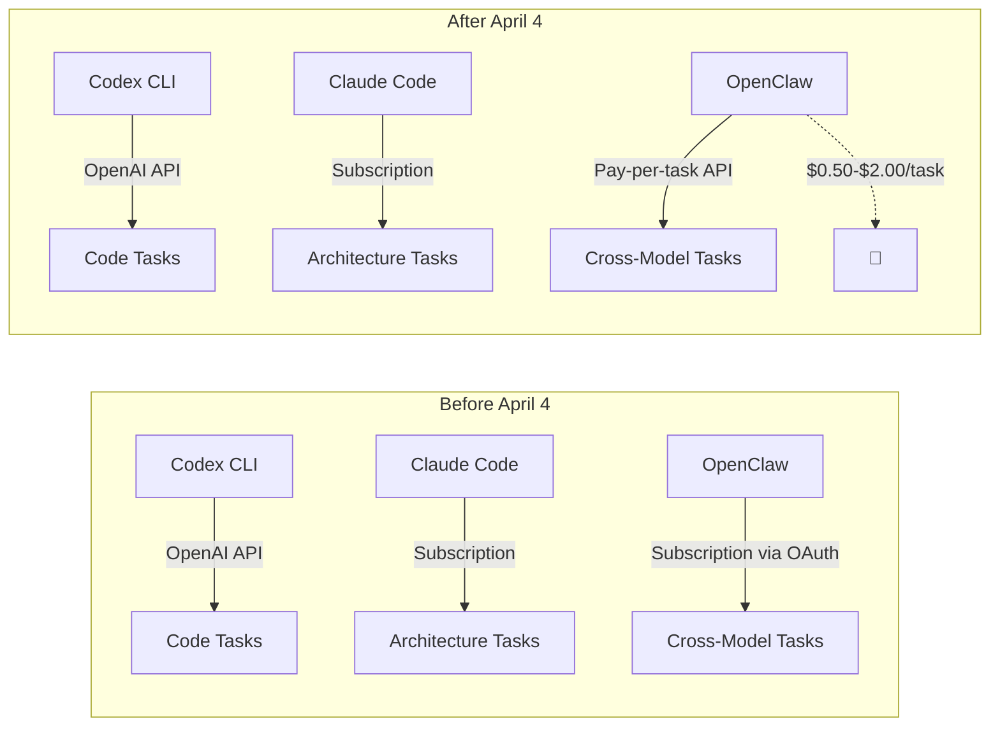
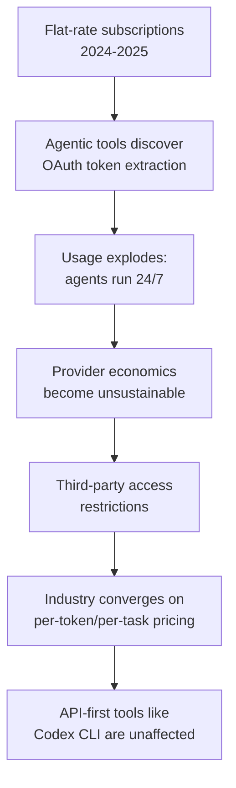

# Anthropic Blocks Third-Party Claude Access: What It Means for Multi-Tool Codex Workflows


On 4 April 2026, Anthropic flipped a switch that sent shockwaves through the agentic coding community: Claude Pro and Max subscriptions would no longer cover usage on third-party agent frameworks, starting with OpenClaw[^1]. The move effectively ended the era of flat-rate unlimited AI compute for autonomous agents — and it has direct implications for anyone running multi-tool workflows that combine Codex CLI with Claude Code.

## What Happened

Boris Cherny, Head of Claude Code at Anthropic, announced that subscriptions "weren't built for the usage patterns of these third-party tools"[^2]. Enforcement was immediate — no grace period, no phased rollout. Users running OpenClaw instances against their Claude Max subscription woke up to authentication failures and a choice: switch to pay-as-you-go pricing or stop.

The economics made Anthropic's motivation transparent. A single autonomous OpenClaw instance running for a full day could consume $1,000–$5,000 in API-equivalent compute[^3], whilst the Max subscription providing that access cost $200 per month. Industry analysts identified a 5x+ price gap between what heavy agentic users paid under flat subscriptions and what equivalent usage would cost at API rates[^2]. With over 135,000 OpenClaw instances running at the time of the announcement[^2], Anthropic was haemorrhaging compute subsidies.

### The Timeline That Raised Eyebrows

The competitive dynamics deserve scrutiny. OpenClaw creator Peter Steinberger joined OpenAI on 14 February 2026[^4], announcing that a non-profit foundation would steward the project. Anthropic's restrictions landed less than seven weeks later. Steinberger's response was pointed: "First they copy some popular features into their closed harness, then they lock out open source"[^2].

Whether Anthropic's timing was coincidental or strategic, the perception damage was real. The developer community noted that Claude Desktop had recently added scheduled jobs — a feature OpenClaw had popularised[^5].

## The New Pricing Reality

For users affected by the change, Anthropic offered three paths forward:

| Option | Cost | Notes |
|--------|------|-------|
| Pay-as-you-go extra usage | $0.50–$2.00 per task | Billed separately from subscription |
| Direct API keys | $3/$15 per million tokens (input/output, Sonnet 4.6) | Standard API pricing |
| Pre-purchased bundles | Up to 30% discount | Bulk extra usage credits |

A one-time credit equal to the user's monthly plan amount was redeemable until 17 April[^2]. For hobbyist developers and solo practitioners — the demographic most affected — the cost increase ranged from 10x to 50x their previous monthly spend[^2].

## Why This Matters for Codex CLI Users

If you are running Codex CLI as your primary coding agent, this policy change strengthens your position in several ways. But it also introduces a cost dimension to multi-tool strategies that previously did not exist.

### The Multi-Tool Strategy Gets a Price Tag

Many senior developers adopted a deliberate multi-tool approach: Codex CLI for code generation and refactoring in the terminal, Claude Code for architectural reasoning and documentation, and occasionally OpenClaw as a bridge layer for cross-model orchestration. That strategy assumed Claude Code's subscription covered the Claude-side compute regardless of how it was accessed.

That assumption is dead. Any workflow that routes Claude requests through a third-party harness now incurs per-task or per-token charges on top of the subscription. The practical impact:



### Codex CLI's Open-Source Advantage

Codex CLI's Apache 2.0 licence[^6] and open-source architecture mean it cannot impose the same kind of third-party restriction. OpenAI's API pricing is transparent and model-based — you pay per token regardless of which harness sends the request. There is no concept of a "subscription" that subsidises some access paths but not others.

This is not merely philosophical. It has practical consequences:

- **No vendor lock-in on the harness layer.** If you build automation around Codex CLI, your investment in AGENTS.md files, skills, hooks, and MCP server configurations is portable. Any tool that speaks the OpenAI API can drive the same models.
- **Predictable cost modelling.** API-first pricing means your CI/CD budget forecasts do not depend on a vendor's willingness to continue subsidising flat-rate access.
- **Community-driven harness improvements.** The codex-rs Rust core[^7] accepts community contributions. Harness quality — which Terminal-Bench benchmarks show matters more than model quality[^8] — improves through open collaboration rather than closed optimisation.

### The Broader Signal: Flat-Rate AI Compute Is Ending

Anthropic is not alone. Google's Gemini now enforces hard caps: free users get 5 prompts daily, AI Pro subscribers receive 100 at $20/month, and AI Ultra subscribers get 500 at $250/month[^9]. Cursor and Replit implemented similar usage restrictions in 2025[^9]. The pattern is unmistakable: every provider that offered "unlimited" access is walking it back as agentic workloads amplify consumption by orders of magnitude.



For Codex CLI users, this convergence validates the API-first model. You were already paying per token. Your costs did not change on 4 April.

## Practical Recommendations

### 1. Audit Your Multi-Tool Costs

If you are combining Codex CLI with Claude Code, map out which tasks go to which tool and calculate the per-task cost under the new pricing:

```bash
# Example: track daily Claude API spend with the Anthropic CLI
anthropic usage --from 2026-04-04 --to 2026-04-09 --format json \
  | jq '.daily[] | {date, total_cost, task_count}'
```

### 2. Consolidate Where Possible

Consider whether tasks you were routing through Claude Code or OpenClaw can be handled by Codex CLI directly. The gpt-5.4 and gpt-5.3-codex models[^10] available through Codex CLI now match or exceed Claude Sonnet 4.6 on most coding benchmarks. Architectural reasoning tasks — traditionally Claude's strength — are increasingly well-served by structured AGENTS.md instructions combined with Codex CLI's `/plan` mode.

### 3. Use MCP for Cross-Tool Integration

Rather than routing through a bridge layer like OpenClaw, connect your tools directly via Model Context Protocol. Codex CLI's MCP support[^11] lets you integrate with external services — Jira, Confluence, Datadog — without passing through a third-party harness that might lose access to its underlying model.

### 4. Budget for API-First Workflows

Accept that the era of subsidised AI compute is ending. Build your workflow budgets around per-token pricing from the start. For a typical senior developer's daily Codex CLI usage (roughly 2–5 million input tokens and 500K–1M output tokens), expect $10–$30/day at current gpt-5.4 rates — predictable, transparent, and not subject to sudden policy changes.

## The Competitive Landscape in April 2026

The third-party access restriction reshuffles competitive dynamics:

| Tool | Pricing Model | Third-Party Access | Open Source |
|------|--------------|-------------------|-------------|
| Codex CLI | Per-token API | Unrestricted | Yes (Apache 2.0) |
| Claude Code | Subscription + pay-as-you-go | Restricted since April 4 | No |
| Cursor | Subscription with caps | Restricted since 2025 | No |
| OpenCode | Per-token API | Unrestricted | Yes |

Codex CLI and OpenCode — both open-source, both API-first — are the only major tools unaffected by the subscription access crackdown. That is not a coincidence. It is a structural advantage of the open-source, API-first model.

## Conclusion

Anthropic's decision to block third-party Claude access is rational from a business perspective — subsidising $5,000/day workloads on a $200/month subscription was never sustainable. But it marks a turning point for the agentic coding ecosystem. The tools that weather this transition best are those that never depended on subsidised access in the first place.

For Codex CLI users, the message is straightforward: your workflow is resilient to vendor policy changes because it was built on transparent, per-token economics from day one. The multi-tool strategy remains viable, but it now requires explicit cost accounting for every Claude-side task. Plan accordingly.

## Citations

[^1]: [Anthropic cuts off the ability to use Claude subscriptions with OpenClaw and third-party AI agents](https://venturebeat.com/technology/anthropic-cuts-off-the-ability-to-use-claude-subscriptions-with-openclaw-and) — VentureBeat, April 2026
[^2]: [Anthropic blocks OpenClaw from Claude subscriptions in cost crackdown](https://thenextweb.com/news/anthropic-openclaw-claude-subscription-ban-cost) — TNW, April 2026
[^3]: [OpenClaw + Claude Code Costs 2026: API Key vs Pro $20 vs Max $200](https://www.shareuhack.com/en/posts/openclaw-claude-code-oauth-cost) — ShareUHack, April 2026
[^4]: [A Deep Dive Into The Epic Rise Of OpenClaw](https://www.oax.org/2026/03/23/A-Deep-Dive-Into-The-Epic-Rise-of-OpenClaw.html) — OAX Foundation, March 2026
[^5]: [Matt Kuda — OpenClaw agents and the cost of unlimited AI compute](https://www.youtube.com/watch?v=VfLSfMWn6cY) — YouTube, 2026
[^6]: [OpenAI Codex CLI — GitHub repository](https://github.com/openai/codex) — Apache 2.0 licence
[^7]: [Codex CLI releases — codex-rs Rust rewrite](https://github.com/openai/codex/releases) — GitHub, 2026
[^8]: [Claude Code ranks last on Terminal-Bench](https://www.youtube.com/watch?v=Wvj1mTqyzsQ) — Theo, YouTube, 2026
[^9]: [Third-party agents lose access as Anthropic tightens Claude usage rules](https://www.pymnts.com/artificial-intelligence-2/2026/third-party-agents-lose-access-as-anthropic-tightens-claude-usage-rules/) — PYMNTS, April 2026
[^10]: [Codex CLI changelog — April 2026 model updates](https://github.com/openai/codex/blob/main/CHANGELOG.md) — GitHub
[^11]: [Model Context Protocol — Codex CLI documentation](https://developers.openai.com/codex/mcp) — OpenAI Developers
