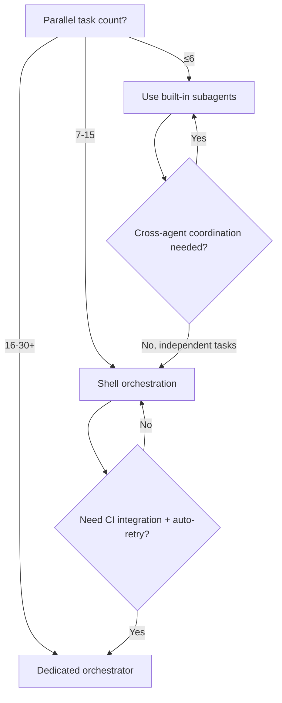
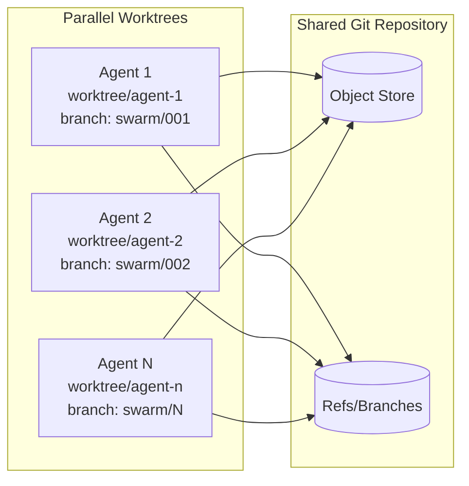
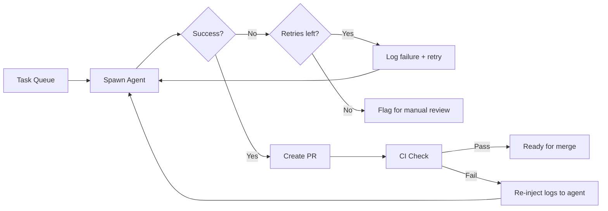

# Building a Codex Agent Swarm: From 6 Threads to 30 with External Orchestration


---

Codex CLI's built-in subagent system is impressive — up to six concurrent threads with TOML-defined roles, path addressing, and CSV batch processing [^1]. But six threads is a ceiling, not a floor. When your migration spans 200 microservices or your test suite needs parallel refactoring across 30 modules, you need to graduate from the built-in orchestrator to something external.

This article covers practical patterns for scaling Codex CLI beyond `max_threads=6`, from shell-based orchestration through to purpose-built swarm managers, with real cost and isolation strategies for running 20–30 agents in parallel.

## Why Six Threads Is Not Enough

Codex CLI's `agents.max_threads` defaults to 6, with `agents.max_depth` capped at 1 [^1]. These defaults exist for good reason: each subagent maintains its own context window, so token costs scale linearly — a 6-agent run costs roughly 6× a single-agent run [^2]. Raising `max_depth` risks exponential token growth and latency [^1].

But consider these real-world scenarios:

- **Large-scale migration**: Converting 150 REST endpoints from Express to Fastify across 40 service repositories
- **Bulk test generation**: Adding integration tests to 80 untested modules
- **Multi-repo dependency updates**: Bumping a shared library across 25 downstream consumers

In each case, the work is embarrassingly parallel — each unit is independent, with no cross-agent coordination required. The built-in subagent system, designed for coordinated multi-step workflows within a single session, is the wrong tool.

## The Graduation Decision Framework

Not every workload needs external orchestration. Use this decision tree:



The key insight: built-in subagents excel at *coordinated* parallel work (explorer scouts the codebase, worker implements, default reviews). External orchestration excels at *independent* parallel work where agents never need to communicate.

## Pattern 1: Shell-Based Orchestration with codex exec

The simplest approach uses `codex exec` — Codex CLI's non-interactive mode — combined with standard Unix parallelism tools [^3].

### Basic GNU Parallel Pattern

```bash
#!/bin/bash
# migrate-services.sh — parallel service migration

TASK_FILE="tasks.txt"  # one task description per line
MAX_JOBS=12
WORKTREE_BASE="/tmp/codex-worktrees"

migrate_service() {
    local task="$1"
    local task_id="$2"
    local worktree="$WORKTREE_BASE/agent-$task_id"

    # Create isolated worktree
    git worktree add "$worktree" -b "agent/$task_id" HEAD

    # Run Codex in non-interactive mode
    cd "$worktree" && codex exec \
        --full-auto \
        --json \
        "$task" > "/tmp/results/agent-$task_id.json" 2>&1

    local exit_code=$?
    echo "Agent $task_id completed with exit code $exit_code"
    return $exit_code
}

export -f migrate_service
export WORKTREE_BASE

# Run tasks in parallel with GNU parallel
cat "$TASK_FILE" | parallel \
    --jobs "$MAX_JOBS" \
    --linebuffer \
    --tagstring "agent-{#}" \
    migrate_service {} {#}
```

The `--json` flag on `codex exec` returns newline-delimited JSON events, enabling downstream processing and monitoring [^3]. Each agent operates in its own git worktree, providing full filesystem isolation.

### Critical: Session Isolation

Prior to v0.99.0, running multiple `codex exec` instances in parallel caused session state interference — context from instance A would leak into instance B via shared files in `~/.codex/` [^4]. This was resolved when the `exec` subcommand was reimplemented on top of the app server architecture [^4]. If you are running an older version, ensure each process uses a unique `CODEX_HOME` directory:

```bash
CODEX_HOME="/tmp/codex-session-$task_id" codex exec --full-auto "$task"
```

## Pattern 2: TypeScript SDK Orchestrator

For more sophisticated control — progress monitoring, failure recovery, dynamic task queuing — the Codex TypeScript SDK provides programmatic access via `run()` and `runStreamed()` [^5].

```typescript
import { Codex } from "@openai/codex-sdk";
import { execSync } from "child_process";

interface Task {
  id: string;
  prompt: string;
  worktree?: string;
}

async function runSwarm(tasks: Task[], concurrency: number = 12) {
  const codex = new Codex();
  const results: Map<string, { success: boolean; output: string }> = new Map();

  // Process tasks in batches
  for (let i = 0; i < tasks.length; i += concurrency) {
    const batch = tasks.slice(i, i + concurrency);

    const promises = batch.map(async (task) => {
      // Create worktree for isolation
      const worktree = `/tmp/swarm/${task.id}`;
      execSync(`git worktree add ${worktree} -b swarm/${task.id} HEAD`);

      try {
        const thread = codex.startThread();
        const result = await thread.run(
          `Working directory: ${worktree}\n\n${task.prompt}`
        );
        results.set(task.id, { success: true, output: result });
      } catch (err) {
        results.set(task.id, {
          success: false,
          output: (err as Error).message,
        });
      } finally {
        execSync(`git worktree remove ${worktree} --force`);
      }
    });

    await Promise.all(promises);
    console.log(`Batch ${Math.floor(i / concurrency) + 1} complete`);
  }

  return results;
}
```

The SDK spawns Codex CLI as a child process and communicates over stdin/stdout using JSONL [^5]. Each `startThread()` call creates an independent session, avoiding the shared-state problems that plagued raw `codex exec` in earlier versions.

### Streaming Progress with runStreamed()

For real-time monitoring across your swarm, `runStreamed()` yields structured events [^5]:

```typescript
for await (const event of thread.runStreamed(task.prompt)) {
  switch (event.type) {
    case "turn.started":
      metrics.trackAgentActive(task.id);
      break;
    case "item.completed":
      metrics.trackToolCall(task.id, event);
      break;
    case "turn.completed":
      metrics.trackAgentIdle(task.id);
      break;
  }
}
```

Event types include `thread.started`, `turn.started`, `item.started`, `item.updated`, `item.completed`, and `turn.completed` [^5]. Items represent individual actions (tool calls, text generation), whilst turns represent a complete agent cycle.

## Pattern 3: Agent Orchestrator for Managed Swarms

ComposioHQ's Agent Orchestrator [^6] provides a production-grade solution for running 30+ parallel agents. Built as a 40,000-line TypeScript platform with 3,288 tests, it handles the operational concerns that shell scripts and custom SDK wrappers struggle with:

- **Automatic worktree isolation**: Each agent gets its own git worktree, branch, and PR [^6]
- **CI failure recovery**: When CI fails, the orchestrator injects failure logs back into the agent's session for automatic remediation [^6]
- **Review routing**: Reviewer comments are routed to the originating agent with full context [^6]
- **Multi-agent support**: Pluggable architecture supporting Codex CLI, Claude Code, and Aider [^6]

Configuration is straightforward:

```yaml
# agent-orchestrator.yaml
workspace:
  type: worktree    # or 'clone' for full isolation
agent:
  type: codex       # codex | claude | aider
  retry:
    max_attempts: 2
    timeout_minutes: 30
```

The orchestrator's plugin architecture — Runtime, Agent, Workspace, Tracker, SCM, Notifier, and Terminal slots [^6] — means you can swap in Codex CLI without modifying core orchestration logic.

## Git Worktree Isolation at Scale

Every pattern above depends on git worktrees for filesystem isolation. This is not optional — without it, parallel agents will corrupt each other's working trees.



Worktree creation is near-instant because Git only checks out working files — the object store is already local [^7]. Disk cost scales with checked-out files, not repository history. For a typical 500MB repository, 30 worktrees consume roughly 15GB of disk, which is manageable on any modern development machine.

### The Runtime Isolation Gap

Git worktrees isolate *files* but not *runtimes*. If your agents run `npm install` or `pip install`, they share the same global package cache and can collide on lock files [^8]. Solutions:

- **Container-per-agent**: Wrap each `codex exec` in a lightweight container (`podman run --rm`)
- **Node.js local installs**: Use `--prefix` to isolate `node_modules` per worktree
- **Python venvs**: Create a fresh virtual environment in each worktree before running the agent

## Monitoring with OpenTelemetry

Codex CLI ships with native OpenTelemetry support, emitting traces, metrics, and logs via OTLP [^9]. Configure it in `~/.codex/config.toml`:

```toml
[telemetry]
enabled = true
otlp_endpoint = "http://localhost:4317"
otlp_protocol = "grpc"
```

For a swarm, this gives you per-agent visibility into token usage, API latency, tool calls, and session duration [^9]. Tools like AI Observer [^10] or SigNoz [^11] provide purpose-built dashboards for monitoring multiple concurrent Codex sessions.

Key metrics to track across your swarm:

| Metric | Why It Matters |
|--------|---------------|
| `codex.tokens.total` per agent | Cost attribution and budget enforcement |
| `codex.api.latency_p99` | Detect rate limiting under high parallelism |
| `codex.tools.calls` | Identify agents stuck in retry loops |
| `codex.session.duration` | Spot hung agents for timeout enforcement |

## Cost Management for 20+ Parallel Agents

Running 30 agents simultaneously can burn through API budget rapidly. Each agent maintains its own context window, and with GPT-5.3-Codex at current pricing, a 30-agent swarm processing moderately complex tasks (10K tokens input + 5K output per agent) can cost $15–30 per batch [^2].

Mitigation strategies:

1. **Use GPT-5.3-Codex-Spark for independent tasks**: Spark delivers 1,000+ tokens/second on simpler operations [^12] at significantly lower cost, and is ideal for embarrassingly parallel work that does not require deep reasoning
2. **Set `job_max_runtime_seconds`**: The `agents.job_max_runtime_seconds` config (default 1800) prevents runaway agents [^1] — reduce this for simple tasks
3. **Progressive batching**: Start with 5 agents, verify output quality, then scale to 30 — catching prompt issues early saves 6× the cost
4. **Dry-run validation**: Use `--approval-mode suggest` on a single task first to verify the agent's approach before committing to a full swarm run

## Failure Recovery Patterns

At 30 agents, failures are not exceptional — they are expected. Design for them:



The critical pattern: **never discard a failed agent's context**. Log the full JSON output from `codex exec --json`, including tool calls and intermediate reasoning. When retrying, include the previous failure context in the new prompt so the agent does not repeat the same mistake.

## When External Orchestration Is Overkill

Not every scaling problem needs a swarm. Before building orchestration infrastructure, consider:

- **Codex Cloud tasks**: OpenAI's hosted execution environment handles parallelism server-side, with no worktree management needed [^13]. If your tasks are self-contained and do not require local toolchain access, this is simpler.
- **Built-in CSV batch**: The `spawn_agents_on_csv` tool processes many rows in parallel within the built-in 6-thread limit [^1]. For 6 or fewer parallel tasks, this is the right abstraction.
- **Sequential with caching**: If tasks share substantial context, running them sequentially on a single thread with `resumeThread()` [^5] can be cheaper than parallel execution with duplicated context.

## Summary

| Approach | Concurrency | Complexity | Best For |
|----------|-------------|------------|----------|
| Built-in subagents | ≤6 | Low | Coordinated multi-step workflows |
| Shell + GNU parallel | 7–20 | Medium | Batch migrations, bulk refactoring |
| TypeScript SDK | 10–30 | Medium-High | Custom pipelines with monitoring |
| Agent Orchestrator | 20–50+ | High (but managed) | Production swarms with CI integration |

The progression from built-in subagents to external orchestration is not about replacing Codex's architecture — it is about recognising when your workload has outgrown coordinated parallelism and needs independent parallelism instead. Start with `codex exec` and GNU parallel, graduate to the TypeScript SDK when you need programmatic control, and reach for Agent Orchestrator when you need production-grade lifecycle management.

## Citations

[^1]: [Subagents – Codex CLI Documentation](https://developers.openai.com/codex/subagents) — Official documentation covering `max_threads`, `max_depth`, agent roles, TOML configuration, and `spawn_agents_on_csv`.

[^2]: [Codex Gets Subagents: The Parallel AI Coding Pattern Is Now The De Facto Industry Standard](https://medium.com/@richardhightower/codex-gets-subagents-the-parallel-ai-coding-pattern-is-now-industry-standard-how-does-it-stack-35bd217ef11f) — Rick Hightower's analysis of token cost scaling in multi-agent Codex workflows.

[^3]: [Features – Codex CLI](https://developers.openai.com/codex/cli/features) — Official documentation for `codex exec` non-interactive mode and `--json` flag.

[^4]: [Multiple parallel codex exec instances interfere via shared session restore · Issue #11435](https://github.com/openai/codex/issues/11435) — GitHub issue documenting session state interference, closed April 2026 after app server reimplementation.

[^5]: [SDK – Codex CLI](https://developers.openai.com/codex/sdk) — Official TypeScript SDK documentation covering `run()`, `runStreamed()`, event types, and thread management.

[^6]: [ComposioHQ/agent-orchestrator](https://github.com/ComposioHQ/agent-orchestrator/) — Open-source orchestrator supporting Codex CLI, Claude Code, and Aider with automatic worktree isolation and CI recovery.

[^7]: [Codex App Worktrees Explained: How Parallel Agents Avoid Git Conflicts](https://www.verdent.ai/guides/codex-app-worktrees-explained) — Technical explanation of worktree isolation patterns for parallel AI agents.

[^8]: [Git Worktrees Need Runtime Isolation for Parallel AI Agent Development](https://www.penligent.ai/hackinglabs/git-worktrees-need-runtime-isolation-for-parallel-ai-agent-development/) — Analysis of the gap between file-level and runtime-level isolation.

[^9]: [Advanced Configuration – Codex CLI](https://developers.openai.com/codex/config-advanced) — Official documentation covering OpenTelemetry configuration in `config.toml`.

[^10]: [ai-observer: Unified local observability for AI coding assistants](https://github.com/tobilg/ai-observer) — Self-hosted OpenTelemetry backend designed for monitoring Codex CLI and other coding agents.

[^11]: [OpenAI Codex Observability & Monitoring with OpenTelemetry](https://signoz.io/docs/codex-monitoring/) — SigNoz integration guide for Codex CLI telemetry.

[^12]: [OpenCode vs Codex CLI (2026)](https://www.morphllm.com/comparisons/opencode-vs-codex) — Performance comparison noting GPT-5.3-Codex-Spark at 1,000+ tok/s.

[^13]: [Codex App First Impressions (2026)](https://www.verdent.ai/guides/codex-app-first-impressions-2026) — Overview of Codex Cloud tasks as an alternative to local parallel execution.
