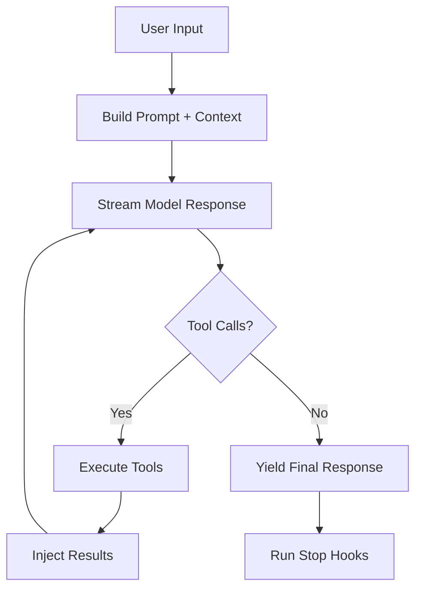
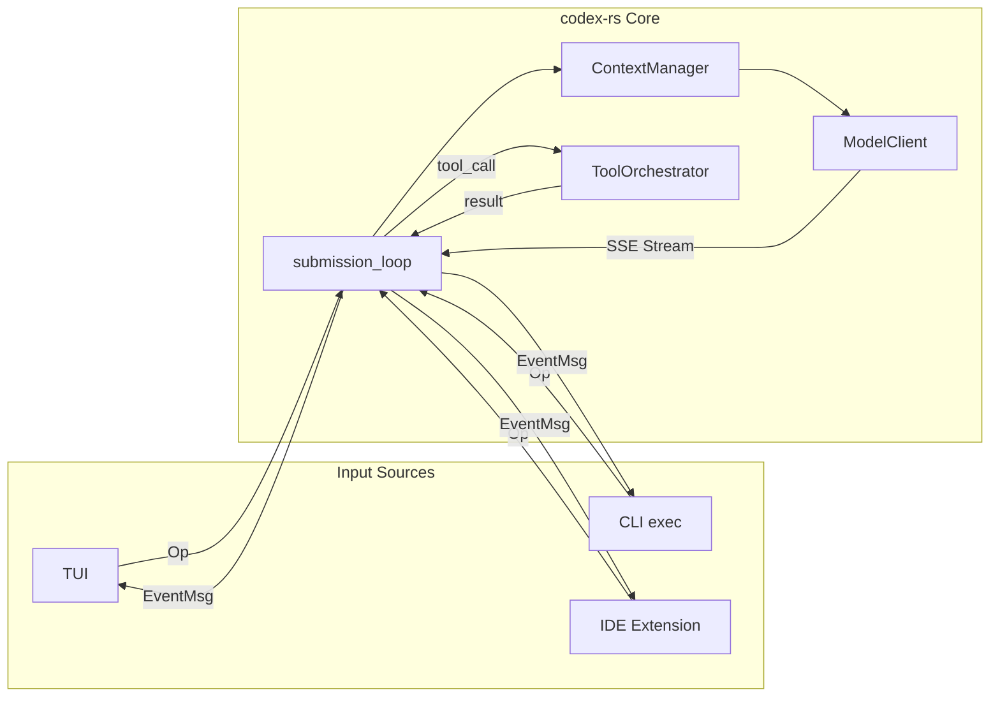
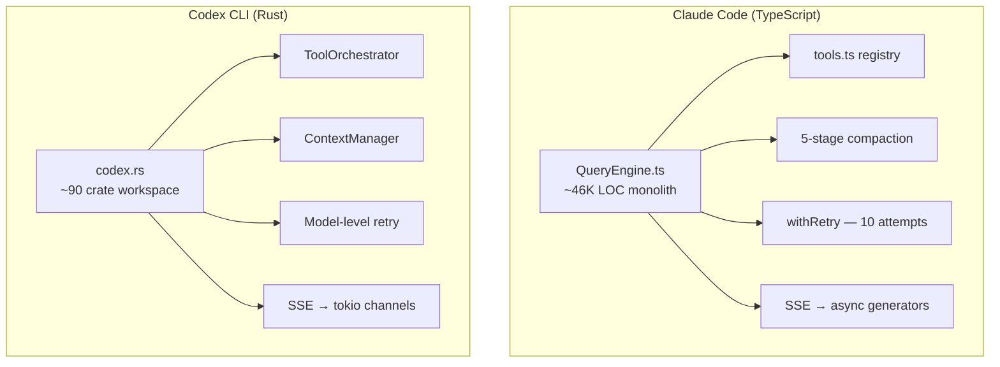

# Claude Code's query-engine.ts vs Codex CLI's codex-rs: Comparing Agent Loop Architectures

---

Every agentic coding tool reduces to the same fundamental pattern: send a prompt, stream a response, execute tool calls, feed results back, repeat. But how that loop is implemented — the language, the state model, the concurrency strategy — profoundly affects reliability, extensibility, and performance. This article dissects the agent loop cores of two leading tools: Claude Code's `QueryEngine` (TypeScript) and Codex CLI's `codex-rs` (Rust), drawing on the source code exposed in March 2026 and the open-source Codex repository.

## The Agent Loop Pattern

Both tools implement the same conceptual loop:

The differences lie entirely in *how* each system implements these stages and what escape hatches they provide when things go wrong.

## Claude Code: The TypeScript Monolith

### QueryEngine — The 46K-Line Brain

`QueryEngine.ts` is the single file that owns Claude Code's entire query lifecycle [^1]. One instance is created per conversation, holding mutable state including message history (`mutableMessages`), cumulative token usage (`totalUsage`), permission denial records, and an `AbortController` for cancellation [^2].

The entry point is `submitMessage()`, an async generator that:

1. Builds the system prompt via `fetchSystemPromptParts()`
2. Writes the transcript to disk *before* the API call — enabling crash recovery [^2]
3. Delegates to `query()`, which in turn calls `queryLoop()`

### The queryLoop() State Machine

`queryLoop()` is a `while(true)` loop carrying a typed `State` object between iterations [^2]. This state tracks messages, tool contexts, compaction metadata, and a `transition` reason code explaining why the loop continued. Seven continuation reasons are defined [^2]:

| Transition | Trigger |
|-----------|---------|
| `max_output_tokens_escalate` | Hit 8K cap; retry at 64K |
| `max_output_tokens_recovery` | Output limit hit; inject nudge (max 3×) |
| `reactive_compact_retry` | Prompt overflow; compact and retry |
| `collapse_drain_retry` | Context collapse stages exhausted |
| `stop_hook_blocking` | Hook error injected as user message |
| `token_budget_continuation` | Budget check; nudge and continue |
| *(implicit tool loop)* | Model returned `tool_use` blocks |

The loop exits by yielding a `Terminal` state with reasons like `completed`, `model_error`, `prompt_too_long`, or `aborted_streaming` [^2].

### Streaming and Retry

`queryModel()` streams responses via Anthropic's SDK, reconstructing `AssistantMessage` objects per content block [^2]. When a `tool_use` block arrives, the engine sets `needsFollowUp = true` and continues the loop.

Retry logic uses exponential backoff with jitter, up to 10 attempts [^2]. Notable behaviours:

- **529 (overloaded)**: Foreground retries; background bails immediately
- **Opus fallback**: After 3 consecutive 529s, throws `FallbackTriggeredError`
- **OAuth 401**: Forces token refresh before retry
- **Persistent mode**: Retries indefinitely with a 30-minute backoff cap, yielding heartbeats every 30 seconds

### Tool Registry (tools.ts)

`tools.ts` serves as the central dispatch map [^3]. Every tool registers into this map, and the loop remains identical regardless of tool additions. The permission system classifies operations into four modes: `default`, `auto`, `bypass`, and the confusingly named `yolo` (which, contrary to intuition, uses a `SAFE_YOLO_ALLOWLISTED_TOOLS` set that restricts execution to read-only operations like `FILE_READ`, `GREP`, and `GLOB`) [^4].

### Context Management Pipeline

Claude Code employs a five-stage context reduction pipeline, applied in priority order before each API call [^2]:

1. **`applyToolResultBudget()`** — caps result byte size, externalises large outputs
2. **`snipCompact`** — removes provably unneeded middle messages
3. **`microcompact`** — merges tool-result/user pairs; cached variant uses API-side cache edits
4. **`contextCollapse`** — read-time projection over full history
5. **`autoCompact`** — full summarisation when approaching the blocking limit

A circuit breaker exits with `PROMPT_TOO_LONG_ERROR_MESSAGE` if context exceeds limits after all compaction attempts [^2].

## Codex CLI: The Rust State Machine

### codex.rs — Submission/Event Architecture

Where Claude Code uses generators, Codex CLI uses Rust's async runtime. The central `Codex` struct processes operations through a `submission_loop` running as a dedicated `tokio` task [^5]. Operations arrive as typed `Op` messages, and results flow back as `EventMsg` values — a clean message-passing architecture that enables non-blocking interaction across TUI, CLI, and IDE modes [^5].

### CodexThread — Turn Orchestration

Each conversation turn is managed by a `CodexThread` [^5]:

1. User input is wrapped in a `Submission`
2. `ContextManager` builds the prompt, incorporating message history and token tracking
3. `ModelClient` streams responses via SSE
4. Tool calls interrupt the stream for execution
5. Results feed back for continuation

State is maintained across turns via `ContextManager` (message history, token counts, cached prompt prefixes) and `Session` (turn-level response assembly) [^5]. Session rollouts are persisted to compressed JSONL in `~/.codex/sessions/`, enabling replay and forking for multi-agent workflows [^5].

### Tool Orchestration

The `ToolOrchestrator` acts as middleware between tool invocations and execution runtimes, enforcing three policies [^6]:

1. **Approval policy** — routes to human review or guardian sub-agent
2. **Sandbox policy** — selects appropriate OS-level confinement
3. **Command safety classification** — categorises operations by risk

Built-in tools include [^5]:

| Tool | Purpose |
|------|---------|
| `apply_patch` | Structured file editing via unified diff |
| `js_repl` | Persistent Node.js kernel |
| `tool_search` | BM25-powered semantic search |
| `spawn_agent` / `wait_agent` | Hierarchical multi-agent spawning |
| `request_permissions` | Mid-turn sandbox escalation |
| `web_search` | Live web search |
| MCP tools | External servers via `McpConnectionManager` |

### Sandbox Architecture

Codex CLI's sandbox translates high-level `SandboxPolicy` enums into OS-native primitives [^7]:

- **macOS**: Seatbelt profiles
- **Linux**: Landlock rules (with Bubblewrap as default since v0.115.0 [^8])
- **Windows**: Restricted tokens with OS-level egress rules [^9]

Three policy levels are available: `DangerFullAccess`, `ReadOnly`, and `WorkspaceWrite` (write access limited to the current working directory, with `.git/` protected) [^7].

## Architectural Comparison

### Language and Concurrency

Claude Code's `async generator` chain (`submitMessage → query → queryLoop → queryModel → withRetry`) yields streaming tokens at every level [^2]. This is elegant but inherently single-threaded — JavaScript's event loop handles I/O concurrency, but CPU-bound work (context compaction, token counting) blocks the loop.

Codex CLI's `tokio` runtime provides true multi-threaded async [^5]. The `submission_loop` processes operations sequentially for state consistency, but tool execution, sandbox setup, and MCP communication run on separate tasks. The `StreamingToolExecutor` equivalent fires tools in parallel with the stream still open, reducing multi-tool latency [^5].

### State Management

Claude Code carries a mutable `State` object through a `while(true)` loop with seven typed continuation reasons [^2]. This is explicit but creates a single, complex state machine.

Codex CLI uses message-passing between `Op` submissions and `EventMsg` responses [^5]. State lives in dedicated managers (`ContextManager`, `Session`, `RolloutRecorder`), each with a focused responsibility. This separation makes it easier to test individual components and reason about state transitions.

### Crash Recovery

Both systems prioritise resumability. Claude Code writes transcripts before API calls [^2]. Codex CLI persists compressed JSONL rollouts that can be replayed to reconstruct any session state [^5]. Codex's approach additionally supports *forking* — branching a sub-agent from a primary session's state [^5].

### Extensibility

Claude Code's monolithic `QueryEngine` means every new feature (streaming tool execution, context collapse, auto-dream) adds complexity to the same file [^1]. The generator chain makes it difficult to insert middleware without modifying the core.

Codex CLI's crate workspace (~90 member crates [^5]) provides natural module boundaries. New tools register via `ToolOrchestrator` without touching the core loop. MCP servers connect through `McpConnectionManager` with stdio or HTTP transport [^5], and the approval system can delegate to guardian sub-agents — a pattern not available in Claude Code's permission model.

### Scale and Performance

Claude Code's TypeScript codebase reportedly spans ~390K lines of code [^1]. The Codex CLI binary, compiled from 95.6% Rust, is self-contained with fast startup times [^8]. For CI and batch workflows (`codex exec`), the Rust binary's cold-start advantage is material — there is no Node.js runtime to initialise.

## What Practitioners Can Learn

The comparison reveals three design principles for agent loop architecture:

1. **Explicit continuation reasons beat implicit loops.** Claude Code's seven-variant `Transition` enum documents every reason the loop continues. This is worth adopting even in simpler agents — when debugging why an agent made 47 API calls, a typed reason code is invaluable.

2. **Separate state from orchestration.** Codex CLI's split between `ContextManager`, `ToolOrchestrator`, and `Session` makes each concern testable in isolation. Claude Code's single `QueryEngine` trades this for co-located logic, which is faster to prototype but harder to maintain at scale.

3. **Transcript-first design enables recovery.** Both systems write state before API calls. For any production agent, this pattern — persist intent before execution — should be non-negotiable.

The "secret sauce" of neither tool is the agent loop itself. It is the co-optimisation between model and harness: how the system prompt is structured, which tools are exposed, how context is managed, and how failures are recovered. Terminal-Bench results confirm that the same model can score 16 percentage points higher in one harness than another [^10] — the loop architecture is the competitive differentiator, not the model.

## Citations

[^1]: [Core Architecture — Claude Code DeepWiki](https://deepwiki.com/claude-code-best/claude-code/2-core-architecture)
[^2]: [Claude Code Manual — Query Engine](https://github.com/inematds/claudecode-manual/blob/main/01-core-architecture/04-query-engine.md)
[^3]: [Claude Code Architecture Explained — DEV Community](https://dev.to/brooks_wilson_36fbefbbae4/claude-code-architecture-explained-agent-loop-tool-system-and-permission-model-rust-rewrite-41b2)
[^4]: [Claude Code YOLO Mode Security Research (March 2026)](https://gist.github.com/hartphoenix/698eb8ef8b08ad2ce6a99cf7346cd7cc)
[^5]: [openai/codex — DeepWiki](https://deepwiki.com/openai/codex)
[^6]: [Tool Orchestration and Approval — DeepWiki](https://deepwiki.com/yulin0629/codex/4.3-non-interactive-exec-mode)
[^7]: [Sandboxing and Security Policies — DeepWiki](https://deepwiki.com/openai/codex/6.4-sandboxing-and-security-policies)
[^8]: [How Codex is Built — Pragmatic Engineer](https://newsletter.pragmaticengineer.com/p/how-codex-is-built)
[^9]: [OpenAI Codex CLI April 2026 Update — Daily 1 Bite](https://daily1bite.com/en/blog/ai-tools/openai-codex-cli-april-2026-update)
[^10]: [Claude Code Leak: Agentic Architecture Lessons 2026](https://www.digitalapplied.com/blog/claude-code-leak-agentic-architecture-lessons-2026)
