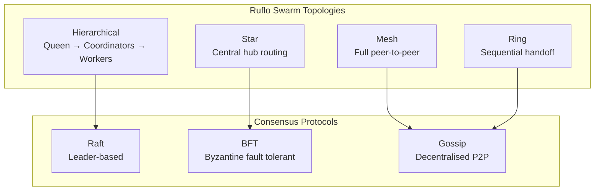
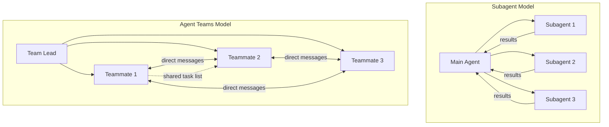
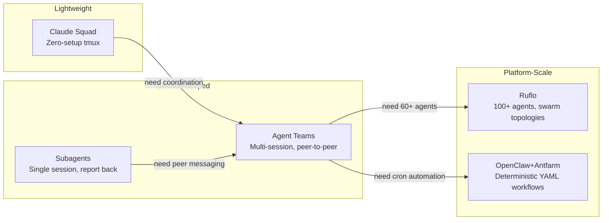

# Claude Flow, Ruflo and Anthropic Agent Teams: The Claude Multi-Agent Ecosystem


---

The multi-agent story in the Claude ecosystem has evolved rapidly through early 2026. Three distinct layers have emerged: the community-built orchestration platform **Ruflo** (formerly Claude Flow), Anthropic's official **Agent Teams** shipped with Opus 4.6, and a tier of local orchestrators including **Claude Squad** and **OpenClaw+Antfarm**. Each occupies a different niche. This article surveys the architecture of each, compares them with Codex CLI's subagent model, and examines what cross-pollination opportunities exist.

## Ruflo: The Community Orchestration Platform

### From Claude Flow to Ruflo v3.5

Claude Flow began as a community project by Ruv (ruvnet) to orchestrate multiple Claude Code instances through a queen/worker hierarchy [^1]. It has since been rebranded as **Ruflo** and completely rebuilt. The current v3.5 release comprises over 6,066 commits and 250,000 lines of TypeScript and WebAssembly [^2].

The core architecture flows through distinct layers:

```
User → Ruflo (CLI/MCP) → Router → Swarm → Agents → Memory → LLM Providers
```

Ruflo integrates with Claude Code via MCP, enabling direct command access within Claude Code sessions [^2].

### Queen-Led Hierarchy and Swarm Topologies

Ruflo employs a **queen-led** agent hierarchy with strategic, tactical, and adaptive coordinators managing over 100 specialised agent types — coder, tester, reviewer, architect, security, and more [^2]. Eight worker types (researcher, analyst, documenter, optimiser, etc.) operate beneath these coordinators.

The swarm coordination layer supports four topologies:



Anti-drift protection ensures hierarchical coordinators validate outputs against original goals, preventing agent task deviation [^2].

### Self-Learning with SONA

Ruflo v3 introduced the **RuVector Intelligence Layer**, a suite of machine learning components that differentiate it from static orchestration frameworks [^3]. The Self-Optimising Neural Analysis (SONA) engine learns from every task execution with sub-0.05ms latency, whilst Elastic Weight Consolidation (EWC++) prevents catastrophic forgetting of successful patterns [^2].

The platform claims roughly a **250% improvement in effective subscription capacity** and a **30–50% reduction in token consumption** through intelligent task routing: simple tasks (<1ms) are handled by the Agent Booster (WebAssembly transforms, zero LLM cost), medium-complexity tasks by Haiku/Sonnet, and complex problems by Opus with multi-agent swarms [^2]. ⚠️ These performance claims come from Ruflo's own documentation and have not been independently verified.

### Adoption

Ruflo reports nearly 100,000 monthly active users across more than 80 countries [^3]. The npm package remains available under the original `claude-flow` name [^4].

## Anthropic Agent Teams: The Official Multi-Agent Layer

### Architecture and Enabling

Anthropic shipped Agent Teams as an experimental feature alongside the **Opus 4.6** release in February 2026 [^5]. They require Claude Code **v2.1.32 or later** and are disabled by default — enabled by setting `CLAUDE_CODE_EXPERIMENTAL_AGENT_TEAMS` in `settings.json` or the environment [^6]:

```json
{
  "env": {
    "CLAUDE_CODE_EXPERIMENTAL_AGENT_TEAMS": "1"
  }
}
```

An agent team consists of four components [^6]:

| Component | Role |
|-----------|------|
| **Team lead** | Main session that creates the team, spawns teammates, and coordinates work |
| **Teammates** | Separate Claude Code instances working on assigned tasks |
| **Task list** | Shared work items that teammates claim and complete |
| **Mailbox** | Messaging system for direct inter-agent communication |

### Subagents vs Teammates

The critical distinction from Claude Code subagents is **communication topology**. Subagents run within a single session and can only report results back to the main agent — they never talk to each other. Agent Teams removes that bottleneck entirely [^6]:



Teammates work independently, each in its own context window, and communicate directly with each other through the mailbox. Task claiming uses **file locking** to prevent race conditions when multiple teammates try to claim the same task simultaneously [^6].

### Plan Approval and Quality Gates

Teammates can be required to operate in **read-only plan mode** until the lead approves their approach. Three hooks enforce quality gates [^6]:

- **`TeammateIdle`** — runs when a teammate is about to go idle; exit code 2 sends feedback and keeps the teammate working
- **`TaskCreated`** — validates task creation
- **`TaskCompleted`** — validates task completion; exit code 2 prevents premature completion

### Display Modes

Agent Teams support two display modes: **in-process** (all teammates in the main terminal, cycle with Shift+Down) and **split panes** (each teammate in its own tmux or iTerm2 pane) [^6]. The default `"auto"` setting uses split panes if already inside tmux.

### Current Limitations

Agent Teams remain experimental with notable constraints: no session resumption with in-process teammates, no nested teams (teammates cannot spawn their own teams), one team per session, and the lead is fixed for the team's lifetime [^6]. Token usage scales linearly with teammate count — roughly **4–7× more tokens** than single-agent sessions [^7].

## Tier 2 Local Orchestrators: Claude Squad and OpenClaw+Antfarm

### Claude Squad

Claude Squad is a **zero-setup tmux-based** tool for orchestrating multiple Claude Code agents with a terminal UI dashboard [^8]. It occupies the simplest end of the local orchestration spectrum — no configuration files, no swarm topologies, just multiple agents visible in terminal panes.

### OpenClaw+Antfarm

OpenClaw+Antfarm sits at the more opinionated end. It runs the **Ralph loop** pattern with planner, developer, verifier, tester, and reviewer roles through one-command installation, using YAML and SQLite for deterministic workflows [^8]. It represents the "ship while you sleep" paradigm — cron-driven, fully automated.

However, the landscape shifted significantly on **4 April 2026** when Anthropic blocked Claude Pro and Max subscribers from using their subscriptions with third-party agent frameworks including OpenClaw [^9]. Boris Cherny, Head of Claude Code, stated that subscriptions "weren't built for the usage patterns of these third-party tools" [^9]. Users must now use pay-as-you-go billing or direct API keys, with some facing cost increases of up to 50× their previous outlay [^10].

This move reinforces the economic advantage of Anthropic's own Agent Teams over third-party orchestrators for subscription users.

## Comparison with Codex CLI Subagents

Codex CLI's multi-agent model differs architecturally from all three Claude layers:

| Feature | Codex CLI Subagents | Claude Agent Teams | Ruflo |
|---------|--------------------|--------------------|-------|
| **Definition** | TOML-based agent definitions | Natural language + subagent defs | 100+ pre-built agent types |
| **Addressing** | Path-based (`/root/agent_a`) | Name-based (mailbox) | Swarm topology routing |
| **Communication** | Report back to parent only | Direct peer-to-peer mailbox | Queen-coordinated + gossip |
| **Max parallelism** | `max_threads=6`, `max_depth=1` | No hard limit (3–5 recommended) | 60+ agents in swarms |
| **Batch spawning** | `spawn_agents_on_csv` | N/A | Swarm deploy command |
| **Sandbox** | Built-in network/filesystem sandbox | Inherits lead permissions | Relies on Claude Code sandbox |
| **Protocol** | Structured messaging (v0.117.0+) | Native MCP | MCP integration |

### Where Codex CLI Excels

Codex CLI's strengths lie in **sandbox isolation** and **token efficiency**. Every subagent runs within the same sandboxed environment with network and filesystem restrictions enforced at the process level [^11]. OpenAI claims Codex CLI uses **4× fewer tokens** than comparable approaches [^11]. The TOML-based agent definition system offers deterministic, version-controllable agent configuration:

```toml
[agent.security-reviewer]
model = "o3"
instructions = "Review code for security vulnerabilities"
tools = ["read", "grep", "glob"]
max_threads = 2
```

### Where Claude Agent Teams Excel

Agent Teams' **mailbox system** enables a fundamentally different coordination pattern. In a real-world Next.js migration example, an API refactoring agent discovered a type change that would break the frontend and flagged it directly to the frontend agent, which adjusted its approach without manual orchestration [^7]. This kind of cross-agent coordination simply doesn't exist in Codex CLI's report-back-to-parent model.

The **plan approval** mechanism also has no direct equivalent in Codex CLI — teammates can be held in read-only mode until the lead explicitly approves their approach, providing a safety gate for high-risk changes.

### Cross-Pollination Opportunities

Several patterns could transfer between ecosystems:

1. **Mailbox for Codex** — Codex CLI's subagents could benefit from peer-to-peer messaging rather than routing everything through the parent. This would enable the kind of cross-agent discovery that Agent Teams demonstrate.
2. **TOML definitions for Claude** — Agent Teams currently rely on natural language prompts or subagent definitions to configure teammates. Codex's declarative TOML approach offers more reproducible team configurations.
3. **CSV batch spawning for Claude** — Codex CLI's `spawn_agents_on_csv` pattern, which creates agents from spreadsheet data, has no equivalent in Agent Teams and could enable data-driven team composition.
4. **Ruflo's self-learning for both** — Neither Codex CLI nor Agent Teams learn from previous task executions. Ruflo's SONA pattern of reinforcing successful agent routing could improve both.

## The Emerging Architecture

The three-layer Claude multi-agent ecosystem maps to distinct use cases:



For Codex CLI users, the key takeaway is architectural: the future of multi-agent coding tools is moving from **hub-and-spoke** (parent coordinates everything) toward **peer-to-peer** (agents coordinate directly). Whether that arrives in Codex CLI via A2A protocol support, an MCP-based mailbox, or a native implementation remains to be seen — but the direction is clear.

## Citations

[^1]: [Ruflo GitHub repository — ruvnet/ruflo](https://github.com/ruvnet/ruflo)
[^2]: [Ruflo README and technical documentation](https://github.com/ruvnet/ruflo/blob/main/README.md)
[^3]: [Analytics Vidhya — Claude Flow: The AI Orchestration Framework Redefining Multi-Agent Automation](https://www.analyticsvidhya.com/blog/2026/03/claude-flow/)
[^4]: [claude-flow npm package](https://www.npmjs.com/package/claude-flow)
[^5]: [TechCrunch — Anthropic releases Opus 4.6 with new 'agent teams'](https://techcrunch.com/2026/02/05/anthropic-releases-opus-4-6-with-new-agent-teams/)
[^6]: [Claude Code Docs — Orchestrate teams of Claude Code sessions](https://code.claude.com/docs/en/agent-teams)
[^7]: [Particula — Codex vs Claude Code: Which CLI Agent Wins for Your Workflow in 2026](https://particula.tech/blog/codex-vs-claude-code-cli-agent-comparison)
[^8]: [Addy Osmani — Orchestrating Coding Agents, O'Reilly CodeCon 2026](https://talks.addy.ie/oreilly-codecon-march-2026/)
[^9]: [VentureBeat — Anthropic cuts off the ability to use Claude subscriptions with OpenClaw](https://venturebeat.com/technology/anthropic-cuts-off-the-ability-to-use-claude-subscriptions-with-openclaw-and)
[^10]: [TechCrunch — Anthropic says Claude Code subscribers will need to pay extra for OpenClaw usage](https://techcrunch.com/2026/04/04/anthropic-says-claude-code-subscribers-will-need-to-pay-extra-for-openclaw-support/)
[^11]: [OpenAI Codex CLI documentation and release notes](https://github.com/openai/codex)
