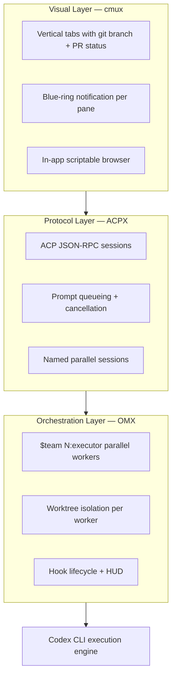
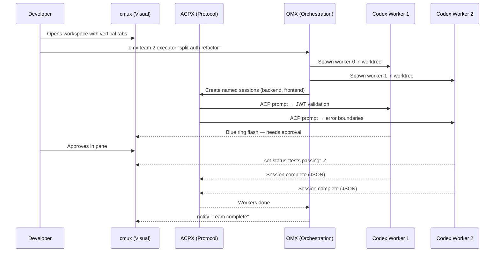

# cmux, ACPX, and OMX: The Three Layers of Multi-Agent UX


---

Running a single AI coding agent is straightforward. Running five in parallel — each on a different module, each needing different approvals — is a UX problem that no traditional terminal was designed to solve. In early 2026 three open-source projects crystallised into a de facto multi-agent UX stack for Codex CLI: **cmux** (visual layer), **ACPX** (protocol layer), and **OMX** (orchestration layer). Each solves a different problem; together they compose into a coherent workflow for teams running parallel agentic sessions at scale.

## The Three-Layer Model



The layers are independent — you can use any one without the others — but they compose naturally: OMX orchestrates the work, ACPX routes prompts to agents via structured protocol, and cmux gives you eyes on everything.

## Layer 1: cmux — The Visual Surface

**cmux** is a native macOS terminal built on Ghostty's `libghostty` rendering engine[^1]. Released in February 2026, it reached 13.3k GitHub stars within weeks[^2]. The core insight: when you are running multiple AI agents, your terminal needs to be agent-aware.

### Notification System

The "notification fatigue" problem is real. With five agents running across splits and tabs, you need a glanceable signal for which pane needs attention. cmux solves this with a layered notification architecture:

- **Blue-ring flash**: The `trigger-flash` command causes a bright blue border to flash around the pane that needs input[^3]. Tabs in the sidebar simultaneously light up.
- **macOS system notifications**: `cmux notify --title "Tests Passed" --body "auth-module green"` fires a standard notification[^3].
- **Status indicators**: Agents can set per-pane status with `cmux set-status <key> <value> --icon <sf_symbol>` and progress bars with `cmux set-progress <value>`[^3].
- **OSC escape sequences**: cmux monitors OSC 9/99/777 terminal sequences for backward compatibility with tools that already emit notifications[^2].

### Socket API and Agent Control

Communication between agents and the terminal happens over a Unix domain socket at `/tmp/cmux.sock`[^3]. Agents running inside a cmux pane issue CLI commands that translate to JSON messages sent to this socket — near-instantaneous IPC rather than PTY scraping.

```bash
# Split a new pane and open a browser to the dev server
cmux new-split right
cmux new-pane --type browser --url http://localhost:3000

# Agent-driven browser interaction
cmux browser wait --surface $CMUX_SURFACE_ID --load-state complete
cmux browser snapshot --surface $CMUX_SURFACE_ID --interactive
cmux browser click --surface $CMUX_SURFACE_ID '<button_ref>'
```

The sidebar displays git branch, PR status, working directory, listening ports, and the latest notification text per tab — all the context you need to supervise parallel agents without switching focus[^2].

### Claude Code Integration

cmux provides a hook system for Claude Code that triggers scripts on agent events (session start, task completion)[^3]. There is also an open proposal to support cmux as a native `teammateMode` backend for Claude Code agent teams[^4], which would replace tmux for multi-agent spawning.

## Layer 2: ACPX — The Protocol Surface

**ACPX** (Agent Client Protocol X) is a headless CLI client for the Agent Client Protocol (ACP)[^5]. Where cmux solves *seeing* agents, ACPX solves *talking to* them — structured JSON-RPC communication instead of sending keystrokes to a PTY.

### Why a Protocol Layer Matters

Traditional multi-agent setups use `tmux send-keys` to inject text into terminal panes. This is fragile: you are effectively screen-scraping your own processes. ACPX replaces this with typed ACP messages — session creation, prompt delivery, cancellation, and status queries all flow through a structured protocol[^5].

```bash
# Install globally
npm install -g acpx@latest

# Start a named session scoped to the current repo
acpx codex sessions new -s backend
acpx codex prompt -s backend "Refactor the auth middleware to use JWT validation"

# Fire-and-forget a second session
acpx codex sessions new -s frontend
acpx codex prompt -s frontend --no-wait "Add error boundaries to all route components"
```

### Session Management

Sessions are directory-scoped (resolved via git-root walk) with optional names[^5]. Key properties:

- **Persistence**: Sessions survive process restarts. `Ctrl+C` and reconnect — ACPX picks up the running agent.
- **Prompt queueing**: Multiple prompts execute sequentially within a session. No race conditions, no interleaving.
- **Soft-close lifecycle**: Closing a session marks it inactive without deleting disk records — history is preserved.
- **Queue owner TTL**: A brief availability window after prompt completion allows follow-up prompts without re-creating the session.

### Agent Adapters

ACPX ships built-in adapters for a remarkable breadth of agents: Codex CLI, Claude Code, Gemini CLI, Cursor CLI, GitHub Copilot CLI, Pi Coding Agent, OpenClaw ACP bridge, Factory Droid, iFlow CLI, Kilocode, Kimi, Kiro, OpenCode, Qoder, Qwen, and Trae[^5]. This makes it the polyglot glue layer — one command surface regardless of which agent executes the work.

### Output Formats

Four output modes serve different consumers[^5]:

| Mode | Use case |
|------|----------|
| `text` | Human-readable with tool updates (default) |
| `json` | NDJSON event stream for automation and dashboards |
| `quiet` | Final assistant text only — for piping into other tools |
| `--suppress-reads` | Replaces file contents with `[read output suppressed]` for security |

Configuration lives in `~/.acpx/config.json` (global) and `.acpxrc.json` (project-level), supporting default agent selection, permission policies (`approve-all`, `approve-reads`, `deny-all`), and custom agent commands[^5].

## Layer 3: OMX — The Orchestration Surface

**Oh My codeX (OMX)** is the orchestration layer built on top of Codex CLI[^6]. At 19.6k stars and v0.12.4 (released 9 April 2026)[^7], it is the most mature of the three projects. OMX does not replace Codex — it wraps it with reusable skills, team coordination, hooks, and persistent project state.

### Skills System

OMX provides four canonical skills invoked with `$` syntax[^6]:

| Skill | Purpose |
|-------|---------|
| `$deep-interview` | Structured scope clarification before implementation |
| `$ralplan` | Consensus planning with trade-off analysis |
| `$ralph` | Persistent execution loop — keeps working until goals are verified complete |
| `$team N:executor` | Coordinated parallel execution across N workers |

Beyond these, OMX ships 33 specialised agent prompts organised into build/analysis, review, domain, and coordination categories[^7].

### Worktree Isolation

Since v0.12.1, every team worker runs in an isolated git worktree by default[^6]:

```
.omx/
  team/
    auth-migration/
      worktrees/
        worker-0/    # isolated git worktree
        worker-1/    # isolated git worktree
        worker-2/    # isolated git worktree
```

No flags needed — `omx team 3:executor "parallelise auth migration across modules"` automatically creates three worktrees, preventing write conflicts when agents edit concurrently[^7].

### Hook System and HUD

OMX operates two hook systems in parallel[^8]:

1. **Native Codex hooks** via `.codex/hooks.json` — the canonical lifecycle surface.
2. **OMX-specific hooks** via `.omx/hooks/*.mjs` — extensible JavaScript handlers for framework-level events.

The live Heads-Up Display (`omx hud --watch`) provides real-time monitoring of worker status, task claims, and mailbox messages between workers[^8].

### Team Coordination

The team runtime uses tmux (or psmux on Windows) for durable process management[^7]. Workers communicate through a claim-safe task lifecycle with mailbox messaging, and state survives session interruptions[^8]. Project guidance, plans, logs, and state persist in `.omx/` across sessions[^6].

## How the Layers Compose



A typical workflow:

1. **OMX** plans the work (`$ralplan`), spawns a team (`$team 3:executor`), and creates isolated worktrees.
2. **ACPX** manages the structured communication — each worker gets a named session with prompt queueing and cancellation support.
3. **cmux** renders the visual surface — vertical tabs per worker, blue-ring alerts when approval is needed, status indicators showing progress.

The developer's role shifts from typing commands to supervising a dashboard.

## When to Use Each vs Codex's Built-In Subagents

Codex CLI's native subagent system[^9] handles straightforward delegation within a single session. The three-layer stack becomes valuable when you need:

| Requirement | Built-in subagents | cmux + ACPX + OMX |
|-------------|--------------------|--------------------|
| Visual monitoring of 5+ agents | ✗ | ✓ (cmux) |
| Cross-agent protocol communication | ✗ | ✓ (ACPX) |
| Persistent worktree isolation | ✗ | ✓ (OMX) |
| Mixed-agent workflows (Codex + Claude) | ✗ | ✓ (ACPX adapters) |
| Single-session simple delegation | ✓ | Overkill |

For a single agent doing a focused task, Codex subagents are simpler and sufficient. For a team of agents working in parallel across multiple repositories or mixed providers, the three-layer stack provides the observability, protocol safety, and orchestration that built-in subagents lack.

## Platform Considerations

- **cmux** is macOS-only (Swift/AppKit + libghostty)[^2]. A community Windows port (wmux) exists[^10] but is less mature. ⚠️ The sandbox restriction for `/tmp/cmux.sock` access means agents running in strict sandbox mode may need configuration adjustments[^3].
- **ACPX** is cross-platform (Node.js/TypeScript)[^5].
- **OMX** is cross-platform, using tmux on macOS/Linux and psmux on Windows[^7].

## Citations

[^1]: [cmux: Native macOS Terminal for AI Coding Agents — Better Stack Community](https://betterstack.com/community/guides/ai/cmux-terminal/)

[^2]: [cmux — manaflow-ai/cmux on GitHub](https://github.com/manaflow-ai/cmux)

[^3]: [cmux Complete Guide: The Next-Gen macOS Terminal for AI Coding Agents — Gardenee Blog](https://agmazon.com/blog/articles/technology/202603/cmux-terminal-ai-guide-en.html)

[^4]: [Support cmux as a teammateMode backend for agent teams — Claude Code Issue #36926](https://github.com/anthropics/claude-code/issues/36926)

[^5]: [acpx: Headless CLI client for stateful ACP sessions — GitHub](https://github.com/openclaw/acpx)

[^6]: [What Is Oh My Codex (OMX)? Complete 2026 Guide — a2a-mcp.org](https://a2a-mcp.org/blog/what-is-oh-my-codex)

[^7]: [Oh My codeX — GitHub](https://github.com/Yeachan-Heo/oh-my-codex)

[^8]: [OmX for Codex CLI: A Practical Guide to Multi-Agent Orchestration, Hooks, and HUDs — addROM](https://addrom.com/omx-for-codex-cli-a-practical-guide-to-multi-agent-orchestration-hooks-and-huds/)

[^9]: [Subagents — Codex CLI Documentation](https://developers.openai.com/codex/subagents)

[^10]: [wmux: Windows terminal multiplexer for AI agents — GitHub](https://github.com/amirlehmam/wmux)
