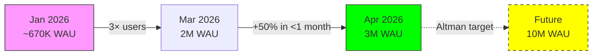
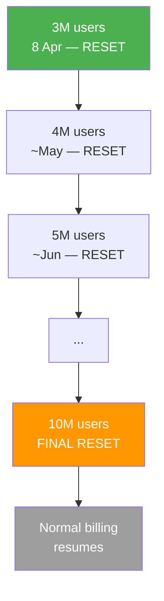
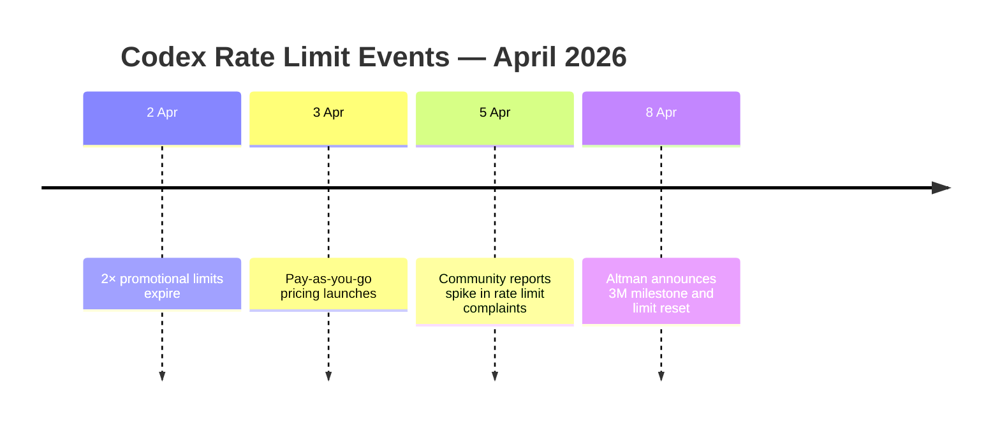

# Codex CLI 3 Million Users: Growth Trajectory and What the Usage Limit Reset Strategy Means

---

On 8 April 2026, Sam Altman announced that Codex had crossed three million weekly active users[^1]. Codex head Thibault Sottiaux confirmed the figure, noting it had risen from two million "a little under a month ago"[^2]. To mark the milestone, OpenAI reset usage limits for every subscriber — and committed to doing so again at every subsequent million-user mark up to ten million[^1].

This is not just a vanity metric. The growth curve, the reset strategy, and the concurrent pricing restructure together reveal how OpenAI is managing capacity, incentivising adoption, and positioning Codex as its enterprise wedge product. This article dissects what practitioners need to know.

## The Growth Curve

The trajectory since Codex's relaunch with the desktop app in February 2026 has been steep:

| Date | Weekly Active Users | Notable Event |
|------|-------------------:|---------------|
| Early Feb 2026 | ~1M downloads (first week) | Desktop app launch with GPT-5.3 Codex[^3] |
| Early Mar 2026 | 1.6M | Fortune reports 3× user growth since January[^4] |
| Late Mar 2026 | 2M | 5× token usage growth since January[^4] |
| 8 Apr 2026 | 3M | Altman announces milestone and limit reset[^1] |

The gap between user growth (3× since January) and token usage growth (5× since January) is the more telling signal[^4]. Existing users are not just signing up — they are integrating Codex deeper into daily workflows, running longer sessions with more complex tasks.

Enterprise adoption has been even more aggressive. Within ChatGPT Business and Enterprise, the number of Codex users grew 6× since January 2026[^4]. Companies including Cisco, Nvidia, Ramp, Rakuten, and Harvey have rolled out Codex across their engineering teams[^4].

## The Progressive Limit Reset Strategy

Altman's exact words: "To celebrate 3 million weekly Codex users, we are resetting usage limits. We will do this for every million users up to 10 million."[^1]

### What a Reset Actually Does

A usage limit reset wipes the accumulated consumption counter for every subscriber, regardless of where they are in their current billing window[^2]. If you had consumed 60% of your weekly allocation on Tuesday, it drops back to 0% — but your window end-date also shifts[^5].

This creates a predictable pattern through the 10M target:

### The Strategic Logic

The reset strategy serves multiple purposes simultaneously:

1. **Capacity signal.** Each reset implicitly tells the market "we can handle this load." At 3M weekly active users with 5× token growth, OpenAI is burning significant GPU capacity. Resetting limits rather than tightening them signals confidence in infrastructure scaling.

2. **Growth flywheel.** Users who hit their limit mid-week tend to churn or downgrade. A surprise reset re-engages lapsed heavy users and generates social media buzz — Altman's post was widely amplified[^6]. The promise of future resets creates anticipation that keeps users engaged past friction points.

3. **Pricing migration bridge.** The reset announcement came five days after the 3 April pay-as-you-go pricing restructure[^7]. The resets keep fixed-tier subscribers happy while OpenAI migrates enterprise customers to token-based billing where limits are less relevant.

## The April Pricing Context

The 3M milestone did not happen in a vacuum. On 3 April, OpenAI restructured Codex pricing[^7]:

- **Codex-only seats** for Business and Enterprise: no fixed seat fee, pure token-based billing, no rate limits[^7]
- **Business plan price cut**: $25 → $20 per seat per month[^8]
- **Promotional credits**: up to $500 per team ($100 per new Codex-only team member)[^9]
- **Transparent token billing**: usage now tracked as credits per million input/output tokens rather than opaque "message" counts[^7]

For enterprise teams, the combination is compelling: lower base cost, transparent per-token billing, and periodic free limit resets for anyone still on fixed tiers.

### Rate Limit Friction

The growth story is not without friction. The community has documented significant rate-limit complaints, particularly after the 2× promotional limits expired on 2 April[^10]:

- GitHub issue #16848 reports "rate limits going crazy" with basic tasks consuming entire 5-hour allocations within 10 minutes[^11]
- Issue #16785 documents "arbitrary usage resets resulting in an overall loss of tokens" — the paradox where a celebratory reset can actually disadvantage users who had carefully managed their allocation[^5]
- Issue #16423 captures frustration with "arbitrary weekly limit resets" that shift window end-dates unpredictably[^12]

The Plus tier is particularly affected. Users report hitting 5-hour limits after two short sessions, with single prompts consuming 7% of weekly limits on the Plus plan[^13]. Pro users fare somewhat better but still encounter stricter-than-expected limits following the end of the promotional 2× period[^14].

The timing is suggestive. The limit reset on 8 April effectively functions as damage control for the friction created when promotional limits expired six days earlier. Whether intentional or opportunistic, it smooths the transition.

## What This Means for Practitioners

### Capacity Planning

If your team relies on Codex during peak hours, the growth trajectory introduces genuine capacity risk. Adding one million users per month means rate-limit pressure will intensify between resets. Practical mitigations:

- **Migrate to Codex-only seats** if on Business or Enterprise. Token-based billing with no rate limits sidesteps the issue entirely[^7].
- **Front-load complex work** immediately after a reset when your allocation is fresh.
- **Monitor the GitHub issues tracker** — issues #16848 and #14593 (491 comments on billing opacity) are the canaries in the coal mine[^11].

### Cost Modelling

The shift from opaque limits to token-based billing makes cost modelling tractable for the first time. A typical Codex session processes approximately 50K–100K tokens (input + output). With the rate card now published at API-equivalent rates[^15], teams can forecast monthly spend by measuring actual token consumption during a trial period on the $500 promotional credit.

### Enterprise Adoption Signals

The 6× enterprise user growth since January[^4] suggests Codex is transitioning from individual developer experimentation to team-wide deployment. Sottiaux's comment that "there's very little that is specific to coding" in the underlying agent architecture[^4] hints at OpenAI's broader ambition: Codex as a general-purpose enterprise agent platform that happens to have started with code.

## The Competitive Landscape

The 3M milestone arrives as competitive dynamics intensify. Ramp data shows Anthropic capturing over 60% of business AI chatbot invoices (up from 10% a year prior), while OpenAI's share declined to approximately 35%[^4]. Claude Code's open-source release (390K+ lines of TypeScript) gives it a transparency advantage that Codex's open-source CLI matches but the cloud-hosted Codex app does not.

TokenCalculator's April 2026 rankings place Claude Code #1 and Codex #2, predicting parity by mid-2026[^16]. The growth-through-generosity strategy — limit resets, price cuts, promotional credits — reads as OpenAI's response to this competitive pressure.

## Outlook

At the current trajectory of roughly one million new weekly active users per month, Codex could reach the 10M target by Q4 2026 — triggering six more limit resets along the way. The real question is whether OpenAI can sustain the GPU capacity to match this growth without degrading the experience that drove adoption in the first place.

The rate-limit complaints suggest the answer is "not yet, not seamlessly." But the pay-as-you-go migration provides a pressure valve: users who need guaranteed capacity can pay for it, while the limit resets keep the fixed-tier majority engaged. It is a classic two-speed growth strategy, and so far, the numbers say it is working.

---

## Citations

[^1]: Sam Altman, announcement on Threads/X, 8 April 2026. Reported by [Techmeme](https://www.techmeme.com/260408/p7).
[^2]: [OpenAI Resets Codex Usage Limits After Reaching 3 Million Weekly Users — Technobezz](https://www.technobezz.com/news/openai-resets-codex-usage-limits-after-reaching-3-million-weekly-users)
[^3]: [OpenAI's Codex App Hits 1 Million Downloads — techbuddies.io](https://www.techbuddies.io/2026/02/10/openais-codex-app-hits-1-million-downloads-as-agentic-coding-enters-the-enterprise-mainstream/)
[^4]: [OpenAI sees Codex users spike to 1.6 million, positions coding tool as gateway to AI agents for business — Fortune](https://fortune.com/2026/03/04/openai-codex-growth-enterprise-ai-agents/)
[^5]: [Arbitrary usage resets resulting in an overall loss of tokens — GitHub Issue #16785](https://github.com/openai/codex/issues/16785)
[^6]: [OpenAI Codex celebrates 3 million weekly users, CEO Sam Altman resets usage limits — BusinessToday](https://www.businesstoday.in/technology/story/openai-codex-celebrates-3-million-weekly-users-ceo-sam-altman-resets-usage-limits-524717-2026-04-08)
[^7]: [Codex now offers pay-as-you-go pricing for teams — OpenAI](https://openai.com/index/codex-flexible-pricing-for-teams/)
[^8]: [AI Coding: OpenAI Switches Codex to Pay-as-You-Go, Cuts Seat Cost to $20 — WinBuzzer](https://winbuzzer.com/2026/04/04/openai-switches-codex-pay-as-you-go-pricing-cuts-business-seat-cost-xcxwbn/)
[^9]: [OpenAI Adds Pay-As-You-Go Codex Seats for ChatGPT Business and Enterprise Teams — gHacks](https://www.ghacks.net/2026/04/03/openai-adds-pay-as-you-go-codex-seats-for-chatgpt-business-and-enterprise-teams/)
[^10]: [CODEX LIMITS - FINALLY GOOD after April 1st reset — OpenAI Developer Community](https://community.openai.com/t/codex-limits-finally-good-after-april-1st-reset/1378333)
[^11]: [Rate Limits going CRAZY?? — GitHub Issue #16848](https://github.com/openai/codex/issues/16848)
[^12]: [Frustrated with arbitrary weekly limit resets — GitHub Issue #16423](https://github.com/openai/codex/issues/16423)
[^13]: [Codex - Usage after the limit reset update, single prompt eats 7% of weekly limits - Plus tier — OpenAI Developer Community](https://community.openai.com/t/codex-usage-after-the-limit-reset-update-single-prompt-eats-7-of-weekly-limits-plus-tier/1365284)
[^14]: [Are Codex Pro limits now stricter after the recent update too? — OpenAI Developer Community](https://community.openai.com/t/are-codex-pro-limits-now-stricter-after-the-recent-update-too/1364809)
[^15]: [Codex rate card — OpenAI Help Center](https://help.openai.com/en/articles/20001106-codex-rate-card)
[^16]: [Best AI IDE & CLI Tools April 2026: Claude Code Wins, Codex Catches Up — TokenCalculator](https://tokencalculator.com/blog/best-ai-ide-cli-tools-april-2026-claude-code-wins)
