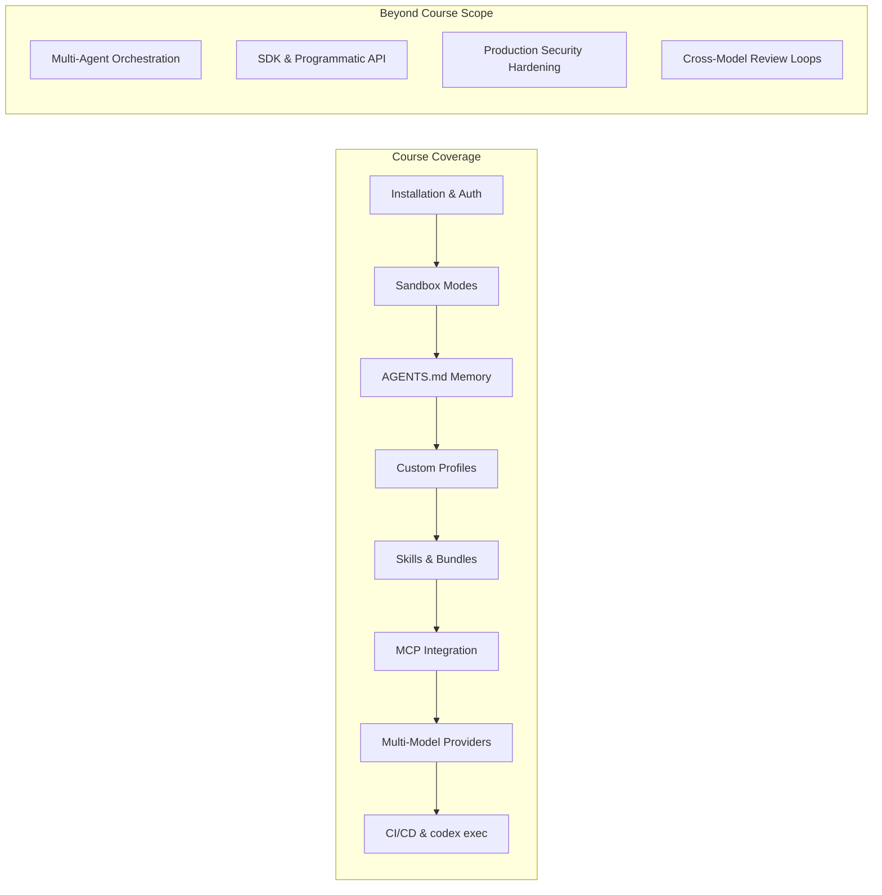

# Codex CLI Enters the O'Reilly Curriculum: What Ken Kousen's 5-Hour Course Tells Us About Mainstream Adoption

---

When a tool graduates from GitHub README to O'Reilly live training, it has crossed an invisible line. OpenAI's Codex CLI has just done exactly that. Ken Kousen — O'Reilly veteran, JavaOne Rock Star, author of *Kotlin Cookbook* and *Modern Java Recipes* — is delivering a 5-hour live course titled **Agentic Coding with OpenAI Codex CLI** on 4 May 2026[^1]. This article examines what that milestone signals about Codex CLI's maturity, how the course content maps to the tool's current feature surface, and where Codex CLI sits in the broader O'Reilly agentic-coding curriculum.

## Why This Matters

O'Reilly's editorial team classifies the course as **Intermediate**, not beginner[^1]. That classification carries weight: it tells prospective learners — and their employers — that Codex CLI is no longer experimental. It is a production-grade tool that warrants structured professional development, sitting alongside established technologies in the O'Reilly catalogue.

The timing is significant. Codex CLI crossed 3 million weekly active users on 7 April 2026, up 50% from 2 million in early March[^2]. Sam Altman celebrated the milestone by resetting usage limits, with plans to repeat the reset at every million-user milestone up to 10 million[^2]. A tool with that adoption curve demands formal training pathways, and O'Reilly is meeting the demand.

## Inside the Course

Kousen's training repository on GitHub[^3] reveals a 160-slide Slidev deck and six progressive hands-on labs:

| Lab | Duration | Focus |
|-----|----------|-------|
| Lab 0 | 15–20 min | Plan mode interaction and task steering |
| Lab 1 | 60–90 min | Spring Boot REST API with CRUD, H2 database, testing |
| Lab 2 | 45–60 min | Python refactoring with type hints and design patterns |
| Lab 3 | 45–60 min | React TypeScript forms with validation and accessibility |
| Lab 4 | 90–120 min | Multi-language microservices with RabbitMQ and Docker |
| Lab 5 | 30 min | Custom skill creation using `$skill-creator` |

The prerequisites are telling: **Node.js 22+** and an active **OpenAI API key**[^1]. Even in May 2026, npm-first onboarding remains canonical — no Docker image, no system package, just `npm install -g @openai/codex`.

### Polyglot by Design

Kousen's background is Java, Kotlin, and Groovy. His lab choices — Spring Boot, Python, React TypeScript, multi-language microservices — deliberately span the ecosystem. This confirms what power users already know: Codex CLI is language-agnostic by design, and the training reflects that reality rather than defaulting to a single stack.

### Coverage Mapping

The course covers a substantial slice of Codex CLI's feature surface:

The course spans roughly the equivalent of Parts 1–3 of a comprehensive treatment (getting started → configuration → agents and skills), while deeper topics like multi-agent orchestration, SDK integration, and production security patterns remain beyond its scope. For teams needing those advanced patterns, the gap represents a clear opportunity for supplementary resources.

## Kousen's Evolving Perspective on Codex CLI

Kousen's candid assessment on his Substack newsletter provides useful context[^4]. He characterises Codex CLI as having gone from "almost unusable" to "totally usable" after substantial improvements. His one persistent criticism: TOML files for MCP server configuration, which he finds less ergonomic than alternatives[^4].

More revealingly, Kousen is exploring **agent orchestration** — configuring Codex CLI and Gemini CLI as MCP servers that Claude Code can delegate to[^4]. This cross-agent pattern, where one CLI tool orchestrates others, is exactly the kind of advanced workflow that sits beyond the course's scope but hints at where the ecosystem is heading.

His September 2025 AI Codecon talk, "The Hitchhiker's Guide to AI Coding Agents (Don't Panic!)", introduced the major agents — Claude Code, Codex CLI, Gemini CLI — with quick demos of capabilities and limitations[^5]. The May 2026 course represents a natural deepening: from a 15-minute survey to a 5-hour deep dive on a single tool.

## The Broader O'Reilly Agentic-Coding Ecosystem

Codex CLI's course does not exist in isolation. O'Reilly has built an entire agentic-coding curriculum:

| Course | Instructor | Tool |
|--------|-----------|------|
| Agentic Coding with OpenAI Codex CLI | Ken Kousen | Codex CLI |
| Agentic Coding with Claude Code | — | Claude Code |
| Agentic Coding with Gemini CLI | — | Gemini CLI |
| A Five-Step Framework for Effective AI-Assisted Coding | Andrew Stellman | General |
| AutoGen with Python for Multi-Agent Systems | Noureddin Sadawi | AutoGen |

Every major AI coding CLI now has an O'Reilly training track[^6]. This parallel investment tells us the market has not converged on a single winner — O'Reilly is hedging across all three major CLI agents, which is itself a signal of ecosystem health.

### Curated Bundles and Individual Purchase

In February 2026, O'Reilly announced that live events are now available for **individual purchase** without requiring a platform subscription[^7]. Curated bundles include "Agentic Coding for Software Developers", "MCP for Developers", and "Agents for Everyone"[^7]. The bundling strategy is notable: it frames agentic coding not as a single-tool skill but as a **discipline** requiring breadth across multiple tools and patterns.

### AI Codecon Conference Series

O'Reilly's third AI Codecon, "Software Craftsmanship in the Age of AI", took place on 26 March 2026[^8]. Speakers included Cat Wu (Anthropic, Claude Code product lead), Addy Osmani (orchestrating coding agents), and Nicole Koenigstein (agentic failure costs)[^8]. The conference — free for all attendees — positions agentic coding as a first-class software engineering discipline, not a novelty.

## What the Recommended Follow-Ups Reveal

The course page recommends three follow-up resources[^1]:

1. **Reading and Maintaining Code with Generative AI** — treating AI-generated code as a maintenance concern
2. **AI-Assisted Test-Driven Development** — integrating AI into the testing workflow
3. **AI-Assisted Programming** (book) — broader patterns for AI-augmented development

This learning path suggests O'Reilly views Codex CLI as a **starting point**, not an endpoint. The progression runs: learn the tool → manage the code it produces → test rigorously → develop broader AI-assisted practices. It is a maturity model disguised as a reading list.

## Implications for the Ecosystem

### For Teams Evaluating Codex CLI

The existence of formal O'Reilly training significantly lowers the barrier to enterprise adoption. Training budgets can now be allocated against a recognised catalogue entry. L&D departments have a concrete answer to "how do we upskill our engineers?"

### For Competing Tools

Claude Code and Gemini CLI each have their own O'Reilly courses, creating a level playing field in terms of training availability. The differentiator shifts from "can we get trained?" to "which tool fits our workflow?" — a much healthier competitive dynamic.

### For Content Creators

With 3 million weekly users and O'Reilly-level training now available, the Codex CLI content market is maturing. The gap is no longer introductory material (Kousen's course covers that) but **advanced patterns**: multi-agent orchestration, production security, SDK integration, and cross-model workflows.

## Conclusion

Ken Kousen's O'Reilly course is a lagging indicator of what practitioners already know — Codex CLI is a serious, production-grade tool — but a **leading indicator** for enterprise adoption. When the training catalogue entry exists, procurement approvals follow. The 5-hour format, intermediate classification, polyglot lab design, and curated follow-up path all point to the same conclusion: Codex CLI has graduated from open-source curiosity to mainstream professional tool.

The question is no longer *whether* to learn Codex CLI, but *how deep to go*.

## Citations

[^1]: O'Reilly Media, "Agentic Coding with OpenAI Codex CLI" course listing, [https://www.oreilly.com/live-events/agentic-coding-with-openai-codex-cli/0642572198695/](https://www.oreilly.com/live-events/agentic-coding-with-openai-codex-cli/0642572198695/)

[^2]: BusinessToday, "OpenAI Codex celebrates 3 million weekly users, CEO Sam Altman resets usage limits", April 2026, [https://www.businesstoday.in/technology/story/openai-codex-celebrates-3-million-weekly-users-ceo-sam-altman-resets-usage-limits-524717-2026-04-08](https://www.businesstoday.in/technology/story/openai-codex-celebrates-3-million-weekly-users-ceo-sam-altman-resets-usage-limits-524717-2026-04-08)

[^3]: Ken Kousen, "codex-training" GitHub repository, [https://github.com/kousen/codex-training](https://github.com/kousen/codex-training)

[^4]: Ken Kousen, "Tales from the jar side: AI Codecon, CLI Agents" Substack, [https://kenkousen.substack.com/p/tales-from-the-jar-side-ai-codecon](https://kenkousen.substack.com/p/tales-from-the-jar-side-ai-codecon)

[^5]: O'Reilly Media, "AI Codecon: Coding for the Agentic World" event, [https://www.oreilly.com/live-events/ai-codecon-coding-for-the-agentic-world/0642572207748/](https://www.oreilly.com/live-events/ai-codecon-coding-for-the-agentic-world/0642572207748/)

[^6]: O'Reilly Media, Live Events catalogue, [https://www.oreilly.com/live-events/](https://www.oreilly.com/live-events/)

[^7]: O'Reilly Media / BusinessWire, "O'Reilly Offers Its Renowned Live Events for Individual Purchase", February 2026, [https://www.businesswire.com/news/home/20260223838501/en/OReilly-Offers-Its-Renowned-Live-Events-for-Individual-Purchase-Along-with-Curated-Bundles-Covering-the-Latest-Technical-Skills](https://www.businesswire.com/news/home/20260223838501/en/OReilly-Offers-Its-Renowned-Live-Events-for-Individual-Purchase-Along-with-Curated-Bundles-Covering-the-Latest-Technical-Skills)

[^8]: O'Reilly Media / BusinessWire, "O'Reilly to Host Third AI Codecon on Software Craftsmanship in the Age of AI", March 2026, [https://www.businesswire.com/news/home/20260309594534/en/OReilly-to-Host-Third-AI-Codecon-on-Software-Craftsmanship-in-the-Age-of-AI](https://www.businesswire.com/news/home/20260309594534/en/OReilly-to-Host-Third-AI-Codecon-on-Software-Craftsmanship-in-the-Age-of-AI)
