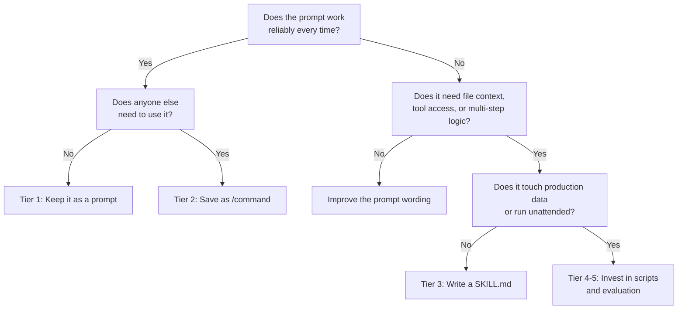

# Codex CLI Skills: When a 10-Word Prompt Beats a Production Artefact


---

The skill ecosystem for AI coding agents has exploded. SkillsMP lists over 96,000 skills for Claude Code alone[^1]. OpenAI's own skills catalogue ships system-level skills like `skill-creator` and `skill-installer` bundled with every Codex CLI installation[^2]. Anthropic's Skill Creator V2 now offers scientific A/B evaluation with parallel test executions and percentage improvement scores[^3].

And yet the most productive pattern many senior developers have discovered is this: a 10-word prompt, saved as a one-line command, that just works.

This article explores the spectrum from throwaway prompt to production skill, offers a decision framework for where your next automation should land, and examines why over-engineering a skill can actively make things worse.

## The Durability Problem

AI tooling changes at a pace that makes six-month-old code feel archaeological. A skill written in January 2026 against Claude Code's commands system needed rewriting by March when Anthropic merged commands and skills into a unified architecture[^4]. A Codex CLI skill targeting the original single-agent model needed restructuring when multi-agent v2 arrived with TOML-defined subagents and path-based addressing[^5].

The implication is uncomfortable: **the more moving parts a skill has, the faster it rots**. A skill that shells out to specific CLI flags, references particular model names, or depends on a precise tool invocation chain becomes a maintenance liability the moment any upstream component shifts.

A 10-word prompt — "refactor this module to use dependency injection throughout" — has no moving parts. It survives model upgrades, CLI version bumps, and architectural changes because it operates at the level of intent rather than implementation.

## The Skill Spectrum

Not every automation belongs at the same level of investment. The spectrum runs from zero-cost prompts through to fully evaluated production pipelines:


### Tier 1: The Prompt

A prompt typed directly into Codex CLI or Claude Code. Zero persistence, zero maintenance. If it works reliably, there is no reason to promote it further.

**Example:** `codex "add error handling to all public methods in src/api/"`

### Tier 2: The Saved Command

Both Codex CLI and Claude Code now support saving prompts as slash commands. In Claude Code, drop a markdown file into `.claude/skills/` or `~/.claude/skills/` and the filename becomes the `/command`[^6]. In Codex CLI, AGENTS.md files at any directory level can define reusable instruction blocks[^7].

The cost is one file. The benefit is repeatability and discoverability — other developers on the team can invoke `/lint-review` without knowing the underlying prompt.

### Tier 3: The Structured Skill (SKILL.md)

A SKILL.md file with YAML frontmatter (name and description), markdown instructions, and optional subdirectories for scripts, references, and assets[^8]. This is the format standardised across both Codex CLI and Claude Code since Anthropic open-sourced the Agent Skills specification in December 2025[^9].

```toml
# Example: Codex CLI skill frontmatter (SKILL.md)
---
name: "migration-generator"
description: "Generate database migration files from schema changes"
---
```

The progressive disclosure model means Codex loads only the metadata initially (~50–100 tokens per skill) and fetches the full instructions only when the skill is selected[^10]. This keeps the context window clean when you have dozens of installed skills.

### Tier 4: Skill With Scripts

Adding a `scripts/` directory to a skill introduces deterministic steps — shell scripts, Python utilities, or validation checks that run outside the LLM's reasoning loop. This is where skills start to resemble traditional tooling and where maintenance cost climbs sharply.

### Tier 5: Evaluated Pipeline

Anthropic's Skill Creator V2 operates in four modes: Create, Eval, Improve, and Benchmark[^3]. The eval pipeline uses four composable sub-agents running in parallel — executor, grader, comparator, and analyser — with a 60/40 training/test split to prevent overfitting[^11]. It produces percentage improvement scores and interactive browser-based review dashboards.

This is rigorous. It is also expensive. A single evaluation cycle can cost $12–15 in token usage[^12].

## The Decision Framework

The question is not "should I write a skill?" but "at which tier should this automation live?" Here is a practical framework:



The key insight: **most automations should stop at Tier 2**. The jump from a saved command to a structured SKILL.md should be motivated by a concrete failure mode — the prompt sometimes produces wrong output, it needs to invoke specific tools, or it requires multi-step orchestration that natural language cannot reliably express.

## AGENTS.md: The Constitution That Makes Skills Optional

Codex CLI's AGENTS.md system provides a layering mechanism that often eliminates the need for standalone skills entirely[^7]. AGENTS.md files are discovered hierarchically — Codex walks from the project root down to the current working directory, loading each level's instructions[^13].

This creates natural tiers:

- **Root AGENTS.md** — project-wide conventions (coding style, testing requirements, architectural constraints). This functions as a constitution.
- **Directory-level AGENTS.md** — specialist instructions for specific subsystems (`/api/AGENTS.md` with REST conventions, `/infra/AGENTS.md` with Terraform patterns).
- **Skills** — cross-cutting workflows that do not belong to any single directory.

When the constitutional and specialist layers are well-written, the agent already knows how to handle most tasks correctly. Skills become necessary only for workflows that cross boundaries or require deterministic script execution.

## When Over-Engineering Makes Things Worse

There are three specific failure modes when a skill is over-engineered relative to its purpose:

### False Precision

A skill that specifies exact file paths, line numbers, or implementation details constrains the agent unnecessarily. LLMs reason well about intent; they reason poorly when forced to follow overly prescriptive step-by-step instructions that do not match the current state of the codebase.

### Context Window Pollution

Each skill adds approximately 50–100 tokens of metadata to the agent's initial context[^10]. When the full instructions are loaded, a verbose skill can consume thousands of tokens. With Codex CLI's 192,000-token context window[^14], this sounds manageable in isolation — but compound it across 30+ installed skills, subagent definitions, AGENTS.md files, and the actual codebase, and you are burning context on instructions rather than reasoning.

A vague skill description like "helps with databases" will fire on irrelevant prompts and pollute the context further[^10].

### Brittleness

A skill with six shell scripts, three API calls, and a custom validation step is a skill with six points of failure. When Codex CLI updates its sandbox model, or when an external API changes its response format, the skill breaks silently. The developer who wrote it has moved on. The developer who inherits it spends more time debugging the skill than they would have spent doing the task manually.

## The Weekly Review Pattern

Rather than investing heavily in skill creation upfront, a more sustainable approach is periodic review. The pattern:

1. **Week 1:** Use ad-hoc prompts. Note which ones you repeat.
2. **Week 2:** Promote repeated prompts to Tier 2 saved commands.
3. **Weekly thereafter:** Have the agent itself review saved commands that have not changed recently and suggest improvements or consolidation.

This can be automated in Codex CLI using a subagent that reads the skills directory, checks git history for staleness, and proposes updates:

```bash
codex "Review all skills in ~/.codex/skills/. For each one, check if its instructions reference any deprecated flags, outdated model names, or removed features. Suggest updates or recommend deletion if the skill is no longer useful."
```

This is, notably, a single prompt — not a skill. It does not need to be one.

## When Evaluation Is Worth the Spend

Anthropic's Skill Creator V2 evaluation pipeline is genuinely useful in specific contexts[^3]:

- **Enterprise skills** that automate end-to-end workflows (ticket creation → ADR review → implementation → PR) where a 11% improvement translates to hundreds of saved engineer-hours per month.
- **Unattended skills** running in CI/CD or scheduled tasks where silent failures are costly.
- **Cross-team skills** where consistency across dozens of developers justifies the upfront investment.

For a personal formatting helper or a project-specific refactoring command, spending $15 to learn it improved by 11.4% is vanity metrics territory[^12]. Save the tokens for actual work.

## Practical Recommendations

1. **Start with AGENTS.md.** Get the constitutional and specialist layers right before creating any skills. A well-written root AGENTS.md eliminates the need for half the skills you think you need.

2. **Write descriptions, not instructions.** When you do create a SKILL.md, invest in a precise, keyword-rich description. Codex's progressive disclosure model means the description is all that is loaded initially — it determines whether the skill fires at all[^10].

3. **Prefer Tier 2 over Tier 3.** A saved command with a good description is faster to create, easier to maintain, and often just as effective as a structured SKILL.md.

4. **Delete aggressively.** Skills that have not been invoked in 30 days are candidates for deletion. Stale skills consume context and create confusion.

5. **Reserve evaluation for high-value workflows.** If the skill does not save at least 10x its evaluation cost in developer time, the evaluation is not worth running.

## Conclusion

The skill ecosystem in 2026 is mature, standardised, and impressively powerful. But maturity brings the temptation to over-engineer. The developers getting the most value from Codex CLI and Claude Code are often the ones with the fewest skills — a tight AGENTS.md constitution, a handful of well-described saved commands, and the discipline to let a good prompt remain a prompt.

The 10-word prompt is not a sign of laziness. It is a sign that you understand what the agent is actually good at.

## Citations

[^1]: [SkillsMP: 96,751+ Claude Code Skills Directory](https://medium.com/@julio.pessan.pessan/skillsmp-this-96-751-claude-code-skills-directory-7dec2eabc338) — Julio Pessan, Medium, 2026
[^2]: [Skills Catalog for Codex](https://github.com/openai/skills) — OpenAI, GitHub, 2026
[^3]: [Anthropic Skill Creator Measures If Your Agent Skills Work](https://medium.com/ai-software-engineer/anthropic-new-skill-creator-measures-if-your-agent-skills-work-no-more-guesswork-840a108e505f) — Joe Njenga, Medium, March 2026
[^4]: [Claude Code Merges Slash Commands Into Skills](https://medium.com/@joe.njenga/claude-code-merges-slash-commands-into-skills-dont-miss-your-update-8296f3989697) — Joe Njenga, Medium, 2026
[^5]: [Codex CLI: The Definitive Technical Reference](https://blakecrosley.com/guides/codex) — Blake Crosley, 2026
[^6]: [Extend Claude with Skills — Claude Code Docs](https://code.claude.com/docs/en/skills) — Anthropic, 2026
[^7]: [Custom Instructions with AGENTS.md — Codex Developer Docs](https://developers.openai.com/codex/guides/agents-md) — OpenAI, 2026
[^8]: [Agent Skills — Codex Developer Docs](https://developers.openai.com/codex/skills) — OpenAI, 2026
[^9]: [CLAUDE.md, AGENTS.md, and Every AI Config File Explained](https://www.deployhq.com/blog/ai-coding-config-files-guide) — DeployHQ, 2026
[^10]: [Codex CLI Agent Skills: 2026 Install and Usage Guide](https://itecsonline.com/post/codex-cli-agent-skills-guide-install-usage-cross-platform-resources-2026) — ITECS Online, 2026
[^11]: [Anthropic Skill Creator 2.0 Update: Evals, Benchmarks, and Multi-Agent Testing](https://www.thetoolnerd.com/p/anthropic-skill-creator-20-update) — The Tool Nerd, 2026
[^12]: ⚠️ Token cost estimates (~$12–15 per evaluation cycle) are based on community reports and vary significantly based on skill complexity and model choice.
[^13]: [How to Set Up OpenAI Codex: AGENTS.md, MCP Servers, Skills](https://llmx.tech/blog/openai-codex-setup-agents-md-mcps-skills-definitive-guide/) — LLMx, 2026
[^14]: [Context Management Strategies for OpenAI Codex](https://iceberglakehouse.com/posts/2026-03-context-openai-codex/) — Alex Merced, Lakehouse Blog, 2026
