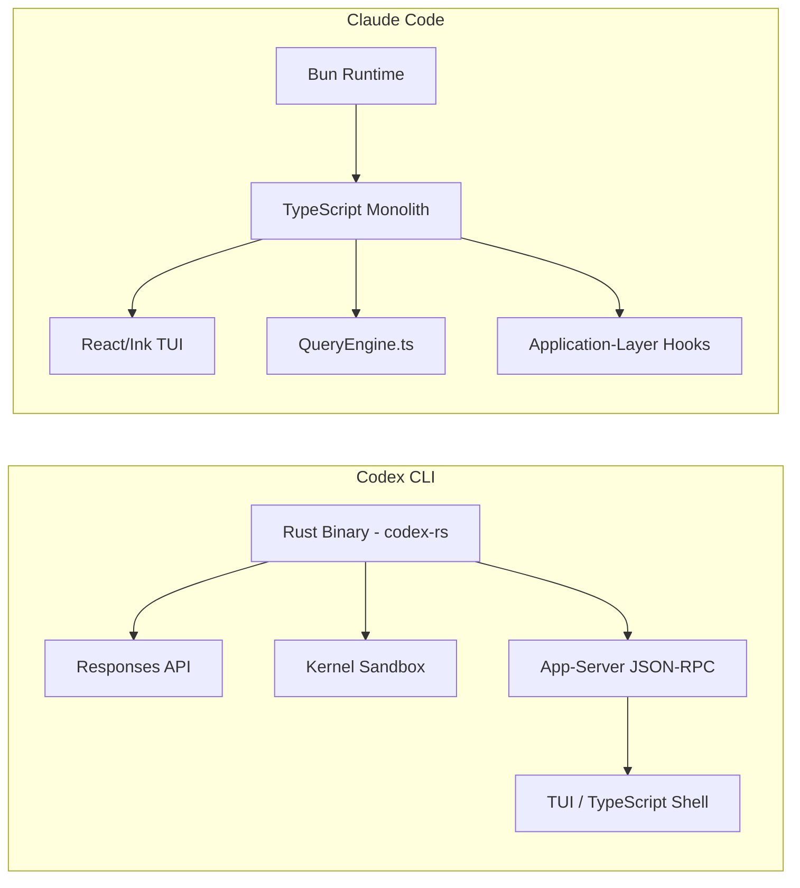
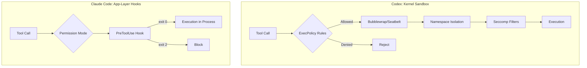

# Codex CLI and Claude Code Compared: April 2026 Architecture Deep Dive

---

The accidental publication of Claude Code's full source on 31 March 2026 — 512,000 lines of TypeScript exposed via an npm source-map packaging error[^1] — made a structured architectural comparison with Codex CLI possible for the first time. Both tools occupy the same niche: terminal-native AI coding agents that read your codebase, propose changes, and execute them. Beneath that surface similarity, they embody fundamentally different engineering philosophies. This article dissects the two architectures side by side as of April 2026.

## Runtime & Language Choices

**Codex CLI** completed its migration from TypeScript to Rust in 2025[^2]. The active codebase lives entirely in `codex-rs/`, with the legacy `codex-cli/` directory retained as a Node.js wrapper that bundles the Rust binary. The repository maintains 67,000+ stars and a development velocity of 10–15 commits per day[^3]. Rust gives Codex zero-dependency installation — no Node.js runtime required — along with deterministic memory management and the ability to enforce kernel-level sandboxing from the same process.

**Claude Code** is a TypeScript monolith running on the Bun runtime[^1]. The 785 KB `main.tsx` entry point bundles a custom React terminal renderer (Ink), 50+ tools, and the entire agent orchestration layer into a single process. Where Codex went native for performance and security, Anthropic bet on rapid iteration speed and the React component model for UI composition.

## The Agent Loop

Both tools implement a core loop of inference → tool calls → results → inference, but the internal architecture differs substantially.

### Codex CLI: ToolOrchestrator in Rust

Central orchestration lives in `codex-rs/core/src/codex.rs`[^3]. Tool dispatch flows through a `ToolOrchestrator` that implements a four-phase pipeline: approval check, sandbox selection, execution attempt, and retry-with-escalation-on-denial. Tools are registered in a `ToolRegistry` and dispatched via a `ToolRouter`. First-party tools include `shell_command` (sandboxed execution), `apply_patch` (a Lark grammar parser for freeform diffs), `js_repl` (persistent Node.js kernel), `spawn_agent`/`wait_agent`/`send_input`/`close_agent` for multi-agent coordination, and `web_search`[^3].

Codex exclusively uses the Responses API (`/v1/responses`)[^3], with built-in provider support for OpenAI (default), Ollama, and LM Studio. Custom providers are configurable in `config.toml` with arbitrary base URLs, API key environment variables, and retry configuration.

### Claude Code: QueryEngine.ts

Claude Code's agent loop is owned by `QueryEngine.ts` — approximately 1,295 lines managing the LLM API loop, session lifecycle, and automatic tool execution[^4]. The tool system lives in `tools.ts`, which registers 50+ tools with a permission model offering four modes: default, auto, bypass, and (ironically) "yolo" which denies everything[^5]. Each tool implements a uniform interface (schema, permissions, execution), so MCP tools from external servers plug in identically to first-party ones.

The key structural difference: Codex separates the agent core (Rust) from the presentation layer (TypeScript TUI) via a JSON-RPC interface, whereas Claude Code's query engine, tool system, and UI all share a single TypeScript process boundary.

## Sandbox Models: Kernel vs Application Layer

This is the sharpest architectural divergence between the two tools.

### Codex CLI: OS-Level Enforcement

Codex enforces safety at the kernel level using platform-native primitives[^6]:

- **Linux**: Bubblewrap (vendored and compiled since v0.115.0) constructs a restricted filesystem view with `--unshare-user`, `--unshare-pid`, and `--unshare-net`. The filesystem defaults to read-only (`--ro-bind / /`) with explicit writable path bindings. Seccomp filters block `AF_UNIX` and `socketpair` syscalls. Protected directories (`.git`, `.codex`) remain read-only even under writable roots[^3].
- **macOS**: Apple's Seatbelt framework via `sandbox-exec` with mode-specific profiles compiled at runtime[^6].
- **Windows**: Restricted tokens with optional elevation, running processes on isolated desktops[^3].

The `execpolicy` crate implements a DSL-based rule engine. Rules live in `~/.codex/rules/*.rules` and workspace `.codex/rules/*.rules`. Several command categories are hardcoded as banned regardless of rules: shell interpreters (`python`, `ruby`, `perl`), shell wrappers (`bash -c`, `sh -c`), and bare `git` commands[^3].

### Claude Code: Lifecycle Hooks

Claude Code uses application-layer hooks across 17 lifecycle event types[^7]. A `PreToolUse` hook on Bash can inspect every command, validate it against arbitrary logic, and block it with exit code 2. This provides finer-grained programmability — you can write hooks that enforce project-specific invariants — but shares a process boundary with the agent itself.

The fundamental trade-off: kernel sandboxing provides stronger isolation boundaries but coarser control, while application-layer hooks offer fine-grained programmability at the cost of weaker containment[^7].

## Context Management & Memory

### Context Windows

Codex CLI's default model `gpt-5.3-codex` provides a 272K token context window[^3], whilst Claude Code using Claude Opus 4.6 offers 200K tokens (1M in beta)[^8]. Codex's larger standard window provides an advantage for monorepo work requiring cross-file reasoning in a single pass. Claude Code compensates through superior retrieval via codebase search and the layered `CLAUDE.md` hierarchy that front-loads relevant context[^7].

### Persistent Memory

Codex CLI implements a two-phase persistent memory pipeline[^3]:

1. **Extraction**: Runs at startup, scans previous threads, extracts memories using `gpt-5.1-codex-mini` with low reasoning effort — processing up to 5,000 threads with 8 concurrent workers.
2. **Consolidation**: Uses `gpt-5.3-codex` with medium reasoning under a global lock to merge extracted memories. Results are stored in `memory_summary.md`, capped at 5,000 tokens, with SQLite tracking of job ownership leases (1-hour expiry).

Claude Code relies on the `CLAUDE.md` hierarchy for persistent project context and session compaction for within-session memory management. The layered configuration (managed settings → command line → local project → shared project → user defaults) provides automatic context without explicit memory extraction[^7].

## TUI Architecture

**Codex CLI** separates concerns via `codex app-server`, which exposes JSON-RPC 2.0 over stdio (NDJSON) or WebSocket[^3]. The TUI is a TypeScript shell that communicates with the Rust core through this protocol. This separation means alternative frontends can be built against the same interface — TypeScript and JSON Schema exports are available via `generate-ts` and `generate-json-schema` commands.

**Claude Code** implements a custom fork of the Ink renderer — React for the terminal[^9]. The rendering pipeline flows from React component tree → custom DOM-like structure → Yoga layout engine (C++ Flexbox implementation) → ANSI serialisation. Key optimisations include frame batching during LLM token streaming, cursor position memoisation to avoid redundant ANSI move commands, and `VirtualMessageList` virtualisation for the REPL history[^9]. The engine supports bidirectional text (RTL/LTR) and efficient rendering over SSH via EL (Erase in Line) sequences rather than space padding.

## Session Persistence

Codex CLI's session model comprises three primitives[^3]:

- **Thread**: SQLite-backed persistent conversations that survive restarts, supporting fork, archive, and rollback operations.
- **Turn**: A single round-trip of user input → inference → tool calls → results.
- **Item**: Granular events within turns (agent messages, shell output, file edits, reasoning traces).

Claude Code maintains session state within `QueryEngine.ts`, with compaction handling context overflow. The session model is less granular — there is no equivalent of Codex's thread forking or rollback operations.

## Multi-Agent Coordination

**Codex CLI** offers cloud task delegation via `codex cloud exec`, spinning up isolated cloud environments per task and returning diffs[^7]. Locally, it supports concurrent agent threads for parallel subtask execution (up to 6 in the current release) via `spawn_agent`/`wait_agent`/`send_input`/`close_agent` tool calls[^3].

**Claude Code** provides explicit subagent spawning via the Task tool, enabling interactive orchestration with visibility into subagent reasoning[^7]. Agent Teams coordinate using git worktrees locally, with shared task lists, dependency tracking, and inter-agent messaging[^8].

## Configuration Philosophy

Codex uses TOML with explicit profiles switched via `--profile` flags — favouring explicitness and auditability. You can always answer "what configuration was active?" by checking the profile name[^7].

Claude Code employs the layered `CLAUDE.md` hierarchy: managed settings, command line overrides, local project, shared project, and user defaults. Configuration applies automatically based on directory context but requires reading multiple layers to determine the effective state[^7].

Both tools support instruction files (`AGENTS.md` for Codex, `CLAUDE.md` for Claude Code) that coexist without conflict in the same repository[^7].

## Benchmark Performance

Terminal-Bench 2.0 shows Codex significantly ahead at 77.3% versus Claude Code's 65.4%[^8] — a 12-point gap on terminal-native tasks (scripting, system administration, DevOps workflows). However, in blind code quality evaluations, Claude Code wins 67% of comparisons, producing code that developers consistently judge as cleaner and more idiomatic[^8].

Token efficiency heavily favours Codex: on a Figma-to-code benchmark, Claude Code consumed 6.2M tokens versus Codex CLI's 1.5M — a 4.2× difference[^8]. Across multiple benchmarks, Claude Code consistently uses 3–4× more tokens for comparable tasks.

## Choosing Between Them

The architectures serve different priorities. Codex CLI's Rust core, kernel sandboxing, and token efficiency make it the stronger choice for autonomous execution at scale, CI/CD integration, and security-sensitive environments. Claude Code's vertical integration, superior code quality, and fine-grained hook system make it preferable for complex refactoring across deep dependency graphs where output quality matters more than throughput.

For teams already running both, the good news is that `AGENTS.md` and `CLAUDE.md` coexist cleanly — you can configure both tools per-project and switch based on task characteristics.

## Citations

[^1]: [Anthropic Leak Exposes Claude Code As An Open Source Learning Event — Open Source For You](https://www.opensourceforu.com/2026/04/anthropic-leak-exposes-claude-code-as-an-open-source-learning-event/)

[^2]: [Another Rust Rewrite: OpenAI's Codex CLI Goes Native — InfoQ](https://www.infoq.com/news/2025/06/codex-cli-rust-native-rewrite/)

[^3]: [OpenAI Codex CLI Architecture and Multi-Runtime Agent Patterns — Zylos Research](https://zylos.ai/research/2026-03-26-openai-codex-cli-architecture-multi-runtime-patterns)

[^4]: [Inside Claude Code: An Architecture Deep Dive — Zain Hasan](https://zainhas.github.io/blog/2026/inside-claude-code-architecture/)

[^5]: [Claude Code Source: tools.ts — ForrestKnight walkthrough](https://github.com/xorespesp/claude-code)

[^6]: [Sandboxing Implementation — openai/codex DeepWiki](https://deepwiki.com/openai/codex/5.6-sandboxing-implementation)

[^7]: [Codex CLI vs Claude Code 2026: Architecture Deep Dive — Blake Crosley](https://blakecrosley.com/blog/codex-vs-claude-code-2026)

[^8]: [Codex vs Claude Code: Benchmarks, Agent Teams & Limits Compared — MorphLLM](https://www.morphllm.com/comparisons/codex-vs-claude-code)

[^9]: [Ink Renderer & Custom TUI Engine — Claude Code DeepWiki](https://deepwiki.com/alesha-pro/claude-code/7.1-ink-renderer-and-custom-tui-engine)
