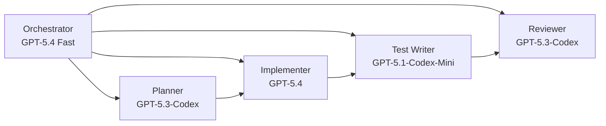
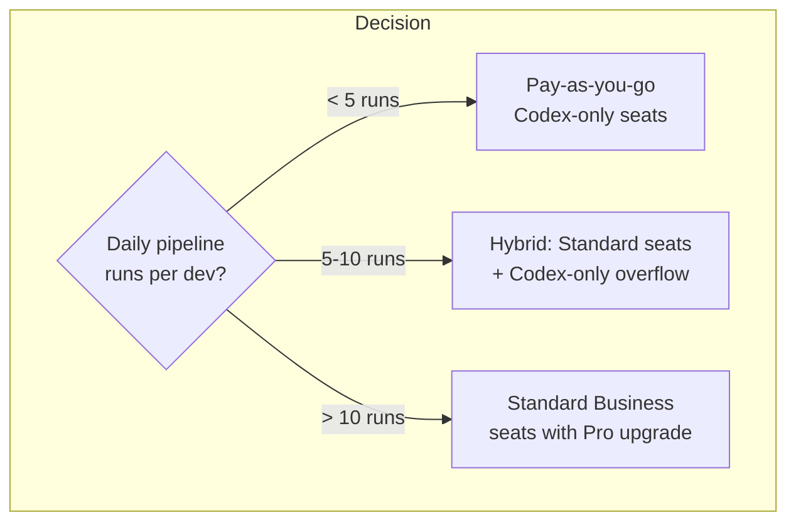

# Codex Pay-As-You-Go Pricing: Modelling Costs for Multi-Agent Workflows


---

## The April 2026 Pricing Restructure

On 2 April 2026, OpenAI replaced Codex's per-message credit system with token-based billing aligned to API usage[^1]. The same announcement lowered the annual ChatGPT Business seat price from $25 to $20[^2] and introduced a new seat type—**Codex-only seats**—that carry no fixed monthly fee and bill purely on token consumption[^1]. The restructure applies to new and existing Plus, Pro, ChatGPT Business, and new ChatGPT Enterprise plans[^3].

The headline change is transparency: every token consumed by every agent is now individually measurable, making multi-agent cost modelling feasible for the first time.

## Seat Types After the Restructure

Teams on ChatGPT Business and Enterprise now choose between two seat types:

| Seat Type | Fixed Cost | Codex Access | Rate Limits | Billing Model |
|-----------|-----------|-------------|-------------|---------------|
| **Standard Business** | $20/seat/month | Included (capped) | Plan limits apply | Subscription + optional credits |
| **Codex-only** | $0/seat/month | Full access | No rate limits | Token consumption only |

Codex-only seats provide full Codex access without ChatGPT workspace features[^1]. Usage is billed on token consumption, giving teams a clearer view of how spend maps to actual work[^1]. For teams that need Codex but not the broader ChatGPT workspace, this removes the per-seat floor entirely.

### The $500 Credit Promotion

Eligible ChatGPT Business workspaces can earn $100 in Codex credits for each new Codex-only member who sends their first Codex message, up to $500 per workspace[^1]. This provides a low-risk evaluation path—enough credit to run meaningful multi-agent trials before committing to ongoing spend.

## The Rate Card: Models and Token Costs

The April 2026 rate card lists four models with credits priced per million tokens[^4]:

| Model | Input Credits/1M | Cached Input Credits/1M | Output Credits/1M |
|-------|-----------------|------------------------|-------------------|
| GPT-5.4 | 62.50 | 6.250 | 375 |
| GPT-5.3-Codex | 43.75 | 4.375 | 350 |
| GPT-5.4-Mini | 18.75 | 1.875 | 113 |
| GPT-5.1-Codex-Mini | 6.25 | 0.625 | 50 |

**Fast mode doubles credit consumption**[^4]. The cached input discount is 1/10 of the regular input rate, providing significant savings for repeated repository context[^4].

For teams using API key mode directly (via `preferred_auth_method = "apikey"` in the CLI config), dollar-denominated pricing applies[^4]:

| Model | API Input $/1M | API Cached $/1M | API Output $/1M |
|-------|---------------|----------------|-----------------|
| gpt-5.1-codex-mini | $0.25 | $0.025 | $2.00 |
| gpt-5.3-codex | $1.75 | $0.175 | $14.00 |
| gpt-5.4 | $2.50 | $0.25 | $15.00 |

The cost differential between GPT-5.1-Codex-Mini and GPT-5.4 is roughly 10× on input and 7.5× on output. This gap is the primary lever for multi-agent cost optimisation.

## Modelling Multi-Agent Costs

### Single-Agent Baseline

A typical single-agent Codex session performing multi-file feature work (touching ~5 files) costs approximately $0.16 on GPT-5.4 API pricing[^5]. A full day of intensive single-agent coding runs to roughly $2.00[^5]. These figures assume standard (non-fast) mode.

### Scaling to Parallel Agents

Multi-agent workflows multiply token consumption roughly linearly with agent count. Five parallel `codex exec` processes each maintaining their own context window will consume approximately 5× the tokens of a single session[^6]. However, three factors modify this naive multiplier:

1. **Cached input tokens**: When multiple agents work on the same repository, subsequent agents benefit from the 10× cached input discount. In practice, repository context (the largest input component) is heavily shared.
2. **Model mixing**: Not every agent needs GPT-5.4. Routine tasks—linting, test generation, documentation—can use GPT-5.1-Codex-Mini at 1/10 the cost.
3. **Fast mode selectivity**: Reserving fast mode (2× credits) for the orchestrating agent while workers run in standard mode halves the multiplier on worker costs.

### Worked Example: Five-Agent Feature Pipeline

Consider a staged pipeline where an orchestrator delegates to four specialist workers:



Assuming each agent processes approximately 500K input tokens (with 80% cache hit rate) and generates 50K output tokens per run:

| Agent | Model | Input Cost | Cached Input Cost | Output Cost | **Total** |
|-------|-------|-----------|-------------------|-------------|-----------|
| Orchestrator | GPT-5.4 (fast, 2×) | $0.25 | $0.10 | $1.50 | **$1.85** |
| Planner | GPT-5.3-Codex | $0.175 | $0.07 | $0.70 | **$0.95** |
| Implementer | GPT-5.4 | $0.25 | $0.10 | $0.75 | **$1.10** |
| Test Writer | GPT-5.1-Codex-Mini | $0.025 | $0.01 | $0.10 | **$0.14** |
| Reviewer | GPT-5.3-Codex | $0.175 | $0.07 | $0.70 | **$0.95** |
| | | | | **Pipeline Total** | **$4.99** |

Running this pipeline 10 times per day across a working month (22 days) yields approximately **$1,098/month** for the team. Compare this with five Standard Business seats at $100/month ($500 total) with capped usage—the pay-as-you-go model becomes cheaper only if daily pipeline runs drop below ~4.5.

### The Break-Even Calculation



The crossover point depends heavily on model mix. Teams that aggressively route routine work to GPT-5.1-Codex-Mini can push the break-even threshold significantly higher.

## CI/CD Billing Under the New Model

For `codex exec` in CI/CD pipelines, API key mode is the recommended authentication method[^7]. Key considerations:

```bash
# CI configuration: use API key auth with the cheapest viable model
export OPENAI_API_KEY="${CODEX_CI_TOKEN}"
codex exec --model gpt-5.1-codex-mini \
           --ephemeral \
           --json \
           --output-last-message \
           "Run the test suite and fix any failures"
```

- **`--ephemeral`** skips session persistence, reducing overhead in stateless CI environments[^7]
- **Model selection** is critical: a CI lint-and-fix job on GPT-5.1-Codex-Mini costs ~$0.14 per run versus ~$1.85 on GPT-5.4 with fast mode
- **`--json --output-last-message`** enables machine-readable output for pipeline integration[^7]
- Each CI invocation is independently billable, making per-pipeline cost attribution straightforward under token-based billing

A team running 50 CI pipeline invocations per day on GPT-5.1-Codex-Mini would spend approximately **$7/day** or **$154/month**—comparable to a single Pro subscription but with full auditability.

## Comparison with Claude Code Max

For teams evaluating both tools, the pricing models differ fundamentally:

| Dimension | Codex Pay-as-You-Go | Claude Code Max 5× | Claude Code Max 20× |
|-----------|--------------------|--------------------|---------------------|
| Monthly cost | Variable (token-based) | $100/month fixed | $200/month fixed |
| Multi-agent multiplier | Linear with agents | ~3× for 3 agents, ~7× with plan mode[^8] | ~3× for 3 agents, ~7× with plan mode[^8] |
| Cost transparency | Per-token granularity | Opaque (usage counted against limit) | Opaque (usage counted against limit) |
| Rate limits | None (Codex-only seats) | Plan-based caps | Higher plan-based caps |
| Overage model | Pay more tokens | Hit limit, wait for reset | Hit limit, wait for reset |

Claude Code's flat-rate model is cheaper for heavy users—a $200/month Max 20× subscription can deliver $1,000–$5,000 worth of equivalent API compute[^8]. However, Anthropic's April 2026 restriction on third-party tool access means this value is locked within the Anthropic ecosystem[^9].

Codex's token-based model offers superior cost attribution for enterprise teams who need to allocate spend across projects, teams, and CI pipelines. The trade-off is predictability: flat-rate subscriptions cap downside risk, while pay-as-you-go can surprise teams with unexpectedly high bills during intensive sprints.

## Practical Recommendations

1. **Start with the $500 credit promotion** to benchmark your team's actual token consumption before committing to a billing model
2. **Instrument token usage early**: use `--json` output to capture per-task token counts and build a consumption baseline
3. **Model-mix aggressively**: route test generation, documentation, and lint fixes to GPT-5.1-Codex-Mini; reserve GPT-5.4 for architectural decisions and complex refactoring
4. **Use cached context intentionally**: structure multi-agent workflows so agents share repository context, maximising the 10× cached input discount
5. **Set billing alerts**: with no rate limits on Codex-only seats, a runaway agent loop can burn through credits rapidly
6. **Hybrid seat strategy**: assign Standard Business seats to developers who need ChatGPT workspace features; use Codex-only seats for CI/CD service accounts and occasional contributors

## Citations

[^1]: OpenAI, "Codex now offers pay-as-you-go pricing for teams," 2 April 2026. [https://openai.com/index/codex-flexible-pricing-for-teams/](https://openai.com/index/codex-flexible-pricing-for-teams/)

[^2]: Winbuzzer, "AI Coding: OpenAI Switches Codex to Pay-as-You-Go, Cuts Seat Cost to $20," 4 April 2026. [https://winbuzzer.com/2026/04/04/openai-switches-codex-pay-as-you-go-pricing-cuts-business-seat-cost-xcxwbn/](https://winbuzzer.com/2026/04/04/openai-switches-codex-pay-as-you-go-pricing-cuts-business-seat-cost-xcxwbn/)

[^3]: Lilting Channel, "OpenAI Codex Moves from Message-Based Credits to Token-Based Pricing," April 2026. [https://lilting.ch/en/articles/openai-codex-token-based-pricing-rate-card](https://lilting.ch/en/articles/openai-codex-token-based-pricing-rate-card)

[^4]: OpenAI, "Codex rate card," April 2026. [https://help.openai.com/en/articles/20001106-codex-rate-card](https://help.openai.com/en/articles/20001106-codex-rate-card)

[^5]: Flowith Blog, "OpenAI Codex Pricing 2026: API Costs, Token Limits, and Which Tier Makes Sense for Your Dev Workflow." [https://flowith.io/blog/openai-codex-pricing-2026-api-costs-token-limits/](https://flowith.io/blog/openai-codex-pricing-2026-api-costs-token-limits/)

[^6]: Get AI Perks, "OpenAI Codex Pricing 2026: Credits, Limits & API Costs." [https://www.getaiperks.com/en/articles/codex-pricing](https://www.getaiperks.com/en/articles/codex-pricing)

[^7]: OpenAI Developers, "Command line options – Codex CLI." [https://developers.openai.com/codex/cli/reference](https://developers.openai.com/codex/cli/reference)

[^8]: SSD Nodes, "Claude Code Pricing in 2026: Every Plan Explained." [https://www.ssdnodes.com/blog/claude-code-pricing-in-2026-every-plan-explained-pro-max-api-teams/](https://www.ssdnodes.com/blog/claude-code-pricing-in-2026-every-plan-explained-pro-max-api-teams/)

[^9]: PYMNTS, "Anthropic's Claude Subscription Shift Signals New AI Pricing Era," April 2026. [https://www.pymnts.com/artificial-intelligence-2/2026/third-party-agents-lose-access-as-anthropic-tightens-claude-usage-rules/](https://www.pymnts.com/artificial-intelligence-2/2026/third-party-agents-lose-access-as-anthropic-tightens-claude-usage-rules/)
