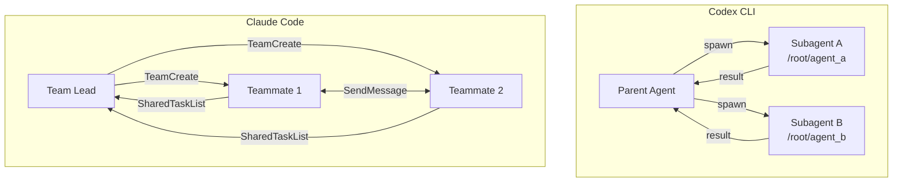
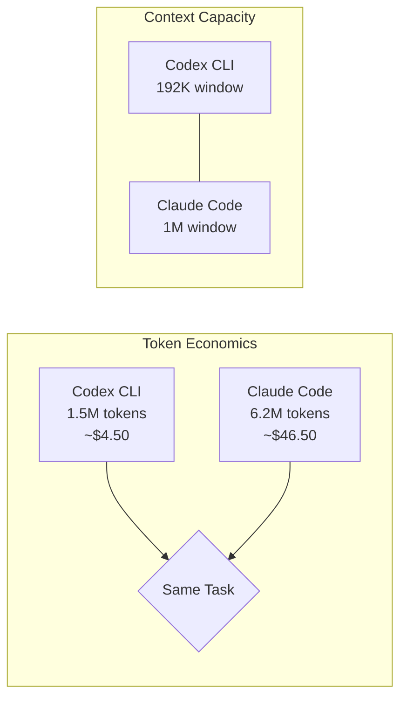
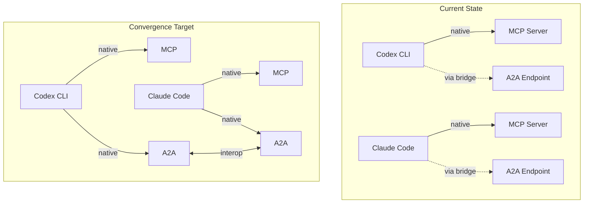

# Codex CLI vs Claude Code Multi-Agent: Subagents, Agent Teams and the Protocol Gap


---

The two dominant terminal-native coding agents — OpenAI's Codex CLI and Anthropic's Claude Code — have each shipped multi-agent capabilities, but with fundamentally different architectural philosophies. Codex CLI offers TOML-defined subagents with explicit spawning, path-based addressing and batch processing. Claude Code counters with Agent Teams: peer-to-peer mailbox communication, shared task lists, and autonomous delegation. This article dissects both systems head-to-head, compares their protocol stacks, examines the benchmarks, and asks whether they are converging.

## Architectural Philosophies

The split reflects each vendor's trust model. Codex CLI prioritises explicit user control and auditability — you define agents in TOML, set hard concurrency limits, and spawn them deliberately[^1]. Claude Code emphasises autonomous agent judgement: Agent Teams members claim work from a shared task list and communicate directly without routing through a parent[^2].



The diagram captures the core difference: Codex subagents report results back to a parent in a hub-and-spoke pattern; Claude Code teammates talk to each other in a mesh.

## Codex CLI Subagents: Explicit Control

Codex subagents became generally available in March 2026, graduating from a feature-flag preview to a stable default[^3]. Custom agents are defined as standalone TOML files placed in `~/.codex/agents/` (personal scope) or `.codex/agents/` (project scope)[^1].

### Configuration

Each TOML file requires three fields — `name`, `description`, and `developer_instructions` — with optional overrides for `model`, `sandbox_mode`, and `mcp_servers` that inherit from the parent session when omitted[^1].

```toml
# .codex/agents/security-reviewer.toml
name = "security-reviewer"
description = "Reviews code changes for security vulnerabilities"
developer_instructions = """
Analyse diffs for OWASP Top 10 vulnerabilities.
Report findings as structured JSON with severity levels.
"""
model = "o4-mini"
sandbox_mode = "locked-network"
```

### Runtime Controls

Global orchestration settings live in the `[agents]` section of `config.toml`[^1]:

| Setting | Default | Purpose |
|---------|---------|---------|
| `max_threads` | 6 | Concurrent open agent thread cap |
| `max_depth` | 1 | Nesting depth (prevents recursive delegation) |
| `job_max_runtime_seconds` | 1800 | Per-worker timeout for batch jobs |

### Built-in Roles and Batch Processing

Codex ships three built-in agent roles: **default** (general-purpose), **worker** (execution-focused), and **explorer** (read-heavy codebase navigation)[^1]. For parallel workloads, the experimental `spawn_agents_on_csv` tool accepts a CSV file and an instruction template with `{column_name}` placeholders, spawning one worker per row[^1]. Each worker must call `report_agent_job_result` exactly once.

### Path-Based Addressing

Since the March 2026 multi-agent v2 release, subagents receive path-based addresses (e.g., `/root/agent_a`) and accept structured steering instructions mid-execution[^4]. This is a significant step toward richer inter-agent communication, though it remains parent-to-child rather than peer-to-peer.

## Claude Code Agent Teams: Autonomous Collaboration

Agent Teams shipped with Claude Opus 4.6 on 5 February 2026 as an experimental feature, enabled via `CLAUDE_CODE_EXPERIMENTAL_AGENT_TEAMS=1`[^2]. Teams support 2–16 agents working on a shared codebase.

### Architecture

The system comprises four components[^5]:

1. **Team Lead** — your main Claude Code session, which analyses tasks, creates teams via `TeamCreate`, and orchestrates the workflow.
2. **Teammates** — independent Claude Code processes, each with its own full context window and tool access.
3. **Shared Task List** — stored at `~/.claude/tasks/{team-name}/`, providing coordination with statuses, ownership, and dependency tracking.
4. **Mailbox** — the `SendMessage` tool enables direct peer-to-peer messaging between any teammates, or broadcasts to the entire team.

### Agent Definition

Claude Code uses Markdown with YAML frontmatter in `.claude/agents/`, a deliberate contrast to Codex's TOML[^6]:

```markdown
---
name: security-reviewer
description: Reviews code for security vulnerabilities
model: opus
---

# Security Reviewer

Analyse diffs for OWASP Top 10 vulnerabilities.
Report findings with severity levels.
```

### When Subagents vs Teams

Claude Code maintains both patterns. Subagents (the `Agent` tool) are quick, focused workers that report back to the parent — similar to Codex's model. Agent Teams are for tasks where teammates need to share findings, challenge each other, and coordinate autonomously[^2]. The trade-off: Agent Teams consume 4–7× more tokens than single-agent sessions[^7].

## Head-to-Head Comparison

### Benchmarks

| Benchmark | Codex CLI | Claude Code | Notes |
|-----------|-----------|-------------|-------|
| SWE-bench Verified | ~80% (GPT-5.3-Codex) | 80.9% (Opus 4.5) | Essentially tied[^8][^9] |
| Terminal-Bench 2.0 | 77.3% | 65.4% | 12-point Codex advantage[^7] |
| Blind Code Quality | 25% win rate | 67% win rate | Claude produces cleaner code[^7] |

The benchmarks tell a split story. Raw coding ability on SWE-bench Verified is a dead heat. Terminal-native tasks (scripting, system admin, DevOps) favour Codex CLI decisively. But when human developers blindly evaluate code quality, Claude Code wins two-thirds of the time[^7].

### Token Efficiency and Cost

OpenAI claims a 4× token efficiency advantage for Codex CLI[^7]. In practice, a complex refactor consuming 1.5M tokens on Codex CLI required 6.2M tokens for a comparable task on Claude Code[^7]. Combined with lower per-token pricing (GPT-5.3-Codex at $1.25/$10 per MTok vs Opus 4.6 at $5/$25 per MTok), Codex works out roughly 10× cheaper per equivalent coding task on API pricing[^7].

### Context Window

Claude Code holds a significant advantage here: Opus 4.6 supports up to 1M tokens of context, versus Codex CLI's 192K[^7]. For large-scale refactoring across many files, that 5× context advantage matters.



## The Protocol Gap: MCP and A2A

Both tools support MCP (Model Context Protocol), but with different depths.

### MCP Support

Codex CLI supports MCP servers as both STDIO processes and streamable HTTP endpoints, configured via `config.toml` and managed through `codex mcp add`[^10]. Claude Code has deeper MCP integration with over 3,000 tool integrations and 14+ lifecycle hook trigger points[^7][^11].

### The A2A Question

A2A (Agent-to-Agent), created by Google in April 2025 and now stewarded by the Linux Foundation's Agentic AI Foundation, standardises how agents discover and communicate with each other across vendor boundaries[^12]. Over 100 enterprises have adopted it[^13].

Neither Codex CLI nor Claude Code natively implements A2A as of April 2026. Both can access A2A endpoints through MCP bridge servers — community-built adapters that expose A2A agent communication as MCP tools[^14]. But native A2A support would allow Codex subagents and Claude Code teammates to collaborate across vendor boundaries without bridging overhead.



## The Convergence Thesis

Despite different starting points, both tools are converging architecturally:

1. **Codex is gaining richer communication.** Path-based addressing and structured messaging (March 2026) move Codex subagents from pure hub-and-spoke toward something resembling peer awareness[^4].
2. **Claude Code is gaining explicit controls.** Agent Teams still exposes configuration for team sizes, task dependencies, and ownership — structured orchestration layered on top of autonomous behaviour[^5].
3. **Both need A2A.** The multi-vendor world demands that agents from different providers coordinate. MCP solves tool access; A2A solves agent coordination. The first tool to ship native A2A gains a significant interoperability advantage[^12].

The deeper pattern: Codex users should learn from Claude's mailbox and shared task list patterns for richer inter-agent coordination. Claude Code users should learn from Codex's explicit concurrency controls and token efficiency for cost management at scale.

## Decision Framework

| Factor | Choose Codex CLI | Choose Claude Code |
|--------|------------------|--------------------|
| Token budget matters | ✅ 4× more efficient | |
| Terminal/DevOps tasks | ✅ 77.3% Terminal-Bench | |
| Code quality priority | | ✅ 67% blind win rate |
| Large codebase context | | ✅ 1M token window |
| Peer-to-peer agent work | | ✅ Agent Teams mailbox |
| Batch parallel processing | ✅ spawn_agents_on_csv | |
| MCP ecosystem breadth | | ✅ 3,000+ integrations |
| Autonomous execution | ✅ Kernel-level sandbox | |

## What Codex Users Should Watch

- **Agent Teams patterns are coming.** Codex's structured messaging is a stepping stone toward peer-to-peer. Expect a mailbox-like primitive in a future release.
- **A2A native support.** When this lands, Codex subagents become first-class citizens in cross-vendor workflows.
- **The context window gap.** At 192K vs 1M, Codex needs to close this for complex multi-file refactoring scenarios.

The multi-agent landscape is young — both architectures are evolving fast. The winning strategy is not to pick one tool permanently, but to understand both models deeply enough to use each where it excels.

## Citations

[^1]: [Subagents – Codex | OpenAI Developers](https://developers.openai.com/codex/subagents)
[^2]: [Claude Code Agent Teams: Setup & Usage Guide 2026](https://claudefa.st/blog/guide/agents/agent-teams)
[^3]: [Use subagents and custom agents in Codex — Simon Willison](https://simonwillison.net/2026/Mar/16/codex-subagents/)
[^4]: [Codex vs Claude Code: The Divergence in Subagent Design Philosophy — SmartScope](https://smartscope.blog/en/blog/codex-vs-claude-code-subagent-architecture-2026/)
[^5]: [From Tasks to Swarms: Agent Teams in Claude Code — alexop.dev](https://alexop.dev/posts/from-tasks-to-swarms-agent-teams-in-claude-code/)
[^6]: [Claude Code Custom Subagents: Complete Guide — Claude Lab](https://claudelab.net/en/articles/claude-code/claude-code-custom-subagents-at-mention-guide)
[^7]: [Codex vs Claude Code: Which CLI Agent Wins for Your Workflow in 2026 — Particula](https://particula.tech/blog/codex-vs-claude-code-cli-agent-comparison)
[^8]: [SWE-Bench Verified Leaderboard March 2026 — Marco Patzelt](https://www.marc0.dev/en/leaderboard)
[^9]: [Best LLM for Coding 2026 — SmartScope](https://smartscope.blog/en/generative-ai/chatgpt/llm-coding-benchmark-comparison-2026/)
[^10]: [Model Context Protocol – Codex | OpenAI Developers](https://developers.openai.com/codex/mcp)
[^11]: [AI Weekly: Claude Code Dominates, MCP Goes Mainstream — DEV Community](https://dev.to/alexmercedcoder/ai-weekly-claude-code-dominates-mcp-goes-mainstream-week-of-march-5-2026-15af)
[^12]: [MCP vs A2A: The Complete Guide to AI Agent Protocols in 2026 — DEV Community](https://dev.to/pockit_tools/mcp-vs-a2a-the-complete-guide-to-ai-agent-protocols-in-2026-30li)
[^13]: [Deploying multi-agent systems using MCP and A2A with Claude on Vertex AI — Anthropic](https://www.anthropic.com/webinars/deploying-multi-agent-systems-using-mcp-and-a2a-with-claude-on-vertex-ai)
[^14]: [A2A-MCP-Server — GitHub](https://github.com/GongRzhe/A2A-MCP-Server)
