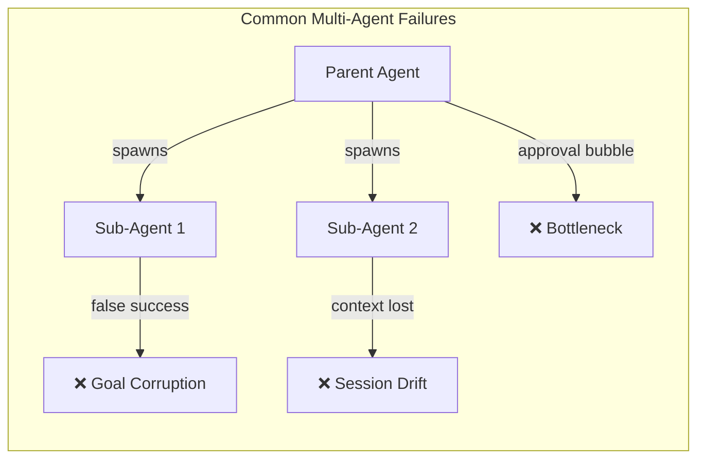
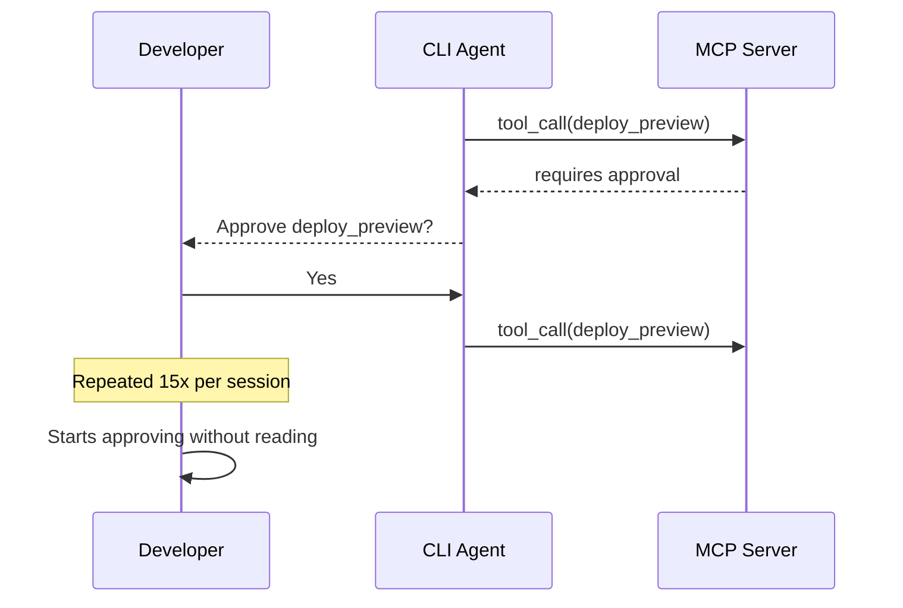
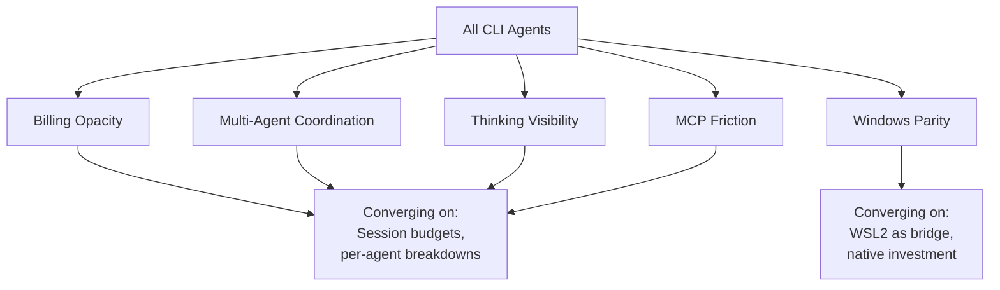

# Cross-Platform Agent Friction: The Five Pain Points Every CLI Tool Shares in April 2026

---

Terminal-based AI coding agents have become the default tool for serious developers in 2026[^1]. Codex CLI, Claude Code, Gemini CLI, OpenCode, Kimi CLI, GitHub Copilot CLI — the roster keeps growing. Yet beneath the feature wars and benchmark one-upmanship, a striking pattern has emerged: **every major CLI tool is fighting the same five battles simultaneously**.

The [agents-radar](https://github.com/duanyytop/agents-radar) daily digest tracking all eight major CLI tools reveals convergent friction across the entire ecosystem[^2]. These are not niche complaints — they are structural problems baked into the current generation of agentic tooling. Understanding them helps practitioners make better tool choices and architect workflows that mitigate rather than amplify shared weaknesses.

## 1. Billing Opacity: The Trust Deficit

The most emotionally charged friction point across every tool is **cost unpredictability**. Users cannot reliably predict what a session will cost before it runs, and post-hoc cost attribution is inadequate.

### The evidence

Codex CLI's billing issues have generated hundreds of GitHub comments. Issue [#15959](https://github.com/openai/codex/issues/15959) documents how a CLI update caused unexpected top-up credit consumption — users with remaining weekly quota found their credits drained to zero[^3]. Issue [#16785](https://github.com/openai/codex/issues/16785) reports arbitrary usage resets resulting in net token loss[^4]. Sub-agent costs compound the problem: issue [#12488](https://github.com/openai/codex/issues/12488) describes a user exceeding their Pro Plan budget by $350 in a single week because cost impact was invisible before sub-agent launch[^5].

Claude Code faces an even more acute crisis. Issue [#38335](https://github.com/anthropic/claude-code/issues/38335) — with hundreds of comments — reports 100% quota drain in 70 minutes to two hours versus normal full-day usage[^2]. The Max plan at $200/month does not exempt users from rate limits during intensive multi-file refactors[^6].

OpenAI describes Codex rate limits in **relative terms** (2x, 6x multipliers) rather than absolute token counts[^7]. This means you cannot predict when you will hit a limit, making it impossible to plan a workday around the tool.

### What practitioners can do now

Set explicit session budgets using `--max-cost` flags where available. For Codex CLI, monitor the token usage display in the TUI — though be aware that issue [#16610](https://github.com/openai/codex/issues/16610) shows usage sometimes displays as "Other", blocking granular tracking[^2]. Spawn fresh sub-agents for discrete tasks rather than letting long sessions accumulate hidden costs.

## 2. Multi-Agent Coordination Failures

Every tool has shipped some form of multi-agent capability. None has made it reliable enough for unsupervised use.

### The pattern across tools

- **Codex CLI**: Issue [#11436](https://github.com/openai/codex/issues/11436) captures demand for agent teams that remains partially implemented[^2]. Sub-agent costs are opaque (see above), and the duplicate issue [#14642](https://github.com/openai/codex/issues/14642) requests per-agent token breakdowns in the TUI[^5].
- **Gemini CLI**: Sub-agents falsely report success after `MAX_TURNS` interruption, corrupting goal tracking (issue [#22323](https://github.com/google/gemini-cli/issues/22323))[^2]. The parent agent has no way to distinguish genuine completion from a silent truncation.
- **Claude Code**: Teammate permission requests bubble up to the lead session, creating an approval bottleneck[^8]. Token costs scale linearly — each teammate has its own context window — and coordination overhead increases non-linearly with team size.

### How Codex CLI is addressing this

Recent Codex CLI releases have introduced readable path-based sub-agent addresses (`/root/agent_a`), structured inter-agent messaging, and consistent tool naming (`wait_agent` aligned with `spawn_agent` and `send_input`)[^9]. These are the right primitives, but the cost visibility gap remains the primary blocker for production multi-agent workflows.

## 3. Thinking and Reasoning Visibility

Developers want to see **how** the agent reasons, not just what it produces. This demand cuts across every tool but is addressed inconsistently.

### The spectrum

| Tool | Default Visibility | Pain Point |
|------|-------------------|------------|
| Codex CLI | High — detailed step narration in TUI | Token cost of verbose reasoning[^1] |
| Claude Code | Low — requires extra keystrokes | Placeholder text ("mulling", "percolating") distracts rather than informs (issue [#42851](https://github.com/anthropic/claude-code/issues/42851))[^2] |
| Qwen Code | Configurable | Models return thinking content despite `model.reasoning: false` (issue [#2770](https://github.com/QwenLM/qwen-code/issues/2770))[^2] |
| Gemini CLI | Moderate | Reasoning visible but not actionable |

The underlying tension is architectural: showing reasoning costs tokens, hiding it costs trust. Codex CLI's approach — defaulting to visible reasoning — is more expensive but produces higher developer confidence[^10]. Claude Code's approach prioritises token efficiency at the cost of transparency.

For practitioners, the optimal strategy depends on task type. Exploratory refactoring benefits from full visibility. Repetitive, well-understood tasks (formatting, test generation) can safely run with reduced reasoning output to save tokens.

## 4. MCP Ecosystem Friction

The Model Context Protocol promised a universal tool integration layer. In practice, MCP is the source of significant cross-platform friction in three areas.

### 4a. Environment variable propagation

MCP servers frequently need access to environment variables (API keys, database URLs, feature flags). The 2026 MCP roadmap explicitly calls out "configuration portability across clients" as an unresolved gap[^11]. Each CLI tool handles environment injection differently — there is no standard mechanism for an MCP server to declare its required environment, and no portable way to supply it across Codex CLI, Claude Code, and Gemini CLI simultaneously.

### 4b. Tool approval fatigue

Multiple platforms require approval re-entry per session. Gemini CLI issue [#24577](https://github.com/google/gemini-cli/issues/24577) documents the problem explicitly[^2]. The MCP specification's emerging solution — session-scoped authorisation with automatic expiry[^12] — is not yet universally implemented. Codex CLI's recent PR [#17043](https://github.com/openai/codex/pull/17043) adds v2 elicitation API support, and PR [#17164](https://github.com/openai/codex/pull/17164) auto-approves elicitations in `danger-full-access` mode[^9], which helps for trusted server workflows but does not address the general case.

### 4c. Scalability ceiling

Gemini CLI returns HTTP 400 errors when more than 128 MCP tools are registered (issue [#24246](https://github.com/google/gemini-cli/issues/24246))[^2]. This is a hard limit that enterprise teams with large MCP server fleets hit quickly. Codex CLI does not publish an equivalent limit, but tool-name normalisation for hyphenated server names (PR [#15946](https://github.com/openai/codex/pull/15946)) suggests the tool registry is being hardened for scale[^9].

## 5. The Windows Parity Gap

Every major CLI tool ships a degraded experience on Windows. This is not a minor inconvenience — it affects enterprise adoption where Windows remains the dominant developer platform in many organisations.

### P0/P1 Windows issues across tools

- **Codex CLI**: `npm install` broken after packaging refactor (issue [#11744](https://github.com/openai/codex/issues/11744))[^2]
- **OpenCode**: SDK spawn failures with `.cmd` resolution (issue [#20772](https://github.com/opencode/opencode/issues/20772))[^2]
- **Gemini CLI**: PowerShell translation removes file content, breaking `__write` operations (issue [#24571](https://github.com/google/gemini-cli/issues/24571))[^2]
- **GitHub Copilot CLI**: Internal tooling cannot spawn `pwsh.exe` despite valid PATH (issue [#2355](https://github.com/github/copilot-cli/issues/2355))[^2]

The root cause is architectural: all these tools were designed for Unix-first environments. Shell command translation to PowerShell is lossy, path handling differs, and process spawning semantics are fundamentally different. OpenAI's Codex desktop app shipped on macOS on 2 February 2026 and Windows on 4 March 2026 — a full month later[^13].

Until tool vendors invest in Windows as a first-class platform, enterprise teams should consider WSL2 as the deployment target for CLI agents, accepting the overhead of maintaining a Linux environment within Windows.

## The Convergence Thesis

These five friction points are not independent — they compound. Billing opacity makes multi-agent coordination risky. MCP approval fatigue increases cognitive load. Windows issues exclude entire teams from the ecosystem. The tools that solve these problems first will win enterprise adoption; the specific model behind the tool matters less than it did twelve months ago[^1].

For Codex CLI users, the practical takeaway is threefold:

1. **Budget defensively** — set explicit cost caps, prefer fresh sub-agents over extended sessions, and monitor token attribution.
2. **Curate your MCP surface** — fewer, well-configured MCP servers beat a large fleet with approval fatigue. Use Codex CLI's elicitation auto-approve only with trusted servers.
3. **Standardise on Unix** — even on Windows, WSL2 provides the most reliable execution environment for any CLI agent today.

The agents-radar data shows these friction points are narrowing quarter over quarter[^2]. The question is not whether they will be solved, but which tool solves them first — and whether the solution preserves the developer-in-the-loop workflow that makes CLI agents trustworthy in the first place.

## Citations

[^1]: Codex vs Claude Code: Architecture Deep Dive 2026. <https://blakecrosley.com/blog/codex-vs-claude-code-2026/>

[^2]: AI CLI Tools Digest 2026-04-03, agents-radar. <https://github.com/duanyytop/agents-radar/issues/384>

[^3]: Codex CLI consumed top-up credits unexpectedly, Issue #15959. <https://github.com/openai/codex/issues/15959>

[^4]: Arbitrary usage resets resulting in token loss, Issue #16785. <https://github.com/openai/codex/issues/16785>

[^5]: Sub-agent costs are too high and too opaque, Issue #12488. <https://github.com/openai/codex/issues/12488>

[^6]: Claude Code Pricing 2026: Free Credits, API Costs & Max Plan. <https://www.nxcode.io/resources/news/claude-code-pricing-2026-free-api-costs-max-plan>

[^7]: OpenAI Codex Pricing: API Cost, Credits & Usage Limits. <https://uibakery.io/blog/openai-codex-pricing>

[^8]: Orchestrate teams of Claude Code sessions — Claude Code Docs. <https://code.claude.com/docs/en/agent-teams>

[^9]: Codex Release Notes — April 2026 Latest Updates. <https://releasebot.io/updates/openai/codex>

[^10]: Codex vs Claude Code: Which CLI Agent Wins for Your Workflow in 2026. <https://particula.tech/blog/codex-vs-claude-code-cli-agent-comparison>

[^11]: MCP Roadmap — Model Context Protocol. <https://modelcontextprotocol.io/development/roadmap>

[^12]: Everything your team needs to know about MCP in 2026. <https://workos.com/blog/everything-your-team-needs-to-know-about-mcp-in-2026>

[^13]: 5 Best AI Coding Agent Desktop Apps Compared for 2026. <https://www.augmentcode.com/tools/best-ai-coding-agent-desktop-apps>
