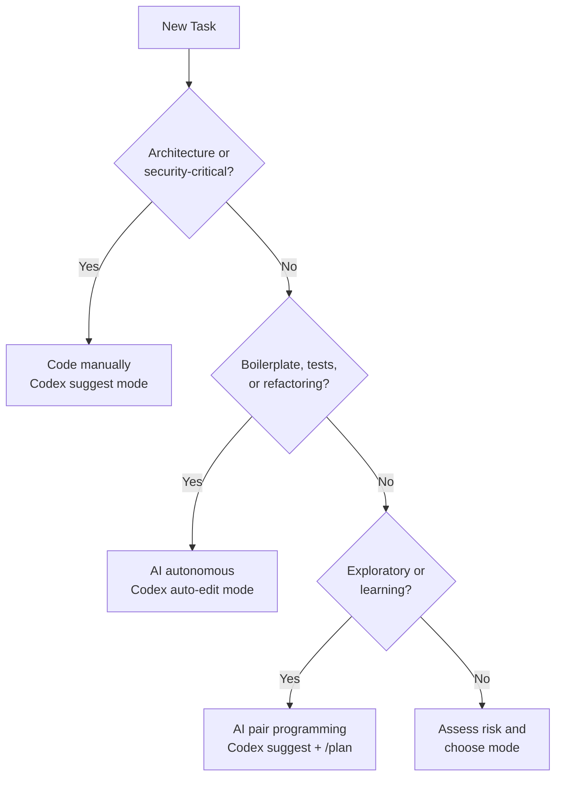

# AI-Assisted Coding Tool Comparison: What the freeCodeCamp 85-Minute Course Teaches Practitioners


---

On 1 April 2026 freeCodeCamp published a 1.5-hour video course titled *AI Tools for Developers* covering five AI development tools: GitHub Copilot, Claude Code, Gemini CLI, OpenClaw, and CodeRabbit[^1]. Published by Beau Carnes on the freeCodeCamp YouTube channel, the course has rapidly become the go-to introduction for developers entering the agentic coding space[^2]. For Codex CLI practitioners the course is worth studying — not because it covers Codex (it does not), but because its framework for *when* to use AI tools maps directly onto Codex CLI's own capabilities, and the omission itself tells us something important about mindshare.

## What the Course Covers

The course is structured around two complementary themes: **AI pair programming** inside IDEs and **agentic terminal workflows** in the shell[^1]. The five tools form a clear progression:

| Tool | Category | Key Strength |
|---|---|---|
| GitHub Copilot | IDE extension | Tab completion, inline chat, agent mode[^3] |
| Claude Code | Terminal CLI | Interactive sessions, autonomous multi-file edits[^4] |
| Gemini CLI | Terminal CLI | 1M-token context window, free tier (60 req/min)[^5] |
| OpenClaw | Self-hosted agent | Multi-channel (Slack, Discord, Telegram), cron jobs, webhooks[^6] |
| CodeRabbit | PR review | Line-by-line automated review across GitHub/GitLab/Azure DevOps/Bitbucket[^7] |

This taxonomy is useful because it maps the *entire lifecycle*: writing code (Copilot), building features autonomously (Claude Code / Gemini CLI), automating workflows (OpenClaw), and reviewing output (CodeRabbit).

## The Framework: When to Use AI vs When to Code Yourself

The course draws on freeCodeCamp's companion handbook by Mrugesh Mohapatra[^3], which provides a decision framework that experienced Codex CLI users will recognise:

**Use AI for:**

- Boilerplate and scaffolding
- Writing tests from existing implementations
- Documentation generation
- Refactoring repetitive patterns
- Learning unfamiliar framework syntax

**Code manually for:**

- System architecture decisions
- Security-critical logic
- Complex business rules
- Performance-sensitive hot paths
- Initial concept learning (where understanding matters more than speed)

This framework translates directly to Codex CLI's approval modes. The `suggest` mode maps to the "code manually" category — the agent proposes, you decide. The `auto-edit` mode suits boilerplate and test generation. Full `auto` mode with sandbox is appropriate for scaffolding and refactoring where the blast radius is contained[^8].



## The "Neighbouring Tabs" Trick and Codex Context

The course highlights a GitHub Copilot technique: opening related files in adjacent IDE tabs so the model can read them as context[^3]. This "neighbouring tabs" pattern is IDE-specific, but the underlying principle — *give the model the right context* — is universal.

In Codex CLI the equivalent mechanisms are more explicit and more powerful:

```toml
# AGENTS.md — project-level context
# Codex reads this automatically at session start

## Architecture
This is a Next.js 14 app with App Router.
API routes live in src/app/api/.
Database access uses Drizzle ORM with PostgreSQL.

## Conventions
- All components are functional with TypeScript strict mode
- Tests use Vitest with React Testing Library
- Never import from barrel files in tests
```

Where Copilot relies on *implicit* context from open tabs, Codex CLI uses *explicit* context through `AGENTS.md` scope chains, skill files, and the `project_doc_fallback_filenames` configuration[^8]. The advantage is reproducibility: any team member running Codex in the same repository gets identical context without needing the right files open.

## The CLI Tier: Claude Code vs Gemini CLI — and Where Codex Fits

The course positions Claude Code and Gemini CLI as the "agentic terminal workflow" tier[^1]. Both are open-source CLI tools that operate autonomously in the terminal. This is exactly the tier where Codex CLI competes.

A direct comparison reveals where Codex CLI differentiates:

| Capability | Claude Code | Gemini CLI | Codex CLI |
|---|---|---|---|
| Runtime | TypeScript (~390K LOC)[^9] | TypeScript | Rust core (codex-rs) + TS shell[^10] |
| Context window | 200K tokens | 1M tokens[^5] | Model-dependent (up to 1M with GPT-5.4)[^11] |
| Sandbox | macOS Seatbelt | Permission prompts | Seatbelt + Landlock + Windows sandbox[^8] |
| Multi-agent | Background agents | Conductor extension[^12] | Native TOML subagents with `spawn_agents_on_csv`[^8] |
| Project context | CLAUDE.md | GEMINI.md | AGENTS.md with scope chains and overrides[^8] |
| CI/CD integration | `claude -p` | `gemini -p` | `codex exec` with structured output[^8] |
| Approval modes | 3 modes | 2 modes (allow/deny) | 4 modes (suggest/auto-edit/auto/full-auto)[^8] |

Codex CLI's differentiators — the Rust performance core, four-surface architecture (CLI, desktop app, VS Code extension, Python SDK), and native subagent orchestration — are genuine technical advantages. Yet the course does not mention Codex CLI at all.

## The Discoverability Gap

The omission of Codex CLI from a major freeCodeCamp course is notable. As of April 2026, Codex CLI has over 59,000 GitHub stars[^10] and crossed 3 million weekly active users on 8 April 2026[^13]. By any measure it is a mainstream tool.

Several factors likely explain the gap:

1. **Brand confusion.** "Codex" historically referred to the deprecated OpenAI Codex API (the GPT-3-era code completion model). Developers searching for "Codex" may find outdated references before they find the CLI[^10].

2. **Ecosystem fragmentation.** Codex CLI has four surfaces (CLI, desktop app, IDE extension, Python SDK). This breadth makes it harder to position in a single category like "terminal AI tool."

3. **OpenAI-account requirement.** Unlike Gemini CLI's generous free tier (1,000 requests/day at no charge[^5]) or OpenClaw's bring-your-own-key model[^6], Codex CLI requires an OpenAI account. For a course targeting beginners, the friction matters.

4. **Content creation lag.** The course was published on 1 April 2026[^1]. Codex CLI's most significant recent features — the app-server TUI (v0.117.0), generalised bearer auth, and Windows sandbox improvements — landed in late March and early April 2026[^14]. Course production timelines may simply not have caught up.

This is a familiar pattern in developer tooling: technical capability does not automatically translate to mindshare. Claude Code benefits from Anthropic's direct developer relations. Gemini CLI benefits from Google's brand and the free tier. Codex CLI's growth has been largely organic.

## What Codex CLI Users Should Take Away

### 1. Adopt the lifecycle model

The course's five-tool progression (write → build → automate → review) is sound. Codex CLI covers the "build" phase exceptionally well, but practitioners should complement it with dedicated review tooling. CodeRabbit integrates with GitHub Actions and can review PRs generated by `codex exec` pipelines[^7].

### 2. Map the decision framework to approval modes

The "when to use AI" framework is not just pedagogical — it is a practical configuration guide:

```toml
# Profile for architectural work — agent suggests, you decide
[profiles.architecture]
model = "gpt-5.4"
model_reasoning_effort = "high"
approval_mode = "suggest"

# Profile for test generation — let the agent run
[profiles.tests]
model = "gpt-5.4-mini"
model_reasoning_effort = "medium"
approval_mode = "auto-edit"
```

### 3. Invest in explicit context

The neighbouring-tabs trick is fragile. `AGENTS.md` files, skill definitions, and hook-based quality gates provide the same contextual benefit with full reproducibility across team members and CI environments.

### 4. Consider the discoverability problem

If you are building internal tooling or open-source projects around Codex CLI, the naming and positioning challenge is real. Use "Codex CLI" (not just "Codex") in documentation, and link directly to the [OpenAI Codex CLI documentation](https://developers.openai.com/codex/cli) rather than assuming developers will find it.

## The Broader Landscape

The freeCodeCamp course is one data point in a larger trend: AI-assisted coding education is maturing from "look what ChatGPT can do" into structured, tool-specific curricula. freeCodeCamp's Claude Code Handbook[^4], the Scrimba tutorials[^15], and the O'Reilly AI-assisted development catalogue all treat agentic coding as a professional skill rather than a novelty.

For Codex CLI, the implication is clear. The tool is technically competitive — arguably leading on multi-agent orchestration, sandbox security, and CI/CD integration. But technical leadership and educational visibility are different games. The community, and OpenAI's developer relations team, need to close the gap.

---

## Citations

[^1]: freeCodeCamp. "AI Tools for Developers – OpenClaw, GitHub Copilot, Claude Code, CodeRabbit, Gemini CLI." Published 1 April 2026. <https://www.freecodecamp.org/news/ai-tools-for-developers/>

[^2]: freeCodeCamp YouTube channel. "AI Tools for Developers" (1h 25m). <https://www.youtube.com/watch?v=wlpBCazAY9Q>

[^3]: Mohapatra, Mrugesh. "How to Become an Expert in AI-Assisted Coding – A Handbook for Developers." freeCodeCamp, 2 September 2025. <https://www.freecodecamp.org/news/how-to-become-an-expert-in-ai-assisted-coding-a-handbook-for-developers/>

[^4]: freeCodeCamp. "The Claude Code Handbook: A Professional Introduction to Building with AI-Assisted Development." <https://www.freecodecamp.org/news/claude-code-handbook/>

[^5]: Google. "Gemini CLI – Open-Source AI Agent for Your Terminal." <https://github.com/google-gemini/gemini-cli>

[^6]: OpenClaw. Official documentation. <https://docs.openclaw.ai>

[^7]: CodeRabbit. "AI Code Reviews on Pull Requests, IDE, and CLI." <https://docs.coderabbit.ai/>

[^8]: OpenAI. "Codex CLI Documentation." <https://developers.openai.com/codex/cli>

[^9]: ForrestKnight. "Claude Code Open Source Walkthrough" (YouTube). Source referenced in agents-radar digest. <https://www.youtube.com/watch?v=ESwH-_xFS_M>

[^10]: OpenAI. "Codex – Lightweight Coding Agent That Runs in Your Terminal." GitHub repository. <https://github.com/openai/codex>

[^11]: OpenAI. "GPT-5.4 Model Card." Referenced via Codex CLI model selection documentation. <https://developers.openai.com/codex/cli>

[^12]: Google. "Conductor: A Context-Driven Gemini CLI Extension." MarkTechPost, 2 February 2026. <https://www.marktechpost.com/2026/02/02/google-releases-conductor-a-context-driven-gemini-cli-extension-that-stores-knowledge-as-markdown-and-orchestrates-agentic-workflows/>

[^13]: OpenAI / Sam Altman. Codex CLI 3 million weekly active users milestone, 8 April 2026. Referenced in codex-resources backlog.

[^14]: OpenAI. "Codex Changelog." <https://developers.openai.com/codex/changelog>

[^15]: Scrimba. "Best Claude Code Tutorials and Courses in 2026." <https://scrimba.com/articles/best-claude-code-tutorials-and-courses-in-2026/>
