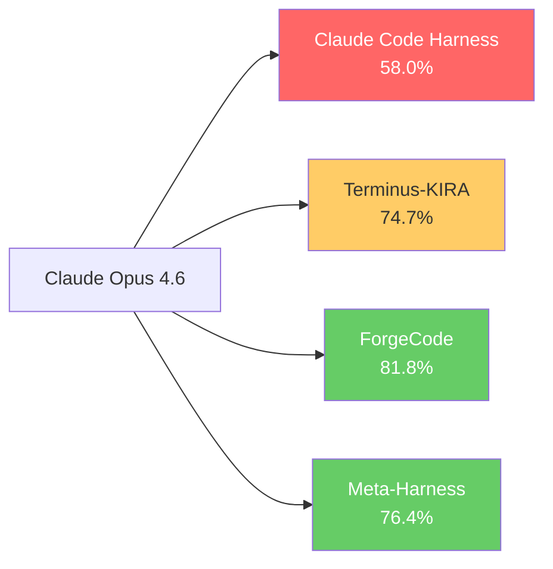
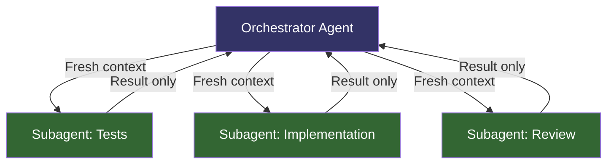

# Harness Performance on Terminal-Bench: Why Scaffolding Matters More Than Model Choice


---

Terminal-Bench 2.0 has become the definitive benchmark for evaluating AI coding agents in realistic terminal environments [^1]. Published at ICLR 2026, it tests agents across 89 tasks spanning software engineering, biology, security, and gaming — each running inside a Docker container with automated verification [^2]. What makes the leaderboard genuinely interesting is not which model sits at the top, but that the *same model* can swing by 20+ percentage points depending on the harness wrapping it. For practitioners choosing tools — Codex CLI, Claude Code, ForgeCode, or others — this has direct implications for how you spend your optimisation budget.

## The Model-Harness Gap Is Real

The most striking data point on the Terminal-Bench 2.0 leaderboard: Claude Opus 4.6 scores 58.0% when running inside Claude Code's harness (position #33), but reaches 74.7% inside the Terminus-KIRA harness — a 16.7-point gap from the *same underlying model* [^3] [^4]. ForgeCode, an open-source Rust-based harness, beats Claude Code on Terminal-Bench when both run Opus 4.6, reaching 81.8% versus Claude Code's 58.0% [^5].

This is not a marginal difference. It is the difference between a middling score and a competitive one. The model is identical; only the scaffolding changes.



## What Terminal-Bench Actually Measures

Terminal-Bench 2.0 tasks are not toy problems. Each task provides a Docker container with a unique environment, and the agent must explore the filesystem, run commands, edit code, interpret errors, and iterate — the full agentic loop [^2]. Scoring is binary: pass all pytests or get zero credit. The benchmark ran over 32,000 trials across model-harness pairs, with each combination tested at least five times for statistical reliability [^1].

This methodology makes harness quality visible in the data. Each leaderboard entry pairs an agent framework with a model, so the same model appears multiple times with different scaffolding. The result: harness engineering is no longer a hidden variable.

## Why Harnesses Create Such Large Gaps

The HumanLayer team's analysis of harness engineering identifies the key levers that differentiate strong harnesses from weak ones [^6]:

### Prompt Architecture

How the harness frames the task, injects system context, and structures tool-call schemas has outsized impact. ForgeCode reorders JSON schema fields to reduce tool-call errors, flattens nested schemas, and adds explicit truncation reminders when files are partially read [^5]. These are not model improvements — they are pure scaffolding optimisations.

### Environment Bootstrapping

Stanford's Meta-Harness research demonstrates that gathering a snapshot of the sandbox environment (working directory, file listing, available languages, package managers, memory) *before* the agent loop starts saves 2–5 early exploration turns [^7]. Those turns are not wasted on `ls` and `which python3` — they go directly to task-relevant work. This single optimisation helped Meta-Harness achieve 76.4% with Opus 4.6, surpassing hand-engineered alternatives [^7].

### Sub-Agent Decomposition

Strong harnesses use sub-agents as "context firewalls" — spawning isolated context windows for discrete sub-tasks rather than polluting the main context with irrelevant detail [^6]. This maps directly to Codex CLI's TOML subagent pattern, where each subagent operates in a fresh context window with a focused brief.

### Verification Passes

ForgeCode implements a mandatory reviewer skill that checks task completion before submitting, catching silent failures that single-pass harnesses miss [^5]. This is the scaffolding equivalent of running your tests before pushing.

## What This Means for Codex CLI

Codex CLI sits at 77.3% on Terminal-Bench 2.0 with GPT-5.3-Codex [^3] — competitive with the best harness-model pairs. But the broader lesson is more important than any single score: **the harness is where practitioners have leverage**.

### Open-Source Iteration Speed

Codex CLI's open-source harness can iterate faster than closed-source alternatives. The Terminus 2 harness improved from 62.9% to 74.4% with Opus 4.6 through community contributions — matching "Simple Codex + GPT-5.3-Codex" without changing the model [^4]. Open-source harnesses benefit from the same dynamic that makes open-source software robust: many eyes finding many bugs.

### AGENTS.md as Harness Configuration

Every Codex CLI project already has a harness configuration layer: `AGENTS.md`. The prompt architecture that ForgeCode hard-codes into its Rust scaffolding, Codex CLI externalises as project-specific markdown. This makes harness tuning accessible to every developer on the team, not just the harness maintainers.

```toml
# codex.toml — harness-level configuration
model = "o4-mini"
approval_mode = "auto-edit"

[sandbox]
type = "workspace-write"

[history]
persistence = true
max_context_tokens = 120000
```

### The Subagent Advantage

Codex CLI's subagent orchestration — spawning fresh agents for discrete tasks rather than extending long sessions — aligns with the harness engineering principle that context management drives performance. Each subagent starts with a clean context window, avoiding the context pollution that degrades performance in long-running sessions [^6].



## The Benchmaxxing Caveat

The r/ClaudeCode community has rightly flagged "benchmaxxing" — optimising a harness specifically for benchmark performance at the expense of real-world usability [^5]. ForgeCode's 81.8% on Terminal-Bench is impressive, but Claude Code has the deeper ecosystem: hooks, MCP integrations, auto-memory, and IDE integrations that matter for daily development workflows [^5].

Terminal-Bench measures one dimension of agent capability. Production development involves long-horizon tasks, multi-file refactoring, team conventions, CI integration, and security guardrails — none of which Terminal-Bench captures. A harness optimised for 89 benchmark tasks may underperform on the 90th task that looks like your actual codebase.

The practical takeaway: benchmark scores tell you about harness *potential*, not harness *fit*. Codex CLI's 77.3% matters less than whether its `AGENTS.md` + hooks + subagent architecture matches your team's workflow.

## Harness Engineering as a Practice

Stanford's Meta-Harness paper [^7] hints at where harness engineering is heading: automated optimisation of the harness itself. Rather than hand-tuning prompt templates and tool schemas, an outer-loop system searches over harness configurations using execution traces from prior runs. On Haiku 4.5, Meta-Harness achieved 37.6% — outperforming the next-best agent (Goose, 35.5%) by 2.1 points [^7]. The improvement is larger on weaker models, suggesting that harness quality acts as a multiplier on model capability.

For Codex CLI practitioners, this translates to a concrete practice:

1. **Measure your harness** — run representative tasks and track success rates, token usage, and turn counts
2. **Tune AGENTS.md iteratively** — treat prompt architecture as code, version it, and A/B test changes
3. **Use subagents for context control** — spawn fresh contexts for discrete tasks rather than cramming everything into one session
4. **Add verification passes** — hooks that validate output before committing, catching the silent failures that inflate perceived productivity
5. **Bootstrap environment context** — front-load relevant project information so the agent spends fewer turns on exploration

## The Convergence

The Terminal-Bench leaderboard tells a clear story: we have reached the point where harness engineering yields larger returns than waiting for the next model release. A 16-point swing from scaffolding changes dwarfs the typical 2–3 point improvement between model generations.

For teams using Codex CLI, this is good news. The harness is open source, the configuration is externalised in `AGENTS.md`, and the subagent architecture provides natural leverage points for optimisation. The model-harness gap is not a problem to solve — it is an opportunity to exploit.

---

## Citations

[^1]: Terminal-Bench: Benchmarking Agents on Hard, Realistic Tasks in Command Line Interfaces. ICLR 2026. [arxiv.org/abs/2601.11868](https://arxiv.org/abs/2601.11868)

[^2]: Terminal-Bench 2.0 and Harbor announcement. [tbench.ai/news/announcement-2-0](https://www.tbench.ai/news/announcement-2-0)

[^3]: Terminal-Bench 2.0 Leaderboard. [tbench.ai/leaderboard/terminal-bench/2.0](https://www.tbench.ai/leaderboard/terminal-bench/2.0)

[^4]: Terminus open-source harness improvements. Alex Dimakis. [x.com/AlexGDimakis/status/2024618119101301106](https://x.com/AlexGDimakis/status/2024618119101301106)

[^5]: ForgeCode vs Claude Code: which AI coding agent actually wins? DEV Community, April 2026. [dev.to/liran_baba/forgecode-vs-claude-code-which-ai-coding-agent-actually-wins-36c](https://dev.to/liran_baba/forgecode-vs-claude-code-which-ai-coding-agent-actually-wins-36c)

[^6]: Skill Issue: Harness Engineering for Coding Agents. HumanLayer Blog. [humanlayer.dev/blog/skill-issue-harness-engineering-for-coding-agents](https://www.humanlayer.dev/blog/skill-issue-harness-engineering-for-coding-agents)

[^7]: Meta-Harness: End-to-End Optimization of Model Harnesses. Stanford IRIS Lab, March 2026. [arxiv.org/abs/2603.28052](https://arxiv.org/abs/2603.28052)
