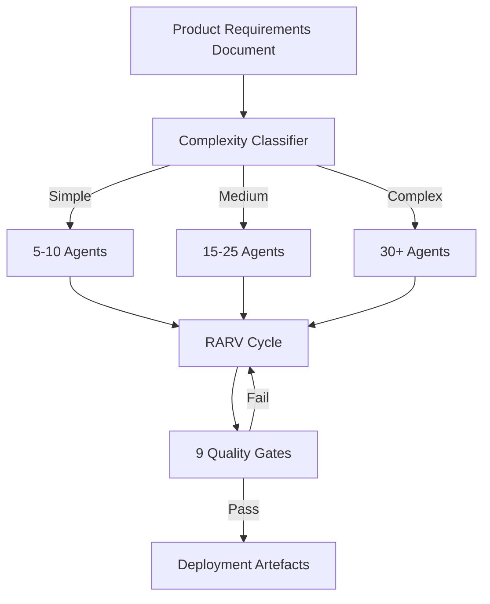
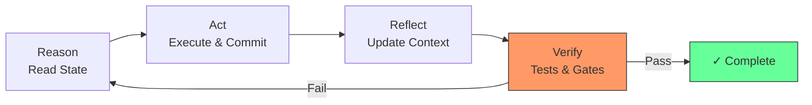
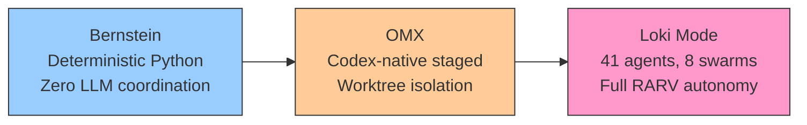

# Loki Mode: 41-Agent Autonomous Execution and What Codex CLI Can Learn From It


---

## Introduction

The multi-agent orchestration space around Codex CLI has matured rapidly in early 2026. Alongside Codex-native tools like OMX and cross-model frameworks like Bernstein, a more ambitious project has emerged: **Loki Mode** (asklokesh/loki-mode)[^1]. With 823 stars, 856 commits, and 41 specialised agent types spread across 8 swarms, Loki Mode represents the most comprehensive attempt yet at fully autonomous software delivery — from a Product Requirements Document (PRD) to deployed, tested code with minimal human intervention.

This article dissects Loki Mode's architecture, evaluates its benchmark claims, and — most importantly — identifies patterns that Codex CLI practitioners can adapt into their own workflows using subagents, hooks, and multi-agent v2 features.

## Architecture: 8 Swarms, 41 Agent Types

Loki Mode organises its agents into eight domain swarms, each containing between three and eight specialised agent types[^2]:

| Swarm | Agent Count | Examples |
|-------|------------|---------|
| Engineering | 8 | `eng-frontend`, `eng-backend`, `eng-database`, `eng-qa`, `eng-perf` |
| Operations | 8 | `ops-devops`, `ops-security`, `ops-monitor`, `ops-sre`, `ops-compliance` |
| Business | 8 | `biz-marketing`, `biz-legal`, `biz-finance`, `biz-hr` |
| Growth | 4 | `growth-hacker`, `growth-community`, `growth-success`, `growth-lifecycle` |
| Data | 3 | `data-ml`, `data-eng`, `data-analytics` |
| Product | 3 | `prod-pm`, `prod-design`, `prod-techwriter` |
| Review | 3 | `review-code`, `review-business`, `review-security` |
| Orchestration | variable | Coordinator agents managing cross-swarm dependencies |

Critically, these are agent *type definitions*, not a fixed roster. Loki Mode dynamically spawns agents based on PRD complexity — a simple todo app might use 5–10 agents, whilst a complex multi-service platform spawns the full complement[^2].



## The RARV Cycle: Self-Correcting Autonomous Execution

At the heart of Loki Mode is the **RARV cycle** — Reason, Act, Reflect, Verify — which runs continuously until all tasks pass quality gates[^1]:

1. **Reason** — Read current state from `.loki/orchestrator.json` and `.loki/autonomy-state.json`, assess what needs doing next
2. **Act** — Execute the task, commit changes to git
3. **Reflect** — Update context, record interaction traces to episodic memory
4. **Verify** — Run tests, check spec compliance, execute quality gates

When verification fails, the cycle restarts with the failure context injected into the Reason phase. The system implements exponential backoff for retries, configurable via `LOKI_BASE_WAIT` (default 60s) and `LOKI_MAX_WAIT` (default 3600s), with up to `LOKI_MAX_RETRIES` attempts (default 50)[^3].



### Three-Tier Memory System

The RARV cycle is supported by a three-tier memory architecture[^1]:

- **Episodic memory** — Interaction traces and task histories, enabling the system to recall what happened in previous RARV iterations
- **Semantic memory** — Generalised patterns learned across projects
- **Procedural memory** — Reusable skills and workflow templates

Vector search integration is optional but recommended for larger codebases where retrieval speed matters.

## The 9 Quality Gates

Loki Mode's quality pipeline is arguably its most interesting feature for Codex CLI users. Code cannot ship until all nine gates pass[^4]:

1. **Input Guardrails** — Validate scope, detect prompt injection attempts
2. **Static Analysis** — CodeQL, ESLint, type checking
3. **Blind Code Review** — Three parallel reviewers, each unable to see the others' findings
4. **Anti-Sycophancy Check** — If all three reviewers unanimously approve, a devil's advocate reviewer is triggered to challenge the consensus
5. **Output Guardrails** — Code quality, spec compliance, secrets detection
6. **Severity-Based Blocking** — Critical, High, or Medium findings block the pipeline
7. **Test Coverage Gates** — 100% test pass rate required, >80% coverage threshold
8. **Mutation Testing** — Validates that tests actually detect injected faults
9. **Documentation Completeness** — Ensures API docs and user guides are updated

The anti-sycophancy mechanism deserves attention. Research from the CONSENSAGENT paper (2025) suggests that blind review combined with devil's advocate reduces false positives by approximately 30%[^4]. This directly addresses the well-documented tendency of LLMs to agree with previously stated opinions.

## Provider Support: Claude Gets Parallelism, Codex Runs Sequential

One of Loki Mode's most notable design decisions is its asymmetric provider support[^5]:

| Provider | Execution Mode | Parallel Agents | Subagent Support |
|----------|---------------|----------------|-----------------|
| Claude Code | Full | 10+ concurrent | Yes (Task tool) |
| Codex CLI | Sequential | No | No (`--full-auto`) |
| Gemini CLI | Sequential | No | No |
| Cline | Sequential | No | No |
| Aider | Sequential | No | No |

When running under Codex CLI, Loki Mode operates in what the documentation calls "degraded mode"[^5]:

- RARV cycles execute sequentially rather than in parallel
- Task tool calls are bypassed entirely
- Quality gate reviews run sequentially instead of three-reviewer parallel assessment
- The `--parallel` flag becomes ineffective

Codex CLI uses `--full-auto` (v0.98.0+) for autonomous execution, with a 400K token context window — larger than Claude's 200K — but without the parallelism that makes Loki Mode's swarm architecture effective[^5].

This limitation is **not intrinsic to Codex CLI**. With multi-agent v2 and subagent support now available[^6], there is no technical reason Loki Mode could not leverage Codex's `worker` subagent type for parallel task execution. The sequential constraint appears to be a development priority rather than an architectural limitation.

## Patterns to Adapt for Codex CLI

### 1. RARV as a Subagent Workflow

The four-phase RARV cycle maps naturally onto Codex CLI's subagent architecture[^6]:

```toml
# ~/.codex/config.toml — enable subagents
[features]
multi_agent = true
multi_agent_v2 = true
enable_fanout = true
```

A custom subagent configuration could implement each RARV phase:

```bash
# Plan agent reads state and determines next action
codex --agent plan-agent "Read the current project state and determine next implementation step"

# Worker agents execute in parallel
codex --agent worker "Implement the authentication module per spec"
codex --agent worker "Write unit tests for the authentication module"

# Reflect agent updates context
codex --agent plan-agent "Review what was implemented and update project state"

# Verify agent runs quality checks
codex --agent worker "Run all tests and report coverage metrics"
```

### 2. Anti-Sycophancy Review as a Hooks Chain

Loki Mode's blind review pattern can be implemented using Codex CLI's hooks system:

```toml
# ~/.codex/config.toml
[[hooks.post_commit]]
command = "codex exec 'Review this diff for correctness issues. Be critical.' | tee /tmp/review-1.md"

[[hooks.post_commit]]
command = "codex exec 'Review this diff for security vulnerabilities. Assume hostile input.' | tee /tmp/review-2.md"

[[hooks.post_commit]]
command = "codex exec 'Review this diff for performance issues. Identify O(n²) patterns.' | tee /tmp/review-3.md"
```

The key insight is isolation: each reviewer operates on the same diff but with a different focus prompt and no visibility of the other reviews.

### 3. The 9-Gate Pipeline as CI Integration

Codex CLI's `exec` command integrates naturally with CI/CD pipelines. A GitHub Actions workflow implementing Loki Mode's quality gates:

```yaml
# .github/workflows/quality-gates.yml
jobs:
  static-analysis:
    runs-on: ubuntu-latest
    steps:
      - uses: actions/checkout@v4
      - run: codex exec "Run CodeQL and ESLint analysis on changed files"

  blind-review:
    runs-on: ubuntu-latest
    strategy:
      matrix:
        focus: [correctness, security, performance]
    steps:
      - uses: actions/checkout@v4
      - run: codex exec "Review changed files for ${{ matrix.focus }} issues. Be critical and thorough."

  mutation-testing:
    runs-on: ubuntu-latest
    needs: [static-analysis, blind-review]
    steps:
      - uses: actions/checkout@v4
      - run: codex exec "Run mutation testing on changed modules and report survival rate"
```

## Comparison with Other Orchestrators

Loki Mode sits at the high-autonomy end of the multi-agent spectrum:



| Aspect | Bernstein | OMX | Loki Mode |
|--------|-----------|-----|-----------|
| Coordination | Deterministic Python, zero LLM tokens[^7] | Codex-native staged pipeline | LLM-driven RARV cycle |
| Parallelism | Git worktree isolation | Worktree isolation | Claude-only parallel; others sequential |
| Quality gates | Lint + types + PII scan | Stage-based verification | 9 gates including anti-sycophancy |
| Provider lock-in | Provider-agnostic | Codex-native | Claude-optimised, others degraded |
| Licence | Open source | Open source | BUSL-1.1 (Apache 2.0 from 2030)[^1] |

The BUSL-1.1 licence is worth noting: Loki Mode is free for personal, internal, academic, and non-commercial use, but commercial deployment requires a licence until it converts to Apache 2.0 on 19 March 2030[^1].

## Benchmark Claims: Context Required

Loki Mode claims 162/164 on HumanEval (98.78%) with a maximum of three retries using RARV self-verification[^1]. For context:

- Direct Claude without RARV achieves 161/164 (98.17%) — the RARV cycle recovers exactly **one additional problem**
- The claim that this "beats MetaGPT by +11–13%" compares against MetaGPT's 85.9–87.7% — a significantly different architecture[^1]
- ⚠️ The SWE-bench claim of "299/300 patches generated" notes that the evaluator has not yet been executed, making this figure unverifiable

These benchmarks should be interpreted carefully. HumanEval problems are small, self-contained functions where retry-based approaches naturally excel. The real value of Loki Mode's RARV cycle is more likely to manifest on larger, integration-heavy tasks where self-correction across multiple files matters.

## When Full Autonomy Makes Sense

Loki Mode's fully autonomous approach suits specific scenarios:

- **Greenfield prototyping** — Generate a complete MVP from a PRD with minimal human oversight
- **Bulk migration tasks** — Apply repetitive transformations across hundreds of files with verification
- **Compliance-heavy environments** — The 9-gate pipeline provides auditable quality evidence

For most day-to-day Codex CLI work, the human-in-the-loop approval gates (`suggest` or `auto-edit` mode) remain preferable. Full autonomy trades control for throughput — acceptable for disposable prototypes, risky for production systems where architectural decisions compound.

## Conclusion

Loki Mode represents the most ambitious attempt at fully autonomous multi-agent software delivery in the Codex CLI ecosystem. Its 41 agent types, RARV self-correction cycle, and 9-gate quality pipeline offer genuine architectural innovations — particularly the anti-sycophancy blind review pattern.

For Codex CLI practitioners, the actionable takeaways are clear: implement RARV-style self-correction loops using subagent workflows, adopt blind multi-reviewer patterns in hooks or CI, and build quality gate pipelines that go beyond basic linting. The patterns matter more than the framework.

## Citations

[^1]: [Loki Mode GitHub Repository — asklokesh/loki-mode](https://github.com/asklokesh/loki-mode)
[^2]: [Loki Mode Agent Reference — references/agents.md](https://github.com/asklokesh/loki-mode/blob/main/references/agents.md)
[^3]: [Loki Mode Autonomy System — autonomy/README.md](https://github.com/asklokesh/loki-mode/blob/main/autonomy/README.md)
[^4]: [Loki Mode Quality Gates and Anti-Sycophancy — CLAUDE.md](https://github.com/asklokesh/loki-mode/blob/main/CLAUDE.md)
[^5]: [Loki Mode Provider Support — skills/providers.md](https://github.com/asklokesh/loki-mode/blob/main/skills/providers.md)
[^6]: [Codex CLI Subagents Documentation — OpenAI Developers](https://developers.openai.com/codex/subagents)
[^7]: [Bernstein — Declarative Agent Orchestration — chernistry/bernstein](https://github.com/chernistry/bernstein)
