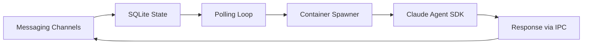
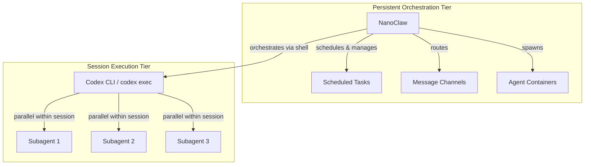

# NanoClaw and Codex CLI: Building an Always-On Agentic Assistant


---

Codex CLI excels at interactive coding sessions and scripted automation via `codex exec`. But what happens when you need an agent that persists across hours or days — one that runs scheduled research at 3am, processes batch operations while you sleep, and responds to messages on Telegram or Slack? That is the gap NanoClaw fills: a lightweight, container-isolated orchestration layer built on Anthropic's Claude Agent SDK that turns Claude Code into a persistent, always-on agentic platform[^1].

This article examines how NanoClaw extends the single-session model into continuous operation, how its architecture compares to Codex CLI's own automation capabilities, and the real-world patterns that emerge when you run an agentic assistant on autopilot.

## The Persistence Problem

Both Codex CLI and Claude Code are session-scoped tools. Codex CLI's `codex exec` command runs non-interactively and exits[^2]. The Codex Desktop app introduced automations — scheduled tasks backed by a local SQLite database that survive restarts[^3] — but these require the desktop app to be open and running on your machine.

Claude Code has a similar constraint. Claude Code Channels (launched March 2026) let you control a local session from Telegram or Discord[^4], but the session itself must be running. Neither tool natively provides the "agentic pod on autopilot" pattern: a long-running process that manages multiple agent instances, routes messages from external platforms, and executes scheduled work across days or weeks without human intervention.

## NanoClaw's Architecture

NanoClaw takes a radically minimal approach: approximately 500 lines of TypeScript running as a single Node.js process[^1]. The core pipeline is straightforward:



Five key components handle the entire orchestration:

| Component | File | Responsibility |
|-----------|------|----------------|
| Orchestrator | `src/index.ts` | State management and message routing |
| Channel Registry | `src/channels/registry.ts` | Self-registering messaging adapters |
| Container Runner | `src/container-runner.ts` | Spawns isolated agent environments |
| Task Scheduler | `src/task-scheduler.ts` | Cron, interval, and one-time jobs |
| Group Queue | `src/group-queue.ts` | Per-group FIFO with concurrency limits |

The repository has grown to 26.9k GitHub stars and 685 commits as of April 2026[^5], but the core codebase remains deliberately small — a design philosophy the maintainers call "skills over features"[^1].

### Container Isolation

Every agent session runs inside an isolated Linux container — Apple Container on macOS, Docker on Linux[^5]. This is OS-level isolation rather than application-level permission checks:

- Filesystem access limited to explicitly mounted directories
- Non-root execution with read-only project mounts by default
- Symlink escape detection and mount allowlists via `~/.config/nanoclaw/mount-allowlist.json`[^6]
- IPC via filesystem queues rather than network sockets

Mount privileges vary by group type: main groups receive the full project root at `/workspace/project`, whilst non-main groups access only their own directory. All groups share read-only access to `groups/global/` for shared knowledge[^6].

### The Task Scheduler

NanoClaw's scheduler supports three execution paradigms[^6]:

**Cron-based** — Standard 5-6 field cron expressions with timezone support via `cron-parser`. For example, `0 9 * * 1-5` triggers at 9am on weekdays.

**Interval-based** — Arithmetic recurrence where the next execution is calculated as `now + interval_ms`. Useful for polling or periodic checks.

**One-time** — ISO 8601 timestamps that execute exactly once, then mark as completed with `next_run = NULL`.

The scheduler polls every 60 seconds via `startScheduler()`, querying `getDueTasks()` for active tasks where `next_run <= Date.now()`. Each execution spawns a fresh container via `runAgent()` and logs results to the `task_run_logs` table[^6].

```bash
# Natural language scheduling via chat
@Andy every Monday at 8am, compile the week's Codex CLI changelog
      entries and summarise breaking changes

# Or programmatically via the IPC task queue
echo '{"schedule": "0 8 * * 1", "prompt": "compile changelog..."}' \
  > $IPC_DIR/main/tasks/weekly-changelog.json
```

## Real-World Patterns

### Daily Morning Briefing

A scheduled task at 6am triggers web research across multiple sources, generates a sketchnote summary via Gemini image generation, curates relevant news, and delivers the result to Telegram — all before the developer's first coffee. The multi-tool pipeline combines `WebSearch`, `WebFetch`, image generation APIs, GitHub APIs, and git operations in a single automated workflow.

### Automated Batch Operations

Background batch operations demonstrate NanoClaw's async strength. For example, generating sketchnotes for an entire article library (69 images in one run) whilst the assistant continues handling other messages. The per-group queue system ensures batch work does not block interactive responses[^6].

### Repository Management on Autopilot

NanoClaw can manage an entire knowledge base lifecycle: writing articles from a backlog, running fact-checking and citation validation across hundreds of files at 3am, committing and pushing changes, and reporting results via messaging. This "repo caretaker" pattern chains multiple skills — citation-checker, fact-checker, sketchnote-generator — in a single scheduled task.

## How NanoClaw Complements Codex CLI

NanoClaw and Codex CLI occupy different tiers of the automation stack:



**NanoClaw** handles long-running async orchestration across hours and days: scheduled research, message routing, batch processing, and cross-session state management.

**Codex CLI** handles parallel execution within a single session: `codex exec` for scripted automation, subagents for concurrent task decomposition (up to 6 threads by default[^2]), and deep integration with OpenAI's model ecosystem.

The "agentic pod" pattern combines both: NanoClaw as the outer orchestrator managing multiple `codex exec` invocations for tasks that benefit from OpenAI's models, whilst running Claude-native work directly through its container pipeline.

## NanoClaw vs the Alternatives

| Capability | NanoClaw | Claude Code Channels | Codex App Automations | OpenClaw |
|-----------|----------|---------------------|-----------------------|----------|
| Persistence | Always-on process | Requires running session | Requires desktop app open | Always-on process |
| Isolation | OS-level containers | Claude Code sandbox | Codex sandbox | Application-level[^7] |
| Messaging | WhatsApp, Telegram, Slack, Discord, Gmail[^5] | Telegram, Discord, iMessage[^4] | None | 50+ integrations[^7] |
| Scheduled tasks | Cron, interval, one-time | Via desktop pairing | SQLite-backed automations[^3] | Plugin-based |
| Agent swarms | Yes (Claude agent-teams)[^8] | Yes (native) | Yes (subagents) | Limited |
| Codebase size | ~500 LOC core[^1] | 512K LOC[^9] | Proprietary | 430K+ LOC[^7] |
| Model support | Claude only | Claude only | OpenAI only | Multiple |

Claude Code Channels launched as Anthropic's first-party answer to the messaging integration problem[^4], but it specifically targets developer workflows — there is no support for WhatsApp, Gmail, or the broader "personal assistant" use case that NanoClaw and OpenClaw address[^10].

OpenClaw dominates on integration breadth with 50+ messaging platforms, but its 430,000+ lines of code create a substantial attack surface that security researchers have flagged as problematic[^7]. NanoClaw trades integration breadth for container-level security and architectural simplicity.

## The Skill System

Rather than accumulating features into a monolithic codebase, NanoClaw uses Claude Code skills to extend functionality[^1]. Each skill lives in `.claude/skills/{name}/SKILL.md` and teaches Claude Code how to modify the host process:

- `/add-telegram` — Adds Telegram channel support by modifying source
- `/convert-to-docker` — Switches container runtime from Apple Container to Docker
- `/add-web-search` — Enables web search within sandboxed containers

This "skills over features" philosophy keeps the core small whilst enabling arbitrarily complex customisation. Users fork the repository and apply skills to their local copy — a pattern that avoids the plugin ecosystem bloat that plagues larger projects[^1].

## Getting Started

```bash
# Clone and launch — Claude Code handles the rest
git clone https://github.com/qwibitai/NanoClaw.git
cd NanoClaw
claude  # Interactive setup via Claude Code skills

# Requirements:
# - Node.js 20+
# - Container runtime (Apple Container on macOS, Docker on Linux)
# - Anthropic API key or Claude Code OAuth
```

The setup process itself is "AI-native" — rather than editing configuration files, you interact with Claude Code to configure messaging channels, set up scheduled tasks, and customise behaviour[^1]. The `/setup` skill walks through initial configuration, whilst `/customize` handles ongoing adjustments.

## The Persistent Orchestration Gap

Neither Codex CLI nor Claude Code natively addresses the persistent orchestration tier — the layer that manages agent work across sessions, days, and external triggers without requiring a human to keep a terminal open. Codex's cloud tasks are moving in this direction[^3], and Claude Code Channels bridge the messaging gap[^4], but both remain session-oriented at their core.

NanoClaw occupies this gap with a deliberately minimal architecture: a single process, container isolation, and a skill system that grows with need rather than anticipating it. For developers running Codex CLI as their primary coding agent, NanoClaw provides the complementary always-on layer — the persistent orchestrator that ensures your agentic workflows run whether or not you are at your desk.

---

## Citations

[^1]: [NanoClaw Official Website](https://nanoclaws.io/) — NanoClaw documentation and architecture overview
[^2]: [Codex CLI Features — OpenAI Developers](https://developers.openai.com/codex/cli/features) — codex exec and subagent documentation
[^3]: [Codex App Automations — OpenAI Developers](https://developers.openai.com/codex/app/automations) — Scheduled automation capabilities
[^4]: [Anthropic Ships Claude Code Channels — VentureBeat](https://venturebeat.com/orchestration/anthropic-just-shipped-an-openclaw-killer-called-claude-code-channels) — Claude Code Channels launch coverage
[^5]: [NanoClaw GitHub Repository](https://github.com/qwibitai/nanoclaw) — Source code, metrics, and technical documentation
[^6]: [NanoClaw Deep Architecture — DeepWiki](https://deepwiki.com/gavrielc/nanoclaw) — Detailed technical architecture analysis
[^7]: [OpenClaw Alternatives Compared — AI Magicx](https://www.aimagicx.com/blog/openclaw-alternatives-comparison-2026) — Security and feature comparison
[^8]: [NanoClaw Agent Swarms — Hacker News](https://news.ycombinator.com/item?id=46941280) — Agent swarm support announcement
[^9]: [Claude Code Architecture Deep Dive](https://claudefa.st/blog/guide/agents/agent-teams) — Claude Code codebase metrics
[^10]: [Claude Code Channels Setup — ShareUHack](https://www.shareuhack.com/en/posts/claude-code-channels-telegram) — Channels capabilities and limitations
