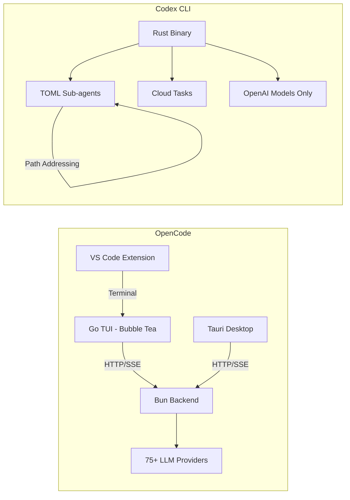
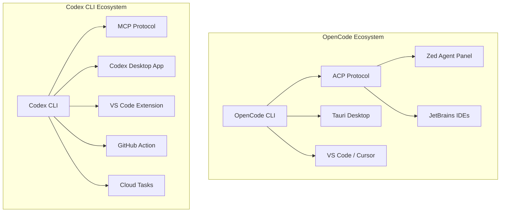

# OpenCode vs Codex CLI: The Open-Source Challenger With 75+ Model Providers

---

The terminal coding agent landscape in 2026 has consolidated around three serious contenders: Claude Code, Codex CLI, and OpenCode. While Claude Code occupies the Anthropic-native lane, the more interesting rivalry is between Codex CLI and OpenCode — two tools with fundamentally different philosophies on vendor lock-in, model flexibility, and what "open" actually means.

This article provides a technical head-to-head comparison as of April 2026, covering architecture, model support, performance, pricing, ecosystem integration, and the strategic question underpinning both tools: does the future favour single-vendor optimisation or multi-provider openness?

## Architecture

### OpenCode: Go + Bun Client-Server

OpenCode is built as a client-server application[^1]. The TUI is a Go binary using Bubble Tea[^2], while the backend is a TypeScript process running on Bun that exposes an HTTP API and pushes real-time updates via Server-Sent Events[^3]. This separation allows the same backend to serve the terminal TUI, a Tauri-based desktop application, and IDE extensions simultaneously.

The architecture supports two built-in agent modes: **build** (full filesystem and shell access) and **plan** (read-only analysis)[^4].

### Codex CLI: Rust Monolith

Codex CLI is a Rust-based single binary[^5] with a richer agent system. Sub-agents are defined in TOML with path-based addresses like `/root/agent_a`, and the multi-agent v2 system supports structured messaging between agents with configurable thread limits[^6]. Cloud tasks offload heavy work to sandboxed environments with full networking.

## Model Support: BYOM vs Single-Vendor Optimisation

This is the fundamental divide between the two tools.

### OpenCode: Bring Your Own Model

OpenCode supports 75+ LLM providers out of the box[^7]: OpenAI, Anthropic (via API key), Google Gemini, AWS Bedrock, Azure OpenAI, Groq, DeepSeek, and — critically — local model runtimes like Ollama, LM Studio, and llama.cpp. You can point it at any OpenAI-compatible endpoint.

This flexibility means you can run OpenCode entirely offline with a local model, use a cheap provider for routine tasks and a premium model for complex refactors, or avoid vendor lock-in entirely.

### Codex CLI: OpenAI-Only, But Optimised

As of the April 7 2026 model availability update, Codex CLI supports[^8]:

- **gpt-5.4** — the flagship model
- **gpt-5.4-mini** — cost-optimised variant
- **gpt-5.3-codex** — the dedicated coding model
- **gpt-5.3-codex-spark** — ultra-fast coding on Cerebras WSE-3

The older `gpt-5.2-codex`, `gpt-5.1` variants, and `gpt-5` have been removed from the model picker[^8]. Custom model providers with dynamic bearer tokens were added in v0.118.0[^9], but the ecosystem remains OpenAI-centric.

The trade-off is clear: Codex CLI cannot run a local Llama model, but its tight integration with OpenAI's infrastructure enables optimisations that OpenCode cannot match.

## Performance: Speed vs Flexibility

GPT-5.3-Codex-Spark, running on Cerebras WSE-3 hardware, delivers over 1,000 tokens per second[^10] — roughly 15× faster than the standard GPT-5.3-Codex path. On SWE-Bench Pro and Terminal-Bench 2.0, Spark demonstrates strong performance while completing tasks in a fraction of the time[^10]. This is a genuine hardware-level advantage that no multi-provider tool can replicate.

Comparative benchmarks tell a more nuanced story. In head-to-head testing[^11]:

| Metric | Codex CLI | OpenCode |
|--------|-----------|----------|
| Accuracy | +1.1 points | — |
| Consistency | — | +0.3 points |
| Speed | +2.8 points | — |
| Median runtime | 420s | 474s |

The 13% speed advantage for Codex CLI is meaningful in iterative workflows. However, OpenCode generates approximately 29% more tests in real-world task benchmarks[^12], suggesting its multi-step planning produces more thorough outputs at the cost of speed.

## The Anthropic Block: January 2026

On 9 January 2026, Anthropic deployed server-side checks that rejected OAuth tokens from third-party tools, including OpenCode[^13]. The error was unambiguous: *"This credential is only authorized for use with Claude Code and cannot be used for other API requests."*[^14]

Anthropic cited technical instability — unauthorised harnesses introduce bugs and usage patterns that Anthropic cannot diagnose[^13]. The developer community pointed to economics: the $200/month Max subscription offers unlimited usage, but Anthropic controls consumption speed through its official client[^15].

The consequences reshaped the competitive landscape:

1. **OpenCode gained 18,000 GitHub stars in two weeks** as developers rallied around the project[^16]
2. **OpenCode launched Black and Zen** — first-party model gateways providing access to Claude and other models without relying on consumer OAuth[^17]
3. **OpenAI officially partnered with OpenCode**, allowing ChatGPT subscribers to use their subscriptions directly in OpenCode[^13]

This last point is particularly significant: OpenAI saw a strategic opportunity to capture developers fleeing Anthropic's walled garden, and OpenCode became the bridge.

## Pricing

### OpenCode

OpenCode itself is free and open-source (MIT licence). Model access follows three paths[^17]:

- **BYOK (Bring Your Own Key)** — free, use any provider's API key
- **Zen** — pay-as-you-go gateway, from $0.45/1M input tokens (budget models) to $10/1M (Opus)
- **Black** — $20 / $100 / $200 per month, tiered model access with generous limits

### Codex CLI

Codex CLI requires a ChatGPT subscription[^5]:

- **Plus** — $20/month (limited Codex access)
- **Pro** — $200/month (full access including Spark)

The pricing comparison depends heavily on usage patterns. A developer using OpenCode with a cheap local model pays nothing. A developer wanting Spark-level performance must pay $200/month for ChatGPT Pro.

## IDE and Desktop Integration

### OpenCode

OpenCode ships a Tauri v2 desktop application for macOS, Windows, and Linux[^18]. It uses a sidecar pattern: the desktop app manages a local CLI server instance, providing native notifications, auto-updates, and deep linking. Extensions exist for VS Code, Cursor, and Zed.

Critically, OpenCode integrates the Agent Client Protocol (ACP)[^19] — a JSON-RPC standard co-developed with JetBrains and Zed. Running `opencode acp` starts an ACP-compatible subprocess, enabling OpenCode to function as a first-class agent inside JetBrains IDEs and Zed's agent panel[^20].

### Codex CLI

Codex CLI offers a dedicated Desktop app with automations and a review queue, a VS Code extension, and MCP (Model Context Protocol) server integration[^6]. Plugins became a first-class workflow in v0.117.0, with product-scoped plugin support[^6].

## Community and Adoption

The numbers as of April 2026[^16][^5]:

| Metric | OpenCode | Codex CLI |
|--------|----------|-----------|
| GitHub stars | ~126,000 | ~62,000 |
| Monthly active developers | 2.5M+ | Not disclosed |
| Licence | MIT | Apache 2.0 |

OpenCode's star count is somewhat inflated by the January 2026 Anthropic incident, which drove significant protest-starring. Nevertheless, the gap is substantial and reflects genuine adoption, particularly among developers who value provider independence.

## When to Choose Each

**Choose OpenCode when:**

- Provider flexibility matters — you want to switch between models or use local inference
- You work in air-gapped or privacy-sensitive environments requiring Ollama or llama.cpp
- You use JetBrains IDEs or Zed and want native ACP integration
- You want to avoid single-vendor lock-in on principle
- Budget constraints favour BYOK with cheaper providers

**Choose Codex CLI when:**

- Raw speed matters — GPT-5.3-Codex-Spark's 1,000+ tok/s is unmatched
- You need cloud task sandboxing for heavy workloads
- You want the richer TOML-based sub-agent system with path addressing
- You're already in the OpenAI ecosystem (ChatGPT Pro, API usage)
- Enterprise features, GitHub Action integration, and the review queue are priorities

## The Strategic Question

The deeper question is whether terminal coding agents will converge on single-vendor optimisation or multi-provider openness. OpenAI's partnership with OpenCode[^13] suggests even they see value in the multi-provider approach — or at least in capturing Anthropic refugees. Meanwhile, Codex CLI's Spark integration with Cerebras demonstrates what's possible when model and runtime are co-optimised.

History suggests both approaches survive. Databases have both managed single-vendor offerings and provider-agnostic ORMs. Cloud computing has both AWS-native services and Terraform. The terminal coding agent market is likely heading the same way: Codex CLI as the optimised, integrated choice for OpenAI-committed shops, and OpenCode as the flexible, provider-agnostic alternative for everyone else.

The real winner is the developer who understands both tools well enough to choose the right one for each context.

## Citations

[^1]: [OpenCode Documentation — Introduction](https://opencode.ai/docs/)

[^2]: [OpenCode GitHub Repository](https://github.com/opencode-ai/opencode)

[^3]: [DeepWiki — sst/opencode Architecture](https://deepwiki.com/sst/opencode)

[^4]: [OpenCode Agents Documentation](https://opencode.ai/docs/agents/)

[^5]: [OpenCode vs Codex CLI Comparison — MorphLLM](https://www.morphllm.com/comparisons/opencode-vs-codex)

[^6]: [Codex CLI Changelog — OpenAI Developers](https://developers.openai.com/codex/changelog)

[^7]: [OpenCode Review — OpenAI Tools Hub](https://www.openaitoolshub.org/en/blog/opencode-review-terminal-ai-coding)

[^8]: [Codex CLI Model Availability Update, April 7 2026](https://developers.openai.com/codex/changelog)

[^9]: [Codex CLI 0.118.0 Release Notes](https://developers.openai.com/codex/changelog)

[^10]: [Introducing GPT-5.3-Codex-Spark — OpenAI](https://openai.com/index/introducing-gpt-5-3-codex-spark/)

[^11]: [OpenCode vs Codex CLI Benchmarks — SigmaBench](https://sigmabench.com/blog/opencode-vs-codex-cli-on-gpt-5-1-codex-mini-and-5-2-codex/)

[^12]: [OpenCode vs Claude Code Comparison — MorphLLM](https://www.morphllm.com/comparisons/opencode-vs-claude-code)

[^13]: [Anthropic Cracks Down on Unauthorized Claude Usage — VentureBeat](https://venturebeat.com/technology/anthropic-cracks-down-on-unauthorized-claude-usage-by-third-party-harnesses)

[^14]: [OpenCode Blocked by Anthropic — NxCode](https://www.nxcode.io/resources/news/opencode-blocked-anthropic-2026)

[^15]: [Anthropic's Walled Garden: The Claude Code Crackdown — Paddo.dev](https://paddo.dev/blog/anthropic-walled-garden-crackdown/)

[^16]: [OpenCode's January Surge — Medium](https://medium.com/@milesk_33/opencodes-january-surge-what-sparked-18-000-new-github-stars-in-two-weeks-7d904cd26844)

[^17]: [OpenCode Black Pricing](https://opencode.ai/black)

[^18]: [DeepWiki — OpenCode Desktop Application](https://deepwiki.com/sst/opencode/6.7-desktop-application)

[^19]: [OpenCode ACP Documentation](https://opencode.ai/docs/acp/)

[^20]: [OpenCode ACP Agent — Zed](https://zed.dev/acp/agent/opencode)
