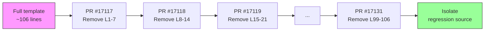
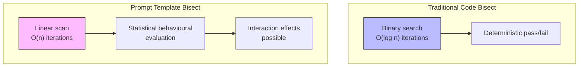

# Orchestrator Template Internals: How OpenAI's Bisect PRs Reveal Multi-Agent v2 Debugging


---

On 8 April 2026, OpenAI engineer **jif-oai** merged fifteen sequential pull requests (#17117–#17131) into the `openai/codex` repository [^1]. Each was titled "codex debug N (guardian approved)." Each removed exactly seven lines from a single file: `codex-rs/core/templates/agents/orchestrator.md`. The entire series completed in a single day. This article examines what the bisect reveals about the orchestrator template's structure, the debugging technique itself, and implications for teams building on multi-agent v2.

## What Is the Orchestrator Template?

The file at `codex-rs/core/templates/agents/orchestrator.md` serves as the **system prompt** for the orchestrator agent in Codex's multi-agent architecture [^2]. When you run a supervisor-mode session — where Codex spawns subagents to handle parallel workstreams — the orchestrator template defines how the supervising agent reasons about task decomposition, subagent coordination, and result consolidation.

Since Codex CLI 0.117.0 (26 March 2026), multi-agent v2 introduced path-based agent addresses like `/root/agent_a` and structured inter-agent messaging [^3]. The orchestrator template is the prompt that governs *how* the root agent decides to use these capabilities.

## The Bisect: 15 PRs, 106 Lines, 7 at a Time

The debugging technique is straightforward but rarely seen applied to prompt templates at this scale. Rather than a traditional binary search (halving the search space each iteration), the team used a **linear scan with fixed-width windows** — removing lines 1–7, then 8–14, then 15–21, and so on through the entire ~106-line template [^1].



Each PR was merged independently, tested against whatever internal evaluation harness OpenAI uses (Codex runs 22 CI checks per PR [^4]), and the behavioural output compared against a baseline. The "guardian approved" suffix in each title suggests an internal review gate — though "guardian" is not a publicly documented concept.

### What Each Section Contained

The bisect inadvertently reveals the orchestrator template's full structure. Reconstructing from the PR diffs:

| Lines | Section | Purpose |
|-------|---------|---------|
| 1–7 | **Identity preamble** | "You are Codex, a coding agent based on GPT-5" — personality, collaborative framing |
| 8–14 | **Tone and style** | Communication guidelines, technical language calibration |
| 15–21 | **User communication** | Rules about relaying command output, transparency about failures |
| 22–28 | **Interaction principles** | Treating users as collaborators, adjusting to expertise level |
| 29–42 | **Update structure** | Plan/status/recap formatting requirements |
| 43–56 | **Code review approach** | Prioritisation: bugs → risks → regressions |
| 57–63 | **Git worktree handling** | "NEVER revert existing changes you did not make" — dirty-worktree safety rules |
| 64–77 | **Git technical guidelines** | Non-interactive git, prefer `rg` over `grep`, avoid destructive commands |
| 78–91 | **Coordination strategy** | Leveraging subagents for parallel work |
| 92–98 | **Agent type selection** | Choosing between explorer, worker, and default agent types |
| 99–106 | **Multi-agent flow** | 5-step orchestration workflow: understand → spawn → coordinate → iterate → shutdown |

The final section (lines 99–106, removed in PR #17131 [^5]) is particularly significant — it contains the explicit orchestration flow that governs how the supervisor agent decomposes tasks and manages subagent lifecycles:

1. Understand the task and decompose into parallel steps
2. Spawn one agent per step, choosing the correct agent type
3. Coordinate via `wait_agent` and `send_input`
4. Iterate on partial results
5. Ask before shutdown

## Why Bisect a Prompt?

Traditional software bisection (`git bisect`) isolates the commit that introduced a bug. Prompt bisection isolates the *section of a prompt* that causes a behavioural regression. The key insight: **prompt templates are code** — they have the same regression risks, the same need for version control, and the same debugging challenges [^6].

But prompt regression is harder to detect than code regression for two reasons:

1. **Non-deterministic outputs.** The same prompt can produce different outputs across runs, so behavioural testing must focus on statistical properties rather than exact matches [^7].
2. **Interaction effects.** Removing section A might only cause a regression when section B is also present. A linear scan (as used here) catches single-section regressions but can miss interaction effects that a factorial design would reveal.

The Codex team's choice of linear scan over binary search suggests they either suspected the regression was localised to a specific section, or they wanted to characterise the *contribution of each section* rather than merely find the offending one.



## The Multi-Agent v2 Context

Understanding *why* the orchestrator template matters requires context on how Codex's multi-agent architecture works.

### Agent Types and Spawning

Codex provides three built-in agent types [^2]:

- **`explorer`** — read-only codebase analysis, no write permissions
- **`worker`** — write-enabled execution within the sandbox
- **`default`** — general-purpose, inherits parent configuration

Custom agent types can be defined via TOML files in `~/.codex/agents/` or `.codex/agents/`. Default limits are `max_threads: 6` and `max_depth: 1` [^3].

### Explicit vs Implicit Delegation

Codex uses an **explicit spawn model** — subagents only spawn when the user or orchestrator deliberately requests them [^2]. This contrasts with Claude Code's implicit delegation, where agents autonomously decide to spawn helpers [^8]. The design choice prioritises token cost predictability: each subagent consumes additional tokens, and explicit spawning keeps that visible to the user.

The orchestrator template's "Flow" section (lines 99–106) is the precise instruction set that tells the model *when and how* to make spawning decisions. Removing it during the bisect would fundamentally alter the orchestrator's coordination behaviour — making it a prime candidate for regression isolation.

### Approval Inheritance

A critical safety property: subagents inherit their parent's sandbox policies and runtime overrides, including `--full-auto` flags [^2]. The orchestrator template governs the *decision-making* layer, but the *permission* layer is handled by the sandbox infrastructure. This separation means template regressions affect coordination quality but not security boundaries.

## Practical Implications for Teams

### 1. Version Your Prompt Templates

If OpenAI bisects their own orchestrator template, your team's custom agent templates deserve the same rigour. Store them in version control, review changes as you would code, and test against a behavioural baseline before deploying.

```toml
# .codex/agents/reviewer.toml
[agent]
name = "reviewer"
type = "explorer"
template = "templates/reviewer.md"  # version-controlled prompt

[limits]
max_tokens = 50000
```

### 2. Build a Prompt Evaluation Harness

The bisect technique only works if you have a reliable way to measure behavioural change. Consider:

- **Golden-set evaluation**: a fixed set of tasks where you know the expected orchestration pattern (e.g., "this task should spawn 3 workers, not 1")
- **LLM-as-judge scoring**: use a separate model to rate orchestration quality against a rubric [^7]
- **Diff-based analysis**: compare subagent spawn patterns, message counts, and task completion rates across template versions

### 3. Watch for Section Interaction Effects

The linear scan approach has a blind spot: it cannot detect regressions caused by the *interaction* between two non-adjacent sections. If your orchestrator template has cross-references (e.g., the "Flow" section references agent types defined earlier), removing either section in isolation might appear fine while removing both causes failure.

### 4. The "Guardian" Pattern

The "guardian approved" suffix on every PR title hints at an automated or semi-automated review gate — likely an internal evaluation that must pass before template changes merge. Teams running multi-agent workflows in production should consider a similar gate: a CI check that runs your orchestration evaluation suite against every template change.

## What This Reveals About Prompt Engineering at Scale

The bisect series is notable not for its technical sophistication — the technique is elementary — but for what it reveals about **prompt engineering maturity at OpenAI**. The orchestrator template is treated as production infrastructure: version-controlled, reviewed, tested through systematic ablation, and gated behind an approval process.

As Addy Osmani observed in his analysis of multi-agent coding patterns, "the bottleneck is no longer generation — it's verification" [^9]. The bisect PRs are verification in action: systematically proving which parts of a 106-line prompt template are load-bearing and which are inert.

For teams building on Codex's multi-agent v2, the lesson is clear: your orchestrator prompts are not configuration files to be tweaked ad hoc. They are executable specifications that govern agent coordination, and they deserve the same engineering discipline as any other critical system component.

## Citations

[^1]: OpenAI Codex Repository — PR series #17117–#17131 by jif-oai, merged 8 April 2026. [github.com/openai/codex/pulls?q=author:jif-oai+codex+debug](https://github.com/openai/codex/pulls?q=is%3Apr+author%3Ajif-oai+%22codex+debug%22)

[^2]: OpenAI Codex Subagents Documentation. [developers.openai.com/codex/subagents](https://developers.openai.com/codex/subagents)

[^3]: OpenAI Codex Developer Changelog — v0.117.0 (26 March 2026) and v0.118.0 (31 March 2026). [developers.openai.com/codex/changelog](https://developers.openai.com/codex/changelog)

[^4]: OpenAI Codex Repository — CI check runs visible on PR pages. [github.com/openai/codex/pull/17117](https://github.com/openai/codex/pull/17117)

[^5]: OpenAI Codex Repository — PR #17131 "codex debug 15 (guardian approved)". [github.com/openai/codex/pull/17131](https://github.com/openai/codex/pull/17131)

[^6]: Traceloop — "Automated Prompt Regression Testing with LLM-as-a-Judge and CI/CD". [traceloop.com/blog/automated-prompt-regression-testing-with-llm-as-a-judge-and-ci-cd](https://www.traceloop.com/blog/automated-prompt-regression-testing-with-llm-as-a-judge-and-ci-cd)

[^7]: Statsig — "Prompt Regression Testing: Preventing Quality Decay". [statsig.com/perspectives/slug-prompt-regression-testing](https://www.statsig.com/perspectives/slug-prompt-regression-testing)

[^8]: SmartScope — "Codex vs Claude Code: Subagent Architecture Comparison (2026)". [smartscope.blog/en/blog/codex-vs-claude-code-subagent-architecture-2026/](https://smartscope.blog/en/blog/codex-vs-claude-code-subagent-architecture-2026/)

[^9]: Addy Osmani — "The Code Agent Orchestra: Multi-Agent Coding Patterns". [addyosmani.com/blog/code-agent-orchestra/](https://addyosmani.com/blog/code-agent-orchestra/)
