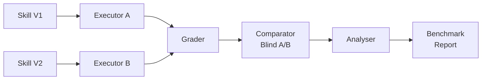
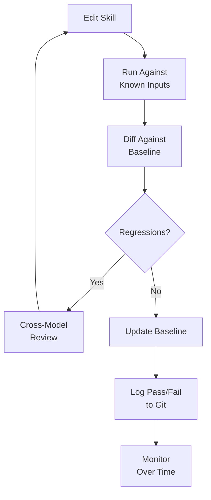

# Skill Creator V2 and Codex CLI: Scientific Skill Improvement Without the Token Bill


---

Anthropic's Skill Creator V2 — available at [skills.sh](https://skills.sh/anthropics/skills/skill-creator) — promises scientific evaluation of agent skills[^1]. It launches parallel sub-agent executions, runs blind A/B comparisons between skill versions, and delivers percentage improvement scores. The Cisco software-security skill achieved a 1.78× improvement across 23 rule categories. The ElevenLabs text-to-speech skill scored 93% overall with a 1.32× improvement in agent success rate[^2].

Impressive numbers. But the question Alan Hemmings raised cuts straight to the point: is it worth paying $12–$15 in token usage to learn that your skill improved by 11.4%? For a personal formatting helper, that sounds like vanity metrics. For an enterprise skill automating 100 engineer-hours per month, it is a no-brainer.

This article examines how to apply the same scientific rigour to Codex CLI skills — without the token bill — and when the full evaluation spend is genuinely justified.

## How Skill Creator V2 Works Under the Hood

Skill Creator V2 operates through four composable sub-agents running in parallel[^3]:

1. **Executor** — runs skills against evaluation prompts in clean, isolated environments
2. **Grader** — evaluates outputs against defined expectations
3. **Comparator** — performs blind A/B comparisons between the old and new skill versions
4. **Analyser** — surfaces patterns that aggregate statistics might hide

For each evaluation prompt, two sub-agents run simultaneously — one with the original skill, one with the improved version — capturing timing and token usage independently[^1]. This parallel execution in isolated environments prevents context contamination that would skew sequential testing results.

The system outputs an interactive HTML viewer showing side-by-side comparisons, qualitative feedback, and benchmark metrics. In one documented example, a README Wizard skill improved from a benchmark score of 81 to 97.5 — a 15.7% improvement verified across four evaluation cases[^4].



## The Cost Problem

Each parallel execution spawns independent sub-agent runs with their own token counts[^3]. For a skill with 10 evaluation prompts, that is 20 sub-agent invocations per iteration — and most skills need multiple improvement iterations before the scores plateau. Three rounds of improvement against 10 prompts means 60 sub-agent runs.

The token economics are straightforward: at current Claude Opus 4.6 pricing, a single evaluation run processing substantial code context can cost $2–$5 in tokens. A full improve-evaluate-iterate cycle can easily reach $12–$15[^5].

For a personal skill that reformats imports or generates commit messages, this expenditure is difficult to justify. The skill works or it does not — you know within two manual tests.

## Codex CLI's Built-In Evaluation Framework

OpenAI shipped a lighter-weight evaluation framework for Codex CLI skills in January 2026[^6]. It does not match Skill Creator V2's sophistication, but it covers the critical path at a fraction of the cost.

### The Eval Structure

An evaluation in Codex CLI has four components[^6]:

- **Outcome goals** — did the task complete correctly?
- **Process goals** — did the agent invoke the skill and follow the intended steps?
- **Style goals** — does the output follow the conventions specified?
- **Efficiency goals** — did the agent avoid thrashing (unnecessary commands, excessive token usage)?

### Running Evals with `codex exec`

The `codex exec` command provides the foundation for automated skill testing[^6]:

```bash
# Capture a structured JSONL trace of a skill execution
codex exec --json --full-auto "Apply the migration-checker skill to this project"

# Constrain output to a schema for deterministic grading
codex exec --output-schema ./eval-schema.json -o ./result.json "Run lint-fixer on src/"
```

The JSONL trace captures every command execution event, file creation, and tool invocation — enough to write deterministic checks against process goals without any model-assisted grading.

### Building a Benchmark Dataset

OpenAI recommends starting with 10–20 prompts in CSV format[^6]:

```csv
prompt,should_trigger,expected_output_contains
"Run the migration checker on this Django project",true,"migration"
"What's the weather like?",false,""
"Check for missing migrations in the models directory",true,"migration"
```

Include explicit invocations, implicit invocations (no skill name), contextual prompts, and negative controls. This dataset becomes your regression suite.

## The Low-Cost Alternative: Three Patterns for Codex CLI

Rather than paying for parallel sub-agent evaluation, Codex CLI's architecture enables three patterns that deliver scientific skill improvement at minimal cost.

### Pattern 1: Diff-Based Output Tracking

Run the skill against a known input set and diff the outputs against a baseline:

```bash
#!/bin/bash
# eval-skill.sh — lightweight skill evaluation
SKILL_DIR=".agents/skills/migration-checker"
EVAL_DIR="$SKILL_DIR/evals"
BASELINE_DIR="$EVAL_DIR/baseline"
RESULTS_DIR="$EVAL_DIR/results/$(date +%Y%m%d-%H%M%S)"

mkdir -p "$RESULTS_DIR"

for prompt_file in "$EVAL_DIR"/prompts/*.txt; do
    prompt=$(cat "$prompt_file")
    name=$(basename "$prompt_file" .txt)
    codex exec --json --full-auto "$prompt" > "$RESULTS_DIR/$name.jsonl" 2>&1
done

# Compare against baseline
diff -r "$BASELINE_DIR" "$RESULTS_DIR" > "$RESULTS_DIR/diff-report.txt"
echo "Differences from baseline: $(grep -c '^[<>]' "$RESULTS_DIR/diff-report.txt") lines"
```

Cost: one `codex exec` invocation per prompt. No parallel duplication, no grading sub-agents.

### Pattern 2: Cross-Model Review Loops

Use Codex CLI's `review_model` configuration to set up a cheaper model as reviewer[^7]:

```toml
# .codex/config.toml
model = "gpt-5.3-codex"
review_model = "o4-mini"
```

The workflow: GPT-5.3-Codex writes the skill output, then o4-mini reviews it via `/review`. This is not blind A/B comparison, but it catches regressions, style violations, and logic errors at a fraction of the cost of spawning parallel Opus 4.6 sub-agents.

For skill development specifically, you can formalise this as a subagent workflow:

```toml
# .codex/agents/skill-reviewer.toml
[agent]
name = "skill-reviewer"
model = "o4-mini"
instructions = """
Review the output of the skill execution against these criteria:
1. Did the skill produce the expected file changes?
2. Were unnecessary commands executed?
3. Does the output follow project conventions?
Rate each criterion pass/fail with a one-line justification.
"""
```

### Pattern 3: Git-Based Pass/Fail Logging

Track skill effectiveness over time with git history and a structured log:

```bash
# After each skill execution, log the result
echo "$(date -Iseconds),migration-checker,PASS,14s,2847tok" >> .codex/skill-eval.log
```

Over weeks, this log reveals degradation patterns that no single evaluation run can surface. A skill that passes 95% of the time in March but drops to 80% in April tells you something changed — in the model, the codebase, or the skill itself.



## When the Full Spend Is Worth It

The corporate-versus-personal divide is not about skill complexity — it is about blast radius.

Alan's example is instructive: a skill that "creates the Jira ticket from an approved template, reads Confluence and ADRs, then delivers the ticket" touches multiple external systems, parses semi-structured data, and produces artefacts that humans act on immediately[^5]. A 15% improvement in that skill's accuracy means fewer incorrect Jira tickets, fewer confused engineers, and fewer manual corrections. At 100 engineer-hours per month, even a $15 evaluation run pays for itself within a single execution.

The decision framework:

| Criterion | Low-cost eval sufficient | Full parallel eval justified |
|---|---|---|
| **Blast radius** | Personal workflow | Team/org-wide automation |
| **Failure mode** | Cosmetic (formatting, style) | Functional (wrong data, missed steps) |
| **Execution frequency** | Ad hoc | Scheduled/CI pipeline |
| **Downstream consumers** | Just you | Other engineers, external systems |
| **Cost per failure** | Minutes to fix | Hours to diagnose and correct |

## Codex CLI's Architectural Advantage

Codex CLI's TOML-based agent definitions make skill composition inherently testable without external tooling[^8]. Each subagent is a discrete, addressable unit with explicit inputs, outputs, and permissions. You can test a subagent in isolation by invoking it directly:

```bash
# Test a specific subagent in isolation
codex exec --agent skill-reviewer --full-auto "Review this migration output"
```

Compare this with monolithic skill definitions where the evaluation tool must understand the entire skill's internal logic to test it meaningfully. Codex CLI's decomposition means you can evaluate each component independently, identify which subagent is underperforming, and improve it in isolation — all without parallel A/B infrastructure.

The `review_model` configuration key is the simplest entry point[^7]. Set it to a different model from your primary, and every `/review` invocation becomes a cross-model check. It is not as rigorous as Skill Creator V2's blind comparison, but it is free (within your existing subscription) and catches the majority of regressions that matter in practice.

## The Pragmatic Middle Ground

Scientific skill improvement does not require scientific infrastructure. For most Codex CLI users, the combination of diff-based output tracking, cross-model review via `review_model`, and a simple pass/fail log in git provides sufficient rigour to catch regressions and measure improvements over time.

Reserve the full parallel evaluation spend — whether through Skill Creator V2 or a custom multi-agent benchmark harness — for skills where the cost of failure justifies the cost of measurement. A $15 evaluation is not a vanity metric when the skill it improves saves $15,000 per month.

The goal is not to eliminate evaluation cost. It is to match the evaluation investment to the skill's impact.

## Citations

[^1]: Anthropic, "Skill Creator," skills.sh, 2026. [https://skills.sh/anthropics/skills/skill-creator](https://skills.sh/anthropics/skills/skill-creator)
[^2]: Tessl, "Anthropic brings evals to skill-creator. Here's why that's a big deal," tessl.io, March 2026. [https://tessl.io/blog/anthropic-brings-evals-to-skill-creator-heres-why-thats-a-big-deal/](https://tessl.io/blog/anthropic-brings-evals-to-skill-creator-heres-why-thats-a-big-deal/)
[^3]: The Tool Nerd, "Anthropic Skill Creator 2.0 Update: Evals, Benchmarks, and Multi-Agent Testing Explained," thetoolnerd.com, 2026. [https://www.thetoolnerd.com/p/anthropic-skill-creator-20-update](https://www.thetoolnerd.com/p/anthropic-skill-creator-20-update)
[^4]: Debbie O'Brien, "I Used Skill Creator v2 to Improve One of My Agent Skills in VS Code," DEV Community, 2026. [https://dev.to/debs_obrien/i-used-skill-creator-v2-to-improve-one-of-my-agent-skills-in-vs-code-fhd](https://dev.to/debs_obrien/i-used-skill-creator-v2-to-improve-one-of-my-agent-skills-in-vs-code-fhd)
[^5]: Alan Hemmings, discussion on skill evaluation economics and enterprise skill automation, 2026. ⚠️ Source from verbal discussion; no permanent URL available.
[^6]: OpenAI, "Testing Agent Skills Systematically with Evals," OpenAI Developers Blog, January 2026. [https://developers.openai.com/blog/eval-skills](https://developers.openai.com/blog/eval-skills)
[^7]: OpenAI, "Configuration Reference — Codex," OpenAI Developers, 2026. [https://developers.openai.com/codex/config-reference](https://developers.openai.com/codex/config-reference)
[^8]: OpenAI, "Subagents — Codex," OpenAI Developers, 2026. [https://developers.openai.com/codex/subagents](https://developers.openai.com/codex/subagents)
