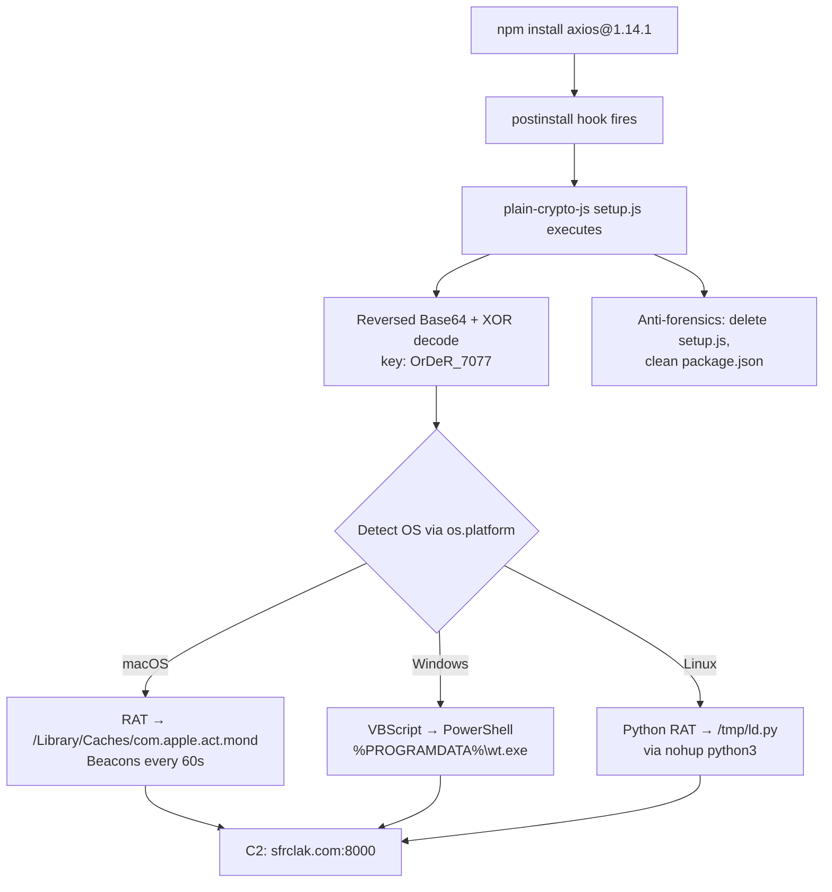

# The Source Map Incident: Lessons in Supply Chain Security for Codex CLI Plugin Authors


March 31, 2026 was a brutal day for npm ecosystem trust. Two major incidents — one accidental, one malicious — landed within hours of each other, exposing structural weaknesses that every Codex CLI plugin and skill author needs to understand. This article dissects both incidents, extracts the lessons, and provides a concrete hardening checklist for anyone publishing npm packages in the Codex ecosystem.

## The Claude Code Source Map Leak

Security researcher Chaofan Shou discovered that version 2.1.88 of the `@anthropic-ai/claude-code` npm package contained a 59.8 MB `.map` file — a JavaScript source map intended for internal debugging[^1]. This file referenced the complete, unobfuscated TypeScript source hosted on Anthropic's R2 cloud storage bucket, making the entire 512,000-line codebase directly downloadable as a ZIP archive[^2].

The root cause was mundane: Claude Code uses the Bun runtime, which **generates source maps by default** unless explicitly disabled[^3]. The build pipeline failed to exclude `.map` files from the published package. Anthropic characterised it as "a release packaging issue caused by human error, not a security breach"[^4], though this was reportedly not the first time — earlier 2025 versions also shipped source maps before being pulled[^2].

### What the Leak Revealed

The archived codebase exposed internal architecture, unreleased feature flags, model codenames, and the multi-agent orchestration system[^5]. More critically for supply chain security, it revealed **internal dependency names** that were unregistered on the public npm registry.

### The Typosquatting Campaign

Within hours, an npm user (`pacifier136`) registered packages matching Claude Code's internal dependency names: `audio-capture-napi`, `color-diff-napi`, `image-processor-napi`, `modifiers-napi`, and `url-handler-napi`[^6]. These were empty stubs — `module.exports = {}` — but the playbook is well-established: squat the name, wait for downloads, then push a malicious update that hits everyone who installed it[^6]. This is a textbook **dependency confusion attack**, where internal package names collide with public registry names.

## The Axios Supply Chain Attack

The same day, a North Korean threat actor (attributed as Sapphire Sleet by Microsoft[^7] and UNC1069 by Google[^8]) compromised the npm account of axios maintainer `@jasonsaayman` and published two malicious versions: `axios@1.14.1` and `axios@0.30.4`[^9].

Both versions injected a dependency on `plain-crypto-js@4.2.1`, which executed a two-layer obfuscated dropper via a `postinstall` hook[^9]:



The exposure window was roughly three hours (00:21–03:29 UTC)[^9]. Axios has over 70 million weekly downloads[^10], making this one of the highest-impact npm compromises to date.

## Why Codex CLI Plugin Authors Should Care

These incidents are not abstract concerns for the Codex ecosystem. Codex CLI's open-source architecture encourages community plugins and skills distributed via npm. The attack surface is real:

1. **AI agents auto-resolve dependencies.** When Codex CLI or any agentic tool runs `npm install`, it pulls the entire dependency tree without human review. Oligo Security documented how loose version specifications (e.g., `"debug": "^4"`) in agent toolchains automatically resolved to poisoned releases[^11].

2. **Postinstall hooks are the primary execution vector.** The axios attack used `postinstall` to execute arbitrary code at install time. Any Codex plugin with transitive dependencies is exposed to this vector.

3. **Codex CLI's own history includes a config injection vulnerability.** Check Point Research disclosed in 2025 that an attacker who could commit a `.env` and `.codex/config.toml` to a repository could trigger arbitrary command execution when a developer ran Codex[^12]. Supply chain attacks can target the tool itself, not just its dependencies.

## The Bun Source Map Trap

Codex CLI plugin authors using Bun as their build toolchain need to be particularly vigilant. Bun's default behaviour generates source maps unless explicitly disabled[^3]. There are additional pitfalls:

- **CLI vs API inconsistency**: In Bun 1.2, `bun build --sourcemap` defaults to linked sourcemaps, but `Bun.build()` with `sourcemap: true` still produces inline maps[^13]. If your CI uses the CLI but local tooling uses the API, you may ship different artefacts without realising it.
- **Production mode bug**: An open issue (oven-sh/bun#28001) reports that Bun creates source maps in production mode even when documentation says they should be disabled[^14].

The fix is explicit: **always pass `--no-sourcemap` in your build command** rather than relying on defaults.

## Hardening Checklist for Codex CLI Plugin Authors

### 1. Use the `files` Allowlist in `package.json`

The `files` field acts as an explicit allowlist — mathematically harder to accidentally expose sensitive files than a denylist approach[^15]:

```json
{
  "name": "my-codex-plugin",
  "files": [
    "dist/**/*.js",
    "dist/**/*.d.ts",
    "README.md",
    "LICENSE"
  ]
}
```

### 2. Maintain a Belt-and-Braces `.npmignore`

Even with a `files` allowlist, add an `.npmignore` as defence in depth:

```text
# Source maps
*.map
*.js.map

# Source code
src/
tsconfig*.json

# Development files
.env*
.codex/
*.test.*
__tests__/
coverage/
.github/
```

### 3. Audit Every Release with `npm pack --dry-run`

Add this to your CI pipeline as a mandatory gate:

```bash
# Fail the build if any .map files would be published
npm pack --dry-run 2>&1 | grep -E '\.map$' && \
  echo "ERROR: Source maps detected in package" && exit 1

# Or audit the full file list
npm pack --dry-run 2>&1 | tee /dev/stderr | \
  wc -l | xargs -I {} echo "Package contains {} files"
```

### 4. Disable Postinstall Hooks in CI

Prevent supply chain attacks from executing during dependency installation:

```bash
npm ci --ignore-scripts
```

If specific packages genuinely need lifecycle scripts, use npm's `--allow-scripts` flag or configure `.npmrc`:

```toml
ignore-scripts=true
```

### 5. Pin Dependencies and Commit Lockfiles

Never use range specifiers for production dependencies in plugins:

```json
{
  "dependencies": {
    "axios": "1.14.0"
  }
}
```

Commit `package-lock.json` and use `npm ci` (not `npm install`) in CI to ensure reproducible builds[^7].

### 6. Register Your Internal Package Names

If your Codex plugin uses workspace packages or internal dependencies, **register those names on the public npm registry** as empty placeholders. The Claude Code leak demonstrated that unregistered internal names are immediately vulnerable to dependency confusion squatting[^6].

### 7. Disable Source Maps in Production Builds

For Bun:

```bash
bun build --no-sourcemap src/index.ts --outdir dist
```

For esbuild:

```bash
esbuild src/index.ts --bundle --sourcemap=false --outdir=dist
```

For TypeScript compiler:

```json
{
  "compilerOptions": {
    "sourceMap": false,
    "declarationMap": false
  }
}
```

## Why Codex CLI's Open-Source Model Helps

One silver lining: Codex CLI's fully open-source codebase[^16] is inherently more auditable than closed-source alternatives. There is no source map to leak because the source is already public. Community contributors can audit the dependency tree, review build configurations, and flag issues before they reach production. The Axios attack was detected by automated scanners within six minutes of publication[^9] — the kind of rapid response that an engaged open-source community enables.

That said, open-source is not immunity. The npm ecosystem's structural weaknesses — account compromise, postinstall execution, loose version resolution — apply regardless of licence. Defence in depth remains essential.

## Summary

The events of March 31, 2026 demonstrated two distinct failure modes: accidental exposure through build misconfiguration, and deliberate compromise through account takeover. Both are preventable with disciplined packaging practices. For Codex CLI plugin authors, the checklist above is not optional — it is the minimum standard for responsible npm publishing in an ecosystem where AI agents automatically install and execute your code.

## Citations

[^1]: [Anthropic Accidentally Exposes Claude Code Source via npm Source Map File — InfoQ](https://www.infoq.com/news/2026/04/claude-code-source-leak/)
[^2]: [Claude Code Source Leaked via npm Packaging Error — The Hacker News](https://thehackernews.com/2026/04/claude-code-tleaked-via-npm-packaging.html)
[^3]: [Bun Bundling's Sourcemap Traps — Medium](https://medium.com/@Nexumo_/bun-bundlings-sourcemap-traps-acc302bd8809)
[^4]: [Anthropic Employee Error Exposes Claude Code Source — InfoWorld](https://www.infoworld.com/article/4152856/anthropic-employee-error-exposes-claude-code-source.html)
[^5]: [Anthropic's Claude Code Leak Reveals Autonomous Agent Tools and Unreleased Models — CryptoBriefing](https://cryptobriefing.com/claude-code-leak-vulnerabilities/)
[^6]: [What the Claude Code Leak Tells Us About Supply Chain Security — Coder](https://coder.com/blog/what-the-claude-code-leak-tells-us-about-supply-chain-security)
[^7]: [Mitigating the Axios npm Supply Chain Compromise — Microsoft Security Blog](https://www.microsoft.com/en-us/security/blog/2026/04/01/mitigating-the-axios-npm-supply-chain-compromise/)
[^8]: [North Korea-Nexus Threat Actor Compromises Widely Used Axios NPM Package — Google Cloud Blog](https://cloud.google.com/blog/topics/threat-intelligence/north-korea-threat-actor-targets-axios-npm-package)
[^9]: [Axios npm Package Compromised: Supply Chain Attack Delivers Cross-Platform RAT — Snyk](https://snyk.io/blog/axios-npm-package-compromised-supply-chain-attack-delivers-cross-platform/)
[^10]: [Axios Supply Chain Attack Chops Away at npm Trust — Malwarebytes](https://www.malwarebytes.com/blog/news/2026/03/axios-supply-chain-attack-chops-away-at-npm-trust)
[^11]: [NPM Supply Chain Attacks: Hidden Risks for AI Agents — Oligo Security](https://www.oligo.security/blog/the-hidden-risks-of-the-npm-supply-chain-attacks-ai-agents)
[^12]: [OpenAI Codex CLI Vulnerability: Command Injection — Check Point Research](https://research.checkpoint.com/2025/openai-codex-cli-command-injection-vulnerability/)
[^13]: [Source Map Incorrectly Served in Production — oven-sh/bun#28001](https://github.com/oven-sh/bun/issues/28001)
[^14]: [Bun Bundling's Sourcemap Traps — Medium](https://medium.com/@Nexumo_/bun-bundlings-sourcemap-traps-acc302bd8809)
[^15]: [The Complete Guide to package.json Files Property — CopyProgramming](https://copyprogramming.com/howto/is-the-files-property-necessary-in-package-json)
[^16]: [GitHub — openai/codex: Lightweight Coding Agent That Runs in Your Terminal](https://github.com/openai/codex)
