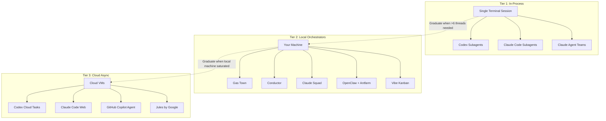
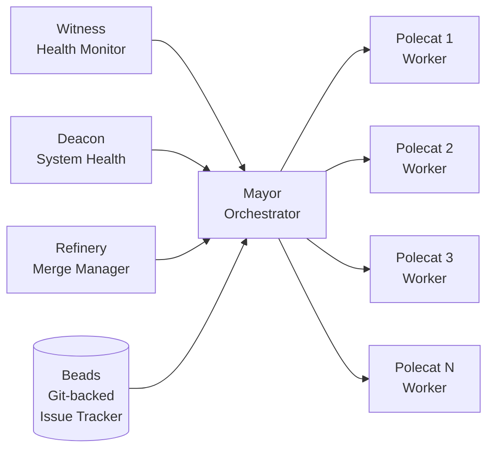
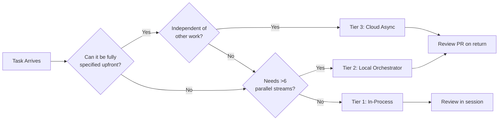

# The Three-Tier Agent Orchestration Landscape: In-Process, Local and Cloud


---

Running a single coding agent is yesterday's problem. The 2026 challenge is orchestrating fleets of them — choosing the right coordination model for each task, managing isolation, and keeping verification costs under control. Addy Osmani's three-tier framework, presented at O'Reilly CodeCon in March 2026[^1], provides the clearest mental model for navigating this landscape. This article examines each tier through the lens of Codex CLI, mapping where it fits today and where the boundaries blur.

## The Framework: Three Tiers of Agent Coordination

Every multi-agent coding tool in 2026 slots into one of three tiers based on where agents run, how they communicate, and how much human oversight they require[^2].



The tiers are not mutually exclusive. Most teams in 2026 use all three — Tier 1 for interactive work, Tier 2 for parallel sprints, and Tier 3 to drain the backlog overnight[^2].

## Tier 1: In-Process Subagents and Teams

In-process agents share a single terminal session. No extra infrastructure, no separate processes — just the orchestrator spawning child agents within its own runtime.

### Codex CLI Subagents

Codex CLI's subagent system is configured via `config.toml`[^3]:

```toml
[agents]
max_threads = 6
max_depth = 1
job_max_runtime_seconds = 1800
```

Three built-in agent types ship out of the box — `default` (general purpose), `worker` (execution-focused), and `explorer` (read-heavy codebase navigation)[^3]. Custom agents live as TOML files under `~/.codex/agents/` or `.codex/agents/`:

```toml
name = "security_reviewer"
description = "Reviews code changes for security vulnerabilities"
developer_instructions = "Focus on injection, auth bypass, and data exposure patterns"
model_reasoning_effort = "high"
sandbox_mode = "read-only"
```

The `max_depth = 1` default is deliberate. The documentation explicitly warns that raising it "can turn broad delegation instructions into repeated fan-out, which increases token usage, latency, and local resource consumption"[^3]. The cap of six concurrent threads keeps resource consumption predictable on a single machine.

For batch operations, the experimental `spawn_agents_on_csv` tool processes tabular inputs in parallel — each row spawns a worker that must call `report_agent_job_result` exactly once[^3].

### Claude Code Agent Teams

Claude's approach differs architecturally. Agent Teams coordinate multiple Claude Code instances with a shared task list (typically `TASKS.md`), where one session acts as team lead whilst teammates work independently[^4]. Unlike Codex's parent-child model, Claude teammates communicate peer-to-peer via a mailbox system using `SendMessage`[^4].

The key distinction: Codex subagents are ephemeral workers that report back to a parent; Claude Agent Teams are persistent peers that share findings and coordinate autonomously[^4].

### When Tier 1 Is Enough

Tier 1 handles the majority of multi-agent work: parallel test generation, codebase exploration with multiple explorer agents, multi-step feature implementation with plan-then-execute patterns. If your task decomposes into six or fewer parallel streams and fits within a single session's context, there is no reason to reach for heavier tooling.

## Tier 2: Local Orchestrators

When six threads are not enough — or when tasks span hours rather than minutes — Tier 2 tools spawn multiple agent processes on your machine, each in its own isolated environment.

### The Git Worktree Pattern

The foundational isolation mechanism across Tier 2 is the git worktree[^5]. Each agent gets its own working directory sharing the same `.git` object database:

```bash
git worktree add ../feature-auth feature/auth
git worktree add ../feature-api feature/api
git worktree add ../feature-ui feature/ui
```

This provides genuine parallelism — three agents working on three features at full speed with no merge conflicts during execution[^5]. Claude Code added native worktree support in February 2026 with the `--worktree` flag, and Codex subagents support `isolation: worktree` in agent frontmatter[^5][^6].

### Gas Town: The Heavy Swarm

Steve Yegge's Gas Town represents the upper bound of Tier 2 ambition — a Go-based orchestrator running 20–30 Claude Code instances in parallel[^7]. The architecture uses operational roles rather than hierarchical management:



The Mayor distributes tasks from Beads (a git-backed issue tracker), Polecats execute in parallel worktrees, and the Witness and Deacon monitor system health[^7]. The cost is real — Yegge has documented token burn rates around $100/hour at full capacity[^8].

### Other Tier 2 Tools

The Tier 2 landscape also includes Conductor (visual orchestration with approval gates), Vibe Kanban (kanban-style task assignment to agents), Claude Squad (lightweight multi-session coordination), OpenClaw + Antfarm (managed local swarms), and Antigravity and Cursor Background Agents[^2]. Each makes different trade-offs between automation and human control.

## Tier 3: Cloud Async Agents

Tier 3 is the "fire-and-forget" model: assign a task, close your laptop, return to a pull request[^2].

### Codex Cloud Tasks

Codex CLI bridges Tiers 1 and 3. Locally, it operates as a Tier 1 in-process agent. But `codex cloud` tasks run in OpenAI-managed containers — your repo is cloned into an isolated sandbox, the agent writes code, runs tests, and creates a PR without touching your local machine[^9].

```bash
# Submit tasks and walk away
codex cloud "Add input validation to the user registration endpoint"
codex cloud "Write unit tests for the payment processing module"
codex cloud "Refactor the logging middleware to use structured output"

# Check results later
codex cloud list
codex apply <TASK_ID>
```

Each task gets its own container with the repo pre-loaded. Front-end tasks now include screenshots of the rendered UI for review without checking out the branch locally[^9]. The sweet spot is well-defined, independent tasks — test generation, documentation updates, routine refactoring — where the agent will not need human judgement mid-execution[^9].

### The Cloud Tier Landscape

Claude Code Web provides a similar cloud-hosted experience for Anthropic's stack. GitHub Copilot Coding Agent runs as a cloud agent triggered from issues or PRs. Jules by Google targets the same fire-and-forget pattern[^2]. The common thread: all assume tasks can be fully specified upfront, which constrains their applicability to well-scoped work.

## The Architectural Principles That Cross All Tiers

Osmani identifies five principles that apply regardless of which tier you are operating in[^2]:

### 1. Plan Approval Gates

"Require teammates to write a plan before they start coding. The lead reviews the approach and approves or rejects."[^2] This catches architectural misalignment before implementation begins, saving both tokens and developer time.

### 2. AGENTS.md as Institutional Memory

The `AGENTS.md` file captures patterns, conventions, and gotchas. Critically, Osmani warns: "Never let an agent write to AGENTS.md directly. The lead must approve every line."[^2] Research shows that LLM-generated `AGENTS.md` files reduce agent success rates by approximately 3% compared to human-curated versions[^2].

### 3. File Locking via Git Worktrees

No two agents should edit the same file simultaneously. Worktrees provide natural isolation, and explicit file ownership assignments prevent conflicts during the merge phase[^2][^5].

### 4. Kill Criteria

"If an agent is stuck for 3+ iterations on the same error, stop and reassign to a fresh agent."[^2] Token budgets enforce hard limits per agent, preventing runaway costs from stuck workers.

### 5. Verification as the Bottleneck

"The bottleneck is no longer generation. It's verification."[^2] Agents produce output at extraordinary speed, but determining correctness remains the human constraint. This is the fundamental reason Tier 3 is limited to well-scoped tasks — verification cost scales with task ambiguity.



## Where Codex CLI Sits Across the Tiers

Codex CLI is unusual in spanning two tiers natively. Its subagent system operates at Tier 1 (in-process, up to six threads, single session), whilst `codex cloud` operates at Tier 3 (fire-and-forget, cloud-hosted containers)[^3][^9]. For Tier 2, users must reach for external orchestration — GNU parallel driving multiple `codex exec` processes, OpenClaw for managed swarms, or custom TypeScript SDK orchestrators using `runStreamed()`[^10].

This dual positioning is a genuine architectural advantage. A developer can prototype a multi-agent workflow interactively at Tier 1, then promote well-understood tasks to Tier 3 cloud tasks for overnight processing — all within the same tool.

## Decision Framework: Which Tier for Which Task

| Criterion | Tier 1 | Tier 2 | Tier 3 |
|---|---|---|---|
| **Parallel agents** | ≤6 | 3–30 | Unlimited |
| **Session duration** | Minutes | Hours | Hours to overnight |
| **Human oversight** | Continuous | Dashboard/periodic | Post-hoc PR review |
| **Isolation model** | Shared sandbox | Git worktrees | Cloud containers |
| **Setup cost** | Zero | Moderate | Zero (managed) |
| **Best for** | Exploration, focused features | Large refactors, parallel sprints | Backlog drainage, CI-like tasks |
| **Codex CLI support** | Native subagents | External tooling needed | Native cloud tasks |

## The Convergence Thesis

The three tiers are converging. Claude Code's Agent Teams blur the line between Tier 1 and Tier 2 — they run in-process but coordinate like local orchestrators. Codex Cloud tasks blur Tier 2 and Tier 3 — cloud-hosted but with local CLI management. Gas Town's v1.0 release in April 2026 is adding cloud worker support, pushing a Tier 2 tool into Tier 3 territory[^11].

The likely endpoint: a single orchestration layer that transparently places agents at the right tier based on task characteristics, resource availability, and cost constraints. We are not there yet, but the building blocks — MCP for tool interop, A2A for agent coordination, git worktrees for isolation — are all in place.

For now, understanding the three tiers gives you a practical framework for choosing the right level of orchestration for each task, rather than over-engineering with a cloud swarm when six in-process subagents would do the job.

---

## Citations

[^1]: Osmani, A. (2026). "Orchestrating Coding Agents." O'Reilly CodeCon, March 2026. [https://talks.addy.ie/oreilly-codecon-march-2026/](https://talks.addy.ie/oreilly-codecon-march-2026/)

[^2]: Osmani, A. (2026). "The Code Agent Orchestra — What Makes Multi-Agent Coding Work." AddyOsmani.com. [https://addyosmani.com/blog/code-agent-orchestra/](https://addyosmani.com/blog/code-agent-orchestra/)

[^3]: OpenAI. (2026). "Subagents – Codex CLI." OpenAI Developers. [https://developers.openai.com/codex/subagents](https://developers.openai.com/codex/subagents)

[^4]: Anthropic. (2026). "Orchestrate Teams of Claude Code Sessions." Claude Code Docs. [https://code.claude.com/docs/en/agent-teams](https://code.claude.com/docs/en/agent-teams)

[^5]: Upsun Developer Center. (2026). "Git Worktrees for Parallel AI Coding Agents." [https://devcenter.upsun.com/posts/git-worktrees-for-parallel-ai-coding-agents/](https://devcenter.upsun.com/posts/git-worktrees-for-parallel-ai-coding-agents/)

[^6]: BSWEN. (2026). "What is Worktree Isolation in AI Agents?" [https://docs.bswen.com/blog/2026-03-18-ai-agent-worktree-isolation/](https://docs.bswen.com/blog/2026-03-18-ai-agent-worktree-isolation/)

[^7]: Yegge, S. (2026). "Welcome to Gas Town." Medium. [https://steve-yegge.medium.com/welcome-to-gas-town-4f25ee16dd04](https://steve-yegge.medium.com/welcome-to-gas-town-4f25ee16dd04)

[^8]: Yegge, S. (2026). "Gas Town: From Clown Show to v1.0." Medium. [https://steve-yegge.medium.com/gas-town-from-clown-show-to-v1-0-c239d9a407ec](https://steve-yegge.medium.com/gas-town-from-clown-show-to-v1-0-c239d9a407ec)

[^9]: OpenAI. (2026). "Web – Codex Cloud Tasks." OpenAI Developers. [https://developers.openai.com/codex/cloud](https://developers.openai.com/codex/cloud)

[^10]: OpenAI. (2026). "Use Codex with the Agents SDK." OpenAI Developers. [https://developers.openai.com/codex/guides/agents-sdk](https://developers.openai.com/codex/guides/agents-sdk)

[^11]: Yegge, S. (2026). "Welcome to the Wasteland: A Thousand Gas Towns." Medium. [https://steve-yegge.medium.com/welcome-to-the-wasteland-a-thousand-gas-towns-a5eb9bc8dc1f](https://steve-yegge.medium.com/welcome-to-the-wasteland-a-thousand-gas-towns-a5eb9bc8dc1f)
