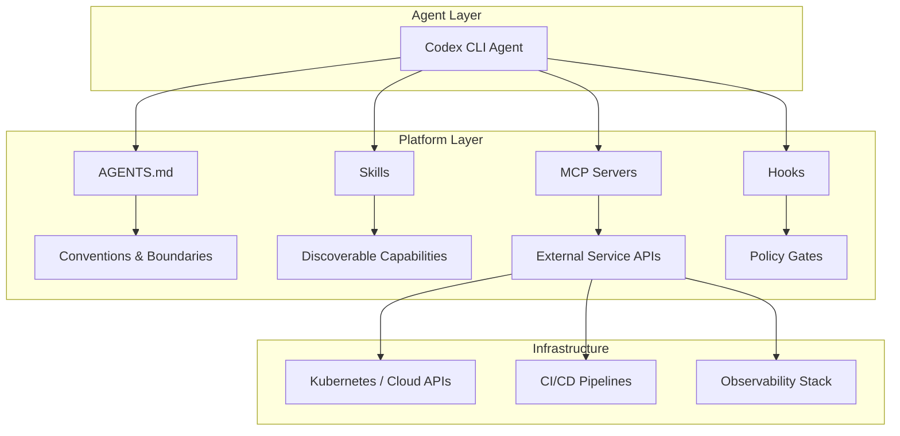
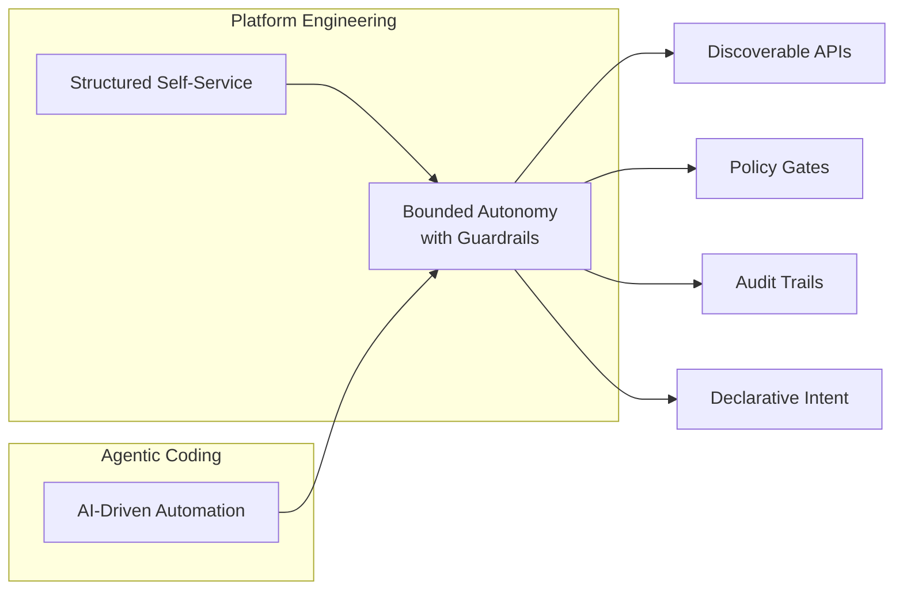

# Agents Can Only Move as Fast as Their Platform: What KubeCon 2026 Means for Codex CLI


---

At KubeCon EU 2026 in Amsterdam, Whitney Lee (Datadog) and Viktor Farcic (Upbound) delivered "Choose Your Own Adventure: AI Meets Internal Developer Platform" — an interactive session where audience votes drove an AI agent through real infrastructure decisions[^1]. The thesis was deceptively simple: **an AI agent is only as capable as the platform APIs it can reach**. Strip away the structured interfaces, and the agent is reduced to guessing at shell commands.

That thesis maps directly onto how Codex CLI works — and, more importantly, onto why it sometimes doesn't.

## The KubeCon Keynote Thesis

Whitney and Viktor's "Choose Your Own Adventure" format has been a KubeCon staple since 2022[^2]. The 2026 edition introduced an AI agent as a third participant: the audience voted on a goal, and the agent attempted to achieve it by interacting with an internal developer platform built on Crossplane.

The key moment came when the agent was pointed at a cluster without Crossplane compositions — just raw Kubernetes primitives. It floundered, generating plausible-looking but incorrect `kubectl apply` commands. When pointed at the same cluster *with* a well-designed control plane exposing custom APIs, it discovered available resource types via the Kubernetes API, inspected status fields, and self-served infrastructure correctly[^3].

The lesson was visceral: an agent without structured APIs is just autocomplete with ambition.

## Why Agents Need Platforms

The Crossplane team articulated this formally two days before KubeCon in their "API-First Infrastructure" post: AI agents require "a unified, structured, machine-readable interface with explicit governance rules, readable historical patterns, and discoverable dependencies"[^4]. Without that structure, autonomy stalls.

This aligns with the broader 2026 consensus in platform engineering. The New Stack reported that mature platforms now treat agents as first-class user personas — complete with RBAC permissions, resource quotas, and governance policies[^5]. The pattern is called "bounded autonomy": give agents clear operational limits, mandatory escalation paths, and comprehensive audit trails.

The implication for developer tooling is stark. An agent calling `kubectl apply` blindly is fundamentally different from one that:

1. Discovers available Crossplane compositions via the API
2. Validates intent against OPA/Kyverno policies before execution
3. Self-serves through a well-designed control plane with guardrails

The first is dangerous. The second is useful.

## Codex CLI as Platform Interface

Codex CLI's architecture already implements the same structural pattern Whitney and Viktor demonstrated — just at a different layer.



**AGENTS.md as the control plane contract.** Just as Crossplane compositions define what a platform offers, AGENTS.md defines what the agent should know about the repository: key commands, architecture, conventions, and boundaries[^6]. Codex merges AGENTS.md files from the repo root down to the current folder, creating a layered configuration analogous to how Crossplane XRDs compose into higher-level abstractions.

**Skills as discoverable capabilities.** Codex CLI skills use progressive disclosure — the agent starts with metadata (name, description, file path) and loads full SKILL.md instructions only when it decides to use a skill[^7]. This mirrors how an agent discovers Crossplane compositions: it enumerates what's available, then engages with what's relevant. A Codex CLI plugin *is* an internal developer platform interface.

**MCP servers as platform APIs.** This is where the convergence becomes concrete. Codex CLI connects to external services via MCP servers configured in `config.toml`[^8]:

```toml
[mcp_servers.kubernetes]
command = "npx"
args = ["-y", "@containers/kubernetes-mcp-server"]
startup_timeout_sec = 30
tool_timeout_sec = 60

[mcp_servers.backstage]
url = "https://backstage.internal.company.com/mcp"
bearer_token_env_var = "BACKSTAGE_TOKEN"
```

With a Kubernetes MCP server connected, Codex CLI gains the same capability Whitney and Viktor demonstrated: it can discover resource types, inspect status fields, watch for change events, and submit declarative intent — all through the Kubernetes API rather than guessing at `kubectl` flags[^9].

## Guardrails Mirror Platform Policies

The parallel between Codex CLI's approval modes and Kubernetes policy engines is exact:

| Platform Concept | Kubernetes | Codex CLI |
|---|---|---|
| Admission control | OPA Gatekeeper / Kyverno | Hooks (pre-commit, approval-mode) |
| Policy language | Rego / YAML | `codex-hooks.toml` |
| Escalation | Deny + audit log | Escalate to human review |
| Sandbox boundary | Pod security standards | `workspace-write` / `danger-full-access` |

OPA Gatekeeper and Kyverno act as dynamic admission controllers — they intercept API requests and enforce policy before anything touches the cluster[^10]. Codex CLI hooks serve the identical function: they intercept agent actions (file writes, command execution) and enforce policy before anything touches the codebase.

The "bounded autonomy" pattern emerging in platform engineering[^5] maps directly to Codex CLI's approval modes. The `workspace-write` sandbox is the equivalent of a restrictive PodSecurityStandard — the agent can operate within defined boundaries but cannot break out. Hooks that escalate risky file patterns (e.g., `infra/`, `secrets/`) to human review mirror Kyverno's ability to enforce "Safe Mode" remediation where agents can restart pods but policies mathematically prevent deletion[^10].

## The Convergence

Platform engineering and agentic coding are solving the same problem from different directions:



Both converge on the same architectural primitives: discoverable APIs, policy gates, audit trails, and declarative intent over imperative commands. The Crossplane blog put it directly: "AI needs APIs, not UIs, and most platforms still aren't built that way"[^4].

Whitney's observation that "agents amplify what's good and bad in your ecosystem" applies directly to AGENTS.md quality. A poorly written AGENTS.md is the equivalent of a platform with no API abstractions — the agent will improvise, and improvisation at scale is a liability. A well-structured AGENTS.md with clear conventions, explicit boundaries, and discoverable skills is the equivalent of a Crossplane-backed control plane: the agent operates within defined rails and produces predictable results.

## Practical Implications

**If you're a platform engineer** adopting Codex CLI, you already understand the patterns. Your Crossplane compositions map to skills. Your OPA policies map to hooks. Your Backstage service catalogue maps to MCP server integrations. The mental model transfers directly.

**If you're a developer** using Codex CLI without platform engineering background, the KubeCon thesis still applies: invest in your AGENTS.md and skills before scaling up agent usage. An agent running against a bare repository with no AGENTS.md, no skills, and no MCP connections is the Whitney-and-Viktor demo without the control plane — it'll generate plausible output, but you'll spend more time reviewing and correcting than you saved.

**If you're building MCP servers** for enterprise services — Jira, Confluence, Datadog, ArgoCD — you're building platform APIs. Apply the same design principles Crossplane uses: declarative interfaces, explicit capability discovery, and policy enforcement at the boundary.

The 2026 DORA report found that nearly 90% of enterprises now have internal platforms, surpassing Gartner's prediction of 80% a full year early[^5]. As those platforms mature and AI agents become first-class consumers, the teams that treat AGENTS.md, skills, and MCP configurations with the same rigour as their Crossplane compositions will be the ones whose agents actually move fast.

---

## Citations

[^1]: KubeCon + CloudNativeCon Europe 2026 Schedule — "Choose Your Own Adventure: AI Meets Internal Developer Platform", Whitney Lee & Viktor Farcic, March 24 2026. <https://kccnceu2026.sched.com/company/Any>

[^2]: Upbound Resources — "Choose Your Own Adventure" series by Whitney Lee & Viktor Farcic. <https://resources.upbound.io/community-videos/choose-your-own-adventure-the-struggle-for-security-whitney-lee-vmware-viktor-farcic-upbound>

[^3]: CNCF Blog — "Crossplane and AI: The case for API-first infrastructure", March 20 2026. <https://www.cncf.io/blog/2026/03/20/crossplane-and-ai-the-case-for-api-first-infrastructure/>

[^4]: Crossplane Blog — "Crossplane & AI: The Case for API-First Infrastructure", 2026. <https://blog.crossplane.io/crossplane-ai-the-case-for-api-first-infrastructure/>

[^5]: The New Stack — "In 2026, AI Is Merging With Platform Engineering. Are You Ready?", 2026. <https://thenewstack.io/in-2026-ai-is-merging-with-platform-engineering-are-you-ready/>

[^6]: OpenAI Developers — "How to Set Up OpenAI Codex: AGENTS.md, MCP Servers, Skills, Config". <https://developers.openai.com/codex/cli>

[^7]: OpenAI Developers — "Agent Skills – Codex". <https://developers.openai.com/codex/skills>

[^8]: OpenAI Developers — "Model Context Protocol – Codex". <https://developers.openai.com/codex/mcp>

[^9]: GitHub — containers/kubernetes-mcp-server: Model Context Protocol server for Kubernetes and OpenShift. <https://github.com/containers/kubernetes-mcp-server>

[^10]: The New Stack — "Simplify Kubernetes Security With Kyverno and OPA Gatekeeper". <https://thenewstack.io/simplify-kubernetes-security-with-kyverno-and-opa-gatekeeper/>
