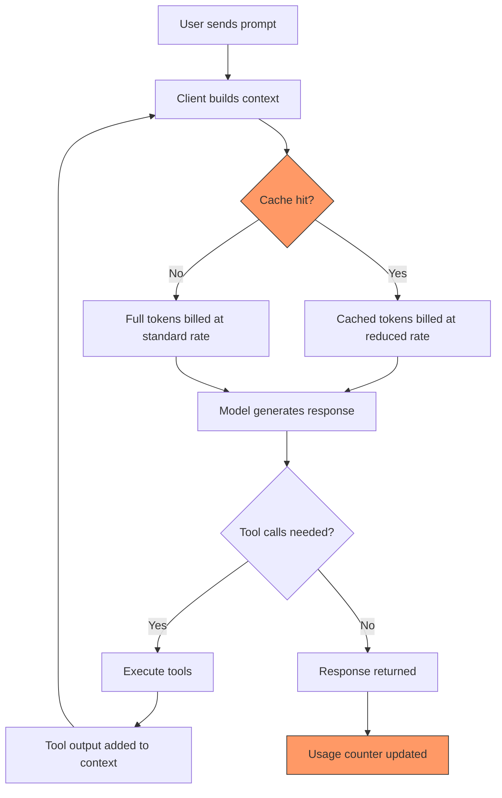
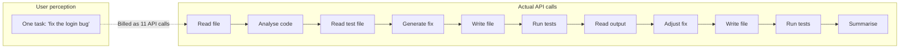

# Billing Transparency Crisis: Token Drain, Usage Limits, and the Trust Gap Across AI Coding Tools


---

## Introduction

In Q1 2026, the dominant user complaint across every major AI coding tool was the same: *my usage limits are draining far faster than expected*. OpenAI's Codex community forums logged 491 comments on token drain threads; Anthropic's Claude Code subreddit accumulated 478 comments on identical grievances[^1]. Windsurf's March pricing overhaul triggered immediate backlash from developers who relied on its flexible credit system[^2]. The pattern is unmistakable — billing transparency has become the competitive differentiator that none of the vendors anticipated.

This article dissects the token drain crisis across the three major AI coding CLIs, examines root causes, catalogues the emerging ecosystem of third-party tracking tools, and offers practical strategies for auditing and controlling spend.

## The Scale of the Problem

### Codex CLI: Metering Anomalies on Plus

OpenAI's Codex CLI users on Plus tier began reporting abnormal quota depletion in late 2025. A single prompt was consuming 7% of the weekly usage limit and 25% of the 5-hour rolling window[^3]. One user reported 97% of their weekly allowance gone after just three prompts[^3]. By March 2026, GitHub Issue #13186 documented a systematic metering anomaly: single-line configuration changes were consuming approximately 2% of the 5-hour quota — what previously lasted 2–3 days was now exhausted in 2–3 hours[^4].

OpenAI's Eric Traut responded that "we have not changed anything on the server side related to usage accounting or metering," suggesting users modify their usage patterns[^4]. The comment received 32 downvotes from community members experiencing identical problems simultaneously[^4].

Alexander Embiricos subsequently shipped two fixes in Codex CLI v0.21: improved cache hit rates to reduce token consumption, and corrected how the CLI counts usage[^5]. The implicit admission: the client *was* miscounting.

### Claude Code: The 10–20× Inflation Bug

Claude Code's crisis peaked in March 2026. A Reddit thread titled "20× max usage gone in 19 minutes" accumulated over 330 comments within 24 hours[^6]. A Claude Pro subscriber reported being maxed out every Monday with usable access only 12 days per month[^7]. A Max 5 plan user ($100/month) depleted their monthly allowance within one hour[^7].

The root causes were a confluence of three factors[^7]:

1. **Intentional peak-hours throttling** — weekday limits between 5am–11am PT / 1pm–7pm GMT were tightened, affecting approximately 7% of users
2. **Counter-desync bugs** — documented across multiple GitHub Issues
3. **Promotion expiry** — a March 2× off-peak promotion ended on 28 March, halving effective limits overnight

Most damaging was a user's claim, after reverse-engineering the Claude Code binary, of finding "two independent bugs that cause prompt cache to break, silently inflating costs by 10–20×"[^6]. Downgrading to version 2.1.34 showed measurable improvement, lending credibility to the report.

### Windsurf: From Credits to Quotas

Windsurf took a different path to the same destination. In March 2026, the company replaced its credit-based billing with daily and weekly usage quotas across Free ($0), Pro ($20), and a new Max ($200) tier[^2]. Credits had given users precision — they knew exactly what each model invocation cost (0.25 or 1.5 credits). The new system replaced this with abstract "usage" buckets marked with `$` and `$$$` symbols, with no clear mapping to actual token consumption[^8].

The backlash was immediate. Developers who had built workflows around predictable credit budgets found themselves unable to estimate whether a given task would exhaust their daily quota[^8].

## Why Token Drain Happens



The diagram highlights the two critical failure points. When **prompt caching breaks**, every turn re-sends the full conversation context at the uncached rate — easily inflating costs 10–20× for long sessions[^6]. When **usage counters desync** between client and server, the displayed remaining quota diverges from reality[^4].

### The Agentic Multiplier

AI coding agents compound the problem. A single user request may trigger 5–15 tool calls, each appending output to the context window. A Codex CLI session starting at 14.6K tokens can balloon to the full 258K context limit within a few agentic loops[^4]. The user sees one task; the billing system sees dozens of API round-trips.



### The Rolling Window Trap

Both Codex and Claude Code use rolling time windows rather than calendar-day resets. Codex uses a 5-hour rolling window plus a weekly cap[^3]. This means heavy usage at the start of a window leaves no budget for the remainder — and because the window rolls, users cannot predict when their quota resets by looking at a clock.

## The Vendor Response Spectrum

Each vendor's response reveals their billing philosophy:

| Vendor | Billing Model (April 2026) | Transparency Mechanism | User Visibility |
|--------|---------------------------|----------------------|-----------------|
| **OpenAI Codex** | Token-based credits (since 2 April 2026)[^9] | `/status` command, usage dashboard | Per-session token counts, 5-hour and weekly remaining |
| **Claude Code** | Subscription tiers with rolling limits | `/cost` command (added March 2026) | Approximate remaining budget, no per-request breakdown |
| **Windsurf** | Daily/weekly quotas replacing credits[^2] | `$`/`$$$` tier labels | Abstract usage bars, no token-level detail |
| **Cursor** | Monthly token allowances + overage | Settings → Usage page | Token counts with model breakdown |
| **GitHub Copilot** | Flat rate ($10–39/month)[^10] | None (unlimited within tier) | N/A — no metering exposed |

OpenAI's April 2026 shift to token-based billing for Business and Enterprise accounts[^9] was explicitly a transparency move: replacing opaque per-message pricing with credits-per-million-tokens rates for input, cached input, and output tokens separately.

## Auditing Your Spend: The Third-Party Ecosystem

The inadequacy of native dashboards has spawned an ecosystem of over 30 tracking tools[^11]. The most relevant for Codex CLI users:

### ccusage: Local Log Analysis

The `ccusage` CLI reads Codex session JSONL files from `~/.codex` and computes per-day or per-month token deltas[^12]. Each `token_count` event reports cumulative totals; the tool subtracts previous values to recover per-turn usage across input, cached input, output, and reasoning tokens.

```bash
# Install and run ccusage for Codex CLI
npx @ccusage/codex

# Output: daily breakdown of input, output, reasoning, cache, total, and USD cost
```

### CodexBar: Menu Bar Monitoring

CodexBar (9.4K GitHub stars) displays current session spend and weekly limits in the macOS menu bar, supporting 15+ providers including Claude Code, Codex CLI, Cursor, and Gemini[^11].

### tokscale: Cross-Tool Leaderboard

`tokscale` tracks token usage across Claude Code, Codex CLI, Gemini CLI, Cursor, and others, offering 2D/3D contribution graphs and a global leaderboard[^13].

### Codextime: Team Analytics

Codextime provides team-level dashboards with heatmaps and per-developer cost attribution — useful for engineering managers tracking ROI across a team[^14].

## Practical Strategies for Cost Control

### 1. Pin Your Client Version

Both the Codex CLI cache-counting fix (v0.21)[^5] and the Claude Code cache bug (pre-2.1.34)[^6] demonstrate that client-side bugs are a primary cost driver. Pin to known-good versions and test upgrades against a token budget before rolling out.

```bash
# Pin Codex CLI version
npm install -g @openai/codex@0.21.3

# Check current version
codex --version
```

### 2. Monitor Token Counts Per Session

Use the `/status` command in Codex CLI to check token consumption mid-session[^15]. If context is approaching the window limit, start a fresh session rather than letting the agent continue appending to a ballooning context.

### 3. Use API Key Mode for Predictable Billing

In API key mode, Codex CLI bills per-token at published API rates rather than drawing from opaque subscription quotas[^9]. This trades the subscription's "included" usage for full transparency on exactly what each session costs.

```toml
# config.toml — switch to API key billing
[auth]
mode = "api-key"
```

### 4. Set Context Limits

Configure maximum context window sizes to prevent runaway agentic loops:

```toml
# config.toml — cap context to control costs
[model]
max_context_tokens = 65536
```

### 5. Audit with Local Logs

Run `ccusage` weekly to identify sessions with anomalous token consumption. Look for sessions where cached-input ratios drop below 50% — a sign that prompt caching is failing[^12].

## The Trust Gap as Competitive Differentiator

The billing crisis has shifted user expectations permanently. Developers now evaluate AI coding tools on three axes: capability, speed, and **cost predictability**. Google's Gemini API team recognised this early, shipping granular cost controls and transparent per-request billing breakdowns[^16]. Cosine's Genie has gone further, charging flat monthly rates based on outcomes rather than tokens — eliminating the metering question entirely[^17].

For Codex CLI, the competitive position is strong: local JSONL logs provide an auditable trail that no other major tool matches. The gap is in *real-time* visibility — surfacing token spend and cache hit rates directly in the TUI during agentic execution, not just after the fact.

## Conclusion

The token drain crisis of Q1 2026 exposed a structural weakness in how AI coding tools are billed. Subscription-based limits with opaque metering create an adversarial dynamic where users cannot distinguish between a genuine bug and intentional throttling. The vendors that win the trust race will be those that treat billing transparency not as a cost centre but as a core product feature — exposing per-request token counts, cache hit rates, and cost attribution in real time.

Until then, instrument your own usage. The tools exist. The logs are local. The alternative is trusting a black box with your engineering budget.

## Citations

[^1]: agents-radar community analysis, April 2026 — token drain complaint volumes across Claude Code (478 comments) and Codex (491 comments)

[^2]: [Windsurf pricing overhaul announcement, March 2026](https://x.com/windsurf/status/2034393520937816340)

[^3]: [OpenAI Community Forum — "Codex usage after the limit reset update, single prompt eats 7% of weekly limits"](https://community.openai.com/t/codex-usage-after-the-limit-reset-update-single-prompt-eats-7-of-weekly-limits-plus-tier/1365284)

[^4]: [GitHub Issue #13186 — "Possible Codex usage metering anomaly on Plus"](https://github.com/openai/codex/issues/13186)

[^5]: [Alexander Embiricos on X — Codex CLI v0.21 cache and usage counting fixes](https://x.com/embirico/status/1955344043740893617)

[^6]: [MacRumors — "Claude Code Users Report Rapid Rate Limit Drain, Suspect Bug"](https://www.macrumors.com/2026/03/26/claude-code-users-rapid-rate-limit-drain-bug/)

[^7]: [The Register — "Anthropic admits Claude Code quotas running out too fast"](https://www.theregister.com/2026/03/31/anthropic_claude_code_limits/)

[^8]: [DEV Community — "Windsurf's New Pricing Explained: Simpler AI Coding or Hidden Trade-Offs?"](https://dev.to/icornea/windsurfs-new-pricing-explained-simpler-ai-coding-or-hidden-trade-offs-f3g)

[^9]: [OpenAI Codex Pricing — token-based billing update, April 2026](https://developers.openai.com/codex/pricing)

[^10]: [Awesome Agents — AI Coding Tools Pricing, April 2026](https://awesomeagents.ai/pricing/ai-coding-tools-pricing/)

[^11]: [Starmorph — "AI Token Throughput Tracking Tools: The Complete Guide for Developers (2026)"](https://blog.starmorph.com/blog/ai-token-throughput-tracking-tools)

[^12]: [GitHub — ccusage: CLI tool for analysing Claude Code/Codex CLI usage from local JSONL files](https://github.com/ryoppippi/ccusage)

[^13]: [GitHub — tokscale: CLI tool for tracking token usage across multiple AI coding tools](https://github.com/junhoyeo/tokscale)

[^14]: [Codextime — Codex Usage Tracker & OpenAI Cost Analytics](https://codexti.me/)

[^15]: [OpenAI Codex CLI — Slash Commands documentation](https://developers.openai.com/codex/cli/slash-commands)

[^16]: [Google Blog — "Giving you more transparency and control over your Gemini API costs"](https://blog.google/innovation-and-ai/technology/developers-tools/more-control-over-gemini-api-costs/)

[^17]: [Cosine Blog — "Pricing AI Coding Agents: Why Pay-Per-Token Won't Last"](https://cosine.sh/blog/ai-coding-agent-pricing-task-vs-token)
