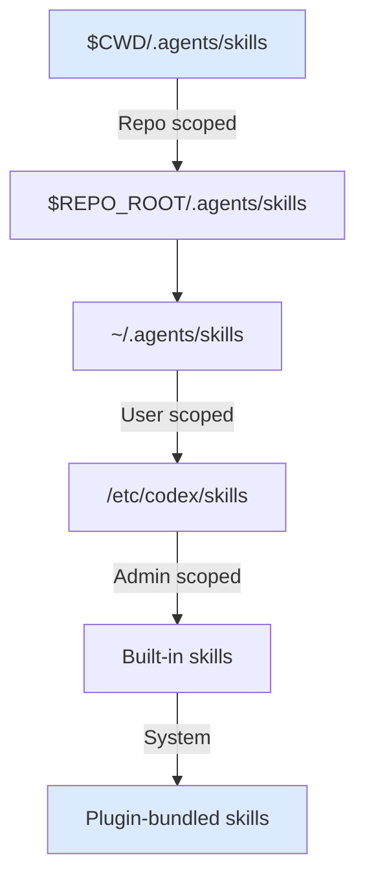
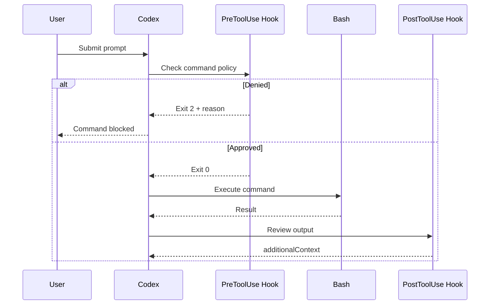
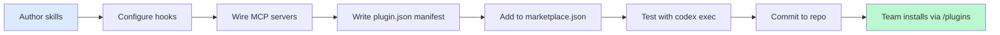

# Building a Codex CLI Plugin: Skills, Hooks, MCP Servers and Project-Specific Automation


---

Codex CLI plugins — introduced in March 2026 — are installable bundles that package skills, app integrations, and MCP server configurations into reusable, distributable units[^1]. A well-crafted plugin transforms a generic coding agent into a project-aware automation engine that enforces your team's conventions, connects to your enterprise services, and gates risky operations behind deterministic checks.

This article walks through building a complete plugin for a typical enterprise project, covering every component from skill authoring through marketplace distribution.

## Plugin Anatomy

Every plugin is a directory with a required manifest at `.codex-plugin/plugin.json` and optional supporting files[^2]:

```
my-project-plugin/
├── .codex-plugin/
│   └── plugin.json            # Required: manifest
├── skills/
│   ├── migration-generator/
│   │   └── SKILL.md
│   ├── pr-description/
│   │   └── SKILL.md
│   └── deploy-preflight/
│       ├── SKILL.md
│       └── scripts/
│           └── check-env.sh
├── .mcp.json                  # Optional: MCP server config
├── .app.json                  # Optional: app integrations
└── assets/
    └── icon.png               # Optional: branding
```

The manifest declares metadata and points to each component:

```json
{
  "name": "acme-service-plugin",
  "version": "1.0.0",
  "description": "Project automation for ACME microservices",
  "author": {
    "name": "ACME Platform Team",
    "email": "platform@acme.dev"
  },
  "skills": "./skills/",
  "mcpServers": "./.mcp.json",
  "apps": "./.app.json",
  "interface": {
    "displayName": "ACME Service Plugin",
    "shortDescription": "Skills, hooks, and MCP for ACME projects",
    "category": "Engineering",
    "capabilities": ["Read", "Write"],
    "brandColor": "#2563EB"
  }
}
```

Critical rule: only `plugin.json` belongs inside `.codex-plugin/`. Everything else lives at the plugin root[^2].

## Project-Specific Skills

Skills are the primary unit of reusable automation. Each skill is a directory containing a `SKILL.md` file with YAML frontmatter declaring `name` and `description` (both required), followed by Markdown instructions[^3].

### Skill Discovery

Codex scans multiple hierarchical locations for skills, from most specific to broadest[^3]:



When packaged inside a plugin, skills are discovered via the `"skills"` pointer in `plugin.json` and cached at `~/.codex/plugins/cache/$MARKETPLACE/$PLUGIN/$VERSION/`[^2].

### Worked Example: Migration Generator

A skill that reads your ORM schema and generates a migration file following team conventions:

```yaml
---
name: migration-generator
description: >
  Generate a database migration from the current ORM schema diff.
  Trigger when the user asks to create, add, or modify a database migration.
  Do NOT trigger for seed data or fixture generation.
---

## Steps

1. Read the ORM schema from `src/db/schema.prisma` (or the equivalent for the project's ORM).
2. Compare against the latest migration in `prisma/migrations/`.
3. Generate a new migration using the project's migration tool (`npx prisma migrate dev --name <descriptive-name>`).
4. Validate the generated SQL against the team's migration checklist in `docs/MIGRATION_RULES.md`.
5. If the migration includes destructive operations (DROP, ALTER column type), add a `-- DESTRUCTIVE` comment header and warn the user.
```

### Worked Example: PR Description Writer

```yaml
---
name: pr-description
description: >
  Generate a pull request description following the team's ADR template.
  Trigger when the user asks to write, draft, or create a PR description.
---

## Steps

1. Run `git diff main...HEAD --stat` to identify changed files.
2. Read `docs/templates/PR_TEMPLATE.md` for the required sections.
3. For each changed module, summarise the intent (not the diff).
4. Include a "## Breaking Changes" section if any public API signatures changed.
5. Add a "## Testing" section listing which test suites cover the changes.
```

### Controlling Implicit Invocation

For skills that should only fire when explicitly requested, add an `agents/openai.yaml` file[^3]:

```yaml
policy:
  allow_implicit_invocation: false
```

This prevents the migration generator from firing when someone merely mentions "database" in a prompt.

## Hooks as Quality Gates

Hooks inject deterministic scripts into the Codex agent loop. They are currently behind a feature flag[^4]:

```toml
[features]
codex_hooks = true
```

Hook configuration lives in `hooks.json` files at two scopes — `~/.codex/hooks.json` (user-level) and `<repo>/.codex/hooks.json` (repository-level). Both load additively; higher-precedence layers do not replace lower-precedence hooks[^4].

### Hook Lifecycle Events

Codex supports five hook events[^4]:

| Event | When It Fires | Matcher Filters On |
|-------|---------------|-------------------|
| `SessionStart` | Session starts or resumes | `startup` or `resume` |
| `PreToolUse` | Before a tool executes | Tool name (currently `Bash`) |
| `PostToolUse` | After a tool executes | Tool name |
| `UserPromptSubmit` | User submits a prompt | Not supported |
| `Stop` | Agent stops | Not supported |



### Pre-Tool Hook: Blocking Destructive Commands

A `PreToolUse` hook that blocks risky operations on protected paths:

```json
{
  "hooks": {
    "PreToolUse": [
      {
        "matcher": "Bash",
        "hooks": [
          {
            "type": "command",
            "command": "python3 .codex/hooks/guard_infra.py",
            "statusMessage": "Checking infrastructure policy",
            "timeout": 10
          }
        ]
      }
    ]
  }
}
```

The guard script receives JSON on stdin with the proposed command in `tool_input.command`. To deny execution, exit with code 2 and print the reason to stderr[^4]:

```python
#!/usr/bin/env python3
import json, sys, re

data = json.load(sys.stdin)
cmd = data.get("tool_input", {}).get("command", "")

PROTECTED = [r"infra/", r"terraform/", r"\.env", r"secrets/"]
if any(re.search(p, cmd) for p in PROTECTED):
    print("Blocked: command touches protected infrastructure paths. "
          "Require human approval.", file=sys.stderr)
    sys.exit(2)
```

### Stop Hook: Enforcing Test Passage

A `Stop` hook that forces another pass when tests are failing:

```json
{
  "hooks": {
    "Stop": [
      {
        "hooks": [
          {
            "type": "command",
            "command": "python3 .codex/hooks/check_tests.py",
            "timeout": 120
          }
        ]
      }
    ]
  }
}
```

The script returns a JSON `decision: "block"` response to trigger continuation[^4]:

```python
#!/usr/bin/env python3
import json, subprocess, sys

result = subprocess.run(["npm", "test"], capture_output=True, text=True)
if result.returncode != 0:
    print(json.dumps({
        "decision": "block",
        "reason": "Tests are still failing. Fix the remaining failures before stopping."
    }))
    sys.exit(0)
```

## MCP Server Integration

The `.mcp.json` file (or direct `config.toml` entries) connects the plugin to enterprise services[^5]. Two transport types are supported: STDIO for local processes and Streamable HTTP for remote servers[^5].

### Connecting to Enterprise Services

```json
{
  "mcp_servers": {
    "jira": {
      "url": "https://mcp.atlassian.com/jira",
      "bearer_token_env_var": "JIRA_API_TOKEN"
    },
    "datadog": {
      "command": "npx",
      "args": ["-y", "@datadog/mcp-server"],
      "env": {
        "DD_API_KEY": "${DD_API_KEY}",
        "DD_APP_KEY": "${DD_APP_KEY}"
      }
    },
    "openai-docs": {
      "url": "https://developers.openai.com/mcp"
    }
  }
}
```

This gives skills access to sprint backlogs (Jira), runtime metrics during debugging (Datadog), and official documentation (OpenAI Docs)[^5]. Each MCP server's tools can be selectively enabled or disabled via `enabled_tools` and `disabled_tools` arrays in the server configuration[^5].

### Timeout Configuration

For enterprise servers behind VPNs or with higher latency, adjust timeouts[^5]:

```toml
[mcp_servers.jira]
url = "https://mcp.internal.acme.dev/jira"
startup_timeout_sec = 30
tool_timeout_sec = 120
```

## AGENTS.md Composition

Codex discovers `AGENTS.md` files hierarchically, walking from the project root down to the current working directory. The closest file to the edited file takes precedence; explicit user prompts override everything[^6].

A plugin can ship AGENTS.md fragments at directory level without overwriting existing team instructions. The recommended pattern:

```
my-project/
├── AGENTS.md                      # Team-wide conventions
├── src/
│   ├── AGENTS.md                  # Source code conventions
│   └── db/
│       └── AGENTS.md              # Plugin-provided: migration rules
└── infra/
    └── AGENTS.md                  # Plugin-provided: IaC conventions
```

For local overrides that should not be committed, use `AGENTS.override.md` — Codex merges these with the base `AGENTS.md` at the same directory level[^6].

Fallback filenames and size limits are configurable in `~/.codex/config.toml`[^6]:

```toml
project_doc_fallback_filenames = ["TEAM_GUIDE.md", ".agents.md"]
project_doc_max_bytes = 65536
```

## Marketplace Distribution

Plugins are distributed through marketplace JSON files at three scopes[^2]:

| Scope | Location |
|-------|----------|
| Repository | `$REPO_ROOT/.agents/plugins/marketplace.json` |
| Personal | `~/.agents/plugins/marketplace.json` |
| Official | OpenAI Plugin Directory (coming soon) |

### Repository Marketplace

For team-internal distribution, commit a marketplace file alongside the plugin:

```json
{
  "name": "acme-internal-plugins",
  "interface": {
    "displayName": "ACME Internal Plugins"
  },
  "plugins": [
    {
      "name": "acme-service-plugin",
      "source": {
        "source": "local",
        "path": "./plugins/acme-service-plugin"
      },
      "policy": {
        "installation": "INSTALLED_BY_DEFAULT",
        "authentication": "ON_INSTALL"
      },
      "category": "Engineering"
    }
  ]
}
```

Setting `installation` to `INSTALLED_BY_DEFAULT` ensures every team member gets the plugin without manual setup[^2]. Three installation policies are available: `AVAILABLE`, `INSTALLED_BY_DEFAULT`, and `NOT_AVAILABLE`[^2].

### Installing Locally

```bash
# Repository-scoped
mkdir -p ./plugins
cp -R /path/to/acme-service-plugin ./plugins/acme-service-plugin

# Personal
mkdir -p ~/.codex/plugins
cp -R /path/to/acme-service-plugin ~/.codex/plugins/acme-service-plugin
```

Codex caches installed plugins at `~/.codex/plugins/cache/$MARKETPLACE_NAME/$PLUGIN_NAME/$VERSION/`. For local plugins, `$VERSION` is `local`[^2].

## Testing the Plugin

Validate each skill against fixture inputs using `codex exec`:

```bash
# Test migration generator against a known schema diff
codex exec --skill ./skills/migration-generator \
  --input "Generate a migration adding a 'status' column to the orders table"

# Test PR description against a known diff
git checkout feature-branch
codex exec --skill ./skills/pr-description \
  --input "Write a PR description for the current branch"
```

For CI integration, run skills in a locked-down profile with `workspace-write` sandbox mode to prevent unintended side effects. ⚠️ The exact `codex exec` flags may vary — consult your installed version's help output.

## The Complete Lifecycle



The plugin pattern gives teams a single distributable unit that encodes project knowledge — from coding conventions in AGENTS.md through quality gates in hooks to enterprise service access via MCP. As the official Plugin Directory matures, expect cross-organisation sharing of these bundles to become the primary way teams bootstrap Codex CLI for new projects.

## Citations

[^1]: [OpenAI introduces plugin support in Codex](https://alternativeto.net/news/2026/3/openai-introduces-plugin-support-in-codex-with-app-integrations-skills-and-mcp-servers/) — AlternativeTo, March 2026
[^2]: [Build plugins — Codex Developer Documentation](https://developers.openai.com/codex/plugins/build) — OpenAI, 2026
[^3]: [Agent Skills — Codex Developer Documentation](https://developers.openai.com/codex/skills) — OpenAI, 2026
[^4]: [Hooks — Codex Developer Documentation](https://developers.openai.com/codex/hooks) — OpenAI, 2026
[^5]: [Model Context Protocol — Codex Developer Documentation](https://developers.openai.com/codex/mcp) — OpenAI, 2026
[^6]: [Custom instructions with AGENTS.md — Codex Developer Documentation](https://developers.openai.com/codex/guides/agents-md) — OpenAI, 2026
