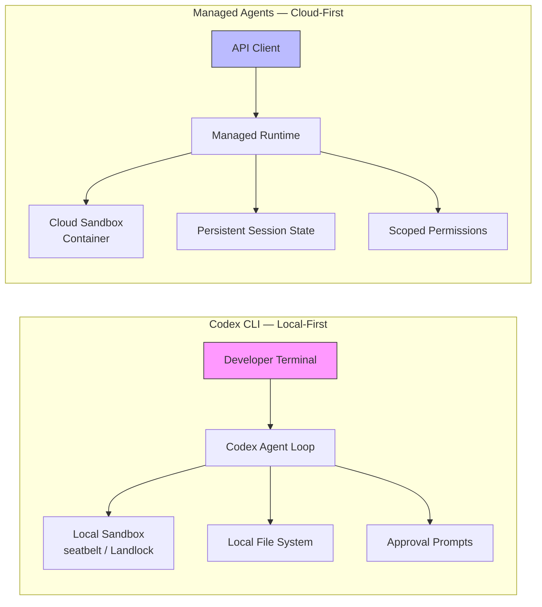
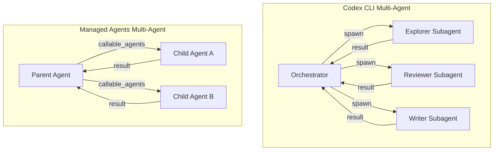
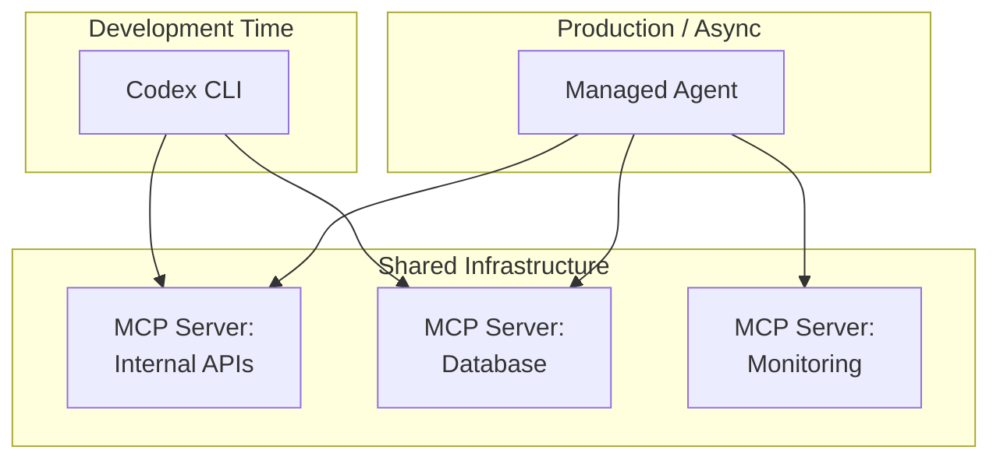

# Claude Managed Agents: What Anthropic's Cloud-Hosted Agent Platform Means for Codex CLI


---

On 8 April 2026 Anthropic launched **Claude Managed Agents** in public beta — a suite of composable APIs for building and deploying cloud-hosted agents at scale [^1]. The timing is deliberate: every major AI lab now ships an agent runtime, and Anthropic's entry collapses months of infrastructure work into days. For practitioners already running Codex CLI, the question is not "which one wins?" but "where does each fit, and how do they compose?"

This article dissects what Managed Agents actually ships today, compares its architectural choices with Codex CLI's local-first model, examines the multi-agent overlap, and argues that MCP — supported by both platforms — makes them complementary rather than exclusive.

## What Managed Agents Does

Claude Managed Agents is a **managed runtime** that pairs an agent harness tuned for performance with production infrastructure [^2]. You define an agent — model, system prompt, tools, MCP servers, and skills — as a versioned JSON configuration, then reference it by ID each time you start a session [^3]. Anthropic handles the rest:

- **Sandboxed execution** — bash, file operations, web search and web fetch run inside secure containers [^4].
- **Long-running sessions** — agents operate autonomously for hours; progress persists through disconnections [^1].
- **Checkpointing and crash recovery** — sessions resume from the last checkpoint after outages [^2].
- **Scoped permissions** — fine-grained control over which tools an agent can invoke [^3].
- **End-to-end tracing** — full observability into agent reasoning and tool calls [^1].

The bundled toolset, `agent_toolset_20260401`, provides eight pre-built tools: `bash`, `read`, `write`, `edit`, `glob`, `grep`, `web_fetch`, and `web_search` [^4]. Individual tools can be selectively disabled per agent.

### What Is Still in Research Preview

Two headline features are **not** in the public beta and require separate access requests [^5]:

1. **Multi-agent coordination** — an agent can spin up and direct other agents to parallelise complex work.
2. **Self-evaluation** — the agent defines outcomes and success criteria, then iterates autonomously until they are met.

This distinction matters. The public beta is a single-agent runtime with excellent infrastructure. The multi-agent orchestration that makes Managed Agents sound most powerful is gated behind research preview [^5].

### Pricing

Standard Claude Platform token rates apply, plus **$0.08 per session-hour** for active runtime [^6]. Idle time waiting for input does not count. For a typical 20-minute coding session, the infrastructure surcharge is roughly $0.03 — negligible next to token costs for a Sonnet 4.6 or Opus 4.6 workload.

## Architectural Comparison with Codex CLI

The two platforms approach the same problem from opposite ends.



| Dimension | Codex CLI | Claude Managed Agents |
|---|---|---|
| **Execution** | Local process, developer's machine [^7] | Cloud container, Anthropic infrastructure [^1] |
| **Session model** | Interactive TUI or `codex exec` batch [^7] | Long-running autonomous, hours-scale [^1] |
| **Safety model** | Approval modes (suggest / auto-edit / full-auto) + OS sandbox (macOS seatbelt, Linux Landlock) [^8] | Scoped permissions + container isolation [^3] |
| **State** | Ephemeral (session-scoped, lost on exit unless resumed) | Persistent (checkpointed, survives disconnection) [^2] |
| **Agent definition** | `config.toml` profiles + AGENTS.md [^7] | Versioned JSON agent configs via API [^3] |
| **Developer loop** | Tight — approve/reject in real-time | Loose — fire-and-forget, review later |
| **Models** | OpenAI-native (GPT-5.4, gpt-5.3-codex) + custom providers [^9] | Claude-native (Sonnet 4.6, Opus 4.6) [^3] |

The fundamental trade-off is **steering granularity versus autonomy duration**. Codex CLI excels when you want to stay in the loop, approving each tool call or at least each batch. Managed Agents excels when the task specification is clear enough to delegate entirely — "process these 500 PRs overnight" rather than "help me refactor this function" [^10].

## Multi-Agent Overlap

Both platforms invest heavily in multi-agent orchestration, but with different maturity levels and architectural choices.

### Codex CLI Subagents (GA)

Codex CLI's subagent system is generally available [^11]. Custom agents are defined as TOML files under `~/.codex/agents/` or `.codex/agents/`, with per-agent model, reasoning effort, sandbox mode, and instructions [^11]. The orchestration primitives include:

```toml
[features]
multi_agent = true

[agents.explorer]
description = "Fast reconnaissance of large codebases"
config_file = "explorer.toml"

[agents.reviewer]
description = "Thorough code review with security focus"
config_file = "reviewer.toml"
```

The parent agent spawns subagents, routes instructions, waits for results, and closes threads — a **hub-and-spoke** pattern where all coordination flows through the orchestrator [^11]. Batch processing uses `spawn_agents_on_csv` for data-parallel workloads [^12].

### Managed Agents Multi-Agent (Research Preview)

Managed Agents' multi-agent coordination allows an agent to spin up child agents dynamically via the `callable_agents` array in the agent configuration [^5]. The parent-child spawning model is conceptually similar to Codex subagents, but runs entirely in the cloud with Anthropic managing the lifecycle [^1].



The key difference: Codex subagents run locally and the developer retains approval authority. Managed Agents children run in the cloud and inherit the parent's scoped permissions — no human in the loop unless you build one via webhooks.

### The A2A Absence

Neither platform currently supports Google's **Agent2Agent (A2A)** protocol [^13], the open standard for cross-vendor agent interoperability donated to the Linux Foundation in 2025. A2A enables peer-to-peer agent communication via Agent Cards and task lifecycle management [^13]. Its absence from both Codex CLI and Managed Agents means cross-platform orchestration — a Codex subagent coordinating with a Managed Agent — requires custom glue code today. MCP bridges the tool layer, but not the agent coordination layer.

## The Convergence Thesis

Despite starting from opposite ends — local terminal versus cloud API — both platforms are converging on remarkably similar patterns:

1. **Tool use** — both provide bash, file operations, web search, and extensibility via MCP [^4][^7].
2. **Parallel agents** — both support spawning multiple agents for concurrent work [^5][^11].
3. **Sandbox isolation** — both enforce tool-level security boundaries, albeit through different mechanisms [^3][^8].
4. **Agent-as-configuration** — both define agent behaviour declaratively (TOML vs JSON) rather than imperatively [^3][^7].

The convergence suggests the industry is settling on a common agent architecture. The differentiator is not the pattern but the **deployment model**: local-first with developer steering (Codex CLI) versus cloud-first with autonomous execution (Managed Agents).

## MCP as the Bridge

Both Codex CLI and Managed Agents support the **Model Context Protocol** [^7][^3], making them composable rather than exclusive. An MCP server that exposes your internal APIs, databases, or monitoring tools works with either runtime unchanged.

This creates a practical integration architecture:



Your MCP servers become the **portable capability layer**. Invest in MCP tooling once, deploy through whichever agent runtime suits the task. Interactive refactoring at your terminal? Codex CLI. Overnight batch processing of 200 repositories? Managed Agents.

## What This Means for Practitioners

### Use Codex CLI When

- You need **tight steering** — approving individual tool calls, redirecting mid-task.
- The work involves **local uncommitted changes** or sensitive files that should not leave your machine.
- You want **model flexibility** — GPT-5.4, gpt-5.3-codex-spark, or local models via custom providers [^9].
- Cost sensitivity is high — Codex CLI has no per-session-hour surcharge.

### Use Managed Agents When

- The task is **well-specified and autonomous** — clear inputs, clear success criteria.
- Sessions need to **run for hours** without a developer present [^1].
- You need **production-grade infrastructure** — checkpointing, crash recovery, tracing — without building it yourself [^2].
- The workflow is **Claude-native** — leveraging Sonnet 4.6 or Opus 4.6 strengths.

### Use Both When

- **Development** happens in Codex CLI (interactive, local, fast feedback loops).
- **Production agent services** run on Managed Agents (autonomous, persistent, observable).
- **MCP servers** provide the shared tool layer, reusable across both runtimes.

## The Competitive Landscape Implications

Managed Agents' launch intensifies the agent platform war. OpenAI has the Codex CLI and the Agents SDK [^14]; Anthropic now has Claude Code, the Claude Agent SDK, and Managed Agents; Google has the Agent Development Kit and A2A [^13]. Each is building a full-stack agent platform, but with different centres of gravity:

- **OpenAI**: model-native tooling, local-first CLI, open-source Codex CLI [^7].
- **Anthropic**: managed infrastructure, cloud-first deployment, enterprise sandboxing [^1].
- **Google**: protocol standardisation (A2A, MCP contributions), framework-agnostic interop [^13].

For teams already invested in Codex CLI, Managed Agents is not a replacement — it is an expansion of the solution space. The practitioners who will benefit most are those who recognise that different tasks demand different deployment models, and who build their tooling (AGENTS.md, MCP servers, agent configurations) to be portable across both.

## Citations

[^1]: Anthropic, "Claude Managed Agents: get to production 10x faster", claude.com/blog, 8 April 2026. [https://claude.com/blog/claude-managed-agents](https://claude.com/blog/claude-managed-agents)

[^2]: The Decoder, "Anthropic launches managed infrastructure for autonomous AI agents", 9 April 2026. [https://the-decoder.com/anthropic-launches-managed-infrastructure-for-autonomous-ai-agents/](https://the-decoder.com/anthropic-launches-managed-infrastructure-for-autonomous-ai-agents/)

[^3]: Anthropic, "Claude Managed Agents overview", Claude API Docs. [https://platform.claude.com/docs/en/managed-agents/overview](https://platform.claude.com/docs/en/managed-agents/overview)

[^4]: Anthropic, "Tools — Claude Managed Agents", Claude API Docs. [https://platform.claude.com/docs/en/managed-agents/tools](https://platform.claude.com/docs/en/managed-agents/tools)

[^5]: unicodeveloper, "Claude Managed Agents: Honest Pros and Cons",
Medium, April 2026. [Medium article](https://medium.com/@unicodeveloper/claude-managed-agents-what-it-actually-offers-the-honest-pros-and-cons-and-how-to-run-agents-52369e5cff14)

8 April 2026. [SiliconANGLE article](https://siliconangle.com/2026/04/08/anthropic-launches-claude-managed-agents-speed-ai-agent-development/)

[^7]: OpenAI, "Codex CLI", GitHub. [https://github.com/openai/codex](https://github.com/openai/codex)

[^8]: OpenAI Developers, "Codex CLI Approval Modes and Sandbox", Codex Documentation. [https://developers.openai.com/codex/config-advanced](https://developers.openai.com/codex/config-advanced)

[^9]: danielvaughan, "Codex CLI Custom Model Providers: Azure, Vercel, Local LLMs and Dynamic Bearer Tokens", codex.danielvaughan.com, 31 March 2026. [https://codex.danielvaughan.com/2026/03/31/codex-cli-custom-model-providers/](https://codex.danielvaughan.com/2026/03/31/codex-cli-custom-model-providers/)

[^10]: Northflank, "Claude Code vs OpenAI Codex: which is better in 2026?". [https://northflank.com/blog/claude-code-vs-openai-codex](https://northflank.com/blog/claude-code-vs-openai-codex)

[^11]: OpenAI Developers, "Subagents — Codex". [https://developers.openai.com/codex/subagents](https://developers.openai.com/codex/subagents)

[^12]: danielvaughan, "Codex CLI Subagents: TOML Format, Parallelism and spawn_agents_on_csv", codex.danielvaughan.com, 26 March 2026. [https://codex.danielvaughan.com/2026/03/26/codex-cli-subagents-toml-parallelism/](https://codex.danielvaughan.com/2026/03/26/codex-cli-subagents-toml-parallelism/)

[^13]: Google Developers Blog, "Announcing the Agent2Agent Protocol (A2A)". [https://developers.googleblog.com/en/a2a-a-new-era-of-agent-interoperability/](https://developers.googleblog.com/en/a2a-a-new-era-of-agent-interoperability/)

[^14]: OpenAI Developers, "Use Codex with the Agents SDK". [https://developers.openai.com/codex/guides/agents-sdk](https://developers.openai.com/codex/guides/agents-sdk)
