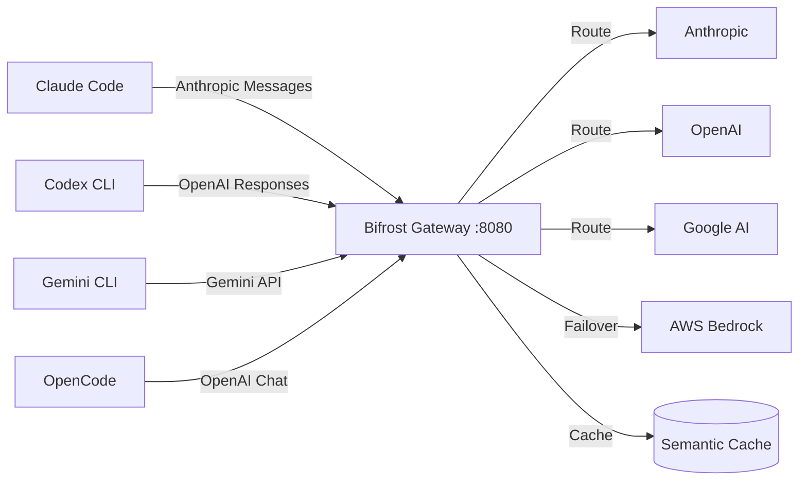
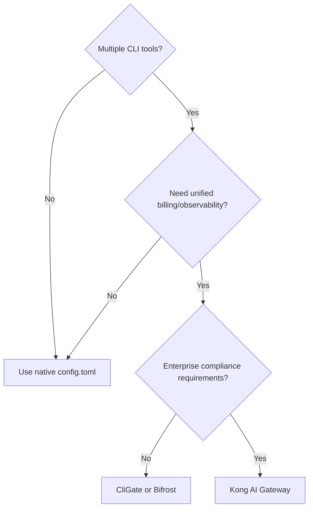

# CliGate, Bifrost, and the Multi-Harness Gateway Pattern: Running Claude Code, Codex CLI, and Gemini CLI as One


---

## The Problem: Three CLIs, Three Worlds

Most senior developers running agentic coding tools in 2026 have at least two — often three — CLI agents installed: Claude Code, Codex CLI, and Gemini CLI. Each speaks a different wire protocol (Anthropic Messages, OpenAI Responses, Gemini API), uses separate authentication, and maintains its own billing relationship[^1]. The operational overhead compounds quickly: three sets of API keys, three billing dashboards, three rate-limit ceilings to monitor, and zero visibility across the whole stack.

The **multi-harness gateway pattern** solves this by inserting a local proxy between your CLI tools and their upstream providers. The gateway handles protocol translation, credential management, failover routing, and unified observability — while each CLI continues speaking its native protocol, unaware anything has changed.

Three tools have emerged as the leading implementations: **CliGate** (open-source, local-first), **Bifrost** (high-performance Go gateway), and **Kong AI Gateway** (enterprise-grade API management). Each takes a different architectural approach to the same problem.

---

## CliGate: The Local-First Multi-Protocol Gateway

CliGate, maintained by codeking-ai (formerly yiyao-ai), is an open-source gateway under AGPL-3.0 that runs exclusively on `localhost`[^2]. It exposes compatible endpoints for every major AI CLI protocol:

| Endpoint | Protocol |
|---|---|
| `POST /v1/messages` | Anthropic Messages API |
| `POST /v1/chat/completions` | OpenAI Chat Completions |
| `POST /v1/responses` | OpenAI Responses API |
| `POST /backend-api/codex/responses` | Codex internal |
| `POST /v1beta/models/*` | Gemini API |

### Quick Start

```bash
npx cligate@latest start
```

The dashboard launches at `http://localhost:8081`, providing account management, model mapping, per-application routing rules, and usage analytics[^2].

### Routing Architecture

CliGate implements four routing strategies[^2]:

- **Account-pool-first** — rotates across a pool of provider accounts
- **API-key-first** — selects routes based on which key to consume
- **Automatic** — CliGate decides based on quota and cost
- **Manual per-application** — pin specific tools to specific upstreams

A particularly useful feature is **free-model routing**: lightweight requests (e.g. `claude-haiku` or small completions) can be directed to free providers like Kilo AI, preserving premium quota for heavy agentic workloads[^2].

### Connecting Codex CLI to CliGate

Point Codex CLI at the local gateway via `config.toml`:

```toml
[model_providers.cligate]
name = "CliGate Local Gateway"
base_url = "http://localhost:8081/v1"
env_key = "OPENAI_API_KEY"
wire_api = "responses"

[profile]
model_provider = "cligate"
model = "o3"
```

Or for a quick session override:

```bash
export OPENAI_BASE_URL=http://localhost:8081/v1
codex
```

Codex CLI's `wire_api` must be set to `responses` — the only supported wire protocol as of the current release[^3].

---

## Bifrost: The High-Performance Go Gateway

Bifrost, built by Maxim AI, takes a different approach: a Go-based gateway engineered for raw throughput. It adds approximately **11 microseconds of overhead per request at 5,000 RPS**[^4] — effectively invisible against LLM response latencies measured in seconds.

### Architecture



### Setup

```bash
npx -y @maximhq/bifrost-cli
```

The interactive installer configures agent-specific environment variables[^5]:

| Agent | Variable | Value |
|---|---|---|
| Claude Code | `ANTHROPIC_BASE_URL` | `http://localhost:8080` |
| Codex CLI | `OPENAI_API_BASE` | `http://localhost:8080/openai/v1` |
| Gemini CLI | `GEMINI_API_BASE` | `http://localhost:8080` |

Note the `/openai/v1` suffix for Codex CLI — omitting it causes routing errors[^5].

### Codex CLI Integration via config.toml

```toml
[model_providers.bifrost]
name = "Bifrost"
base_url = "http://localhost:8080/openai/v1"
env_key = "OPENAI_API_KEY"
wire_api = "responses"

[profile]
model_provider = "bifrost"
model = "o3"
```

### Enterprise Features

Bifrost's enterprise tier adds guardrails (AWS Bedrock Guardrails, Azure Content Safety, Patronus AI), RBAC, vault integration (HashiCorp Vault, AWS Secrets Manager), and OpenTelemetry export for per-agent cost tracking[^4]. Virtual keys enable routing policies per team or environment — useful for organisations running Codex CLI across multiple squads with different budget ceilings.

### MCP Gateway

Bifrost includes a built-in MCP gateway with a "Code Mode" that claims to reduce token usage by 50% across multi-server agentic workflows[^6]. For Claude Code, this integrates natively:

```bash
claude mcp add --transport http bifrost http://localhost:8080/mcp
```

---

## Kong AI Gateway: The Enterprise Control Plane

Kong AI Gateway brings API management maturity to AI CLI proxying. Where CliGate and Bifrost are purpose-built for AI workloads, Kong extends its existing gateway infrastructure with AI-specific plugins[^7].

### Codex CLI Through Kong

The setup uses Kong's declarative configuration:

```yaml
_format_version: "3.0"
services:
  - name: codex-service
    url: http://localhost
routes:
  - name: codex-route
    paths:
      - "/codex"
    service:
      name: codex-service
plugins:
  - name: ai-proxy-advanced
    service: codex-service
    config:
      llm_format: openai
      response_streaming: allow
      targets:
        - route_type: llm/v1/responses
          auth:
            header_name: Authorization
            header_value: "Bearer ${{ env \"DECK_OPENAI_API_KEY\" }}"
          model:
            provider: openai
  - name: request-transformer
    service: codex-service
    config:
      replace:
        uri: "/"
```

Then point Codex CLI at the gateway:

```bash
export OPENAI_BASE_URL=http://localhost:8000/codex
codex
```

The `request-transformer` plugin normalising the URI to `/` is essential — without it, Kong forwards the `/codex` prefix upstream, causing malformed requests[^7].

Kong's strength is composability: you can layer rate-limiting, prompt guards (regex-based filtering to block dangerous prompts), file logging for audit trails, and round-robin load balancing with token counting across providers[^7][^8].

---

## Does a Gateway Add Value Over Native Provider Config?

Codex CLI already supports custom model providers natively through `config.toml`[^3]. The `[model_providers]` table accepts `base_url`, `env_key`, `http_headers`, `env_http_headers`, `query_params`, retry configuration, and WebSocket transport options[^3]. So when does a gateway justify its additional complexity?



**Use native `config.toml`** when you only run Codex CLI, or you run multiple tools but manage them independently. Codex CLI's built-in provider configuration handles custom endpoints, authentication, and retry logic without additional infrastructure[^3].

**Use CliGate or Bifrost** when you run multiple CLI tools and want:

- **Credential pooling** — rotate across multiple accounts to avoid rate limits
- **Cost-based routing** — send lightweight requests to cheaper providers
- **Unified dashboard** — single pane of glass for usage across all tools
- **Automatic failover** — transparent rerouting when a provider hits capacity

**Use Kong AI Gateway** when enterprise policy demands:

- **Prompt guards** — regex-based blocking of dangerous instructions before they reach the LLM[^8]
- **Audit logging** — full request/response capture for compliance
- **Existing Kong infrastructure** — if you already run Kong for API management

---

## Security Considerations

The gateway pattern introduces a meaningful security trade-off: **every gateway sees all your API traffic in cleartext**[^8]. This includes prompts containing proprietary code, API credentials in headers, and full model responses.

### Credential Aggregation Risk

A local gateway that pools credentials for OpenAI, Anthropic, and Google becomes a high-value target. If the gateway process is compromised, all provider credentials are exposed simultaneously. CliGate mitigates this by running exclusively on localhost with no external control plane[^2], but the credentials must still exist in the gateway's memory.

### Enterprise Policy Enforcement

For organisations, the gateway is actually a security *improvement*: rather than distributing API keys to individual developer machines, credentials live in a centrally managed gateway (or Kubernetes secret), and developers authenticate to the gateway instead[^8]. This enables:

- Centralised key rotation without touching developer workstations
- Prompt filtering to prevent accidental data exfiltration
- Request logging for audit trails
- Per-developer or per-team usage quotas

### Codex CLI Hook Integration

Codex CLI's hook system can complement gateway-level security. A pre-execution hook can verify that `OPENAI_BASE_URL` points to the approved gateway, preventing developers from bypassing the proxy:

```bash
#!/bin/bash
# .codex/hooks/pre-start.sh
EXPECTED_BASE="http://localhost:8080"
if [[ "$OPENAI_BASE_URL" != "$EXPECTED_BASE"* ]]; then
  echo "ERROR: Codex CLI must route through the approved gateway"
  exit 1
fi
```

---

## Choosing Your Gateway

| Criterion | CliGate | Bifrost | Kong AI Gateway |
|---|---|---|---|
| **Licence** | AGPL-3.0 | Open-source + Enterprise | Enterprise |
| **Language** | Node.js | Go | Lua/Nginx |
| **Overhead** | Low | ~11µs/request | Variable |
| **Protocol support** | 5 wire protocols | Multi-provider | Plugin-based |
| **Free-model routing** | ✅ | ❌ | ❌ |
| **MCP gateway** | ❌ | ✅ | ❌ |
| **Credential pooling** | ✅ | Via virtual keys | Via plugins |
| **Prompt guards** | ❌ | Enterprise tier | ✅ |
| **Dashboard** | Web UI on :8081 | Cloud dashboard | Kong Manager |
| **Setup** | `npx cligate@latest start` | `npx @maximhq/bifrost-cli` | decK + Docker |

For solo developers running multiple CLI tools, **CliGate** offers the fastest path to a unified gateway with minimal overhead. For teams needing performance and observability, **Bifrost** provides enterprise-grade routing with negligible latency cost. For organisations already invested in Kong infrastructure, the **AI Gateway plugins** extend existing governance to AI CLI traffic without introducing new tooling.

⚠️ The multi-harness gateway space is evolving rapidly. CLIProxyAPI, AgentGateway, and claude-code-router are additional open-source options not covered here in detail but worth evaluating for specific use cases.

---

## Citations

[^1]: [Evolink — One Gateway for 3 Coding CLIs (2026)](https://evolink.ai/blog/one-endpoint-coding-clis-2026)
[^2]: [CliGate — DEV Community: Local Gateway for Claude Code, Codex, and Gemini](https://dev.to/yiyaoai/i-stopped-paying-for-ai-cli-chaos-this-local-gateway-makes-claude-code-codex-and-gemini-work-as-59hl)
[^3]: [Codex CLI Configuration Reference — OpenAI Developers](https://developers.openai.com/codex/config-reference)
[^4]: [Bifrost — Maxim AI: Drop-in LLM Proxy](https://www.getmaxim.ai/bifrost/)
[^5]: [Bifrost CLI Coding Agents — Maxim AI](https://www.getmaxim.ai/bifrost/resources/cli-agents)
[^6]: [Best MCP Gateway in 2026: How Bifrost Cuts Token Usage by 50%](https://www.getmaxim.ai/articles/best-mcp-gateway-in-2026-how-bifrost-cuts-token-usage-by-50/)
[^7]: [Route OpenAI Codex CLI Traffic Through AI Gateway — Kong Docs](https://developer.konghq.com/how-to/use-codex-with-ai-gateway/)
[^8]: [Intercept, Inspect, Secure: Proxying Claude Code CLI Traffic — Cloud Native Deep Dive](https://www.cloudnativedeepdive.com/intercept-inspect-secure-proxying-claude-code-cli-traffic/)
