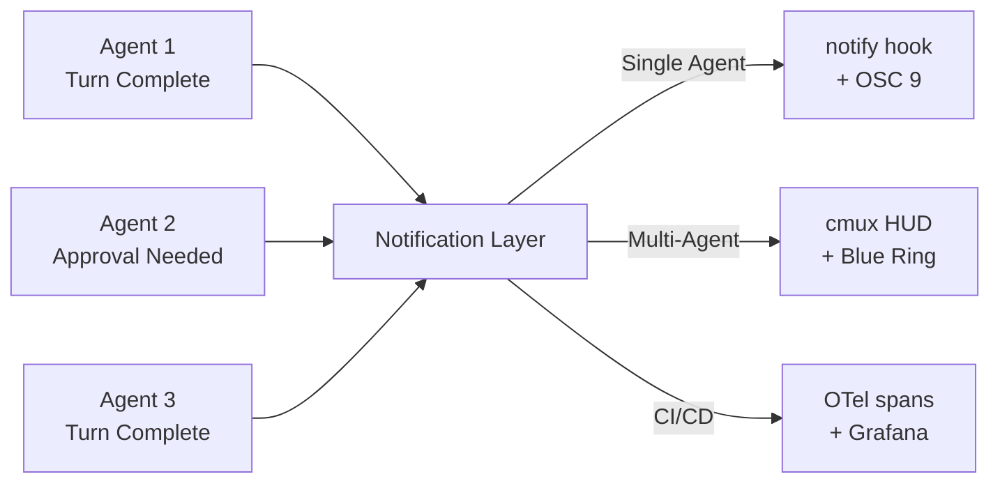

# Codex CLI Agent Notifications: Desktop Alerts, Audio Chimes, and Multi-Agent Monitoring


---

When you run a single Codex CLI session in the foreground, you see everything happen in real time. The moment you start running agents in the background — multiple subagents, cloud tasks, or overnight automation — the question shifts from "what is the agent doing?" to "how do I know when the agent needs me?" The answer is the notification system: a combination of built-in TUI alerts, the `notify` hook, and a growing ecosystem of community tools that bridge the gap between terminal-bound agents and your desktop.

## The Built-In Notification Layer

Codex CLI ships with two complementary notification mechanisms configured via `config.toml`[^1].

### TUI Notifications

The `[tui]` section controls in-terminal alerts that fire when the TUI window is not focused:

```toml
[tui]
notifications = ["agent-turn-complete", "approval-requested"]
notification_method = "osc9"
```

The `notifications` key accepts either a boolean (`true` enables all events) or an array of specific event names[^2]. As of April 2026, Codex supports two notification event types:

- **`agent-turn-complete`** — fires when the agent finishes a turn and is waiting for input
- **`approval-requested`** — fires when the agent needs permission to execute a tool call

The `notification_method` key controls how the alert is delivered[^2]:

| Method | Behaviour |
|--------|-----------|
| `auto` | Codex picks the best available method for your terminal (default) |
| `osc9` | Emits an OSC 9 escape sequence (`\e]9;message\e\\`) — supported by iTerm2, WezTerm, Windows Terminal, and VS Code's integrated terminal |
| `bel` | Sends the ASCII bell character (`\a`) — universally supported but limited to an audible beep |

For most developers on macOS with iTerm2, `osc9` is the correct choice. iTerm2 converts OSC 9 sequences into native macOS Notification Centre alerts[^3], giving you clickable banners that bring the terminal window to the foreground.

### The notify Hook

The `notify` key is a root-level configuration that invokes an external command whenever a notification event fires[^1]:

```toml
notify = ["/bin/bash", "/Users/you/.codex/hooks/notify.sh"]
```

Codex passes a JSON payload to the command via its arguments. The payload includes the event type and the last assistant message[^3]. A minimal notification script for macOS using `terminal-notifier` looks like this:

```bash
#!/bin/bash
# ~/.codex/hooks/notify.sh
export PATH="/opt/homebrew/bin:/usr/local/bin:$PATH"

MSG=$(echo "$1" | jq -r '.["last-assistant-message"] // "Agent needs attention"' 2>/dev/null)
MSG="${MSG:0:220}"

terminal-notifier \
  -title "Codex CLI" \
  -message "$MSG" \
  -sound default \
  -activate com.googlecode.iterm2
```

Install `terminal-notifier` via Homebrew (`brew install terminal-notifier`) and make the script executable[^3]. The JSON payload currently includes the `last-assistant-message` field, which gives you a preview of what the agent just said.

For Linux, replace `terminal-notifier` with `notify-send`:

```bash
#!/bin/bash
MSG=$(echo "$1" | jq -r '.["last-assistant-message"] // "Agent needs attention"' 2>/dev/null)
notify-send "Codex CLI" "${MSG:0:200}"
```

## The Community Notification Ecosystem

The built-in system covers the basics, but the community has built a rich layer of tooling on top of it.

### code-notify: Cross-Platform, Multi-Tool Notifications

code-notify (v1.7.3) is the most comprehensive notification tool, supporting Codex CLI, Claude Code, and Gemini CLI from a single installation[^4]:

```bash
brew tap mylee04/tools && brew install code-notify
cn on codex    # Enable for Codex CLI
cn on claude   # Enable for Claude Code
cn on gemini   # Enable for Gemini CLI
```

It injects the appropriate hooks into each tool's configuration automatically. Key features include sound alerts, voice announcements on macOS, project-scoped configuration via `cnp` commands, and custom alert type filtering[^4]. The `cn alerts` command lets you choose which events trigger notifications — useful for suppressing routine turn-complete alerts whilst keeping approval-requested alerts active.

### codex-notify-chime: Audio Feedback for Agent Turns

For developers who want audio cues without desktop banners, codex-notify-chime is a Rust utility that plays a pleasant chime on every agent notification[^5]:

```bash
cargo install --path .  # After cloning the repo
```

Configuration is a single line in `config.toml`:

```toml
notify = ["codex-notify-chime"]
```

Volume is configurable via `~/.codex/notify.toml`:

```toml
volume = 0.6
```

The chime binary embeds its MP3 asset at compile time, so there are no external file dependencies[^5]. Unknown event types still trigger the default sound, ensuring you never miss a new event type added in future Codex releases.

### agent-notifications: Event-Rich Hook Management

The `agent-notifications` Rust crate (v0.4.7) provides the most granular control, supporting hooks for both Codex CLI and Claude Code with event-specific matchers[^6]:

```bash
cargo install agent-notifications
anot init codex  # Interactive setup
```

Beyond the standard `agent-turn-complete` event, it can hook into `PreToolUse`, `PostToolUse`, `SessionStart`, `SessionEnd`, `SubagentStop`, and `PreCompact` events when used with compatible hook configurations[^6]. This makes it particularly valuable for multi-agent monitoring — you can receive a notification when a specific subagent stops, not just when the parent agent completes a turn.

## VS Code Integration

If you run Codex CLI inside VS Code's integrated terminal, the **Terminal Notification** extension (by wenbopan) captures OSC 9 escape sequences and converts them into native system notifications[^7]. Combined with the `osc9` notification method, this gives you desktop alerts without any external scripts:

```toml
[tui]
notification_method = "osc9"
notifications = true
```

This works identically in Cursor and Windsurf, which share VS Code's terminal emulator.

## Multi-Agent Notification Patterns

When running multiple parallel agents, notification volume becomes a problem. Five agents completing turns simultaneously produce five near-simultaneous alerts — a recipe for notification fatigue.

### Pattern 1: Approval-Only Notifications

Configure notifications to fire only when human input is required:

```toml
[tui]
notifications = ["approval-requested"]
```

This silences routine turn completions whilst ensuring you never miss an approval prompt that would block agent progress.

### Pattern 2: Subagent Completion Aggregation

For multi-agent workflows using `spawn_agents_on_csv` or manual `spawn_agent` calls, configure the parent agent's notify hook but not the subagents'. The parent receives a turn-complete event when all subagents finish, giving you a single notification for the entire batch[^8].

### Pattern 3: cmux Visual Monitoring

For teams running five or more parallel agents, cmux (7.7K stars) provides a Ghostty-based macOS terminal with blue-ring agent notifications and PR-aware tabs[^9]. Rather than individual desktop alerts, cmux gives you a visual dashboard showing which agents are active, which need attention, and which have completed — a fundamentally different approach to the notification problem.



## Practical Configuration

A production-ready notification setup for a developer running two to three parallel agents on macOS:

```toml
# ~/.codex/config.toml

# Desktop alerts via terminal-notifier
notify = ["/bin/bash", "/Users/you/.codex/hooks/notify.sh"]

[tui]
# OSC 9 for iTerm2/VS Code terminal alerts
notification_method = "osc9"
# Only alert on approval requests — turn-complete goes to notify hook
notifications = ["approval-requested"]
```

This splits the notification surface: approval prompts appear as inline TUI alerts (since you need to respond in the terminal anyway), whilst turn completions fire the external notify hook for desktop banners that you can dismiss or act on at your pace.

## What Is Missing

The notification system has several known gaps as of April 2026:

- **No subagent-specific events** — the `notify` hook fires only for `agent-turn-complete` on the parent session. Subagent lifecycle events (`SubagentStop`, etc.) are available via the hooks engine (`codex_hooks`) but not via the `notify` config key[^6].
- **No cloud task notifications** — `codex cloud exec` tasks do not trigger local notify hooks. Cloud task completion alerts require polling via `codex cloud list` or using the Slack integration[^10].
- **No notification grouping** — there is no built-in mechanism to batch or deduplicate notifications from rapid agent turns. Community tools like code-notify add basic rate-limiting but nothing sophisticated.

## Citations

[^1]: [Codex Advanced Configuration — OpenAI Developers](https://developers.openai.com/codex/config-advanced)
[^2]: [Codex Configuration Reference — OpenAI Developers](https://developers.openai.com/codex/config-reference)
[^3]: [Setup Codex CLI notifications on macOS — samwize.com](https://samwize.com/2026/02/05/setup-codex-cli-notifications-on-macos-iterm2-terminal-notifier/)
[^4]: [code-notify — GitHub (mylee04/code-notify)](https://github.com/mylee04/code-notify)
[^5]: [codex-notify-chime — GitHub (Stovoy/codex-notify-chime)](https://github.com/Stovoy/codex-notify-chime)
[^6]: [agent-notifications — crates.io](https://crates.io/crates/agent-notifications)
[^7]: [My setup for Claude Code + Codex Notifications — Simon Alford, Substack](https://simonalford.substack.com/p/my-setup-for-claude-code-codex-notifications)
[^8]: [Codex CLI Multi-Agent v2 — OpenAI Developers](https://developers.openai.com/codex/cli/features)
[^9]: [cmux — Multi-Agent Terminal UX](https://github.com/nicobailon/cmux)
[^10]: [Codex Cloud — OpenAI Developers](https://developers.openai.com/codex/cloud)
