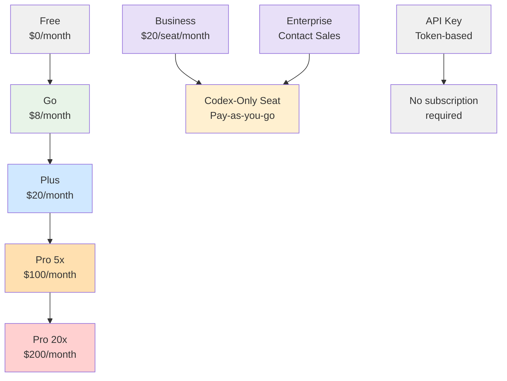
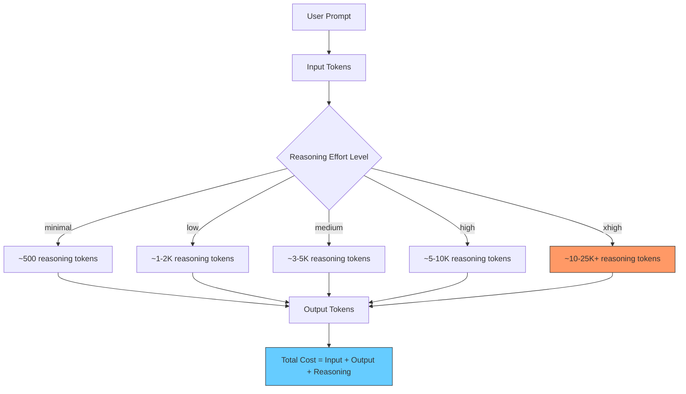
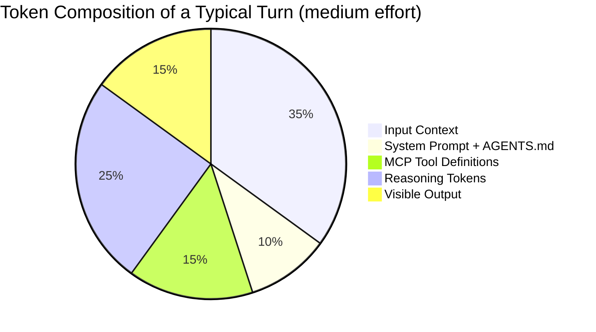
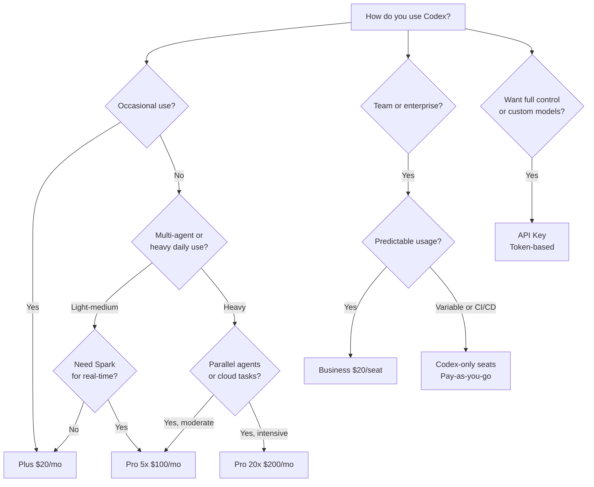
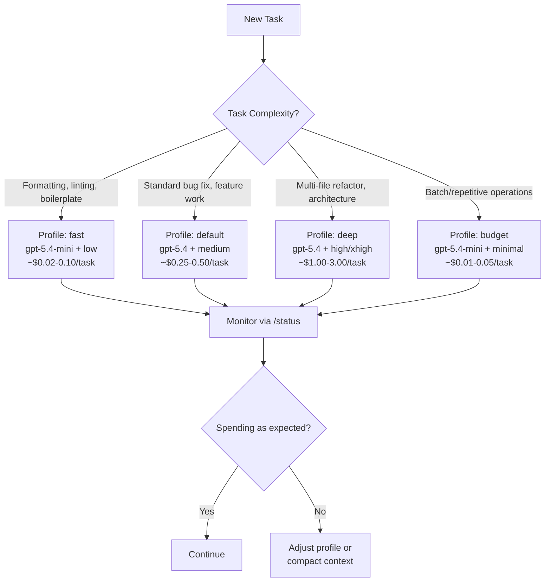

# The Complete Codex CLI Pricing Guide: Subscriptions, Tokens, Cost Optimisation, and Competitive Analysis

Every AI coding agent runs on tokens, and tokens cost money. Codex CLI is unique among major AI coding agents: it is open-source, runs locally, and supports both subscription-based and direct API billing — giving power users token-level cost control that no competitor offers. But the pricing landscape is complex: subscription tiers, API key billing, credit systems, model selection, reasoning effort levels, and caching economics all interact to determine what you actually pay.

This guide consolidates everything a Codex CLI practitioner needs to understand about pricing into a single reference. It covers every billing path, models the costs for each type of user, compares Codex CLI against Cursor, GitHub Copilot, Claude Code, and Windsurf, and provides actionable strategies for reducing spend by 50-80%.

---

## Part 1: The Billing Paths

As of April 2026, there are four ways to pay for Codex CLI usage[^api-pricing][^codex-pricing]:

| Path | How It Works | Rate Limits | Billing |
|------|-------------|-------------|---------|
| **Subscription (Plus/Pro)** | Authenticate via ChatGPT account | Rolling 5-hour windows, dynamic limits | Flat monthly fee |
| **Business Standard Seat** | ChatGPT Business workspace | Plan limits + optional credit top-ups | \$20/seat/month + credits |
| **Business Codex-Only Seat** | Codex access only, no ChatGPT | No rate limits | \$0/seat + token consumption |
| **API Key (Direct)** | OpenAI API key in `config.toml` | Standard API rate limits only | Per-token, pay-as-you-go |

---

## Part 2: The Complete Subscription Tier Map

On 9 April 2026, OpenAI announced a new \$100/month ChatGPT Pro tier that slots between the \$20 Plus plan and the former \$200 Pro plan — now rebranded as Pro 20x[^techcrunch-pro]. Combined with the \$8 Go tier and the pay-as-you-go Codex-only seats launched on 3 April[^codex-payg], the subscription landscape was comprehensively restructured. Codex now has over 3 million weekly active users — a fivefold increase in three months, with 70% month-over-month growth[^business-today].



### Consumer and Individual Tiers

| Tier | Price | Codex CLI Local Messages (5 hr) | Cloud Tasks | Spark Access | Key Use Case |
|------|-------|-------------------------------|-------------|--------------|--------------|
| **Free** | \$0 | Limited | — | — | Quick exploration |
| **Go** | \$8/mo | Light | — | — | Lightweight coding tasks |
| **Plus** | \$20/mo | 20-100 (GPT-5.4) / 60-350 (mini) / 30-150 (5.3-Codex) | Limited | — | Daily development |
| **Pro 5x** | \$100/mo | 200-1,000 (GPT-5.4) / 600-3,500 (mini) / 300-1,500 (5.3-Codex) | Available | Research preview | Professional daily use |
| **Pro 20x** | \$200/mo | 400-2,000 (GPT-5.4) / 1,200-7,000 (mini) / 600-3,000 (5.3-Codex) | Available | Research preview | Intensive parallel workflows |

All usage limits operate on a rolling 5-hour window rather than a daily cap[^codex-pricing].

### Team and Enterprise Tiers

| Tier | Price | Differentiator |
|------|-------|---------------|
| **Business** | \$20/seat/mo (down from \$25) | Standard seats with Codex usage cap; optional Codex-only seats |
| **Codex-Only Seat** | Pay-as-you-go (token-based) | No rate limits; billed on consumption; up to \$500 promo credits per member[^codex-payg] |
| **Enterprise** | Contact sales | SAML SSO, SCIM, EKM, RBAC, audit logs, data retention, credit pools |
| **Edu** | Contact sales | Same enterprise security, education pricing |

### API Key Access

Developers can bypass subscription tiers entirely by authenticating with an API key[^codex-pricing]. This provides:

- Token-based billing at published API rates
- No cloud features (cloud tasks require ChatGPT authentication)
- Access to any API-supported model, including custom providers via `[model_providers]` in `config.toml`
- No rate limit resets tied to subscription events

### What Each Subscription Plan Provides in Token Terms

| Plan | Monthly Price | Max Tokens/Month (est.) | Effective $/M Tokens | Best For |
|------|-------------|------------------------|---------------------|----------|
| Plus | \$20 | ~10M-48M | ~\$0.42-2.00 | Light users |
| Pro 5x | \$100 | ~48M-240M | ~\$0.42 | Medium users |
| Pro 20x | \$200 | ~192M-960M | ~\$0.21 | Heavy users (if under ceiling) |

Plus provides 20-100 GPT-5.4 messages per 5-hour window[^codex-pricing]. At ~8,000 tokens per message and 3 usable windows per day, that is 2.4M-12M tokens/week or ~10M-48M/month. Pro 5x and Pro 20x multiply these limits accordingly.

### Credit Consumption Per Task

Each model consumes credits differently for local versus cloud tasks:

| Model | Local Task | Cloud Task | Code Review |
|-------|-----------|------------|-------------|
| GPT-5.4 | ~7 credits | ~34 credits | ~34 credits |
| GPT-5.3-Codex | ~5 credits | ~25 credits | ~25 credits |
| GPT-5.4-mini | ~2 credits | N/A | N/A |

Fast mode doubles credit consumption across all models[^codex-rate-card].

### The Pro 5x Sweet Spot

The \$100 Pro tier is the headline change for Codex CLI users:

**5x the message throughput.** Where Plus gives you 20-100 GPT-5.4 local messages per 5-hour window, Pro 5x gives you 200-1,000[^codex-pricing]. For a typical subagent workflow running an orchestrator plus three workers, that is the difference between hitting the wall mid-afternoon and running comfortably through a full working day.

**GPT-5.3-Codex-Spark access.** Spark — the Cerebras-powered model running at 1,000+ tokens per second — remains exclusive to Pro subscribers[^codex-models]. For interactive refinement workflows where near-instant feedback changes how you work, this alone may justify the upgrade from Plus.

**Promotional 10x boost through May 2026.** Until 31 May, Pro 5x subscribers receive a temporary 2x multiplier on top of the standard 5x, effectively giving 10x Plus usage[^techcrunch-pro]. The shown limits on the pricing page already include this boost — they will halve on 1 June.

Configuring Spark in your profile:

```toml
# ~/.codex/config.toml

[profiles.spark]
model = "gpt-5.3-codex-spark"
model_reasoning_effort = "high"

[profiles.spark.model_providers.openai]
# Spark requires ChatGPT authentication, not API key
```

```bash
codex --profile spark "refactor the auth module to use PKCE"
```

---

## Part 3: API Token Rates

For Business plan users or anyone using the API directly, per-million-token pricing applies[^api-pricing]:

| Model | Input ($/M) | Cached Input ($/M) | Output ($/M) | Notes |
|-------|------------|-------------------|-------------|-------|
| GPT-5.4-pro | \$30.00 | — | \$180.00 | Reasoning-only, no cache discount |
| GPT-5.4 (priority) | \$5.00 | \$0.50 | \$30.00 | Guaranteed low-latency SLA |
| GPT-5.4 | \$2.50 | \$0.25 | \$15.00 | Frontier capability |
| GPT-5.3-Codex | \$1.75 | \$0.175 | \$14.00 | Code-specialised |
| GPT-5.3-Codex (priority) | \$3.50 | \$0.35 | \$28.00 | Code-specialised, low-latency |
| GPT-5.4-mini | \$0.75 | \$0.075 | \$4.50 | The sweet spot for most tasks |
| GPT-5.4-mini (priority) | \$1.50 | \$0.15 | \$9.00 | Mini with low-latency SLA |
| GPT-5.4-nano | \$0.20 | \$0.02 | \$1.25 | Batch/scripted work only |

GPT-5.4-pro at \$30/\$180 per million tokens (input/output) has **no cached input discount**[^api-pricing]. At heavy volume it costs \$12,300/week for just 50M tokens. This model is designed for complex multi-step reasoning — research problems, novel algorithm design — not routine coding tasks. Using it as a default model is a billing catastrophe.

The 90% cached input discount is the most important number in this table. Codex CLI's prefix caching means that in a typical session, 60-80% of input tokens hit the cache. A session that appears to cost \$2.50/M input tokens effectively costs \$0.50-1.00/M when caching is factored in[^model-selection].

### Credit-Based Billing (Business / Codex-Only Seats)

For pay-as-you-go seats, costs are calculated per million tokens in credits[^codex-payg]:

| Model | Input (credits/1M) | Cached Input | Output |
|-------|-------------------|--------------|--------|
| GPT-5.4 | 62.50 | 6.25 | 375.00 |
| GPT-5.4-mini | 18.75 | 1.875 | 113.00 |
| GPT-5.3-Codex | 43.75 | 4.375 | 350.00 |

The cached input rate — roughly 10x cheaper than uncached — makes prompt caching and session resumption significant cost levers[^codex-pricing].

### Relative Pricing Index (vs GPT-5.4 as 1.00x)

| Model | Cost Index | Plain English |
|-------|-----------|---------------|
| GPT-5.4-pro | 6.58x | 6.6x more expensive — reasoning-only |
| GPT-5.4 (priority) | 2.00x | 2x baseline — low-latency SLA |
| **GPT-5.4** | **1.00x** | **Baseline** |
| GPT-5.3-Codex | 0.89x | 11% cheaper — code-specialised |
| GPT-5.4-mini | 0.30x | **70% cheaper — the sweet spot** |
| GPT-5.4-nano | 0.08x | 92% cheaper — batch only |

**Key insight: GPT-5.4-mini delivers ~80% of GPT-5.4's coding capability at 30% of the cost.**[^model-selection] For a heavy user, defaulting to mini and escalating to full 5.4 only when needed is the single most impactful cost decision.

---

## Part 4: What Users Actually Consume

Before modelling costs, we need to establish what developers actually use. The figures below are drawn from Codex CLI community reports, usage tracking tools, and industry studies of agentic coding tools.

### Per-Session Token Consumption

| Metric | Tokens | Source |
|--------|--------|--------|
| Median context per turn | ~96K | Codex CLI usage spike analysis[^bswen] |
| p95 context per turn | ~200K | Same source[^bswen] |
| Session startup overhead | 21-22K | Up from 12-15K in earlier versions[^bswen] |
| Typical session (simple task) | 10K-100K | Industry agentic tool studies[^faros] |
| Typical session (agent workflow) | 200K-500K | Morph AI coding cost study[^morph] |
| Baseline session cost (GPT-5.4-mini rates) | \$0.45-2.25 | Calculated from session tokens at \$0.75/\$4.50 per M[^api-pricing] |

A critical finding: **60-80% of tokens in agentic sessions are waste** — spent on finding code, re-reading context, and retrying, not on writing code[^morph]. Shell tool outputs alone account for 90.3% of all tool-output characters[^bswen].

### Per-Developer Daily and Weekly Consumption

The table below draws from Codex CLI community reports and comparable agentic tool data. No large-scale Codex CLI usage study has been published yet, so the daily cost estimates are derived from similar agentic coding tools (primarily Claude Code) and translated to GPT-5.4-mini API rates[^api-pricing]. The relative tiers — light through extreme — are consistent across tools because they reflect developer behaviour, not tool-specific factors:

| Developer Profile | Estimated Tokens/Week | Weekly API Cost (5.4-mini) | Monthly API Cost (5.4-mini) | Source |
|-------------------|----------------------|---------------------------|----------------------------|--------|
| **Light** (1-2 sessions/day) | ~2M | ~\$9 | ~\$36 | Community reports, BSWEN[^bswen] |
| **Medium** (3-5 hours/day) | ~10M | ~\$45 | ~\$180 | Industry average[^faros][^morph] |
| **Heavy** (multi-agent workflows) | ~50M | ~\$225 | ~\$900 | Morph AI, community reports[^morph][^openai-forum] |
| **Extreme** (documented outlier) | ~300M | ~\$1,350 | ~\$5,400 | Community case studies[^verdent] |

Data from comparable agentic coding tools (notably Claude Code, the closest published dataset) shows the **average developer spends \$5-8/day** on API-rate usage, with **90% of developers staying below \$12/day**[^faros]. Translating these figures to GPT-5.4-mini rates, 90% of developers would consume fewer than ~5M tokens/week.

### Community-Reported Pain Points

Real Codex CLI developer reports confirm these ranges[^bswen][^openai-forum][^reddit-api-cost]:

- A single Codex CLI prompt consuming **7% of weekly Plus limits** (~600K tokens based on limit structure)
- One user exhausting **97% of weekly allowance after just three prompts**
- A Plus user burning **25% of weekly limit in 30 minutes**
- A one-line configuration change consuming **~2% of the 5-hour quota**
- A single GPT-5.4 xHigh prompt on a **7,000-line codebase cost ~\$3.50** via API key — 7 minutes of work, ~4M tokens consumed across 34 API requests (each tool execution is a separate request), with auto-compaction mid-session[^reddit-api-cost]

That last data point is particularly revealing: even assuming a generous 90% margin, OpenAI's cost for that single prompt would be ~\$0.35 — which means Plus subscribers getting unlimited prompts at \$20/month are receiving substantial subsidies.

### Token Mix Assumptions

For the cost calculations that follow, we assume this token mix (consistent across all tiers):

| Component | Share | Why |
|-----------|-------|-----|
| Input (uncached) | 24% | Fresh context, new files, first turns |
| Input (cached) | 56% | Prefix caching in sustained sessions (70% cache hit rate)[^model-selection] |
| Output | 20% | Agent edits are targeted; prompts are long |

This 70% cache hit rate reflects Codex CLI's prefix caching in sustained sessions. Short sessions or frequent context switches reduce it to 30-50%, significantly increasing costs.

---

## Part 5: Subscription vs API Key — The Head-to-Head Comparison

This is the central question. For each type of user, what does the subscription cost versus what they would pay on an API key?

### Plan vs API Cost Per User Type

| User Type | Tokens/Week | Tokens/Month | Best Subscription | Sub Cost/Month | API Cost/Month (5.4-mini) | Winner | Saving |
|-----------|------------|-------------|-------------------|---------------|--------------------------|--------|--------|
| **Light** | 2M | ~8M | Plus (\$20) | **\$20** | \$36 | Sub | \$16/mo (44%) |
| **Medium** | 10M | ~40M | Plus (\$20) | **\$20** | \$180 | Sub | \$160/mo (89%) |
| **Heavy** | 50M | ~200M | Pro 20x (\$200) | **\$200** | \$900 | Sub | \$700/mo (78%) |
| **Extreme** | 300M | ~1.2B | None (ceiling exceeded) | N/A | \$5,400 | API only | — |
| **Team of 10** | 100M | ~400M | Codex-only seats | \$0 + tokens | \$1,800 | Codex-only | Admin controls |
| **Team of 50 + CI/CD** | 1B | ~4.3B | Codex-only + Batch | \$0 + tokens | \$4,500-9,000 | Codex-only | Admin + batch |

**Key findings:**
- For light and medium users, **subscriptions are massively subsidised** — Plus at \$20/month provides \$180/month of API-equivalent usage
- For heavy users consuming up to ~200M tokens/month, **Pro 20x at \$200/month still beats API rates** — you get \$900 worth of API usage for \$200
- The **subscription ceiling breaks at ~960M tokens/month** (~240M/week). Above that, no subscription plan has enough capacity
- **One billion tokens/week is a team-level volume** — 50 developers plus CI/CD pipelines, not an individual at a keyboard

### The Same Comparison With GPT-5.4 (Full Model)

If you use GPT-5.4 instead of 5.4-mini, the subscription subsidy is even larger — but you hit rate limits sooner because each message consumes more of the allowance:

| User Type | Tokens/Week | API Cost/Month (5.4) | API Cost/Month (5.4-mini) | Best Sub Cost | Sub Saving vs 5.4 | Sub Saving vs mini |
|-----------|------------|---------------------|--------------------------|--------------|-------------------|-------------------|
| **Light** | 2M | \$120 | \$36 | \$20 (Plus) | \$100 (83%) | \$16 (44%) |
| **Medium** | 10M | \$600 | \$180 | \$20 (Plus) | \$580 (97%) | \$160 (89%) |
| **Heavy** | 50M | \$3,000 | \$900 | \$200 (Pro 20x) | \$2,800 (93%) | \$700 (78%) |
| **Extreme** | 300M | \$18,000 | \$5,400 | N/A | API only | API only |

The subsidy on Plus is staggering: a medium user on GPT-5.4 gets **\$600 of API value for \$20**. This is why OpenAI imposes strict rate limits — the subscription is deliberately priced well below cost.

### API Key Cost Per Session

**A typical 30-minute Codex CLI session** consumes roughly:
- 50,000-100,000 input tokens (with 70% cache hit rate -> effective cost: 15,000-30,000 uncached + 35,000-70,000 cached)
- 10,000-30,000 output tokens

**Cost using GPT-5.4 API rates:**
- Input (uncached): 30K x \$2.50/M = \$0.075
- Input (cached): 70K x \$0.25/M = \$0.018
- Output: 20K x \$15.00/M = \$0.30
- **Total per session: ~\$0.39**

At 4-6 sessions per day, that is \$1.56-2.34/day or **\$31-47/month** — comparable to the \$20 Plus subscription but with no rate limits and full control over model selection.

**Cost using GPT-5.4-mini API rates:**
- Input (uncached): 30K x \$0.75/M = \$0.023
- Input (cached): 70K x \$0.075/M = \$0.005
- Output: 20K x \$4.50/M = \$0.09
- **Total per session: ~\$0.12**

At 4-6 sessions per day: **\$10-14/month**. Cheaper than every subscription except Copilot Free.

### API Key Costs at 1B Tokens/Week (Team Scale)

No subscription plan can sustain 1B tokens/week. Here is what it costs on the API:

| Model | Weekly Cost | Monthly Cost |
|-------|-----------|-------------|
| GPT-5.4 | \$3,740 | \$14,960 |
| GPT-5.4-mini | \$1,122 | \$4,488 |
| GPT-5.4-nano | \$309 | \$1,237 |
| Blended (70/25/5 mini/5.4/nano) | \$1,736 | \$6,943 |
| Mini (Batch API) | \$561 | \$2,244 |

---

## Part 6: The Extra Usage Credits Change

In April 2026, OpenAI adjusted how Extra Usage Credits are billed for ChatGPT subscribers, sparking widespread confusion. A Reddit thread in r/codex documented the misunderstanding clearly: many users interpreted the announcement as "subscriptions now cost the same as the API," which is not what happened[^reddit-extra-credits].

### How Quota + Overflow Billing Actually Works

Every ChatGPT subscription (Plus, Pro) provides two layers of included usage:

1. **5-Hour Rolling Quota** — a dynamic allocation that refreshes on a rolling basis. This is the primary usage pool.
2. **Weekly Quota** — a secondary cap that prevents sustained heavy use from exceeding what the subscription is designed to cover.

When both quotas are exhausted, you have two options: wait for the quota to refresh, or purchase **Extra Usage Credits** — an optional top-up that lets you keep working at overflow rates. If you never buy Extra Usage Credits, the pricing change does not affect you at all.

### What Changed and What Did Not

| Component | Before the Change | After the Change |
|-----------|-------------------|------------------|
| Monthly subscription fee | Unchanged | Unchanged |
| 5-hour rolling quota | Unchanged | Unchanged |
| Weekly quota | Unchanged | Unchanged |
| Extra Usage Credits (overflow) | **Discounted** vs API rates | **Same** as API rates |

The change removed the discount on Extra Usage Credits. Previously, overflow usage was cheaper than going directly to the API. Now it costs the same. That is the entire change — the subscription quotas, which represent the core value of Plus and Pro, are unaffected.

### The Three-Way Distinction

| Billing Layer | How You Access It | Effective Cost | When It Applies |
|---------------|-------------------|----------------|-----------------|
| **Subscription quota** | Included with Plus (\$20/mo) or Pro (\$100/mo) | Massively subsidised | Normal usage within rolling and weekly limits |
| **Extra Usage Credits** | Optional purchase when quotas are exhausted | Now equal to API rates | Overflow usage only — you must opt in |
| **Direct API key** | Separate API key in `config.toml` | Standard per-token rates | Always — no quotas, no limits beyond API rate caps |

The subscription quota remains the best deal in the table. A medium user on Plus still gets ~\$180/month of API-equivalent value for \$20 — that has not changed. The only thing that changed is the price you pay if you voluntarily buy more tokens after exhausting your included allocation.

### Practical Guidance: When Each Layer Matters

**Plus (\$20/month)** is generous for light users but constrains heavy Codex CLI use significantly. Community reports indicate that Plus's 5-hour quota can be consumed in roughly 10 minutes of sustained Codex CLI activity[^reddit-extra-credits].

**Pro (\$100/month)** is substantially more generous. One user reported barely reaching 50% of the 5-hour limit after four hours of nonstop use with GPT-5.4 on high effort[^reddit-extra-credits].

**When to use the API instead of a subscription:** if you are a commercial entity that needs predictable, uncapped throughput — or if your usage regularly exceeds Pro's weekly ceiling (~240M tokens/week). For individual developers, the subscription quota still provides significant value.

---

## Part 7: Reasoning Effort — The Second Cost Knob

Every API call to a reasoning model generates two categories of tokens you pay for: the visible output and the hidden reasoning chain the model works through before responding. In Codex CLI, the `model_reasoning_effort` setting directly controls how long that reasoning chain runs — and therefore how much each turn costs[^reasoning-guide]. Getting this setting right is the difference between a productive \$5 day and a bewildering \$50 one.

### How Reasoning Tokens Work

OpenAI's o-series and GPT-5.x models use chain-of-thought reasoning: they generate internal "thinking" tokens before producing the visible response[^reasoning-guide]. These reasoning tokens occupy space in the context window and are billed as output tokens[^reasoning-effort] — which, at current pricing, are significantly more expensive than input tokens.

A short response might use 2,000 visible output tokens but 10,000 reasoning tokens behind the scenes[^tokenmix]. The `reasoning.effort` parameter (exposed in Codex CLI as `model_reasoning_effort`) controls how many of these thinking tokens the model generates before committing to an answer.



The key insight: reasoning tokens are billed at the output token rate. On GPT-5.4, that is 375 credits per million tokens — six times the input rate of 62.50 credits per million[^codex-pricing]. On the API, output tokens for GPT-5.3-Codex cost \$14.00 per million versus \$1.75 per million for input[^nxcode]. Every additional reasoning token hits at the expensive rate.

### The Six Effort Levels

Codex CLI supports six reasoning effort values via the Responses API[^codex-config]:

| Level | Typical Reasoning Tokens | Best For | Relative Cost |
|-------|--------------------------|----------|---------------|
| `none` | 0 | Extraction, routing, simple transforms | 1x (baseline) |
| `minimal` | ~200-500 | Trivial lookups, formatting (GPT-5 family only) | ~1.1x |
| `low` | ~1-2K | Standard code generation, boilerplate | ~1.5x |
| `medium` | ~3-5K | Most development work (default) | ~2-3x |
| `high` | ~5-10K | Complex bugs, multi-file architecture | ~4-6x |
| `xhigh` | ~10-25K+ | Security audits, large refactors, migrations | ~8-15x |

These token ranges are approximate and vary significantly by prompt complexity. OpenAI has noted that "a query that uses 500 reasoning tokens on one request might use 5,000 on a slightly different phrasing"[^tokenmix].

The critical benchmark: **xhigh reasoning can use 3-5x more tokens than medium for the same prompt**[^blake-crosley]. On a complex task that already generates substantial reasoning at medium effort, switching to xhigh can push a \$0.50 turn past \$2.00.

### Configuring Reasoning Effort

**In config.toml:**

```toml
model = "gpt-5.4"
model_reasoning_effort = "medium"
```

**Via command line override:**

```bash
codex -c model_reasoning_effort="high" "explain this race condition"
```

**During an interactive session** — use the `/reasoning` slash command to switch effort levels mid-session without restarting[^screenfluent]:

```
/reasoning high
```

**Plan mode override** — think deeply during planning but execute cheaply:

```toml
model_reasoning_effort = "low"
plan_mode_reasoning_effort = "high"
```

This is particularly effective: you get thorough analysis during the planning phase where reasoning quality matters most, then drop to cheaper execution for the actual code generation[^codex-config].

### The Hidden Cost Multipliers

Beyond reasoning effort, several factors silently inflate token consumption:

**System prompt and AGENTS.md overhead.** Every turn includes the system prompt and your `AGENTS.md` file, adding approximately 2-5K tokens per turn[^blake-crosley]. A verbose AGENTS.md in a large monorepo can push this higher.

**MCP server tool definitions.** Each connected MCP server registers its tool definitions in every API call. Each tool adds roughly 200-500 tokens of schema overhead[^blake-crosley]. Five MCP servers with ten tools each means 10-25K tokens of overhead per turn — before you have even asked a question.

**Shell output bloat.** One study found that shell command output accounted for 90.3% of all tool-output characters in typical sessions[^bswen]. A single `ls -la` on a large directory or a verbose test runner can inject thousands of tokens into your context.



---

## Part 8: Model Selection and Blended Strategies

Once you are past the subscription ceiling and using an API key, model selection becomes the primary cost control.

### Blended Model Strategies

Most heavy API users should not pick a single model. Here is how different blending strategies compare at the heavy individual tier (50M tokens/week):

| Strategy | Model Mix | Monthly Cost | vs All-5.4 | vs All-mini |
|----------|----------|-------------|-----------|------------|
| All GPT-5.4 | 100% 5.4 | \$7,480 | — | +233% |
| Conservative blend | 50% mini / 40% 5.4 / 10% nano | \$4,584 | -39% | +104% |
| **Recommended blend** | **70% mini / 25% 5.4 / 5% nano** | **\$3,472** | **-54%** | **+55%** |
| Aggressive blend | 85% mini / 10% 5.4 / 5% nano | \$2,660 | -64% | +19% |
| All GPT-5.4-mini | 100% mini | \$2,244 | -70% | — |
| All GPT-5.4-nano | 100% nano | \$619 | -92% | -72% |
| Budget batch | 100% mini (batch/flex) | \$1,122 | -85% | -50% |

A blended strategy using Codex CLI profiles:

```toml
[profiles.default]
model = "gpt-5.4-mini"          # 70% of tasks

[profiles.complex]
model = "gpt-5.4"               # 25% of tasks

[profiles.bulk]
model = "gpt-5.4-nano"          # 5% of tasks
```

### Cost-Optimised Profiles With Reasoning Effort

The most effective cost strategy pairs the right model with the right reasoning effort for each class of task:

```toml
# ~/.codex/config.toml

# Default: balanced for everyday work
model = "gpt-5.4"
model_reasoning_effort = "medium"

[profiles.fast]
# Quick tasks: boilerplate, formatting, simple fixes
model = "gpt-5.4-mini"
model_reasoning_effort = "low"
model_reasoning_summary = "none"

[profiles.deep]
# Hard problems: security review, architecture, complex debugging
model = "gpt-5.4"
model_reasoning_effort = "xhigh"
model_reasoning_summary = "detailed"

[profiles.budget]
# Cost-conscious batch work
model = "gpt-5.4-mini"
model_reasoning_effort = "minimal"
model_reasoning_summary = "none"
```

Invoke with the `-p` flag:

```bash
# Quick formatting fix — cheap and fast
codex -p fast "fix the linting errors in src/utils.ts"

# Deep security review — expensive but thorough
codex -p deep "audit this authentication module for vulnerabilities"

# Batch processing on a budget
codex -p budget "add JSDoc comments to all exported functions"
```

Switching from GPT-5.4 to GPT-5.4-mini alone achieves approximately a 2.5-3.3x cost reduction[^codex-pricing]. Combining that with a drop from `medium` to `low` reasoning effort compounds the savings — users report 40-60% cost reductions for routine tasks[^blake-crosley].

### Batch and Flex Processing (50% Discount)

For non-interactive workloads (CI/CD, code review pipelines, bulk refactoring), the Batch API and Flex processing both halve costs[^api-pricing]:

| Model | Standard Monthly (50M/wk) | Batch/Flex Monthly | Savings |
|-------|--------------------------|-------------------|---------|
| GPT-5.4 | \$7,480 | \$3,740 | 50% |
| GPT-5.4-mini | \$2,244 | \$1,122 | 50% |
| GPT-5.4-nano | \$619 | \$310 | 50% |
| GPT-5.3-Codex | \$6,636 | \$3,318 | 50% |

---

## Part 9: Cache Efficiency — The Hidden Cost Lever

The calculations above assume a 70% cache hit rate on input tokens. This number is not guaranteed — it depends on how you use Codex CLI:

| Usage Pattern | Typical Cache Hit Rate | Impact on Monthly Cost (5.4-mini, 50M/wk) |
|---------------|----------------------|-------------------------------------------|
| Long continuous sessions (30+ min) | 75-85% | \$1,960-2,100 |
| Short sessions, same codebase | 60-70% | \$2,200-2,400 |
| Frequent context switches | 30-50% | \$2,600-3,000 |
| Cold starts (new repos, CI/CD) | 5-15% | \$3,200-3,600 |

The difference between best-case and worst-case caching is **~\$1,500/month** on GPT-5.4-mini for a heavy user. For GPT-5.4, the gap widens to **~\$4,800/month**.

Maximising cache hits is the second most impactful cost lever after model selection:

- **Use long sessions** rather than many short ones
- **Keep the same codebase context** across prompts within a session
- **Use profiles** to avoid switching models mid-session (model switches invalidate the cache)
- **Avoid `--no-cache`** unless debugging

---

## Part 10: Business Codex-Only Seats

Codex-only seats on ChatGPT Business bill at token consumption rates with no fixed monthly fee and no rate limits[^codex-rate-card]. For organisations, this provides:

- **Per-user spend controls** — admins set monthly credit limits per seat or per user[^spend-controls]
- **Centralised billing** — all usage appears on the workspace invoice
- **No rate limits** — unlike Plus/Pro, consumption is not gated by 5-hour windows
- **Usage monitoring** — admins can view per-user and per-seat-type consumption in the workspace billing dashboard[^spend-controls]

The token rates for Codex-only seats align with standard API pricing[^codex-rate-card]. For a team, this means the same costs as API key billing but with enterprise controls layered on top.

### Standard Business Seats and Codex CLI

A Standard Business seat (\$20/month) includes Codex CLI access with the same rate limits as Plus[^codex-rate-card]. Critically, **Codex usage on Standard Business seats does consume from the seat's allocation and is visible to workspace admins** — admins can see per-user credit consumption and set spend limits by seat type or by individual user[^spend-controls]. This means:

- Usage is **monitored**: yes, workspace admins see Codex consumption
- Usage is **capped**: Standard seats are subject to the same 5-hour rolling window limits as Plus
- **Overage billing**: if credits are exhausted, usage stops unless the admin has enabled additional credit purchasing

For heavy users on Business plans, the recommended setup is a Codex-only seat rather than a Standard seat — it removes the rate limit ceiling and provides cleaner usage attribution.

---

## Part 11: Competitive Analysis — What You Pay Elsewhere

### Cursor

| Plan | Price | Model Access | Usage |
|------|-------|-------------|-------|
| Hobby | Free | Limited models | Limited agent + tab completions |
| Pro | \$20/mo | Frontier models (GPT-5.4, Claude, Gemini) | Extended agent limits |
| Pro+ | \$60/mo | Same models | 3x usage on all models |
| Ultra | \$200/mo | Same models | 20x usage, priority features |
| Teams | \$40/user/mo | Same models | Shared chats, SSO, analytics |
| Enterprise | Custom | Same models | Pooled usage, SCIM, admin controls |

Cursor's pricing is opaque by design — "extended limits" and "3x usage" give no concrete token budgets. The advantage is model flexibility: Cursor routes to GPT-5.4, Claude Sonnet 4.6, or Gemini depending on the task, and the subscription covers all of them. The disadvantage is that you cannot predict or control costs at the token level[^cursor-pricing].

### GitHub Copilot

| Plan | Price | Premium Requests | Models |
|------|-------|-----------------|--------|
| Free | \$0/mo | 50 chat requests/mo | Limited |
| Pro | \$10/mo | 300 premium requests/mo | GPT-5.4, Claude Sonnet |
| Pro+ | \$39/mo | 1,500 premium requests/mo | All models incl. Claude Opus 4, o3 |
| Business | \$19/user/mo | 300 premium/user/mo | Frontier models, org management |
| Enterprise | \$39/user/mo | 1,000 premium/user/mo | All models incl. Opus 4.6, GitHub Spark |

Copilot uses "premium requests" as its unit of consumption. A premium request is a single interaction with a frontier model — not a token count but a request count. Additional premium requests beyond plan limits are billed at \$0.04 each. The Pro tier at \$10/month is the cheapest entry point to frontier model access across any tool in this comparison[^copilot-plans].

### Claude Code (Anthropic)

| Plan | Price | Usage | Models |
|------|-------|-------|--------|
| Pro | \$20/mo | Base rate limits | Claude Sonnet 4.6 |
| Max 5x | \$100/mo | 5x Pro limits (~88K tokens/5hr) | Sonnet 4.6, Opus 4.6 |
| Max 20x | \$200/mo | 20x Pro limits (~220K tokens/5hr) | Sonnet 4.6, Opus 4.6 |
| Team | Per-seat pricing | Pooled usage | All models, admin |
| Enterprise | Custom | Custom | All models, SSO, compliance |

Claude Code's API rates per million tokens[^claude-pricing]:

| Model | Input | Output |
|-------|-------|--------|
| Claude Opus 4.6 | \$5.00 | \$25.00 |
| Claude Sonnet 4.6 | \$3.00 | \$15.00 |
| Claude Haiku 4.5 | \$1.00 | \$5.00 |

Anthropic recently simplified pricing: the full 1M-token context window is now at standard rates for Opus 4.6 and Sonnet 4.6, eliminating the long-context surcharge. Prompt caching (90% savings) and batch API (50% off) can stack for up to 95% cost reduction[^claude-pricing].

### Windsurf (formerly Codeium)

| Plan | Price | Usage | Models |
|------|-------|-------|--------|
| Free | \$0/mo | Light quota (daily/weekly refresh) | Limited models |
| Pro | \$20/mo | Standard allowance (daily/weekly refresh) | All premium models, SWE-1.5 |
| Max | \$200/mo | Heavy quota (daily/weekly refresh) | All premium models, SWE-1.5 |
| Teams | \$40/user/mo | Standard allowance per seat | Admin dashboard, RBAC, SSO |
| Enterprise | Custom | Unlimited | Hybrid deployment, volume discounts |

Windsurf has moved away from its original credit-based system to a quota model with daily and weekly refreshing allowances. Exact token or request counts are not published. Add-on credits can still be purchased: \$10 for 250 (Pro) or \$40 for 1,000 (Teams/Enterprise)[^windsurf-pricing].

### The Competitive Mirror: Claude Max

Anthropic's Claude pricing now mirrors OpenAI's structure almost exactly[^claude-max]:

| | OpenAI Codex | Anthropic Claude Code |
|---|---|---|
| Base tier | Plus \$20/mo | Pro \$20/mo |
| Mid tier | Pro 5x \$100/mo | Max 5x \$100/mo |
| Top tier | Pro 20x \$200/mo | Max 20x \$200/mo |
| Usage model | 5-hour rolling window | ~5-hour rolling window |
| Pay-as-you-go | Codex-only seats (token-based) | API key only |

The structural similarity is not coincidental. Both companies are converging on the same insight: professional developers will pay \$100/month for 5x throughput, but the \$20-to-\$200 jump was losing them to the competitor[^dataconomy].

Key differentiators remain:

- **Codex** offers pay-as-you-go enterprise seats with no rate limits — Claude has no equivalent[^codex-payg]
- **Codex** has Spark for near-instant feedback loops — Claude has no speed-optimised model tier[^codex-models]
- **Claude Code** scores higher on Terminal-Bench (Claude's Opus 4.6 model is generally rated #1 on multi-file refactoring tasks)[^dataconomy]
- **Claude Max** includes priority access to new models and features like voice mode[^claude-max]

### Why These Tools Are Not Directly Comparable

These tools are not like-for-like substitutes, and comparing their subscription prices as if they were is misleading.

**Codex CLI** is a terminal-based agent. It reads your codebase, proposes and applies edits, runs commands, and iterates — but it has no IDE, no tab completions, no inline chat, no GUI.

**Cursor** is a full IDE (VS Code fork) with tab completions, inline chat, agent mode, debugging, and multi-model routing.

**GitHub Copilot** is primarily a completion engine with chat and agent modes bolted on.

**Claude Code** is the closest analogue to Codex CLI — a terminal agent — but it runs on Anthropic's model stack.

**Windsurf** is another full IDE with its own model (SWE-1.5), tab completions, and an agent mode.

The practical implication: **most teams will not replace Cursor or Copilot with Codex CLI**. They will use Codex CLI alongside their IDE tool. The relevant cost question is not "which one is cheaper?" but "what does adding Codex CLI to my existing stack cost, and what additional value does it deliver?"

---

## Part 12: Enterprise Cost Comparison

For a team of 50 developers:

| Tool | Plan | Monthly Cost | Annual Cost |
|------|------|-------------|-------------|
| Codex CLI | Plus (all users) | \$1,000 | \$12,000 |
| Codex CLI | Pro 5x (all users) | \$5,000 | \$60,000 |
| Codex CLI | Business (API) | \$2,000-8,000 | \$24,000-96,000 |
| Cursor | Teams | \$2,000 | \$24,000 |
| Cursor | Enterprise | Custom | Custom |
| GitHub Copilot | Business | \$950 | \$11,400 |
| GitHub Copilot | Enterprise | \$1,950 | \$23,400 |
| Claude Code | Max 5x (all users) | \$5,000 | \$60,000 |
| Windsurf | Teams | \$2,000 | \$24,000 |
| Windsurf | Enterprise | Custom | Custom |

GitHub Copilot Business at \$19/user/month is the cheapest enterprise option. Codex CLI Plus at \$20/user is close but lacks centralised management. For teams needing heavy usage with admin controls, Cursor Teams and Windsurf Teams (both \$40/user) sit in the middle.

Remember: these costs stack if you use multiple tools. A team running Copilot Business (\$19/user) for IDE completions plus Codex CLI Plus (\$20/user) for agent tasks pays \$39/user — still less than a single Cursor Ultra or Claude Code Max subscription.

---

## Part 13: What Does a Real Workday Cost?

Here are practical cost scenarios for a developer running 15-20 substantial agent interactions per day — not tab completions, but multi-step tasks involving file reads, edits, test runs, and iterations.

### Scenario: 20 Substantial Tasks Per Day

| Tool | Plan | Daily Cost | Monthly Cost | Notes |
|------|------|-----------|-------------|-------|
| Codex CLI | Plus (\$20/mo) | ~\$0.67 | \$20 | May hit rate limits on heavy days |
| Codex CLI | Pro 5x (\$100/mo) | ~\$3.33 | \$100 | Comfortable headroom |
| Codex CLI | API direct | ~\$2-8 | \$40-160 | Varies by model; caching helps |
| Cursor | Pro (\$20/mo) | ~\$0.67 | \$20 | May hit "extended limits" |
| Cursor | Ultra (\$200/mo) | ~\$6.67 | \$200 | 20x usage, priority access |
| GitHub Copilot | Pro (\$10/mo) | ~\$0.33 | \$10 | 300 requests/mo = 15/workday |
| GitHub Copilot | Pro+ (\$39/mo) | ~\$1.30 | \$39 | 1,500 requests/mo = 75/workday |
| Claude Code | Pro (\$20/mo) | ~\$0.67 | \$20 | May hit rate limits |
| Claude Code | Max 20x (\$200/mo) | ~\$6.67 | \$200 | ~220K tokens/5hr window |
| Windsurf | Pro (\$20/mo) | ~\$0.67 | \$20 | Daily/weekly refresh quota |
| Windsurf | Max (\$200/mo) | ~\$6.67 | \$200 | Heavy usage quota |

---

## Part 14: Monitoring Token Spend

Codex CLI emits `token_count` events that report cumulative totals per session. The CLI subtracts previous totals to recover per-turn breakdowns across five categories: input, cached input, output, reasoning, and total[^token-issue].

### In-Session Monitoring

Use the `/status` command in the TUI to see current session token consumption. This shows a running total that updates after each turn.

### External Tooling

For systematic tracking, tools like [ccusage](https://ccusage.com/guide/codex/) parse Codex CLI session logs and provide per-model breakdowns with pricing calculations[^ccusage]. For team-scale visibility, the community-built [tokscale](https://github.com/junhoyeo/tokscale) offers leaderboards and contribution graphs across multiple AI coding tools[^tokscale].

### Setting Safety Limits

Cap worst-case costs with token limits in your config:

```toml
# Trigger automatic history compaction before context explodes
model_auto_compact_token_limit = 80000

# Limit individual tool output stored in conversation
tool_output_token_limit = 20000

# Cap session transcript size (bytes)
[history]
max_bytes = 5000000
```

The `model_auto_compact_token_limit` is particularly important. Without it, long sessions accumulate context that inflates every subsequent turn's input token count. One analysis found sessions reaching a median of 96K tokens per turn with p95 at 200K tokens[^bswen] — at GPT-5.4 input rates, that is 6-12.5 credits per turn just for context before any reasoning begins.

---

## Part 15: Hidden Costs and Gotchas

**Codex CLI cloud tasks cost 5x local tasks.** A GPT-5.3-Codex local task costs ~5 credits; the same task on Codex Cloud costs ~25 credits. Running everything in the cloud burns your budget five times faster. Use local CLI for development work and reserve cloud tasks for CI/CD and scheduled automation[^codex-rate-card].

**Fast mode doubles consumption.** Codex CLI's fast mode provides lower-latency responses but consumes twice the credits. It is useful for interactive exploration but expensive for batch work.

**Cursor's opacity is a feature and a bug.** The "3x" and "20x" multipliers sound generous, but without knowing the base rate in tokens, you cannot calculate cost-per-task.

**Copilot's "premium requests" conflate simple and complex work.** A one-line completion and a multi-file refactoring both cost one premium request. Heavy agent usage exhausts the 300/month Pro budget in two weeks.

**Claude Code's 5-hour windows reset independently.** The ~88K tokens/5hr on Max 5x is generous for focused work but can be exhausted by a single large codebase exploration.

**Windsurf's quotas are opaque.** Windsurf no longer publishes specific credit or request counts — just "standard allowance" and "heavy quota" with daily/weekly refresh cycles.

**Model deprecation risk.** The 7 April model picker update removed six models from ChatGPT-authenticated sessions[^codex-changelog]:

- `gpt-5.2-codex` — removed from picker, full removal 14 April
- `gpt-5.1-codex-mini`, `gpt-5.1-codex-max`, `gpt-5.1-codex` — deprecated 1 April
- `gpt-5.1`, `gpt-5` — removed from picker

Check your config files for deprecated models:

```bash
grep -r "gpt-5.1\|gpt-5.0\|gpt-5\"" ~/.codex/ .codex/ 2>/dev/null
```

The remaining models for ChatGPT sign-in are: `gpt-5.4` (recommended default), `gpt-5.4-mini` (subagent workhorse), `gpt-5.3-codex` (coding specialist), `gpt-5.2` (legacy), and `gpt-5.3-codex-spark` (Pro only).

---

## Part 16: Decision Frameworks

### Subscription vs API Key Decision



### Reasoning Effort Decision



---

## Part 17: Recommendations by Use Case

### By Usage Tier

**Light user (~2M tokens/week):**
- **Recommended:** Plus at \$20/month
- **API equivalent:** ~\$36/month (GPT-5.4-mini)
- **Why subscription:** 44% cheaper, simpler setup, includes ChatGPT access. You will rarely hit rate limits.

**Medium user (~10M tokens/week):**
- **Recommended:** Plus at \$20/month
- **API equivalent:** ~\$180/month (GPT-5.4-mini)
- **Why subscription:** 89% cheaper — the biggest subsidy of any tier. If rate limits become frequent, Pro 5x (\$100) eliminates the risk and is still 44% cheaper than API.

**Heavy individual (~50M tokens/week):**
- **Recommended:** Pro 20x at \$200/month
- **API equivalent:** ~\$900/month (GPT-5.4-mini) or ~\$3,000/month (GPT-5.4)
- **Why subscription:** 78% cheaper than mini API rates. If you regularly exceed ~240M tokens/week, switch to an API key with GPT-5.4-mini default and a blended model strategy.

**Extreme individual (~300M tokens/week):**
- **Recommended:** API key (no subscription has enough capacity)
- **Cost:** ~\$5,400/month on GPT-5.4-mini, or ~\$3,472/month with the recommended 70/25/5 blend
- **Why API:** Pro 20x caps out around ~240M tokens/week. There is no subscription plan that can absorb this volume.

**Team of 10 medium users (~100M tokens/week):**
- **Recommended:** Codex-only seats on ChatGPT Business
- **Cost:** ~\$1,800/month (API rates, no seat fee)
- **Why Codex-only:** Same API rates as direct API key, but with admin spend controls, per-user monitoring, and centralised billing.

**Team of 50 with CI/CD (~1B tokens/week):**
- **Recommended:** Codex-only seats (interactive) + Batch API (pipelines)
- **Cost:** Interactive at mini rates ~\$2,250/month + CI/CD on batch ~\$2,244/month = **~\$4,500/month total**
- **Why:** Far less than 50 x \$200 Pro subscriptions (\$10,000/month), with no rate limits and admin controls.

### By Workflow

**Solo developer, cost-sensitive:** GitHub Copilot Pro (\$10/mo) for completions + Codex CLI on Plus (\$20/mo) for agent tasks. Total: \$30/month for frontier model access across both workflows.

**Solo developer, heavy usage:** Codex CLI on API direct with GPT-5.4-mini as default, GPT-5.4 for complex tasks. Estimated \$30-60/month with no rate limits and full model control.

**Subagent-heavy workflows:** Pro 5x is the minimum. A typical orchestrator + 3 worker pattern can consume 15-30 messages per turn cycle. At Plus limits (20-100 messages per window), you get 1-6 full cycles. At Pro 5x (200-1,000), you get 13-66.

**CI/CD pipelines:** Use Codex-only seats with token-based billing. Rate limits are absent, and you pay only for what `codex exec` actually consumes[^codex-payg]. Set `max_tokens_per_session` in your CI profile:

```toml
# .codex/config.toml (project-level)
[profiles.ci]
model = "gpt-5.4-mini"
model_reasoning_effort = "medium"
approval_policy = "full-auto"
sandbox_mode = "read-only"
```

**Enterprise teams (50+ developers):** The Business seat price drop to \$20/month makes standard seats cheaper[^codex-payg], whilst Codex-only seats let you allocate budget to the developers and pipelines that need it. Enterprise credit pools enable department-level budgeting without per-developer licensing friction.

**Team of 10-50, needs admin controls:** GitHub Copilot Business (\$19/user) for IDE completions + Codex CLI Business (API) for agent tasks. The combination gives centralised billing, audit logs, and the full agent workflow at moderate cost.

**Power user, cost is secondary:** Codex CLI Pro 20x (\$200/mo) or Claude Code Max 20x (\$200/mo). Both provide the highest usage limits for their respective model ecosystems. Choose based on whether you prefer GPT-5.4 or Claude Sonnet 4.6 as your primary model.

**Enterprise with compliance requirements:** GitHub Copilot Enterprise (\$39/user) for fine-tuning and knowledge base, plus Codex CLI Enterprise for agent workflows with custom limits and SSO. Budget \$60-80/user/month total.

### Cost Optimisation Checklist

1. **Set `medium` as your global default reasoning effort.** It handles most development work well and avoids cost surprises.
2. **Create at least two profiles** — a `fast` profile with mini model and low effort, and a `deep` profile for genuinely hard problems.
3. **Use `plan_mode_reasoning_effort`** to separate thinking from doing. High reasoning during planning, low during execution.
4. **Monitor with `/status` regularly.** If a session's token count is climbing faster than expected, compact the history or switch profiles.
5. **Trim your MCP servers.** Only connect the servers you actively need. Each idle server still adds tool definition overhead to every turn.
6. **Set `model_auto_compact_token_limit`.** This single setting prevents runaway context accumulation.
7. **Reserve `xhigh` for tasks where you have tested** and confirmed it produces meaningfully better results than `high`.
8. **Use long sessions** rather than many short ones to maximise cache hit rates.
9. **Default to GPT-5.4-mini** and escalate to full GPT-5.4 only when needed — the single most impactful cost decision.
10. **Use Batch API** for non-interactive workloads — a flat 50% discount.

---

## Key Takeaways

- **Subscriptions are massively subsidised.** Plus at \$20/month delivers \$180/month of API-equivalent value for a medium user — an 89% subsidy. But the subsidy comes with hard volume ceilings.
- **The subscription ceiling breaks around ~240M tokens/week.** Below that, Pro 20x at \$200/month beats API rates. Above it, the API key is the only option.
- **One billion tokens/week is a team number,** not an individual one — achievable by 50 developers plus CI/CD automation, not by a single person at a keyboard.
- **Codex CLI is the only major AI coding agent that supports direct API billing**, giving power users token-level cost control and no rate limits.
- **Model selection is the largest cost lever on the API:** GPT-5.4-mini at 30% of GPT-5.4's cost handles 70-80% of tasks. A blended strategy saves 54%.
- **Reasoning effort is the second knob:** the difference between `low` and `xhigh` can be an order of magnitude in cost. Start low, escalate only when needed.
- **60-80% of tokens in agentic sessions are waste** — spent on context re-reading and retries, not writing code[^morph].
- **Cache hit rate is a major lever:** the difference between 80% and 15% cache hits is ~\$1,500/month on GPT-5.4-mini for a heavy user.
- **Codex-only seats** on ChatGPT Business provide API-rate billing with enterprise admin controls — the recommended path for teams.
- **The Batch API halves costs** for non-interactive workloads.
- **GitHub Copilot Pro at \$10/month** is the cheapest frontier model entry point. Most teams will combine Copilot for completions with Codex CLI for agent tasks.
- **Cloud Codex tasks cost 5x local tasks** — run locally for development, reserve cloud for CI/CD.
- **The Extra Usage Credits change** only affects overflow billing — subscription quotas remain heavily subsidised.

---

## Citations

[^codex-pricing]: Codex Pricing — OpenAI Developers. Subscription tiers, usage limits per 5-hour window, Pro 5x/20x multipliers, promotional boosts. <https://developers.openai.com/codex/pricing>

[^api-pricing]: OpenAI API Pricing — Per-million-token rates for GPT-5.4, GPT-5.4-mini, GPT-5.4-nano, GPT-5.3-Codex including Standard, Batch, Flex, and Priority tiers. <https://developers.openai.com/api/docs/pricing>

[^model-selection]: Codex CLI Model Selection and Cost Optimisation — Profile-based model switching, prefix caching economics, and cache hit rate impact on effective costs. <https://codex.danielvaughan.com/2026/03/26/codex-cli-model-selection/>

[^codex-rate-card]: Codex Rate Card — OpenAI Help Center. Codex-only seat billing model, token consumption rates, Standard vs Codex-only seat comparison. <https://help.openai.com/en/articles/20001106-codex-rate-card>

[^spend-controls]: Managing Credits and Spend Controls in ChatGPT Business — OpenAI Help Center. Admin controls for per-user and per-seat-type credit limits, usage monitoring dashboard. <https://help.openai.com/en/articles/20001155-managing-credits-and-spend-controls-in-chatgpt-business>

[^bswen]: Why Is My Codex CLI Token Usage Suddenly So High? — BSWEN (March 2026). Median context per turn (~96K), p95 (~200K), startup overhead (21-22K), shell output share (90.3%), community reports of single-prompt quota consumption. <https://docs.bswen.com/blog/2026-03-02-codex-cli-token-usage-spike/>

[^faros]: Claude Code Token Limits: A Guide for Engineering Leaders — Faros.ai. Average developer spend \$5-8/day, 90% under \$12/day. **Note:** this data is from Claude Code (a comparable agentic coding tool); it is used here as the best available proxy for Codex CLI usage patterns. <https://www.faros.ai/blog/claude-code-token-limits>

[^morph]: The Real Cost of AI Coding in 2026 — Morph. Agent session costs, 60-80% token waste rates, \$500-2,000/month for heavy API users, 47-iteration agent loop case study. <https://www.morphllm.com/ai-coding-costs>

[^verdent]: Claude Code Pricing 2026: Plans, Token Costs, and Real Usage Estimates — Verdent Guides. Usage tiers (light \$2-5/day, medium \$6-12/day, heavy \$20-60+/day), extreme user case study (10B tokens / 8 months = ~312M tokens/week). **Note:** Claude Code data used as proxy. <https://www.verdent.ai/guides/claude-code-pricing-2026>

[^openai-forum]: Codex Usage After the Limit Reset Update — OpenAI Developer Community. Single prompt eating 7% of weekly limits, 97% weekly allowance after three prompts. <https://community.openai.com/t/codex-usage-after-the-limit-reset-update-single-prompt-eats-7-of-weekly-limits-plus-tier/1365284>

[^reddit-api-cost]: The cost of a single prompt when signed in via API key (GPT-5.4 xHigh) — r/codex, u/gigaflops_ (April 2026). Single prompt on 7,000-line codebase: ~\$3.50 API cost, ~4M tokens, 34 requests, 7 minutes, GPT-5.4 xHigh with auto-compaction. <https://www.reddit.com/r/codex/comments/the-cost-of-a-single-prompt-when-signed-in-via-api-key-gpt54-xhigh/>

[^reddit-extra-credits]: Please stop with the "Codex Sub Same Cost as API Now" Misinformation — r/codex, u/Decaf_GT (April 2026). Clarification of Extra Usage Credits change: subscription quotas unchanged, only overflow billing moved to API-rate parity. Plus quota consumed in ~10 minutes of Codex CLI use; Pro user at 50% of 5-hour limit after 4 hours nonstop. <https://www.reddit.com/r/codex/comments/please-stop-with-the-codex-sub-same-cost-as-api-now-misinformation/>

[^techcrunch-pro]: TechCrunch, "ChatGPT finally offers \$100/month Pro plan," 9 April 2026. <https://techcrunch.com/2026/04/09/chatgpt-pro-plan-100-month-codex/>

[^codex-payg]: OpenAI, "Codex now offers pay-as-you-go pricing for teams," 3 April 2026. <https://openai.com/index/codex-flexible-pricing-for-teams/>

[^codex-changelog]: OpenAI Developer Changelog, "Codex Model Availability Update," 7 April 2026. <https://developers.openai.com/codex/changelog>

[^business-today]: BusinessToday, "OpenAI Codex celebrates 3 million weekly users, CEO Sam Altman resets usage limits," 8 April 2026. <https://www.businesstoday.in/technology/story/openai-codex-celebrates-3-million-weekly-users-ceo-sam-altman-resets-usage-limits-524717-2026-04-08>

[^codex-models]: OpenAI Developer Docs, "Codex Models," April 2026. <https://developers.openai.com/codex/models>

[^claude-max]: IntuitionLabs, "Claude Max Plan Explained: Pricing, Limits & Features," 2026. <https://intuitionlabs.ai/articles/claude-max-plan-pricing-usage-limits>

[^dataconomy]: Dataconomy, "OpenAI Launches New \$100-a-month Pro Plan For ChatGPT," 10 April 2026. <https://dataconomy.com/2026/04/10/openai-launches-new-100-a-month-pro-plan-for-chatgpt/>

[^cursor-pricing]: Cursor Pricing — Plans and pricing for Hobby, Pro, Pro+, Ultra, Teams, and Enterprise tiers. <https://www.cursor.com/pricing>

[^copilot-plans]: GitHub Copilot Plans — Free, Pro, Pro+, Business, and Enterprise tiers with premium request limits and model access. <https://github.com/features/copilot/plans>

[^claude-pricing]: Anthropic Claude API Pricing — Per-million-token rates for Claude Opus 4.6, Sonnet 4.6, and Haiku 4.5 with prompt caching and batch discounts. <https://platform.claude.com/docs/en/about-claude/pricing>

[^windsurf-pricing]: Windsurf Pricing — Credit-based plans from Free to Enterprise with add-on credit purchasing. <https://windsurf.com/pricing>

[^reasoning-guide]: Reasoning models guide — OpenAI API Documentation. <https://developers.openai.com/api/docs/guides/reasoning>

[^reasoning-effort]: Reasoning models — reasoning effort parameter — OpenAI Developers. <https://developers.openai.com/api/docs/guides/reasoning>

[^tokenmix]: OpenAI o4-mini and o3-pro reasoning model guide — TokenMix. <https://tokenmix.ai/blog/openai-o4-mini-o3-pro>

[^nxcode]: GPT-5.2-Codex Complete Guide: xHigh Reasoning — NxCode. <https://www.nxcode.io/resources/news/gpt-5-2-codex-complete-guide-xhigh-reasoning-2026>

[^codex-config]: Configuration Reference — Codex — OpenAI Developers. <https://developers.openai.com/codex/config-reference>

[^blake-crosley]: Codex CLI: The Definitive Technical Reference — Blake Crosley. <https://blakecrosley.com/guides/codex>

[^screenfluent]: Szymon Raczka on X — reasoning effort CLI configuration. <https://x.com/screenfluent/status/1954881189451345949>

[^token-issue]: Display cumulative token usage — GitHub Issue #1047. <https://github.com/openai/codex/issues/1047>

[^ccusage]: Codex CLI Overview — ccusage. <https://ccusage.com/guide/codex/>

[^tokscale]: tokscale — CLI token usage tracker — GitHub. <https://github.com/junhoyeo/tokscale>
