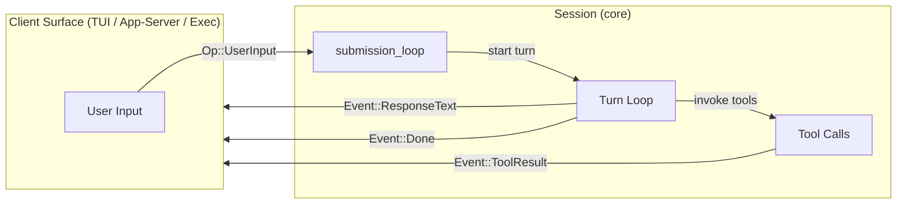
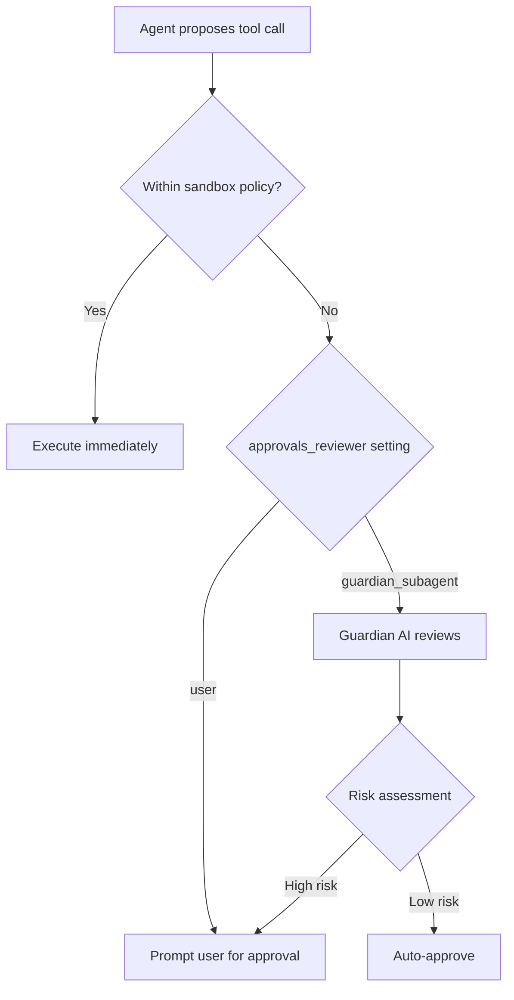
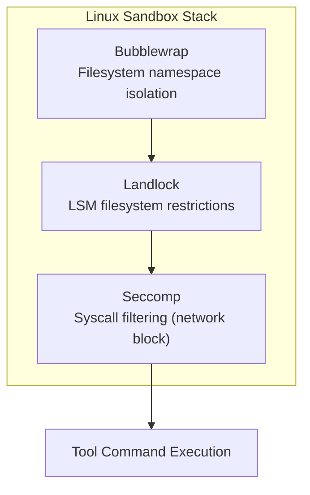

# Codex CLI Internals: Queue-Pair Protocol, Guardian AI, and 3-OS Sandbox Architecture


---

Codex CLI's public documentation covers configuration, prompting, and model selection well. What it barely touches is the 549,000-line Rust codebase (`codex-rs`) that actually runs the show [^1]. This article dissects three architectural pillars that every advanced user should understand: the queue-pair protocol that drives the agent loop, the Guardian AI approval subsystem, and the platform-specific sandbox implementations across macOS, Linux, and Windows.

## The codex-rs Crate Landscape

Before diving into specifics, it helps to understand how the workspace is organised. The `codex-rs` directory is a Cargo workspace containing over 60 crates [^2]. The ones most relevant to this article:

| Crate | Responsibility |
|---|---|
| `core` | Agent loop, config, auth, model client, sandbox manager |
| `tui` | Interactive terminal UI (Ratatui-based) |
| `exec` | Non-interactive / headless execution mode |
| `sandboxing` | Unified sandbox interface and policy abstraction |
| `linux-sandbox` | Bubblewrap + Landlock + seccomp implementation |
| `windows-sandbox-rs` | Restricted tokens, ACL management, Job Objects |
| `protocol` | Wire protocol types shared across surfaces |
| `hooks` | Lifecycle hook execution engine |
| `app-server` | JSON-RPC/WebSocket server powering all client surfaces |

The `core` crate is the gravitational centre — it contains the agent loop state machine, the `SandboxManager`, and the model client that talks to the Responses API [^3].

## The Queue-Pair Protocol

The term "queue-pair" comes from NeuZhou's `awesome-ai-anatomy` teardown [^1], but the pattern is visible in the source: it is an **operation-event channel system** for asynchronous communication between the client surface (TUI, app-server, exec) and the session that runs the agent loop.

### Two Async Channels

The implementation relies on two `tokio` channels [^4]:

1. **Submission channel (Op)** — the client sends user operations downstream. When the TUI receives user input, it wraps it as an `Op::UserInput` and pushes it into this channel. Other operation types include `Op::Shutdown` and `Op::Cancel`.

2. **Event channel** — the session broadcasts events upstream to all connected clients. AI response text, tool call results, compaction notifications, and error signals all flow through this channel.



### The Three-Layer Loop

The agent loop in `codex-rs` has a three-layer structure [^4]:

1. **`submission_loop`** — the outermost infinite loop. It awaits `Op` values from the submission channel and dispatches them. It persists for the entire session lifetime, only terminating on `Op::Shutdown`.

2. **Turn loop** — initiated when `submission_loop` receives `Op::UserInput`. Assembles the prompt (system instructions, tool definitions, conversation history), calls the Responses API, and processes the resulting event stream.

3. **Inner tool loop** — within a single turn, tool invocations and their results are appended to the prompt and fed back into the model until a `done` event terminates the turn [^3].

This is the classic agentic "loop until done" pattern, but the queue-pair separation means the client surface never blocks on model inference. The TUI can continue rendering, handling keyboard input, and displaying streaming tokens while the session processes tool calls in the background.

### Session Primitives

The session model is built on three primitives [^3]:

- **Thread** — a persistent conversation backed by SQLite that survives process restarts and can be resumed, forked, archived, or rolled back.
- **Turn** — one round-trip cycle: user input → model inference → tool calls → results → response.
- **Item** — granular events within a turn (a single tool call, a chunk of response text, a reasoning step).

### Performance: Prompt Caching and Compaction

A naïve implementation of the inner loop would be quadratic — each turn re-sends the entire conversation history as JSON to the Responses API [^3]. Codex addresses this with two mechanisms:

- **Prompt caching** — the Responses API reuses cached inference context from prior turns, converting quadratic replay to linear cost.
- **Compaction** — when the conversation exceeds a token threshold, a dedicated API endpoint produces a compressed representation that replaces earlier context [^5]. GPT-5.2-Codex introduced native compaction support (January 2026), meaning the model itself participates in summarising prior context rather than relying on external truncation [^5].

An early bug in tool enumeration failed to maintain consistent ordering across turns, causing cache misses and quadratic fallback — a reminder that deterministic state management is critical in agent loops [^3].

## Guardian AI: The Approval Subagent

Most agentic coding tools use rule-based approval: a command matches a pattern, the user clicks "allow" or "deny". Codex CLI goes further with **Guardian AI** — a separate LLM-backed subagent that independently evaluates tool call requests before execution [^6].

### How It Works

When the agent loop proposes a tool call that falls outside the sandbox policy (e.g., a shell command that writes to a path not in the writable roots), the request enters the approval flow. With Guardian AI enabled, instead of immediately prompting the user, the system spawns a reviewer subagent [^6]:



The guardian subagent is a carefully prompted reviewer that gathers relevant context — the proposed command, the current working directory, recent conversation history, sandbox policy — and applies a risk-based decision framework [^6]. It can auto-approve low-risk operations (e.g., `cat README.md` in the workspace) while escalating genuinely dangerous commands to the user.

### Configuration

Guardian AI is controlled via `approvals_reviewer` in `config.toml` [^7]:

```toml
[features]
smart_approvals = true  # UI gate — enables the feature in the TUI

[approvals]
approvals_reviewer = "guardian_subagent"  # runtime control
```

The deprecated `guardian_approval = true` alias is automatically migrated to `approvals_reviewer = "guardian_subagent"` when no explicit reviewer is configured [^6].

Smart Approvals was introduced in v0.115.0 (March 16, 2026) via PR #13860 [^6]. It routes guardian review through core for command execution, file changes, managed-network approvals, MCP approvals, and delegated subagent approval flows.

### Practical Implications

Guardian AI is experimental and off by default for good reason — it adds latency (an extra LLM call per approval) and introduces a second model's judgement into the loop. For interactive development, the latency is often acceptable. For `codex exec` in CI pipelines, you typically want deterministic rule-based approvals instead.

The deeper architectural insight is that Codex CLI treats approval as a **pluggable policy slot**, not a hardcoded mechanism. The `approvals_reviewer` field accepts `"user"` or `"guardian_subagent"`, and the system is designed to accommodate additional reviewer types [^7].

## The 3-OS Sandbox Architecture

Every tool call in Codex CLI executes inside a platform-specific sandbox. The main process runs unsandboxed; only the spawned shell commands are confined [^8]. This is a critical distinction — the agent loop itself has full access, but anything the model asks to execute is isolated.

### Policy Types

The `SandboxPolicy` enum defines three permission levels [^9]:

- **`ReadOnly`** — filesystem read-only, no network. The default.
- **`WorkspaceWrite`** — writes permitted only within designated writable roots, network via managed proxy.
- **`DangerFullAccess`** — no sandboxing. Use at your own risk.

Policy selection is via `--sandbox` flag or `config.toml`:

```toml
[sandbox]
mode = "workspace-write"
writable_roots = ["/tmp/codex-resources-hourly"]
```

### macOS: Seatbelt (sandbox-exec)

On macOS, Codex generates a Seatbelt profile in Apple's Sandbox Profile Language (SBPL) and executes commands through `/usr/bin/sandbox-exec` [^8][^9].

The implementation in `codex-rs/core/src/seatbelt.rs` (`spawn_command_under_seatbelt`) dynamically constructs SBPL rules [^9]:

```
(version 1)
(deny default)
(allow process-exec)
(allow signal)
(allow file-read*)
(allow file-write*
  (require-all
    (subpath (param "WRITABLE_ROOT_0"))))
```

Critical security detail: `.git/` and `.codex/` are re-applied as **read-only subpaths** within writable workspace roots [^8]. This prevents the model from modifying git hooks or sandbox configuration — a privilege escalation vector that other tools have been vulnerable to.

**Process hardening:** Before the sandbox activates, `ptrace(PT_DENY_ATTACH)` prevents debugger attachment, `setrlimit(RLIMIT_CORE, 0)` disables core dumps, and `DYLD_*` environment variables are stripped to prevent dylib injection [^8].

The environment variable `CODEX_SANDBOX=seatbelt` signals to child processes that they are running under confinement.

### Linux: Bubblewrap + Landlock + Seccomp

Linux sandboxing combines three complementary technologies [^9][^10]:

**Bubblewrap (`bwrap`)** provides filesystem namespace isolation. The `codex-linux-sandbox` crate vendors a copy and constructs a restricted filesystem view:

- `--ro-bind / /` — read-only bind of the entire filesystem
- `--bind` overlays for writable roots
- `--unshare-user`, `--unshare-pid`, `--unshare-net` — namespace isolation
- Sensitive paths (`.git`, `.codex`) re-applied as read-only
- Symlinks in writable paths blocked via `/dev/null` mounting on the first missing or symlinked component [^9]

**Landlock** provides LSM-level filesystem access control as a supplementary restriction (and legacy fallback when bubblewrap is unavailable). Implementation lives in `codex-rs/linux-sandbox/src/landlock.rs` [^9].

**Seccomp** filters system calls to block network access — `connect`, `bind`, `sendto` are denied, with `AF_UNIX` exempted to allow IPC [^10].



When managed proxy mode is active (`--unshare-net` combined with an internal TCP-to-UDS-to-TCP bridge), network access is routed through the `codex-network-proxy` — a MITM proxy built on the Rama framework that enforces domain allowlists [^8].

### Windows: Restricted Tokens and Job Objects

Windows sandboxing uses a multi-phase setup orchestrated by `codex-rs/windows-sandbox-rs/src/setup_orchestrator.rs` [^9]:

1. **User provisioning** — two local accounts are created: `CodexSandboxOffline` (no network) and `CodexSandboxOnline` (network-enabled via proxy).
2. **ACL management** — `apply_read_acls` grants the sandbox users read access to workspace paths; `audit_everyone_writable` performs preflight scanning to detect overly permissive directories.
3. **Restricted tokens** — `CreateRestrictedToken()` strips privileges from sandbox user tokens before spawning tool processes.

The `windows_sandbox_enabled` configuration flag controls whether Windows sandboxing is active — it remains optional due to the UAC and account provisioning requirements [^9].

### Process Hardening Across Platforms

Pre-main hardening applies on all platforms [^8]:

| Platform | Measure | Purpose |
|---|---|---|
| macOS | `ptrace(PT_DENY_ATTACH)` | Block debugger attachment |
| macOS | Strip `DYLD_*` env vars | Prevent dylib injection |
| Linux | `prctl(PR_SET_DUMPABLE, 0)` | Prevent ptrace access |
| Both | `setrlimit(RLIMIT_CORE, 0)` | Disable core dumps |

These measures protect the agent process itself, not just the sandboxed tool calls — an important defence against local privilege escalation.

## Practical Implications for Hook and Subagent Design

Understanding these internals has concrete consequences:

1. **Hooks execute outside the sandbox** — `SessionStart`, `PostToolUse`, and other hooks run in the main process, not inside the sandbox. A malicious hook has full access. Vet your hooks carefully.

2. **Subagents inherit sandbox policy** — spawned subagents get the parent's sandbox and network rules, including project-profile layering and persisted host approvals [^6]. Design subagent workflows knowing they cannot escape the parent's confinement.

3. **The queue-pair boundary is your extension point** — if you are building a custom client surface (say, a web UI or Slack bot), you implement the `Op`/`Event` protocol against the app-server's JSON-RPC interface, not against the agent loop directly.

4. **Guardian AI adds latency but reduces friction** — for interactive sessions where you trust the model but want a safety net, `approvals_reviewer = "guardian_subagent"` eliminates most approval prompts. For CI, stick with rule-based `approval_policy`.

## Citations

[^1]: NeuZhou, "awesome-ai-anatomy: Source code teardowns of 14 AI coding agents," GitHub, 2026. [https://github.com/NeuZhou/awesome-ai-anatomy](https://github.com/NeuZhou/awesome-ai-anatomy)

[^2]: OpenAI, "codex-rs README," GitHub, 2026. [https://github.com/openai/codex/blob/main/codex-rs/README.md](https://github.com/openai/codex/blob/main/codex-rs/README.md)

[^3]: OpenAI, "Unrolling the Codex agent loop," OpenAI Blog, February 2026. [https://openai.com/index/unrolling-the-codex-agent-loop/](https://openai.com/index/unrolling-the-codex-agent-loop/)

[^4]: Zenn.dev / InfoQ, "Codex CLI agent loop internals — three-layer loop structure and async channels," 2026. [https://www.infoq.com/news/2026/02/codex-agent-loop/](https://www.infoq.com/news/2026/02/codex-agent-loop/)

[^5]: Daniel Vaughan, "Codex Model Lineage: The Context Compaction Breakthrough," codex.danielvaughan.com, 2026. [https://codex.danielvaughan.com/2026/03/28/codex-model-lineage-context-compaction/](https://codex.danielvaughan.com/2026/03/28/codex-model-lineage-context-compaction/)

[^6]: charley-oai, "Add Smart Approvals guardian review across core, app-server, and TUI," PR #13860, GitHub, March 2026. [https://github.com/openai/codex/pull/13860](https://github.com/openai/codex/pull/13860)

[^7]: OpenAI, "Configuration Reference – Codex," OpenAI Developers, 2026. [https://developers.openai.com/codex/config-reference](https://developers.openai.com/codex/config-reference)

[^8]: Agent Safehouse, "OpenAI Codex CLI — Sandbox Analysis Report," 2026. [https://agent-safehouse.dev/docs/agent-investigations/codex](https://agent-safehouse.dev/docs/agent-investigations/codex)

[^9]: DeepWiki, "Sandboxing Implementation — openai/codex," 2026. [https://deepwiki.com/openai/codex/5.6-sandboxing-implementation](https://deepwiki.com/openai/codex/5.6-sandboxing-implementation)

[^10]: OpenAI, "codex-rs/linux-sandbox README," GitHub, 2026. [https://github.com/openai/codex/blob/main/codex-rs/linux-sandbox/README.md](https://github.com/openai/codex/blob/main/codex-rs/linux-sandbox/README.md)
