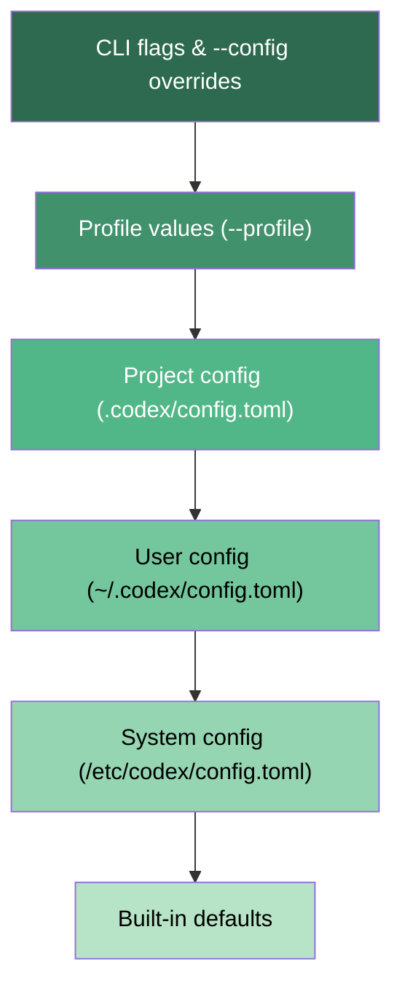
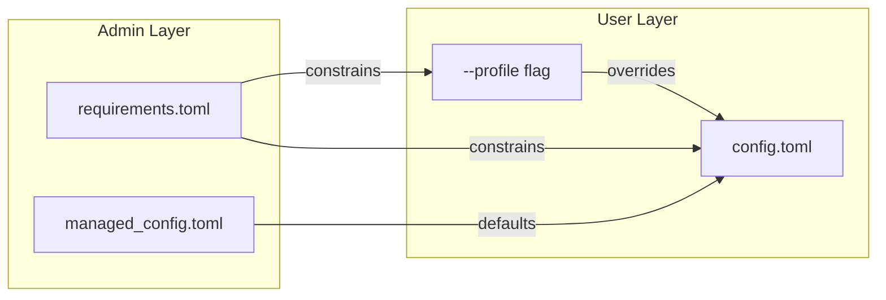

# Profiles and Named Configuration: Running Multiple Codex Personas from One Machine


---

The same developer rarely wants the same Codex CLI behaviour everywhere. A personal sandbox for exploratory hacking needs `danger-full-access` and `gpt-5.4`. A CI pipeline demands `workspace-write`, `never` approval, and structured JSON output. A code-review profile might call `gpt-5-pro` at `high` reasoning effort with read-only sandbox access. Before profiles, you either juggled environment variables, maintained multiple `config.toml` files, or wrapped Codex in shell scripts that spliced `--config` overrides together.

The `--profile` flag (short form `-p`) solves this cleanly[^1]. Define named configuration blocks in your `config.toml`, switch between them with a single flag, and let each context carry its own model, approval policy, sandbox mode, reasoning effort, and even MCP server settings.

## How Profiles Work

Profiles are defined as TOML sub-tables under `[profiles.<name>]` in `~/.codex/config.toml`[^2]. Each profile can override any top-level configuration key. Keys not specified in a profile fall through to the root configuration.

```toml
# ~/.codex/config.toml

model = "gpt-5.4"
approval_policy = "on-request"
sandbox_mode = "workspace-write"
model_reasoning_effort = "medium"

[profiles.deep-review]
model = "gpt-5-pro"
model_reasoning_effort = "high"
approval_policy = "never"
model_catalog_json = "/Users/me/.codex/model-catalogs/deep-review.json"

[profiles.ci-pipeline]
model = "gpt-4.1"
approval_policy = "never"
sandbox_mode = "workspace-write"
model_reasoning_effort = "low"

[profiles.lightweight]
model = "gpt-4.1"
approval_policy = "untrusted"
sandbox_mode = "read-only"
```

Activate a profile from the command line:

```bash
codex --profile deep-review "review this PR for security issues"
codex -p ci-pipeline exec "run tests and fix failures"
```

When both the root configuration and the selected profile set the same key, the profile value wins[^3]. This is the core design: profiles are overlays, not replacements.

## Configuration Precedence

Understanding where profiles sit in the resolution chain is critical for debugging unexpected behaviour. Codex resolves configuration in the following order, from highest to lowest priority[^4]:



A `--config key=value` flag on the command line overrides everything, including the active profile. This means you can fine-tune a profile invocation without editing the TOML:

```bash
codex -p ci-pipeline --config model_reasoning_effort=high exec "complex migration task"
```

## Setting a Default Profile

If you find yourself reaching for the same profile repeatedly, set it as the default at the root level[^2]:

```toml
profile = "deep-review"

[profiles.deep-review]
model = "gpt-5-pro"
model_reasoning_effort = "high"
approval_policy = "never"
```

Codex loads the named profile automatically on every invocation. The `--profile` flag on the command line overrides this default.

## Profile Persistence

When you launch Codex with `--profile`, any configuration changes made during the session are written back to that profile's section, not the root configuration[^1]. This prevents interactive tweaks in one context from bleeding into another — a subtle but important isolation guarantee.

## Practical Patterns

### Pattern 1: CI Pipeline Profile

The most immediate use case. Combine `codex exec` with a locked-down profile for non-interactive pipeline runs[^5]:

```toml
[profiles.ci]
model = "gpt-4.1"
approval_policy = "never"
sandbox_mode = "workspace-write"
model_reasoning_effort = "low"
web_search = "disabled"

[profiles.ci.sandbox_workspace_write]
network_access = false
```

In your GitHub Actions workflow:

```yaml
- name: Run Codex CI
  env:
    CODEX_API_KEY: ${{ secrets.CODEX_API_KEY }}
  run: |
    codex -p ci exec --json \
      "Run the test suite, identify failures, and propose minimal fixes" \
      -o ./codex-output.json
```

The `--json` flag emits structured event output, and `-o` captures the final message[^5]. The profile ensures consistent, reproducible behaviour regardless of what the developer's personal `config.toml` looks like.

### Pattern 2: Cross-Model Review

Use separate profiles to run adversarial reviews across different models:

```toml
[profiles.review-openai]
model = "gpt-5-pro"
model_reasoning_effort = "high"
sandbox_mode = "read-only"
approval_policy = "never"

[profiles.review-anthropic]
model = "claude-sonnet-4"
model_provider = "anthropic"
sandbox_mode = "read-only"
approval_policy = "never"

[profiles.review-anthropic.model_providers.anthropic]
base_url = "https://api.anthropic.com/v1"
env_key = "ANTHROPIC_API_KEY"
```

Script them in sequence for multi-model review:

```bash
codex -p review-openai exec "review src/ for security vulnerabilities" -o review-openai.json
codex -p review-anthropic exec "review src/ for security vulnerabilities" -o review-anthropic.json
diff <(jq .message review-openai.json) <(jq .message review-anthropic.json)
```

### Pattern 3: Cost-Tiered Profiles

Different tasks warrant different cost envelopes. A quick question doesn't need `gpt-5-pro` at `xhigh` reasoning:

```toml
[profiles.cheap]
model = "gpt-4.1"
model_reasoning_effort = "minimal"
approval_policy = "untrusted"

[profiles.balanced]
model = "gpt-5.4"
model_reasoning_effort = "medium"

[profiles.expensive]
model = "gpt-5-pro"
model_reasoning_effort = "xhigh"
```

Alias them in your shell for fast access:

```bash
alias cx='codex -p cheap'
alias cb='codex -p balanced'
alias ce='codex -p expensive'
```

### Pattern 4: Project-Scoped Profiles

Profiles defined in a project's `.codex/config.toml` apply only within that repository[^4]. This lets teams ship profile definitions alongside their code:

```toml
# .codex/config.toml (committed to repo)
[profiles.backend]
model = "gpt-5.4"
sandbox_mode = "workspace-write"

[profiles.frontend]
model = "gpt-4.1"
model_reasoning_effort = "low"
sandbox_mode = "read-only"
```

Project-level profiles are loaded only when the project is trusted[^4] — Codex prompts for trust on first access and skips untrusted project configuration entirely.

## Enterprise Constraints: requirements.toml

In enterprise environments, administrators can enforce constraints that profiles cannot override. The `requirements.toml` file restricts which approval policies, sandbox modes, and features are permitted[^6]:

```toml
# /etc/codex/requirements.toml (admin-deployed)
allowed_approval_policies = ["untrusted", "on-request"]
allowed_sandbox_modes = ["read-only", "workspace-write"]
allowed_web_search_modes = ["cached"]

[features]
personality = true
```

This blocks any profile from setting `approval_policy = "never"` or `sandbox_mode = "danger-full-access"`. The constraint applies regardless of whether the setting comes from a profile, the root config, or a CLI flag.



Enterprise admins on ChatGPT Business or Enterprise plans can also push `requirements.toml` policies from the cloud via the Codex Policies dashboard, with group-based targeting so different teams receive different constraints[^7]. Cloud-managed requirements take the highest precedence, followed by MDM-deployed policies, then the system file[^6].

## What Profiles Can Override

Based on the configuration reference[^8], profiles can override any key that appears at the root level of `config.toml`. The most commonly profiled settings include:

| Setting | Key | Example Values |
|---|---|---|
| Model | `model` | `gpt-5.4`, `gpt-5-pro`, `gpt-4.1` |
| Provider | `model_provider` | `openai`, `anthropic`, custom ID |
| Reasoning effort | `model_reasoning_effort` | `minimal`, `low`, `medium`, `high`, `xhigh` |
| Reasoning summary | `model_reasoning_summary` | `auto`, `concise`, `detailed`, `none` |
| Approval policy | `approval_policy` | `untrusted`, `on-request`, `never` |
| Sandbox mode | `sandbox_mode` | `read-only`, `workspace-write`, `danger-full-access` |
| Web search | `web_search` | `disabled`, `cached`, `live` |
| Service tier | `service_tier` | `flex`, `fast` |
| Personality | `personality` | Custom communication style string |
| Instructions file | `model_instructions_file` | Path to profile-specific system prompt |
| Model catalogue | `model_catalog_json` | Path to model catalogue JSON |

The `model_instructions_file` override is particularly powerful — it lets each profile carry its own system prompt, effectively creating distinct Codex "personas" that behave differently depending on context.

## Current Limitations

Profiles are marked as **experimental** and carry several caveats worth noting[^2]:

- **IDE extension**: profiles are not currently supported in the Codex IDE extension — CLI only
- **MCP server scoping**: while profiles can override top-level MCP settings, fine-grained per-profile MCP server enable/disable requires careful testing
- **No profile inheritance**: profiles cannot extend other profiles; each is a flat overlay on the root configuration
- **Feature flag interaction**: ⚠️ it is not fully documented whether profile-scoped `[features]` overrides are supported or whether feature flags are resolved before profile application

## Conclusion

Profiles transform Codex CLI from a single-personality tool into a context-aware agent harness. The pattern is straightforward: define named configurations in TOML, activate them with `--profile`, and let the precedence chain handle the rest. For teams, the combination of project-scoped profiles and enterprise `requirements.toml` constraints provides the flexibility-with-guardrails balance that production adoption demands.

The feature remains experimental, but the underlying design — named overlays on a layered configuration system — is stable enough to build CI pipelines and team workflows around today.

## Citations

[^1]: [Command Line Options — Codex CLI | OpenAI Developers](https://developers.openai.com/codex/cli/reference)

[^2]: [Advanced Configuration — Codex | OpenAI Developers](https://developers.openai.com/codex/config-advanced)

[^3]: [Sample Configuration — Codex | OpenAI Developers](https://developers.openai.com/codex/config-sample)

[^4]: [Config Basics — Codex | OpenAI Developers](https://developers.openai.com/codex/config-basic)

[^5]: [Non-Interactive Mode — Codex | OpenAI Developers](https://developers.openai.com/codex/noninteractive)

[^6]: [Managed Configuration — Codex | OpenAI Developers](https://developers.openai.com/codex/enterprise/managed-configuration)

[^7]: [Admin Setup — Codex | OpenAI Developers](https://developers.openai.com/codex/enterprise/admin-setup)

[^8]: [Configuration Reference — Codex | OpenAI Developers](https://developers.openai.com/codex/config-reference)
