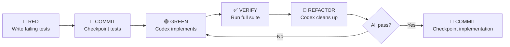
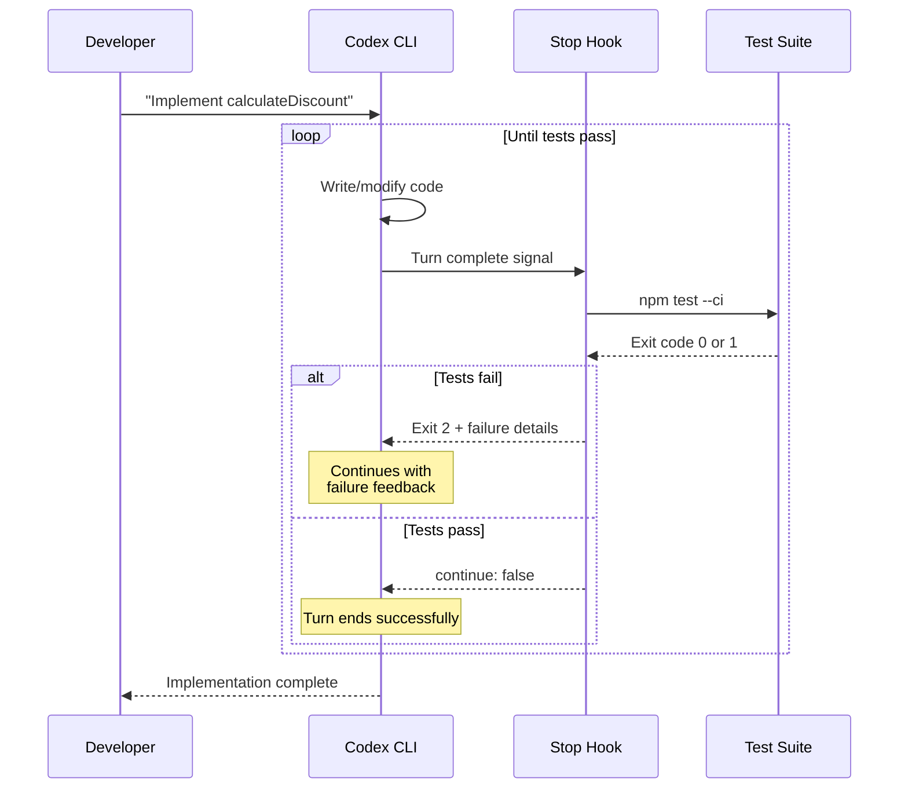
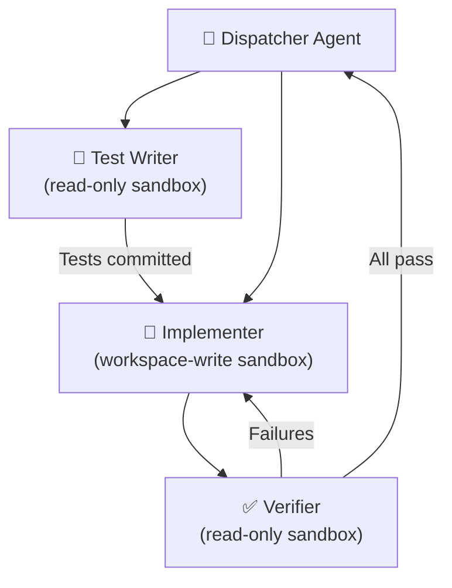

# Test-Driven Development with Codex CLI: The Red-Green-Refactor Loop, AGENTS.md Test Gates, and Hook-Based Verification


---

The TDD AI agent pattern has emerged as the most reliable way to execute autonomous coding in 2026[^1]. When a model can run tests, read failures, and self-correct in a loop, the red-green-refactor cycle becomes a natural fit for agentic workflows. Codex CLI's combination of AGENTS.md instructions, hook-based verification gates, and sandbox-isolated test execution makes it uniquely suited to TDD — but only if you configure it deliberately rather than relying on ad-hoc prompts.

This article walks through the complete TDD workflow with Codex CLI: from structuring AGENTS.md for test-first development, through hook-based quality gates that enforce verification at every tool call, to `codex exec` pipelines that run the entire cycle unattended in CI.

## Why TDD and Agentic Coding Are a Natural Fit

Tests provide the strongest verification mechanism for AI-generated code[^2]. Unlike code review or static analysis, a passing test suite is an external source of truth that remains accurate regardless of how long an agentic session runs. This matters because LLMs have a well-documented tendency to satisfy the letter of a request rather than the intent[^2] — a problem that compounds across long sessions as context compaction discards earlier reasoning.

The reinforcement learning with verifiable rewards (RLVR) paradigm that drives modern Codex models (GPT-5.4, GPT-5.3-Codex) directly exploits this: unit tests, type checks, and linter passes serve as reward signals during training[^3]. When you write tests first and instruct Codex to implement until they pass, you're aligning the runtime workflow with the model's training objective.



## Step 1: AGENTS.md as a Test-First Constitution

AGENTS.md is Codex's equivalent of a README written for the agent[^4]. Codex reads it before doing any work in a session, and its instructions carry forward throughout the entire run[^4]. For TDD workflows, the file must explicitly declare test commands, enforcement rules, and the red-green-refactor expectation.

### A Production AGENTS.md for TDD

```markdown
# AGENTS.md

## Build and test

- **Test command:** `npm test` (Jest, ~45s full suite)
- **Targeted tests:** `npm test -- --testPathPattern=<pattern>`
- **Lint:** `npm run lint` (ESLint + Prettier)
- **Type check:** `npx tsc --noEmit`
- **Build:** `npm run build`

## Development workflow

- **Always follow TDD:** Write failing tests before implementation code.
- **Never modify existing tests** unless explicitly asked to do so.
- **Run the smallest relevant test suite** after every code change.
- **Run lint + type check** before considering a task complete.
- **Commit failing tests separately** before implementing the solution.

## Test conventions

- Tests live in `__tests__/` alongside source files.
- Use `describe` / `it` blocks with descriptive names.
- Cover happy path, edge cases, and error conditions.
- Mock external dependencies; never call real APIs in tests.
- Target 80%+ line coverage for new code.

## PR expectations

- Each PR must include tests for new functionality.
- CI must pass before merge: `npm test && npm run lint && npm run build`.
```

The critical line is **"Never modify existing tests unless explicitly asked to do so."** OpenAI's own best practices documentation warns that this instruction is "not optional for high-stakes work"[^2], because Codex may make tests pass by weakening assertions rather than fixing implementation bugs.

### Nested Overrides for Monorepos

For monorepos, layer directory-specific test commands using AGENTS.override.md files[^5]:

```markdown
# services/payments/AGENTS.override.md

## Payments service rules

- Use `make test-payments` instead of `npm test`.
- Run `npm run test:integration` after unit tests pass.
- Never rotate API keys without notifying the security channel.
```

Codex discovers these files by walking from the Git root to the current working directory[^5], concatenating instructions with closer files taking precedence. The combined size caps at `project_doc_max_bytes` (32 KiB default)[^5].

## Step 2: The Four-Phase TDD Session

### Phase 1 — Red: Write Failing Tests

Start an interactive Codex session and write the tests first:

```bash
codex --approval-mode suggest \
  "Write tests for a new calculateDiscount function in src/pricing.ts.
   Cover: percentage discounts, fixed-amount discounts, stacking rules,
   zero-value edge case, negative price rejection.
   Do NOT write the implementation yet."
```

Using `suggest` mode forces Codex to present each file change for your approval before applying it[^6]. Review the test assertions carefully — this is where you encode your specification.

### Phase 2 — Checkpoint: Commit Failing Tests

Once you've approved the tests, confirm they fail:

```bash
npm test -- --testPathPattern=pricing
```

All tests should fail with "function not found" or similar errors. Commit this checkpoint:

```bash
git add src/__tests__/pricing.test.ts
git commit -m "test: add failing tests for calculateDiscount"
```

This checkpoint is essential. If Codex later drifts or the session compacts away early context, you can always reset to this known state[^2].

### Phase 3 — Green: Codex Implements

Now instruct Codex to implement until tests pass:

```bash
codex "Implement calculateDiscount in src/pricing.ts.
  Make all tests in src/__tests__/pricing.test.ts pass.
  Do NOT modify any test files.
  After implementation, run: npm test -- --testPathPattern=pricing
  Report the results."
```

Codex will iterate — writing code, running tests, reading failures, and adjusting — until the suite passes. The model's RLVR training makes this loop efficient: GPT-5.4 typically converges in 2-3 iterations for well-specified test suites[^7].

### Phase 4 — Refactor: Clean Up with Green Tests as a Safety Net

With all tests passing, request a refactoring pass:

```bash
codex "Refactor calculateDiscount for clarity and performance.
  Extract any magic numbers into named constants.
  Ensure all tests still pass after refactoring.
  Run the full test suite: npm test"
```

## Step 3: Hook-Based Verification Gates

Hooks enable deterministic script injection into the Codex lifecycle[^8]. For TDD, two hooks matter most: **PostToolUse** (verify after every shell command) and **Stop** (enforce test passage before a turn ends).

### Enabling Hooks

```toml
# ~/.codex/config.toml
[features]
codex_hooks = true
```

### PostToolUse: Lint After Every File Change

Create `.codex/hooks.json` in your repository:

```json
{
  "hooks": {
    "PostToolUse": [
      {
        "matcher": "Bash",
        "hooks": [
          {
            "type": "command",
            "command": "python3 .codex/hooks/post-tool-verify.py",
            "timeout": 60,
            "statusMessage": "Verifying code quality"
          }
        ]
      }
    ]
  }
}
```

The verification script checks whether the last command modified source files and, if so, runs the linter:

```python
#!/usr/bin/env python3
"""PostToolUse hook: run lint after source file modifications."""
import json, sys, subprocess

data = json.load(sys.stdin)
cmd = data.get("tool_input", {}).get("command", "")

# Only verify after commands that might modify files
modify_signals = ["apply_patch", "write", "sed", "mv", "cp"]
if not any(sig in cmd for sig in modify_signals):
    print(json.dumps({"decision": "allow"}))
    sys.exit(0)

result = subprocess.run(
    ["npm", "run", "lint", "--", "--quiet"],
    capture_output=True, text=True, timeout=30
)

if result.returncode != 0:
    print(json.dumps({
        "decision": "block",
        "reason": f"Lint failed:\n{result.stdout[:500]}"
    }))
    sys.exit(0)

print(json.dumps({"decision": "allow"}))
```

When the hook returns `"decision": "block"`, Codex replaces the tool result with the hook's feedback and self-corrects[^8].

### Stop Hook: Enforce Test Passage Before Turn Completion

The Stop hook fires when Codex believes a turn is complete[^8]. Use it to ensure the test suite passes before accepting the result:

```json
{
  "hooks": {
    "Stop": [
      {
        "hooks": [
          {
            "type": "command",
            "command": "python3 .codex/hooks/stop-verify.py",
            "timeout": 120,
            "statusMessage": "Running test suite verification"
          }
        ]
      }
    ]
  }
}
```

```python
#!/usr/bin/env python3
"""Stop hook: require tests to pass before turn completion."""
import json, sys, subprocess

result = subprocess.run(
    ["npm", "test", "--", "--ci", "--silent"],
    capture_output=True, text=True, timeout=90
)

if result.returncode != 0:
    # Exit code 2 sends feedback as a new user prompt
    failures = result.stdout[-500:] if result.stdout else result.stderr[-500:]
    print(
        f"Tests are failing. Fix the failures before finishing:\n{failures}",
        file=sys.stderr
    )
    sys.exit(2)

# Tests pass — allow the turn to complete
print(json.dumps({"continue": False}))
```

Exit code 2 with stderr content continues the turn with that feedback as a new user prompt[^8], creating an automatic retry loop. The agent keeps working until the suite passes or the session reaches a timeout.



### PreToolUse: Block Test Modification

Add a PreToolUse hook to prevent Codex from modifying test files:

```json
{
  "hooks": {
    "PreToolUse": [
      {
        "matcher": "Bash",
        "hooks": [
          {
            "type": "command",
            "command": "python3 .codex/hooks/protect-tests.py",
            "statusMessage": "Checking test file protection"
          }
        ]
      }
    ]
  }
}
```

```python
#!/usr/bin/env python3
"""PreToolUse hook: block modifications to test files."""
import json, sys

data = json.load(sys.stdin)
cmd = data.get("tool_input", {}).get("command", "")

# Check if the command targets test files
test_patterns = [".test.", ".spec.", "__tests__/", "test/"]
if any(pat in cmd for pat in test_patterns):
    if any(verb in cmd for verb in ["sed", "write", ">", "patch", "mv", "rm"]):
        print(json.dumps({
            "hookSpecificOutput": {
                "hookEventName": "PreToolUse",
                "permissionDecision": "deny",
                "permissionDecisionReason":
                    "Test files are protected. Modify implementation code instead."
            }
        }))
        sys.exit(0)

print(json.dumps({"decision": "allow"}))
```

⚠️ **Known limitation:** PreToolUse and PostToolUse hooks currently only fire for Bash tool calls, not for file writes made through `apply_patch`[^9]. This means Codex can still edit test files via the patch tool. Until this is resolved (tracked in issue #16732), reinforce the "do not modify tests" instruction in AGENTS.md as a complementary safeguard.

## Step 4: CI/CD Integration with codex exec

The `codex exec` subcommand runs Codex non-interactively[^10], making it ideal for CI pipelines that enforce TDD:

```bash
# Run TDD implementation in CI
codex exec --full-auto \
  --json \
  -c model=gpt-5.4 \
  -c model_reasoning_effort=high \
  "Implement all functions marked TODO in src/pricing.ts.
   Make all tests pass. Do not modify test files.
   Run: npm test && npm run lint && npm run build"
```

### GitHub Actions Integration

```yaml
name: Codex TDD Implementation
on:
  pull_request:
    paths: ['src/**/*.test.ts']

jobs:
  codex-implement:
    runs-on: ubuntu-latest
    steps:
      - uses: actions/checkout@v4

      - uses: actions/setup-node@v4
        with:
          node-version: '22'
          cache: 'npm'

      - run: npm ci

      - name: Verify tests fail (red phase)
        run: |
          npm test -- --ci 2>&1 || echo "Tests failing as expected"

      - name: Codex implementation (green phase)
        uses: openai/codex-action@v1
        with:
          openai-api-key: ${{ secrets.OPENAI_API_KEY }}
          prompt: |
            Implement all TODO functions to make the test suite pass.
            Do not modify any test files.
            Run npm test after implementation.
          sandbox: workspace-write
          model: gpt-5.4
          effort: high
          safety-strategy: drop-sudo

      - name: Verify tests pass (verification)
        run: npm test -- --ci
```

The `openai/codex-action` wraps `codex exec` for GitHub Actions with built-in safety strategies[^11]. The `drop-sudo` strategy (the default) prevents privilege escalation during sandbox execution[^11].

### Structured Output for Test Results

Use `--output-schema` to enforce structured JSON output from `codex exec`[^10]:

```bash
codex exec --full-auto \
  --output-schema '{"type":"object","properties":{"tests_passed":{"type":"boolean"},"coverage_pct":{"type":"number"},"failures":{"type":"array","items":{"type":"string"}}},"required":["tests_passed","coverage_pct","failures"],"additionalProperties":false}' \
  "Run npm test --coverage. Report whether all tests passed, the line coverage percentage, and any failure descriptions."
```

This returns machine-parseable JSON, enabling downstream pipeline decisions based on test results.

## Multi-Agent TDD: Parallel Test Suites

For large codebases, delegate test-writing and implementation to parallel subagents[^12]:

```toml
# .codex/agents/tdd-writer.toml
name = "tdd-writer"
role = "worker"
model = "gpt-5.4"
instructions = """
You write comprehensive test suites. Never write implementation code.
Follow the project's test conventions from AGENTS.md.
"""

# .codex/agents/tdd-implementer.toml
name = "tdd-implementer"
role = "worker"
model = "gpt-5.4"
model_reasoning_effort = "high"
instructions = """
You implement code to make failing tests pass. Never modify test files.
Run the relevant test suite after each change.
"""
```

The dispatcher pattern spawns separate agents for test writing and implementation, enforcing the separation of concerns that makes TDD effective:



## Practical Tips

1. **Keep test files small and focused.** Codex performs better with targeted test suites (~50 tests) than monolithic ones (~500 tests). Use `--testPathPattern` or equivalent to scope runs.

2. **Set `model_reasoning_effort = "high"` for implementation phases.** The reasoning overhead pays for itself in fewer iteration cycles. For test writing, `medium` suffices[^7].

3. **Use the checkpoint pattern religiously.** Commit after each TDD phase. If context compaction triggers mid-session (around 90% of the context window[^13]), the agent can recover from the last checkpoint rather than reconstructing the full history.

4. **Watch for the test-weakening anti-pattern.** If Codex changes an assertion from `toBe(42)` to `toBeTruthy()`, the PreToolUse hook should catch it — but given the `apply_patch` gap[^9], periodic manual review of test diffs remains necessary.

5. **Prefer `workspace-write` sandbox mode.** This gives Codex write access to the project directory whilst blocking network access and system modifications[^6]. Tests that require network (integration tests) should be mocked or run in a separate pipeline stage.

## Citations

[^1]: [Beyond Autocomplete: Best Agentic Coding Workflow in 2026](https://kilo.ai/articles/beyond-autocomplete) — Kilo AI, 2026

[^2]: [OpenAI Codex: Workflows and Best Practices 2026](https://smart-webtech.com/blog/openai-codex-workflows-and-best-practices/) — Smart WebTech, 2026

[^3]: [The AI Capability Gap: Why Karpathy Says Codex CLI Users Live in a Different Reality](https://codex.danielvaughan.com/2026/04/10/karpathy-ai-capability-gap-codex-cli/) — Daniel Vaughan, 2026

[^4]: [Custom Instructions with AGENTS.md](https://developers.openai.com/codex/guides/agents-md) — OpenAI Developers, 2026

[^5]: [AGENTS.md Advanced Patterns: Nested Hierarchies, Override Files and Fallbacks](https://codex.danielvaughan.com/2026/03/26/agents-md-advanced-patterns/) — Daniel Vaughan, 2026

[^6]: [Codex CLI Approval Modes and Sandbox Security Model](https://developers.openai.com/codex/cli) — OpenAI Developers, 2026

[^7]: [Model Selection in Codex CLI](https://developers.openai.com/codex/models) — OpenAI Developers, 2026

[^8]: [Hooks – Codex CLI](https://developers.openai.com/codex/hooks) — OpenAI Developers, 2026

[^9]: [ApplyPatchHandler doesn't emit PreToolUse/PostToolUse hook event — Issue #16732](https://github.com/openai/codex/issues/16732) — openai/codex, 2026

[^10]: [Codex CLI for CI/CD: codex exec, Non-Interactive Mode and Pipeline Integration](https://developers.openai.com/codex/cli/reference) — OpenAI Developers, 2026

[^11]: [The Official Codex GitHub Action](https://github.com/openai/codex-action) — OpenAI, 2026

[^12]: [Codex CLI Subagents: TOML Format, Parallelism and spawn_agents_on_csv](https://codex.danielvaughan.com/2026/03/26/codex-cli-subagents-toml-parallelism/) — Daniel Vaughan, 2026

[^13]: [Codex CLI Context Compaction: Architecture, Configuration, and Managing Long Sessions](https://codex.danielvaughan.com/2026/03/31/codex-cli-context-compaction-architecture/) — Daniel Vaughan, 2026
