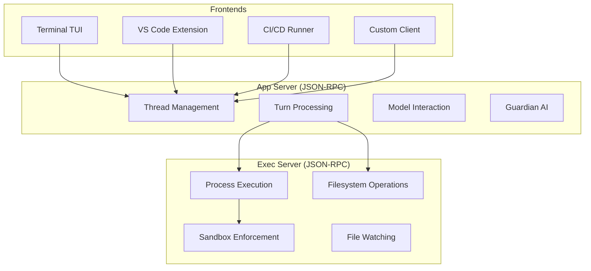
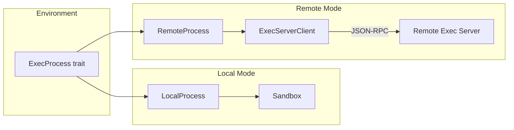
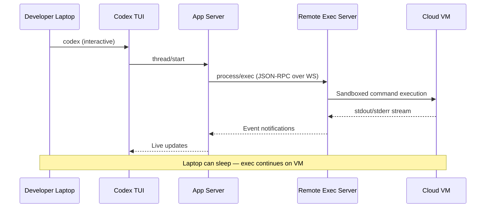

# The codex exec-server Subcommand: Foundation for Headless and Daemon-Mode Codex


---

## Introduction

Since v0.117.0 (March 2026), the Codex CLI codebase has shipped `codex-exec-server` — a standalone execution server process that cleanly separates the runtime responsible for sandboxed command execution and filesystem operations from the interactive TUI [^1]. While `codex exec` already provided non-interactive headless runs [^2], the exec-server goes further: it introduces a JSON-RPC service layer that lets *any* frontend — local TUI, VS Code extension, remote laptop, or CI runner — drive the same execution backend over a well-defined protocol.

This article examines the exec-server's architecture, its relationship to the app-server, the local/remote process split, and what it means for practitioners building CI/CD pipelines and remote development workflows.

---

## Why a Separate Execution Server?

The original Codex CLI bundled everything into a single process: model interaction, tool execution, sandboxing, and the terminal UI. This design works well for interactive use but creates friction in three scenarios:

1. **CI/CD pipelines** — headless environments need execution without a TUI, and `codex exec` addressed this [^2], but the agent loop and execution runtime remained coupled.
2. **Remote development** — developers want the TUI on a laptop but execution on a powerful remote machine, continuing work even when the laptop sleeps [^3].
3. **Multi-frontend architectures** — the VS Code extension, web UIs, and custom integrations all need the same execution capabilities without reimplementing sandboxing logic.

The exec-server solves all three by extracting execution into an independently addressable service.

---

## Architecture Overview

The exec-server sits alongside the app-server in the `codex-rs` Rust codebase. The app-server manages conversations, threads, turns, and model interaction [^4]. The exec-server handles the lower-level concerns: running commands in sandboxes, reading and writing files, and watching filesystem changes [^5].



The key insight is the **Environment abstraction**: the app-server's core logic interacts with an `Environment` struct exposing services via traits [^6]. Each service — process execution, filesystem access — can be backed by either a local implementation or a remote proxy, and the core logic doesn't know the difference.

---

## The JSON-RPC Protocol

The exec-server speaks **newline-delimited JSON-RPC 2.0 over stdio**, matching the app-server's wire conventions (the `"jsonrpc":"2.0"` field is omitted for brevity) [^1]. Stderr is reserved for logs and process errors.

The protocol follows a strict initialisation handshake:

```json
{"method": "initialize", "id": 1, "params": {}}
```

After the handshake, clients can issue RPCs for:

- **Process execution** — spawn commands under the configured sandbox policy, stream stdout/stderr, write stdin, resize PTY windows, and terminate sessions [^5]
- **Filesystem operations** — read files, write files, manage directories, and subscribe to filesystem change notifications [^7]

Connection resilience is built in: malformed JSON-RPC input triggers error responses rather than dropping the connection [^1].

### Supported Transports

The app-server supports multiple transports, and the exec-server follows the same pattern [^4]:

| Transport | Description | Use Case |
|-----------|-------------|----------|
| **stdio** (default) | Newline-delimited JSON over stdin/stdout | Local IPC, subprocess spawning |
| **WebSocket** (experimental) | One JSON-RPC message per text frame | Remote connections, browser UIs |
| **off** | No local transport | Embedded scenarios |

WebSocket listeners additionally expose `/readyz` and `/healthz` health probes and support authentication via capability tokens or HMAC-signed JWT bearer tokens [^4].

---

## The Local/Remote Process Split

The most architecturally significant change is the clean separation between `LocalProcess` and `RemoteProcess` implementations [^8]:



- **`LocalProcess`** is the real implementation — it spawns commands, enforces sandbox policies (macOS Seatbelt, Linux Landlock+seccomp, Windows Job Objects), and manages PTY sessions [^8].
- **`RemoteProcess`** is a thin network proxy that delegates every call to an `ExecServerClient`, which forwards operations to a remote exec-server instance over JSON-RPC [^8].
- **`ProcessHandler`** sits on the server side as a thin RPC adapter that routes incoming requests to `LocalProcess` [^8].

The filesystem layer follows the same split: `LocalFilesystem` handles direct I/O whilst `RemoteFilesystem` proxies operations to the exec-server [^7].

This architecture means you can run the exec-server on a beefy cloud VM, point your laptop's TUI at it via WebSocket, and get full sandboxed execution remotely — with the TUI remaining responsive even over intermittent connections.

---

## Experimental URL-Based Connection

PR #15196 added experimental exec-server URL handling [^9], allowing clients to specify a remote exec-server endpoint in configuration:

```toml
# config.toml (experimental)
[exec_server]
url = "ws://remote-host:8082"
```

When a URL is configured, the `Environment` construction automatically selects remote-backed implementations for process and filesystem services rather than local ones [^6]. This is the configuration-level toggle that makes the local/remote split practical.

⚠️ This configuration surface is experimental as of April 2026 and may change. The exact `config.toml` key names have not been finalised in public documentation.

---

## Implications for CI/CD

The exec-server architecture opens several CI/CD patterns beyond what `codex exec` alone provides:

### Pattern 1: Persistent Execution Server in CI

Rather than spawning a fresh Codex process per pipeline step, a CI workflow can start an exec-server once and issue multiple RPC calls against it:

```bash
# Start exec-server as a background service
codex exec-server --transport stdio &
EXEC_PID=$!

# Multiple pipeline steps reuse the same server
codex exec --exec-server-pid $EXEC_PID "run linting"
codex exec --exec-server-pid $EXEC_PID "fix type errors"
codex exec --exec-server-pid $EXEC_PID "generate release notes"

kill $EXEC_PID
```

⚠️ The exact CLI flags for connecting `codex exec` to a running exec-server are not yet documented publicly. The above illustrates the architectural intent.

### Pattern 2: Remote Execution from Local TUI



This pattern keeps compute-intensive operations (builds, test suites, large refactors) on remote infrastructure whilst maintaining the interactive developer experience locally [^3].

### Pattern 3: Shared Execution Environment

Multiple developers or agents can connect to the same exec-server, enabling collaborative workflows where a human reviews changes in the TUI whilst an automated agent runs tests via `codex exec` — both sharing the same sandboxed filesystem state.

---

## Relationship to the App Server

It's important to understand how exec-server and app-server complement each other [^4]:

| Concern | App Server | Exec Server |
|---------|------------|-------------|
| **Thread/conversation management** | ✓ | — |
| **Model interaction** | ✓ | — |
| **Guardian AI evaluation** | ✓ | — |
| **Command execution** | Via exec-server | ✓ |
| **Filesystem operations** | Via exec-server | ✓ |
| **Sandbox enforcement** | — | ✓ |
| **Health probes** | ✓ | ✓ |

The app-server remains the primary entry point for all frontends. It delegates execution concerns to the exec-server (either in-process via `LocalProcess` or out-of-process via `RemoteProcess`). The v0.117.0 release made the app-server-backed TUI the default, meaning every interactive Codex session now flows through this layered architecture [^10].

---

## Security Considerations

The exec-server inherits the same three-OS sandbox architecture [^11]:

- **macOS**: `sandbox-exec` with Seatbelt profiles
- **Linux**: Landlock LSM + seccomp-bpf (with optional Bubblewrap pipeline)
- **Windows**: Native Windows sandbox in PowerShell, Linux sandbox under WSL2

When running remotely, the exec-server enforces sandbox policies on the server side — the client cannot bypass restrictions by manipulating RPC calls. Authentication via capability tokens or JWT prevents unauthorised access to remote exec-server instances [^4].

However, practitioners should note that remote exec-servers see all code and command output in transit. For sensitive codebases, ensure WebSocket connections use TLS and consider network-level isolation.

---

## Current Status and What's Next

As of April 2026, the exec-server is functional but still maturing:

- **Shipped** (v0.117.0): Stub server, protocol docs, process and filesystem RPCs, local/remote split, environment abstraction [^1] [^5] [^7] [^8]
- **Shipped** (v0.118.0): App-server device-code authentication for headless environments, prompt-plus-stdin workflow for `codex exec` [^10]
- **Experimental**: URL-based remote exec-server connection [^9]
- **Not yet public**: CLI flags for explicitly starting/connecting to exec-server instances, production deployment guides

The trajectory is clear: Codex CLI is evolving from a single-process terminal tool into a client-server architecture where the execution engine can run anywhere. For teams already using `codex exec` in CI/CD, the exec-server will eventually provide persistent execution contexts, remote sandboxing, and multi-client collaboration — turning Codex from a developer's terminal companion into deployable infrastructure.

---

## Citations

[^1]: "Add exec-server stub server and protocol docs" — PR #15089, openai/codex, March 2026. [https://github.com/openai/codex/pull/15089](https://github.com/openai/codex/pull/15089)

[^2]: "Non-interactive mode" — Codex CLI official documentation, OpenAI Developers. [https://developers.openai.com/codex/noninteractive](https://developers.openai.com/codex/noninteractive)

[^3]: "Unlocking the Codex harness: how we built the App Server" — OpenAI blog. [https://openai.com/index/unlocking-the-codex-harness/](https://openai.com/index/unlocking-the-codex-harness/)

[^4]: "App Server README" — codex-rs/app-server, openai/codex. [https://github.com/openai/codex/blob/main/codex-rs/app-server/README.md](https://github.com/openai/codex/blob/main/codex-rs/app-server/README.md)

[^5]: "Add exec-server process and filesystem RPCs" — PR #15090, openai/codex, March 2026. [https://github.com/openai/codex/pull/15090](https://github.com/openai/codex/pull/15090)

[^6]: "Move environment abstraction into exec server" — PR #15125, openai/codex, March 2026. [https://github.com/openai/codex/pull/15125](https://github.com/openai/codex/pull/15125)

[^7]: "Refactor ExecServer filesystem split between local and remote" — PR #15232, openai/codex, March 2026. [https://github.com/openai/codex/pull/15232](https://github.com/openai/codex/pull/15232)

[^8]: "Split exec process into local and remote implementations" — PR #15233, openai/codex, March 2026. [https://github.com/openai/codex/pull/15233](https://github.com/openai/codex/pull/15233)

[^9]: "Add experimental exec server URL handling" — PR #15196, openai/codex, March 2026. [https://github.com/openai/codex/pull/15196](https://github.com/openai/codex/pull/15196)

[^10]: "Changelog" — Codex CLI official changelog, OpenAI Developers. [https://developers.openai.com/codex/changelog](https://developers.openai.com/codex/changelog)

[^11]: "Sandboxing" — Codex CLI official documentation, OpenAI Developers. [https://developers.openai.com/codex/concepts/sandboxing](https://developers.openai.com/codex/concepts/sandboxing)
