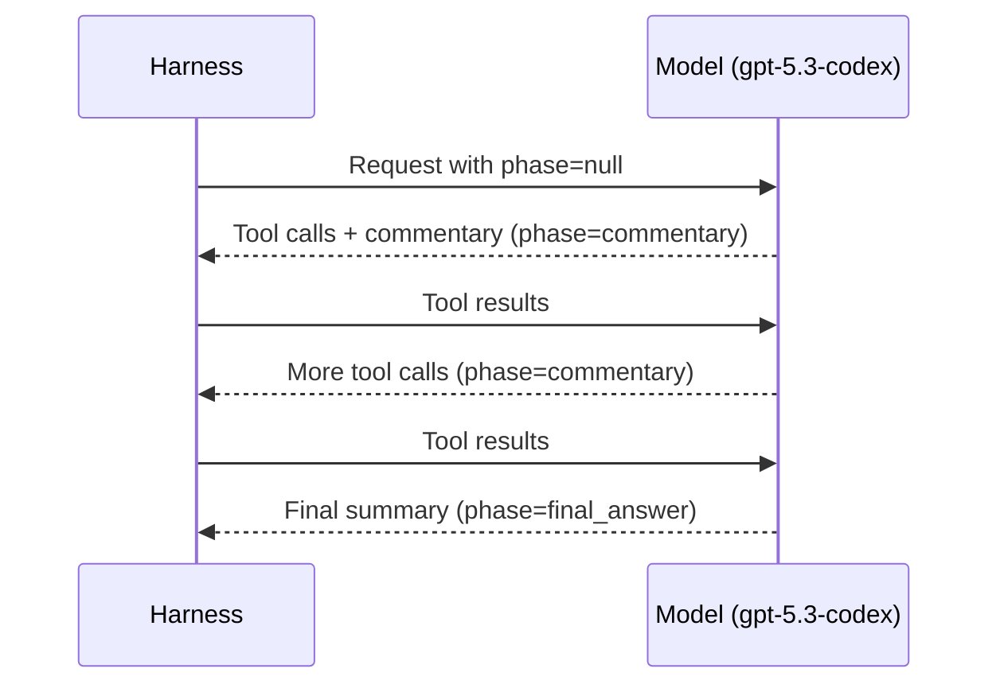

# The Official Codex Prompting Guide: System Prompts, Personality Modes, and Custom Harness Patterns


OpenAI's Cookbook contains a document that most Codex CLI users never read: the **Codex Prompting Guide**[^1]. It is the canonical reference for anyone building a custom harness around gpt-5.3-codex or GPT-5.4 — and it reveals exactly how OpenAI structures the system prompt, tool definitions, and behavioural directives that power every Codex surface, from the CLI to the desktop app to the VS Code extension.

This article decodes the guide's key patterns and shows how to apply them when building your own agent harness with the Responses API.

## Why the Prompting Guide Matters

The Codex CLI itself is open source[^2], but the *prompting patterns* that make it effective are documented separately in the OpenAI Cookbook. These patterns are not Codex-CLI-specific — they apply to any harness that calls gpt-5.3-codex or GPT-5.4 via the Responses API. If you are embedding Codex intelligence in a CI/CD pipeline, a SaaS product, or an internal developer platform, the prompting guide is your starting point.

OpenAI explicitly states that the open-source `codex-cli` agent is the "best reference implementation"[^1], but from working with enterprise customers, they have documented additional customisation patterns that go beyond that implementation.

## The Recommended System Prompt Architecture

The guide prescribes a system prompt with several distinct sections, each steering a different aspect of agent behaviour[^1].

### Autonomy Directive

The core instruction is a **bias to action**: the model should implement with reasonable assumptions rather than asking clarifying questions. Once given a direction, it should proactively gather context, plan, implement, test, and refine — all without waiting for further human input.

This is the single most impactful directive for harness builders. Without it, gpt-5.3-codex tends to ask permission at every step, destroying the autonomous workflow that makes agentic coding valuable.

### Tool Preference Hierarchy

The system prompt establishes a clear hierarchy: prefer dedicated tools (like `apply_patch`) over shell commands for file editing. This prevents the model from falling back to `sed`, `awk`, or `echo >>` for file modifications — patterns that are fragile and harder to audit.

### Parallel Tool Calling

A critical directive instructs the model to think first about all needed resources, then batch all calls together using `multi_tool_use.parallel`[^1]. The pattern is:

1. Plan all needed reads
2. Issue one parallel batch
3. Analyse results
4. Repeat only if new, unpredictable reads arise

```python
# The model is trained to emit parallel tool calls like this:
# Instead of sequential:
#   read file A → read file B → read file C
# It batches:
#   read files A, B, C simultaneously
```

Without this directive, the model reads files one at a time, which burns tokens on round trips and slows the agent loop considerably.

### Planning Behaviour

The guide recommends skipping formal plans for simple tasks and only using the `update_plan` tool for multi-step work[^1]. After completing each subtask, the model should update the plan. Before finishing, all items must be marked Done, Blocked, or Cancelled — no dangling "in progress" items.

## The Two Personality Modes

The Codex harness ships with two built-in personality modes that can be injected via the system prompt[^1][^3]:

### Friendly Mode

Warm, supportive collaboration with more explanations, reassurance, and context-setting. The model acknowledges the user's input, explains its reasoning, and checks in frequently. Ideal for:

- Onboarding new team members
- Ambiguous or exploratory tasks
- Pair programming sessions where the human wants to learn

### Pragmatic Mode

Direct, terse delivery prioritising actionable information. Minimal acknowledgement, no "Good catch!" or "Aha, I see!" filler. Better for:

- Throughput-critical batch operations
- CI/CD pipelines where nobody reads the preamble
- Experienced developers who want results, not conversation

### Preamble Frequency

The guide specifies that updates should be 1–2 sentences, arriving every 1–3 execution steps, with a maximum of 6 steps between updates[^1]. This prevents two failure modes: over-chatty agents that spend tokens on commentary, and silent agents that leave the user wondering whether the session has stalled.

## Tool Definitions for Custom Harnesses

The guide documents four core tools that any harness should implement.

### apply_patch

The primary file editing tool, using the V4A diff format. The Responses API provides first-class support via `tools=[{"type": "apply_patch"}]`[^4]. The model emits `apply_patch_call` objects with three operation types:

| Operation | Purpose |
|-----------|---------|
| `create_file` | Create a new file with full contents |
| `update_file` | Modify an existing file via V4A diff |
| `delete_file` | Remove a file |

Your harness must parse these operations, apply them to the filesystem, and return `apply_patch_call_output` events with `completed` or `failed` status[^4].

```python
from openai import OpenAI

client = OpenAI()

response = client.responses.create(
    model="gpt-5.3-codex",
    input="Rename the fib() function to fibonacci() in all files",
    tools=[{"type": "apply_patch"}],
)

# Parse and apply patch_calls from response.output
for item in response.output:
    if item["type"] == "apply_patch_call":
        operation = item["operation"]
        # Apply the operation to your filesystem
        # Return apply_patch_call_output with status
```

### shell_command

The primary tool for terminal operations. The guide recommends a `command` parameter as a string (not a list), a `workdir` parameter that is always specified, and an optional `timeout_ms`[^1]. A separate PowerShell variant is available for Windows environments.

### update_plan

A standard TODO management tool with status tracking (`pending`, `in_progress`, `completed`). The model uses this to maintain a visible plan that the harness can render in a UI.

### view_image

Enables image attachment for visual context — screenshots, diagrams, or design mockups that the model can reference during implementation.

## The Phase Parameter

Introduced with gpt-5.3-codex, the `phase` parameter on the Responses API prevents early stopping in long sessions[^1][^5]. Three values:

- **`null`** (default) — normal response
- **`"commentary"`** — preamble or progress messages; the model knows more work follows
- **`"final_answer"`** — closing message; the model can wrap up



**Critical implementation detail**: phase metadata must be preserved when reconstructing conversation history. Stripping phase values causes the model to lose track of where it is in a multi-step workflow[^1].

## Response Truncation

The guide recommends limiting tool output to 10,000 tokens[^1]. When output exceeds this limit, use the **half-and-half strategy**:

1. Include the first 50% of the budget
2. Insert a truncation marker (e.g., `…3,482 tokens truncated…`)
3. Include the last 50%

This keeps the model "in-distribution" — it was trained on truncated outputs formatted this way. Sending untruncated 50K-token outputs degrades performance.

## Metaprompting for Troubleshooting

When the model exhibits persistent failure modes — overthinking before the first tool call, unnatural status updates, or awkward preamble phrasing — the guide recommends **metaprompting**[^1]:

1. At the end of a problematic turn, ask the model to review its own instructions
2. Request targeted improvements for the specific issue
3. Generate several variants and look for common elements
4. Simplify the suggestions into a general improvement

This is particularly valuable for enterprise harnesses where the system prompt has grown large through accumulated customisations. The model itself can identify which instructions are conflicting or redundant.

## AGENTS.md Integration

From the model's perspective, AGENTS.md files are discovered and injected automatically from `~/.codex/` through the repository root to the current working directory[^1]. Each file appears as a separate user-role message in the conversation, with later directories overriding earlier ones.

For custom harnesses, this means you should replicate this layered injection pattern: global instructions first, then project-level, then directory-level. The model expects this ordering and uses it to resolve conflicting instructions.

## Frontend Task Guidance

An often-overlooked section of the guide provides specific design directives for UI work[^1]: the model should avoid "safe, average-looking layouts" and aim for intentional, bold designs with expressive typography, meaningful animations, and atmospheric backgrounds. The exception is existing design systems, where the model should preserve established patterns.

This is relevant for harness builders who want the model to generate frontend code — without this directive, gpt-5.3-codex defaults to generic Bootstrap-style layouts.

## Building Your First Custom Harness

The minimum viable harness needs four components:

1. **System prompt** — autonomy directive, tool preference hierarchy, personality mode
2. **Tool definitions** — `apply_patch` (via Responses API first-class support), `shell_command`, optionally `update_plan` and `view_image`
3. **Conversation state** — either `previous_response_id` chaining or input array replay[^5]
4. **Compaction** — call `/responses/compact` when context grows large, passing the encrypted token back in future requests[^1]

The OpenAI Agents SDK provides ready-made implementations for both Python and TypeScript[^4], including `ApplyPatchTool` with built-in approval workflows:

```typescript
import { Agent, run, applyPatchTool, Editor } from "@openai/agents";

const agent = new Agent({
    name: "Custom Harness",
    model: "gpt-5.3-codex",
    instructions: "Your system prompt here.",
    tools: [
        applyPatchTool({
            editor: new YourWorkspaceEditor(),
            needsApproval: true,
        }),
    ],
});

const result = await run(agent, "Implement the feature described in SPEC.md");
```

## What the Guide Does Not Cover

The prompting guide is deliberately silent on several topics that harness builders need to solve independently:

- **Sandbox security** — the guide assumes your harness handles filesystem and network isolation
- **Approval workflows** — beyond basic `needsApproval`, the approval UX is harness-specific
- **Multi-agent orchestration** — the guide covers single-agent patterns only
- **Cost management** — no guidance on token budgets or model routing

For these, refer to the Codex CLI source code[^2] and the app-server architecture documentation[^6].

## Practical Recommendations

1. **Start with the official system prompt**, then customise — do not write from scratch
2. **Enable parallel tool calling** from day one; the performance difference is substantial
3. **Use pragmatic personality** for automated pipelines; friendly for interactive use
4. **Implement response truncation** at 10K tokens exactly as specified
5. **Preserve phase metadata** in conversation history — this is the most common custom harness bug
6. **Use metaprompting** to iteratively improve your system prompt rather than manual editing

## Citations

[^1]: OpenAI, "Codex Prompting Guide," OpenAI Cookbook, 2026. [https://developers.openai.com/cookbook/examples/gpt-5/codex_prompting_guide](https://developers.openai.com/cookbook/examples/gpt-5/codex_prompting_guide)

[^2]: OpenAI, "Codex CLI — Lightweight coding agent that runs in your terminal," GitHub, 2026. [https://github.com/openai/codex](https://github.com/openai/codex)

[^3]: OpenAI, "Custom Prompts — Codex," OpenAI Developers, 2026. [https://developers.openai.com/codex/custom-prompts](https://developers.openai.com/codex/custom-prompts)

[^4]: OpenAI, "Apply Patch Tool Guide," OpenAI API Docs, 2026. [https://developers.openai.com/api/docs/guides/tools-apply-patch](https://developers.openai.com/api/docs/guides/tools-apply-patch)

[^5]: OpenAI, "Building Custom Harnesses with the Codex Responses API," codex.danielvaughan.com, 2026. [https://codex.danielvaughan.com/2026/04/01/codex-responses-api-phase-parameter-custom-harness/](https://codex.danielvaughan.com/2026/04/01/codex-responses-api-phase-parameter-custom-harness/)

[^6]: OpenAI, "Unlocking the Codex Harness: How We Built the App Server," OpenAI Blog, 2026. [https://openai.com/index/unlocking-the-codex-harness/](https://openai.com/index/unlocking-the-codex-harness/)
