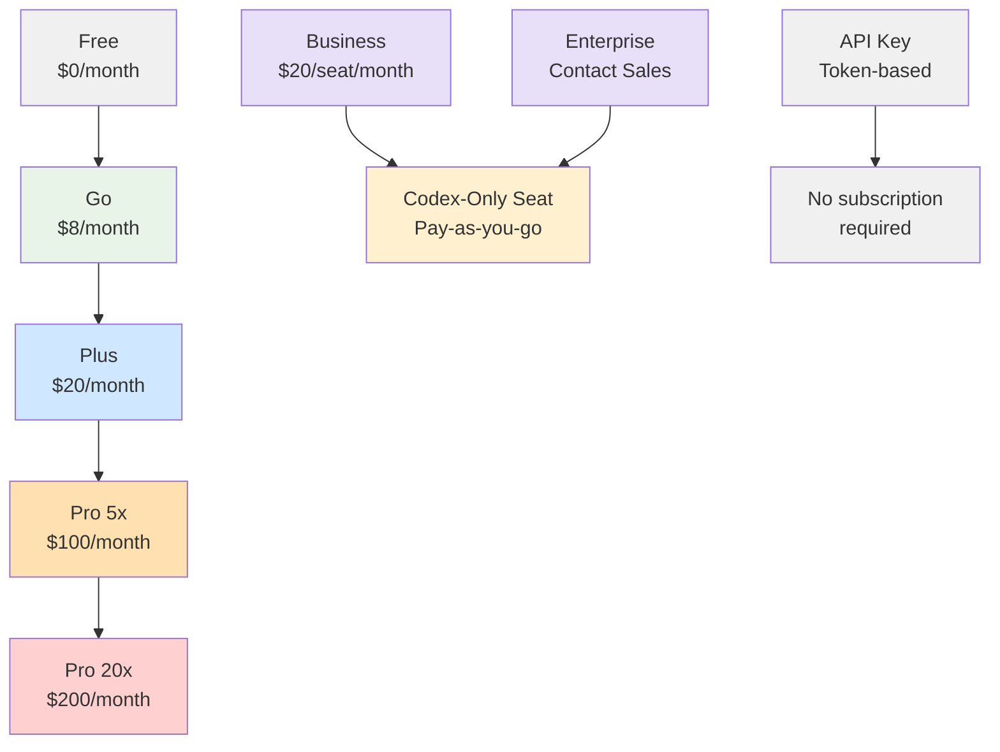
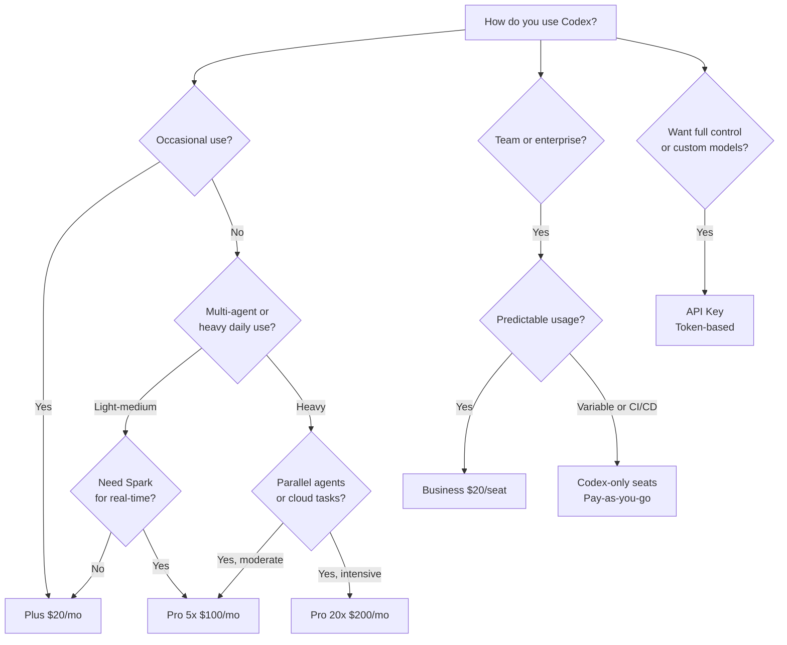

# The New Codex Subscription Landscape: Free, Go, Plus, Pro and Enterprise Compared


On 9 April 2026, OpenAI announced a new **$100/month ChatGPT Pro tier** that slots between the $20 Plus plan and the former $200 Pro plan — now rebranded as Pro 20x [^1]. Combined with the $8 Go tier, the pay-as-you-go Codex-only seats launched on 3 April [^2], and the model deprecation wave that began on 7 April [^3], the Codex subscription landscape has been comprehensively restructured in under a week. This article maps every tier, explains what each means for Codex CLI practitioners, and compares the result with Anthropic's Claude Max pricing.

## Why the Restructure Matters

Codex now has over 3 million weekly active users — a fivefold increase in three months, with 70% month-over-month growth [^4]. That explosive adoption exposed a pricing gap: developers who exceeded Plus limits had no option short of the $200 Pro plan. The new $100 tier directly addresses this, whilst the pay-as-you-go Codex-only seats give enterprise teams granular cost control for CI/CD and multi-agent workloads [^2].

## The Complete Tier Map



### Consumer and Individual Tiers

| Tier | Price | Codex Local Messages (5 hr) | Cloud Tasks | Spark Access | Key Use Case |
|------|-------|---------------------------|-------------|--------------|--------------|
| **Free** | $0 | Limited | — | — | Quick exploration |
| **Go** | $8/mo | Light | — | — | Lightweight coding tasks |
| **Plus** | $20/mo | 20–100 (GPT-5.4) / 60–350 (mini) / 30–150 (5.3-Codex) | Limited | — | Daily development |
| **Pro 5x** | $100/mo | 200–1,000 (GPT-5.4) / 600–3,500 (mini) / 300–1,500 (5.3-Codex) | Available | ✅ Research preview | Professional daily use |
| **Pro 20x** | $200/mo | 400–2,000 (GPT-5.4) / 1,200–7,000 (mini) / 600–3,000 (5.3-Codex) | Available | ✅ Research preview | Intensive parallel workflows |

All usage limits operate on a rolling 5-hour window rather than a daily cap [^5].

### Team and Enterprise Tiers

| Tier | Price | Differentiator |
|------|-------|---------------|
| **Business** | $20/seat/mo (down from $25) | Standard seats with Codex usage cap; optional Codex-only seats |
| **Codex-Only Seat** | Pay-as-you-go (token-based) | No rate limits; billed on consumption; up to $500 promo credits per member [^2] |
| **Enterprise** | Contact sales | SAML SSO, SCIM, EKM, RBAC, audit logs, data retention, credit pools |
| **Edu** | Contact sales | Same enterprise security, education pricing |

### API Key Access

Developers can bypass subscription tiers entirely by authenticating with an API key [^5]. This provides:

- Token-based billing at published API rates
- No cloud features (cloud tasks require ChatGPT authentication)
- Access to any API-supported model, including custom providers via `[model_providers]` in `config.toml`
- No rate limit resets tied to subscription events

## The Pro 5x Sweet Spot

The $100 Pro tier is the headline change. For Codex CLI users, the practical impact is substantial:

**5× the message throughput.** Where Plus gives you 20–100 GPT-5.4 local messages per 5-hour window, Pro 5x gives you 200–1,000 [^5]. For a typical subagent workflow running an orchestrator plus three workers, that is the difference between hitting the wall mid-afternoon and running comfortably through a full working day.

**GPT-5.3-Codex-Spark access.** Spark — the Cerebras-powered model running at 1,000+ tokens per second — remains exclusive to Pro subscribers [^6]. For interactive refinement workflows where near-instant feedback changes how you work, this alone may justify the upgrade from Plus.

**Promotional 10× boost through May 2026.** Until 31 May, Pro 5x subscribers receive a temporary 2× multiplier on top of the standard 5×, effectively giving 10× Plus usage [^1]. The shown limits on the pricing page already include this boost — they will halve on 1 June.

### Configuring Spark in Your Profile

```toml
# ~/.codex/config.toml

[profiles.spark]
model = "gpt-5.3-codex-spark"
model_reasoning_effort = "high"

[profiles.spark.model_providers.openai]
# Spark requires ChatGPT authentication, not API key
```

Then invoke with:

```bash
codex --profile spark "refactor the auth module to use PKCE"
```

## Token Economics: Credits vs API Rates

Understanding the two billing models is critical for cost planning.

### Credit-Based Billing (Plus / Pro)

Credits are consumed per task, with costs varying by model and task type [^5]:

| Task Type | GPT-5.4 | GPT-5.3-Codex | GPT-5.4-mini |
|-----------|---------|---------------|--------------|
| Local task | ~7 credits | ~5 credits | ~2 credits |
| Cloud task | ~34 credits | ~25 credits | — |
| Code review | ~34 credits | ~25 credits | — |

Fast mode doubles credit consumption. Credits enable continued use beyond included limits.

### Token-Based Billing (Business / Codex-Only Seats)

For pay-as-you-go seats, costs are calculated per million tokens [^2]:

| Model | Input (credits/1M) | Cached Input | Output |
|-------|-------------------|--------------|--------|
| GPT-5.4 | 62.50 | 6.25 | 375.00 |
| GPT-5.4-mini | 18.75 | 1.875 | 113.00 |
| GPT-5.3-Codex | 43.75 | 4.375 | 350.00 |

The cached input rate — roughly 10× cheaper than uncached — makes prompt caching and session resumption significant cost levers [^5].

## The Competitive Mirror: Claude Max

Anthropic's Claude pricing now mirrors OpenAI's structure almost exactly [^7]:

| | OpenAI Codex | Anthropic Claude Code |
|---|---|---|
| Base tier | Plus $20/mo | Pro $20/mo |
| Mid tier | Pro 5x $100/mo | Max 5x $100/mo |
| Top tier | Pro 20x $200/mo | Max 20x $200/mo |
| Usage model | 5-hour rolling window | ~5-hour rolling window |
| Pay-as-you-go | Codex-only seats (token-based) | API key only |

The structural similarity is not coincidental. Both companies are converging on the same insight: professional developers will pay $100/month for 5× throughput, but the $20-to-$200 jump was losing them to the competitor [^8].

Key differentiators remain:

- **Codex** offers pay-as-you-go enterprise seats with no rate limits — Claude has no equivalent [^2]
- **Codex** has Spark for near-instant feedback loops — Claude has no speed-optimised model tier [^6]
- **Claude Code** scores higher on Terminal-Bench (39th place notwithstanding, Claude's Opus 4.6 model is generally rated #1 on multi-file refactoring tasks) [^8]
- **Claude Max** includes priority access to new models and features like voice mode [^7]

## Decision Framework: Which Tier for Which Workflow



### Practical Recommendations

**Solo developer, daily use:** Start with Plus. If you consistently hit the 5-hour ceiling before lunch, upgrade to Pro 5x. The promotional 10× boost through May gives you a month to evaluate whether the extra headroom is worth it.

**Subagent-heavy workflows:** Pro 5x is the minimum. A typical orchestrator + 3 worker pattern can consume 15–30 messages per turn cycle. At Plus limits (20–100 messages per window), you get 1–6 full cycles. At Pro 5x (200–1,000), you get 13–66.

**CI/CD pipelines:** Use Codex-only seats with token-based billing. Rate limits are absent, and you pay only for what `codex exec` actually consumes [^2]. Set `max_tokens_per_session` in your CI profile to cap runaway costs:

```toml
# .codex/config.toml (project-level)

[profiles.ci]
model = "gpt-5.4-mini"
model_reasoning_effort = "medium"
approval_policy = "full-auto"
sandbox_mode = "read-only"
```

**Enterprise teams (50+ developers):** The Business seat price drop to $20/month makes standard seats cheaper [^2], whilst Codex-only seats let you allocate budget to the developers and pipelines that need it. Enterprise credit pools enable department-level budgeting without per-developer licensing friction.

## The Model Availability Shift

The 7 April model picker update removed six models from ChatGPT-authenticated sessions [^3]:

- `gpt-5.2-codex` — removed from picker, full removal 14 April
- `gpt-5.1-codex-mini`, `gpt-5.1-codex-max`, `gpt-5.1-codex` — deprecated 1 April, removed from picker
- `gpt-5.1`, `gpt-5` — removed from picker

The remaining models for ChatGPT sign-in are:

- `gpt-5.4` (recommended default)
- `gpt-5.4-mini` (subagent workhorse)
- `gpt-5.3-codex` (coding specialist)
- `gpt-5.2` (legacy, still available)
- `gpt-5.3-codex-spark` (Pro only, research preview)

API key users can still access other API-supported models and configure custom providers [^3]. If your `config.toml` references any deprecated model, Codex will fall back to the default — update your profiles now to avoid surprises:

```bash
# Check all your config files for deprecated models
grep -r "gpt-5.1\|gpt-5.0\|gpt-5\"" ~/.codex/ .codex/ 2>/dev/null
```

## What This Means for the Ecosystem

The restructured pricing tells a clear story about where OpenAI sees Codex heading:

1. **Codex is the growth engine.** The 3 million weekly users and 70% month-over-month growth justify the entire pricing restructure [^4]. The $100 tier exists because Codex created demand for it.

2. **Enterprise is pay-as-you-go.** Fixed per-seat licensing is giving way to consumption-based billing — the same model that won for cloud infrastructure. The $500 promotional credits per Codex-only seat lower the barrier for enterprise evaluation [^2].

3. **Speed is a premium feature.** Spark access gated behind Pro signals that OpenAI views inference speed as a differentiation axis, not just model quality [^6].

4. **The Claude Code arms race is symmetrical.** Both companies now offer identical tier structures at identical price points. The battleground has shifted from pricing to capability — which matters more for your workflow: Codex's Spark speed and cloud task architecture, or Claude Code's multi-file refactoring strength and extended thinking [^8].

## Citations

[^1]: TechCrunch, "ChatGPT finally offers $100/month Pro plan," 9 April 2026. [https://techcrunch.com/2026/04/09/chatgpt-pro-plan-100-month-codex/](https://techcrunch.com/2026/04/09/chatgpt-pro-plan-100-month-codex/)

[^2]: OpenAI, "Codex now offers pay-as-you-go pricing for teams," 3 April 2026. [https://openai.com/index/codex-flexible-pricing-for-teams/](https://openai.com/index/codex-flexible-pricing-for-teams/)

[^3]: OpenAI Developer Changelog, "Codex Model Availability Update," 7 April 2026. [https://developers.openai.com/codex/changelog](https://developers.openai.com/codex/changelog)

[^4]: BusinessToday, "OpenAI Codex celebrates 3 million weekly users, CEO Sam Altman resets usage limits," 8 April 2026. [https://www.businesstoday.in/technology/story/openai-codex-celebrates-3-million-weekly-users-ceo-sam-altman-resets-usage-limits-524717-2026-04-08](https://www.businesstoday.in/technology/story/openai-codex-celebrates-3-million-weekly-users-ceo-sam-altman-resets-usage-limits-524717-2026-04-08)

[^5]: OpenAI Developer Docs, "Codex Pricing," April 2026. [https://developers.openai.com/codex/pricing](https://developers.openai.com/codex/pricing)

[^6]: OpenAI Developer Docs, "Codex Models," April 2026. [https://developers.openai.com/codex/models](https://developers.openai.com/codex/models)

[^7]: IntuitionLabs, "Claude Max Plan Explained: Pricing, Limits & Features," 2026. [https://intuitionlabs.ai/articles/claude-max-plan-pricing-usage-limits](https://intuitionlabs.ai/articles/claude-max-plan-pricing-usage-limits)

[^8]: Dataconomy, "OpenAI Launches New $100-a-month Pro Plan For ChatGPT," 10 April 2026. [https://dataconomy.com/2026/04/10/openai-launches-new-100-a-month-pro-plan-for-chatgpt/](https://dataconomy.com/2026/04/10/openai-launches-new-100-a-month-pro-plan-for-chatgpt/)
