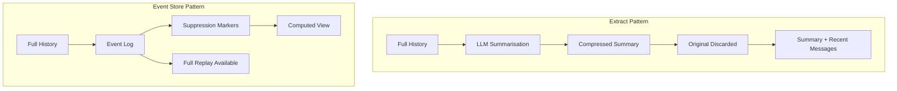
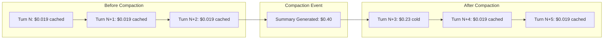

# Context Compaction Showdown: How Codex CLI, Claude Code, and 5 Other Agents Handle Full Context Windows


---

Every AI coding agent eventually fills its context window. What happens next — the compaction strategy — determines whether your session gracefully continues or quietly degrades into hallucinated nonsense. Despite being one of the most consequential design decisions in agent architecture, compaction remains poorly understood by practitioners who use these tools daily.

This article dissects the compaction strategies of seven agents: **Codex CLI**, **Claude Code**, **Gemini CLI**, **OpenCode**, **Roo Code**, **Pi**, and **OpenHands**. Two architectural patterns dominate: the **Extract** pattern (six agents) and the **Event Store** pattern (OpenHands). The differences have real implications for cost, quality, and session longevity.

## Two Architectural Patterns

### Extract: Summarise and Replace

Six of the seven agents use the same fundamental approach: when context fills up, an LLM reads the conversation history and produces a condensed summary that replaces older messages[^1]. The original turns are discarded. This is destructive, irreversible, and — for now — the industry default.

The Extract pattern is conceptually simple but introduces cumulative information loss. Each compaction round feeds a summary of a summary back into the next cycle, compounding degradation[^2].

### Event Store: Append-Only with Computed Views

OpenHands takes a fundamentally different approach. Built on an event-sourced state model, it maintains an append-only persistent log of all events[^3]. Compaction marks events for suppression rather than deletion — the full history remains available for replay or audit. Message views are computed dynamically from the event store, making compaction reversible[^1].

This design sacrifices storage efficiency for correctness guarantees. In regulated environments where audit trails matter, that trade-off is compelling.



## Trigger Thresholds: When Compaction Fires

The threshold at which compaction triggers varies enormously across agents, reflecting different philosophies about when to sacrifice history for headroom.

| Agent | Threshold | Formula |
|-------|-----------|---------|
| **Gemini CLI** | ~50% | Default; adjustable via settings[^1] |
| **Roo Code** | ~86–92% | `contextWindow × 0.9 − maxOutputTokens`[^1] |
| **Claude Code** | ~89% | `contextWindow − min(maxOutput, 20k) − 13k`[^1] |
| **Codex CLI** | ~90% | Hard ceiling, configurable downward only[^1] |
| **Pi** | ~92% | `contextTokens > window − 16,384`[^1] |
| **OpenCode** | ~96–99% | `contextTokens ≥ context − reserved`[^2] |
| **OpenHands** | Event-based | 100 events or agent-triggered[^1] |

Gemini CLI's aggressive 50% threshold is striking — it fires compaction when half the window remains unused[^1]. This trades context utilisation for stability, preventing the quality cliffs that late-firing agents risk. OpenCode sits at the opposite extreme, squeezing every token before compacting at 96–99%.

For practitioners, earlier thresholds mean more frequent but smaller information losses. Later thresholds mean fewer compactions but more catastrophic ones when they do fire.

## How Each Agent Compacts

### Codex CLI: The Dual-Path Architecture

Codex CLI is unique in maintaining two entirely separate compaction paths[^4]:

**Non-Codex models (open path):** The CLI runs a local LLM summarisation using a compaction prompt visible in the open-source code. The summary is stored with a `_summary` prefix to prevent re-summarisation loops[^1].

**Codex models (encrypted path):** The CLI calls OpenAI's remote `compact()` endpoint (`POST /v1/responses/compact`), which returns an AES-encrypted blob[^4]. The encryption key resides on OpenAI's servers. On the next turn, the server decrypts the blob and prepends a handoff prompt framing the summary for the model[^5].

Reverse-engineering by Simon Zhou revealed that the encrypted path's prompts "closely match the known prompts used for non-codex models in the open-source CLI"[^5], raising questions about why the encryption exists at all. The motivation likely relates to zero-data-retention (ZDR) compliance — the encrypted blob can transit the client without exposing conversation content[^6].

```toml
# Codex CLI compaction configuration
# The threshold is configurable downward only
model_auto_compact_token_limit = 180000  # varies by model: 180k–244k
```

### Claude Code: Five-Mechanism Defence

Claude Code employs the most sophisticated compaction architecture of any agent studied, with five distinct mechanisms[^1][^7]:

1. **Microcompact** — a no-LLM inline cleanup that fires on every turn above a warning threshold, removing redundant tool outputs without summarisation
2. **Tool output clearing** — older tool outputs are cleared first, preserving conversation structure
3. **Full LLM summarisation** — traditional Extract pattern when lighter mechanisms prove insufficient
4. **Cross-session cache reuse** — cached context from previous sessions can be leveraged to reduce cold-start costs
5. **Compact Instructions** — users can add a "Compact Instructions" section to CLAUDE.md or pass a focus to `/compact` (e.g., `/compact focus on the API changes`) to guide what the summariser preserves[^7]

Claude Code also supports a thrashing detection mechanism: if context refills immediately after compaction (typically due to a single massive tool output), it stops auto-compacting after a few attempts and surfaces an error rather than looping indefinitely[^7].

### Gemini CLI: Summarise-Then-Verify

Gemini CLI uses a distinctive two-pass approach: the first LLM call summarises the history, then a second call self-critiques the summary for completeness[^1]. This verification step catches omissions that single-pass summarisation misses.

Additionally, Gemini preserves 30% of the conversation tail verbatim alongside the summary[^1], providing a larger recent-context buffer than most competitors. The compaction prompts include hardcoded prompt-injection resistance[^1] — a recognition that summarisation prompts are an attack surface.

### OpenCode: Last-Resort Compaction

OpenCode treats compaction as a measure of last resort, firing at 96–99% capacity[^2]. Before resorting to full LLM summarisation, it runs a separate pruning mechanism that protects the last 40,000 tokens of tool output[^2]. Only content older than this protected buffer is eligible for compaction, with a minimum prunable threshold of 20,000 tokens.

Users can disable automatic compaction entirely via the `OPENCODE_DISABLE_AUTOCOMPACT` environment variable[^2].

### Roo Code: Non-Destructive Tagging

Roo Code takes a hybrid approach: rather than deleting compacted content, it tags summarised segments with a `condenseParent` UUID[^1]. Post-compaction, it uses tree-sitter to extract function signatures from referenced files, maintaining structural awareness even after content reduction.

### Pi: Iterative Accumulation

Pi distinguishes between initial and subsequent compactions with separate prompt templates[^1]. Across multiple compaction cycles, it accumulates file operation tracking in XML format, building a persistent record of which files were modified and how — context that pure summarisation would lose.

## The Hidden Cost: KV Cache Destruction

Every compaction event carries a cost that rarely appears in agent documentation: **KV cache invalidation**[^1].

When an LLM provider processes your context, it builds a key-value cache of the attention computations. Subsequent turns that share the same context prefix hit this cache, dramatically reducing both latency and cost. Anthropic's API pricing makes the difference stark: cache reads cost approximately **92% less** than cold reads — $0.019 versus $0.23 for 60,000 tokens[^1].

Compaction destroys this cache entirely. The summarised context is a new prefix that shares nothing with the previous one, forcing a complete recomputation.

The wasnotwas.com analysis quantified this precisely: **one compaction on a 125,000-token context costs $0.40 — equivalent to approximately 21 follow-up turns at cached rates**[^1].



This means the optimal strategy is not to avoid compaction but to **delay it as long as possible while the cache is warm**, then compact only when the quality degradation from a full window exceeds the cost of cache invalidation.

## Pre-Compaction Checklists: A 49% Improvement

The wasnotwas.com research tested whether injecting a structured preservation checklist before compaction improved summary quality[^1]. The checklist covered seven categories: file paths modified, architectural decisions made, error states encountered, function signatures involved, test results, environment variables, and pending tasks.

The result: summary length increased from 1,643 tokens to 2,455 tokens — a **49% improvement** — at a negligible additional cost of $0.013[^1]. Neither baseline nor nudged variants triggered earlier compaction, as token thresholds are content-blind.

For Codex CLI users, this translates directly to the open-path compaction prompt. For Claude Code users, the "Compact Instructions" section in CLAUDE.md serves the same function[^7].

## Practical Implications for Long-Horizon Work

### Spawn Fresh Agents Instead of Extending Sessions

The compounding information loss from repeated compactions makes a strong case for **subagent architecture over long sessions**[^7]. When a task can be decomposed, spawning a fresh agent with a focused prompt preserves full context fidelity within each subtask. The parent agent maintains coordination state while children operate with clean, uncompacted windows.

### Monitor Your Compaction Count

Most agents provide no visibility into how many compactions have occurred. Claude Code's `/context` command[^7] is the exception — use it regularly. If you are three or more compactions deep, consider starting a fresh session with a structured handoff rather than continuing.

### Choose Your Agent's Threshold Wisely

For exploratory work where you expect long sessions, Gemini CLI's early compaction (50%) provides stability at the cost of context utilisation. For focused, high-context tasks where every token matters, OpenCode's late compaction (96–99%) maximises the useful window but risks quality cliffs.

### The Emerging Alternative: Latent-Space Compaction

Research from MIT and Harvard published in February 2026 introduced **Fast KV Compaction via Attention Matching**[^8] — a technique that constructs a smaller KV set matching the attention outputs of the full set without generating any summary tokens. Crucially, this preserves cache continuity, meaning the compacted state can be served as a new cache prefix without the cold-start penalty. This remains a research result rather than a production feature, but it points toward a future where the Extract-vs-Event-Store dichotomy becomes irrelevant.

## Recommendations

1. **Add compact instructions** to your CLAUDE.md or Codex CLI compaction prompts — the 49% quality improvement is essentially free
2. **Prefer subagents** for tasks exceeding ~30 minutes of active conversation
3. **Track compaction events** and treat three successive compactions as a signal to restructure your session
4. **Understand your agent's threshold** — it determines how much context you can accumulate before information loss begins
5. **Factor KV cache costs** into your workflow decisions — a $0.40 compaction that buys you 21 more cached turns is worthwhile only if you actually need those turns

---

## Citations

[^1]: wasnotwas, "How AI Coding Agents Handle a Full Context Window," wasnotwas.com, March 2026. <https://wasnotwas.com/writing/context-compaction/>

[^2]: badlogic, "Context Compaction Research: Claude Code, Codex CLI, OpenCode, Amp," GitHub Gist, December 2025. <https://gist.github.com/badlogic/cd2ef65b0697c4dbe2d13fbecb0a0a5f>

[^3]: OpenHands, "The OpenHands Software Agent SDK: A Composable and Extensible Foundation for Production Agents," arXiv:2511.03690, 2025. <https://arxiv.org/pdf/2511.03690>

[^4]: Tony Lee, "How Codex Solves the Compaction Problem Differently," tonylee.im, 2026. <https://tonylee.im/en/blog/codex-compaction-encrypted-summary-session-handover/>

[^5]: Simon Zhou, "Investigating how Codex context compaction works," simzhou.com, 2026. <https://simzhou.com/en/posts/2026/how-codex-compacts-context/>

[^6]: OpenAI, "Compaction — OpenAI API," developers.openai.com, 2026. <https://developers.openai.com/api/docs/guides/compaction>

[^7]: Anthropic, "How Claude Code works," code.claude.com, 2026. <https://code.claude.com/docs/en/how-claude-code-works>

[^8]: VentureBeat, "New KV cache compaction technique cuts LLM memory 50x without accuracy loss," venturebeat.com, February 2026. <https://venturebeat.com/orchestration/new-kv-cache-compaction-technique-cuts-llm-memory-50x-without-accuracy-loss>
