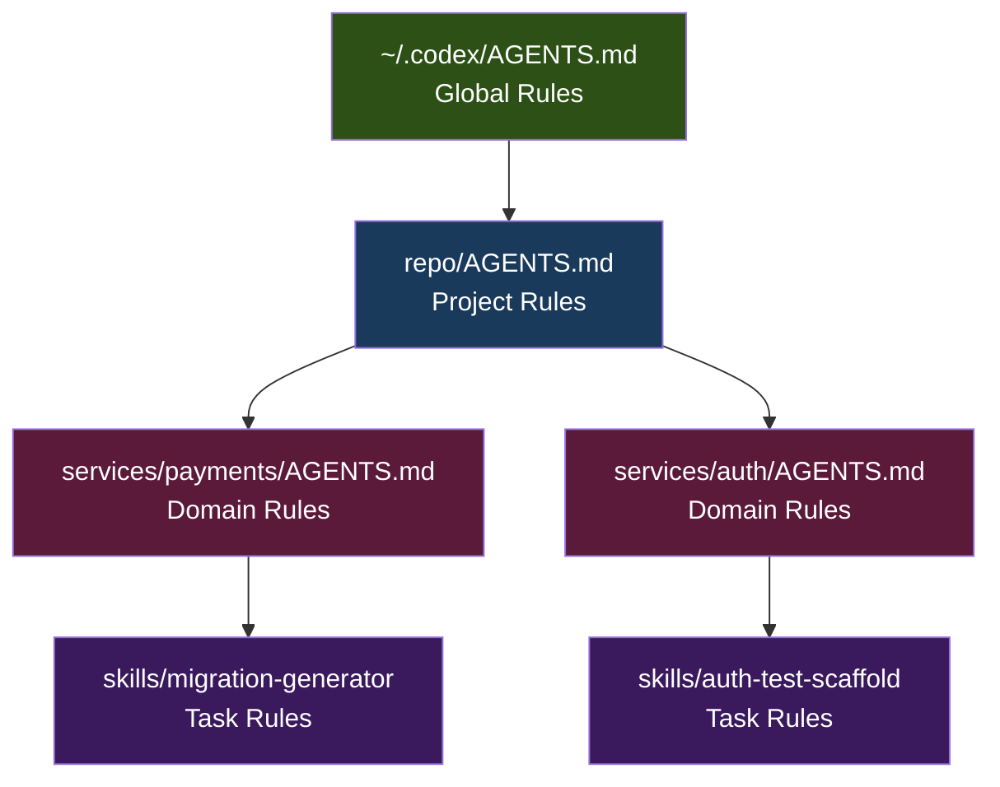
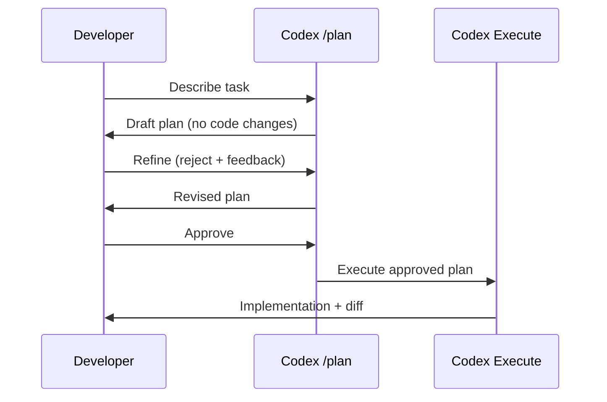
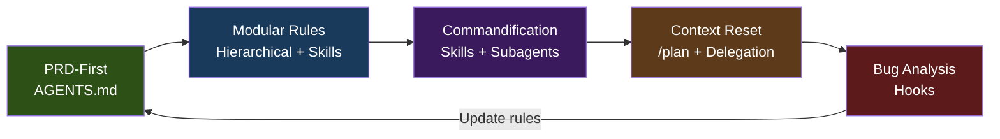

# The 5 Techniques of Top Agentic Engineers (Cole Medin's Framework Applied to Codex CLI)


---

Cole Medin — AI educator, consultant, and one of the more prolific voices in agentic engineering — distilled five techniques that separate the top agentic engineers from the rest[^1]. The framework resonates because it is tool-agnostic: it describes *disciplines*, not product features. But each discipline maps cleanly onto a concrete Codex CLI primitive.

This article walks through each technique, explains the underlying principle, and shows exactly how to implement it with AGENTS.md, subagent TOML, hooks, skills, and `/plan` mode.

## Technique 1: PRD-First Development → AGENTS.md

### The Principle

Top agentic engineers never start with a blank prompt. They begin with a structured Product Requirements Document (PRD) that specifies scope, constraints, acceptance criteria, and architecture decisions *before* the agent writes a single line of code[^1]. This front-loads clarity and prevents the agent from drifting into speculative implementation.

### The Codex CLI Mapping

In Codex CLI, **AGENTS.md** is the PRD. It loads automatically before every session, providing persistent, hierarchical instructions that the agent treats as ground truth[^2].

Codex discovers AGENTS.md files in a strict precedence chain: global (`~/.codex/AGENTS.md`), then walking from the Git root to the current directory, with `AGENTS.override.md` taking priority at each level[^2]. Files concatenate from root downward until the combined size reaches the `project_doc_max_bytes` limit (32 KiB by default)[^2].

```markdown
<!-- repo-root/AGENTS.md -->
## Architecture
- Monorepo: four services under services/
- Shared protobuf definitions in proto/
- All services deploy to Kubernetes via ArgoCD

## Constraints
- British English in all user-facing strings
- No direct database queries — use the repository pattern
- Every public function requires a JSDoc comment

## Acceptance Criteria
- All PRs must pass CI (lint, test, type-check)
- No TODO comments in merged code
```

For domain-specific overrides, place a scoped AGENTS.md deeper in the tree:

```markdown
<!-- services/payments/AGENTS.md -->
## Payments Service Rules
- PCI-DSS: never log card numbers or CVVs
- Use idempotency keys on all Stripe API calls
- Integration tests must run against the sandbox API
```

The hierarchical loading means global conventions stay consistent while specialised directories carry their own context — precisely the layered PRD structure Medin advocates[^1].

### Verification

Confirm your instruction chain loads correctly:

```bash
codex --ask-for-approval never "Summarise current instructions"
```

Check `~/.codex/log/codex-tui.log` if instructions appear truncated[^2].

## Technique 2: Modular Rules Architecture → Hierarchical AGENTS.md + Skills

### The Principle

Medin draws a sharp line between **global rules** (coding standards, security protocols, team conventions) and **task-specific rules** that should only load when relevant[^1]. Loading everything into every prompt wastes context tokens and dilutes focus.

### The Codex CLI Mapping

Codex CLI's hierarchical AGENTS.md system *is* modular rules architecture. Global rules sit in `~/.codex/AGENTS.md` or at the repository root. Task-specific rules live in subdirectory AGENTS.md files that only activate when the agent operates in that directory[^2].

For truly task-scoped rules, **skills** provide an even tighter boundary. A skill is a self-contained instruction set with its own SKILL.md frontmatter that Codex loads only when the skill is invoked[^3]:

```markdown
<!-- .codex/skills/migration-generator/SKILL.md -->
---
name: migration-generator
description: Generate database migrations from schema changes
---

## Rules (loaded only when this skill runs)
- Use Knex.js migration syntax
- Always create both up() and down() functions
- Name format: YYYYMMDD_HHMMSS_description.ts
- Never drop columns — mark deprecated with a comment
```

This layered approach — global AGENTS.md for universal rules, directory AGENTS.md for domain rules, skills for task rules — mirrors Medin's tiered architecture while respecting the finite context window[^4].



## Technique 3: Reusable Commands → Skills and Custom Agents

### The Principle

Medin calls this "commandification" — converting frequently used multi-step prompts into reusable, named commands[^1]. Every time you type the same complex prompt twice, you should abstract it into a command that the team can share and version.

### The Codex CLI Mapping

Codex CLI provides two complementary primitives:

**Skills** for prompt-scoped reuse. A skill packages instructions, constraints, and examples into a discoverable unit. Invoke with `/skill-name` in the interactive TUI or pass via `codex exec`[^3]:

```bash
# Run a skill non-interactively in CI
codex exec "Run the pr-description skill for the current branch"
```

**Custom subagents** for persona-scoped reuse. Define a TOML file in `~/.codex/agents/` or `.codex/agents/` specifying the agent's name, model, sandbox mode, and behavioural instructions[^5]:

```toml
# .codex/agents/reviewer.toml
name = "reviewer"
description = "Code review agent that checks for security, performance, and style issues"
model = "gpt-5.4"
sandbox_mode = "read-only"

developer_instructions = """
You are a senior code reviewer. For every file changed in the current diff:
1. Check for security vulnerabilities (injection, auth bypass, secrets in code)
2. Flag performance anti-patterns (N+1 queries, unbounded loops, missing indices)
3. Verify adherence to the project AGENTS.md conventions
Report findings as a prioritised list. Never modify files.
"""

nickname_candidates = ["Reviewer-A", "Reviewer-B", "Reviewer-C"]
```

The `nickname_candidates` array provides human-readable labels when multiple instances spawn in parallel[^5]. The `name` field remains the programmatic identifier.

Configure concurrency limits globally in `config.toml`:

```toml
[agents]
max_threads = 6       # Concurrent subagent cap
max_depth = 1         # Nesting depth (1 = direct children only)
job_max_runtime_seconds = 1800  # 30-minute timeout per worker
```

## Technique 4: Context Reset for Precision → Subagent Delegation and /plan Mode

### The Principle

After a planning phase, top engineers reset the AI's context window to start fresh, using only the structured plan as input[^1]. This eliminates context contamination — the accumulated noise from exploratory conversations, dead-end attempts, and superseded decisions.

### The Codex CLI Mapping

Codex CLI supports two complementary approaches:

**`/plan` mode** implements the plan-then-execute pattern directly. Toggle with `/plan` or `Shift+Tab` in the interactive TUI[^6]. The agent drafts a step-by-step plan and waits for your approval before writing any code. You can reject and refine iteratively until the plan matches your intent[^6]. This separation ensures the execution phase works from a clean, agreed specification.



**Subagent delegation** achieves context reset architecturally. When a long session accumulates context, spawn a fresh subagent with only the relevant brief[^5]:

```
Spawn a worker agent with these instructions:
- Read services/payments/checkout.ts
- Refactor the validateCard function to use the new CardValidator class
- Run npm test in services/payments/ and fix any failures
- Do not modify any other files
```

Each subagent starts with a clean context window. The parent orchestrates and collects results without passing its entire conversation history to children[^5]. This mirrors Medin's context reset technique at the architecture level, and it scales — you can spawn up to six concurrent subagents by default[^5].

## Technique 5: Continuous Improvement via Bug Analysis → Hooks as Quality Gates

### The Principle

Medin's final technique treats every bug as a learning opportunity: analyse the root cause, update rules and workflows to prevent recurrence, and build institutional memory[^1]. The system improves with every failure.

### The Codex CLI Mapping

**Hooks** are the enforcement layer. They inject custom scripts into the agentic loop at five lifecycle events: `SessionStart`, `PreToolUse`, `PostToolUse`, `UserPromptSubmit`, and `Stop`[^7].

Enable hooks in `config.toml`:

```toml
[features]
codex_hooks = true
```

Then define handlers in `hooks.json`:

```json
{
  "hooks": {
    "PreToolUse": [
      {
        "matcher": "Bash",
        "hooks": [
          {
            "type": "command",
            "command": "python3 .codex/hooks/validate_command.py",
            "statusMessage": "Checking command safety"
          }
        ]
      }
    ],
    "Stop": [
      {
        "matcher": "",
        "hooks": [
          {
            "type": "command",
            "command": "python3 .codex/hooks/stop_gate.py",
            "statusMessage": "Running quality gate"
          }
        ]
      }
    ]
  }
}
```

The **Stop hook** is particularly powerful for continuous improvement. When the agent signals completion, the hook can run tests, linters, or custom validators. If they fail, it returns `"decision": "block"` with a reason, forcing the agent to iterate[^7]:

```python
#!/usr/bin/env python3
# .codex/hooks/stop_gate.py
import json, subprocess, sys

data = json.load(sys.stdin)
result = subprocess.run(["npm", "test"], capture_output=True, text=True)

if result.returncode != 0:
    output = {
        "decision": "block",
        "reason": f"Tests failed. Fix these failures before completing:\n{result.stdout[-500:]}"
    }
    json.dump(output, sys.stdout)
else:
    # Tests passed — allow completion
    json.dump({"continue": True}, sys.stdout)
```

The **PreToolUse hook** implements Medin's "update rules to prevent recurrence" pattern. After identifying a class of bugs (say, the agent repeatedly runs destructive commands), add a validator that blocks the pattern:

```python
#!/usr/bin/env python3
# .codex/hooks/validate_command.py — learned from incident #47
import json, sys

data = json.load(sys.stdin)
command = data.get("command", "")
blocked = ["rm -rf /", "DROP TABLE", "git push --force"]

for pattern in blocked:
    if pattern in command:
        json.dump({"decision": "block", "reason": f"Blocked dangerous pattern: {pattern}"}, sys.stdout)
        sys.exit(0)

json.dump({"continue": True}, sys.stdout)
```

Each hook script is a piece of institutional memory — a codified lesson from a past failure that now runs automatically on every agent interaction[^7].

## The Five Techniques as a System

These techniques are not independent checklist items. They form a feedback loop:



PRD-first development produces the AGENTS.md that modular rules architecture organises. Commandification turns recurring patterns into reusable skills and agents. Context reset keeps execution clean via `/plan` mode and subagent delegation. And when bugs emerge, hook-based quality gates codify the lessons back into the rule system.

The result is a compound engineering workflow where every failure makes the system smarter, every session starts from a clean foundation, and every team member benefits from shared, versioned automation.

## Getting Started Checklist

| Technique | Codex CLI Primitive | First Step |
|-----------|-------------------|------------|
| PRD-First | AGENTS.md | Write a root AGENTS.md with architecture, constraints, and acceptance criteria |
| Modular Rules | Hierarchical AGENTS.md + Skills | Add subdirectory AGENTS.md files for your two most distinct domains |
| Commandification | Skills + Custom Agents | Convert your most-used prompt into a skill under `.codex/skills/` |
| Context Reset | `/plan` mode + Subagents | Use `/plan` for your next feature; spawn a subagent for isolated refactoring |
| Bug Analysis | Hooks | Create a Stop hook that runs your test suite before the agent completes |

---

## Citations

[^1]: Cole Medin, "5 Techniques Separating Top Agentic AI Engineers: Ship Faster with Fewer Mistakes", Geeky Gadgets, 2025. [https://www.geeky-gadgets.com/agentic-engineer-techniques/](https://www.geeky-gadgets.com/agentic-engineer-techniques/)

[^2]: OpenAI, "Custom instructions with AGENTS.md – Codex", OpenAI Developers, 2026. [https://developers.openai.com/codex/guides/agents-md](https://developers.openai.com/codex/guides/agents-md)

[^3]: OpenAI, "Agent Skills – Codex", OpenAI Developers, 2026. [https://developers.openai.com/codex/skills](https://developers.openai.com/codex/skills)

[^4]: Cole Medin, "Advanced Claude Code Techniques: Agentic Engineering With Context Driven Development", AI Coding Summit 2026. [https://gitnation.com/contents/advanced-claude-code-techniques-agentic-engineering-with-context-driven-development-3256](https://gitnation.com/contents/advanced-claude-code-techniques-agentic-engineering-with-context-driven-development-3256)

[^5]: OpenAI, "Subagents – Codex", OpenAI Developers, 2026. [https://developers.openai.com/codex/subagents](https://developers.openai.com/codex/subagents)

[^6]: SmartScope, "Codex Plan Mode: Stop Code Drift with Plan→Execute (2026)", SmartScope Blog, 2026. [https://smartscope.blog/en/generative-ai/chatgpt/codex-plan-mode-complete-guide/](https://smartscope.blog/en/generative-ai/chatgpt/codex-plan-mode-complete-guide/)

[^7]: OpenAI, "Hooks – Codex", OpenAI Developers, 2026. [https://developers.openai.com/codex/hooks](https://developers.openai.com/codex/hooks)
