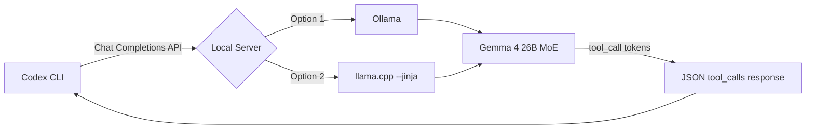
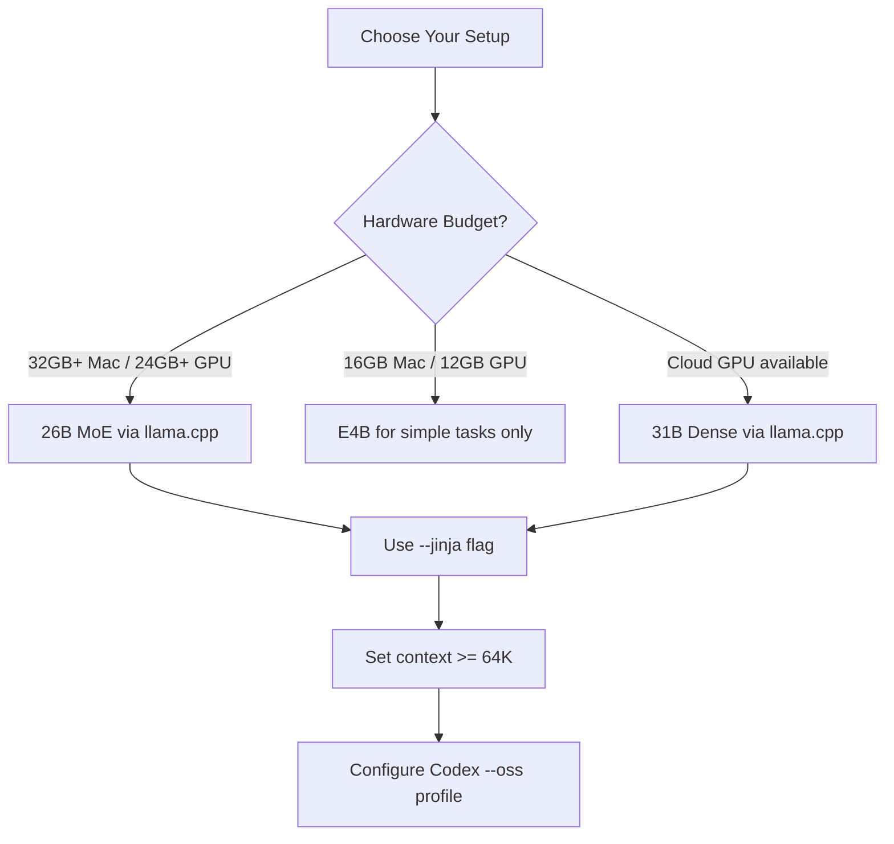

# Running Gemma 4 as a Local Model in the Codex CLI Harness


---

Google's Gemma 4 family, released on 2 April 2026 under the Apache 2.0 licence[^1], is the first open-weight model family with genuinely competitive agentic tool-calling benchmarks. The flagship 31B Dense scores 86.4 % on τ2-bench — up from Gemma 3's dismal 6.6 %[^2]. That thirteen-fold jump makes it worth investigating whether Gemma 4 can serve as a viable local replacement for cloud models inside the Codex CLI harness.

This article walks through the model line-up, the integration path via Codex CLI's custom model providers, what works today, and where the sharp edges remain.

## The Model Line-Up

Gemma 4 ships in four sizes, all sharing a 262K vocabulary[^3]:

| Variant | Total Params | Active Params | Context Window | τ2-bench |
|---------|-------------|---------------|----------------|----------|
| E2B | 5.1B | 2.3B | 128K | 29.4 % |
| E4B | 8B | 4.5B | 128K | 57.5 % |
| 26B MoE | 25.2B | 3.8B | 256K | 85.5 % |
| 31B Dense | 30.7B | 30.7B | 256K | 86.4 % |

The 26B MoE is the sweet spot for local development. With only 3.8B active parameters it runs comfortably on a 32 GB Apple Silicon Mac via Metal offloading, whilst delivering 97 % of the 31B Dense's agentic capability[^2]. Memory requirements for the Q4_K_M quantisation sit around 16–18 GB, leaving headroom for Codex CLI and your editor.

The E2B and E4B variants are too weak for reliable multi-step tool calling — their τ2-bench scores drop off a cliff — but are worth considering for single-shot code generation tasks on constrained hardware.

## Gemma 4's Tool-Calling Architecture

Unlike earlier open models that bolt function calling onto a chat template, Gemma 4 uses six dedicated special tokens baked into the tokeniser[^4]:

- `<|tool_call>` / `<|tool_call|>` — wrap outbound function invocations
- `<|tool_response>` / `<|tool_response|>` — wrap inbound results
- `<|"|>` — delimit string values within tool structures

A generated tool call looks like:

```
<|tool_call>call:run_bash{command:<|"|>ls -la<|"|>}<|tool_call|>
```

Tools are defined using standard OpenAI-compatible JSON schema[^4]:

```json
{
  "type": "function",
  "function": {
    "name": "run_bash",
    "description": "Execute a bash command",
    "parameters": {
      "type": "object",
      "properties": {
        "command": { "type": "string" }
      },
      "required": ["command"]
    }
  }
}
```

This matters for Codex CLI integration because the harness expects tool calls returned via the OpenAI Chat Completions wire format — specifically, `finish_reason: "tool_calls"` with a `tool_calls` array in the response. The inference server must translate Gemma 4's special tokens into this format correctly.

## The Integration Path

Codex CLI supports custom model providers through `~/.codex/config.toml`[^5]. The simplest approach uses the built-in `--oss` flag, which switches from the Responses API to the Chat Completions API — the wire format local servers speak[^6].

### Option 1: Ollama (Quick Start)

```bash
ollama pull gemma4:26b
codex --oss -m gemma4:26b
```

Or configure persistently:

```toml
[model_providers.ollama]
name = "Ollama (Gemma 4)"
base_url = "http://localhost:11434/v1"

[profiles.gemma4-local]
model = "gemma4:26b"
model_provider = "ollama"
```

Then launch with:

```bash
codex --profile gemma4-local
```

### Option 2: llama.cpp (Recommended for Tool Calling)

Build llama.cpp from source and start the server with the `--jinja` flag, which is required for Gemma 4's tool-calling chat template[^7]:

```bash
llama-server \
  -hf ggml-org/gemma-4-26B-A4B-it-GGUF:Q4_K_M \
  --port 8089 \
  -ngl 99 \
  -c 32768 \
  --jinja
```

Then point Codex at it:

```toml
[model_providers.llamacpp]
name = "llama.cpp (Gemma 4)"
base_url = "http://localhost:8089/v1"

[profiles.gemma4-llamacpp]
model = "gemma-4-26b"
model_provider = "llamacpp"
```

```bash
codex --profile gemma4-llamacpp
```

The `-c 32768` context size is a pragmatic minimum. Codex CLI's system prompt, tool definitions, and conversation history consume significant context; the official Ollama documentation recommends at least 64K tokens[^6]. If you have the VRAM budget, push this to 65536.



## What Works

With llama.cpp built from a recent main branch (post PR #21326[^7]) and the `--jinja` flag:

- **Basic tool calling** — Bash execution, file reads, file writes all function correctly. The model generates well-formed tool calls that Codex CLI parses without issue.
- **Code generation quality** — Gemma 4 26B scores 77.1 % on LiveCodeBench[^2], competitive with much larger cloud models for routine coding tasks.
- **Metal GPU acceleration** — Full layer offloading on Apple Silicon delivers usable token rates. Expect roughly 7 tokens/second on M-series hardware with the 26B MoE[^8].
- **Multi-turn conversations** — The model maintains coherent tool-calling behaviour across several turns of read-edit-verify cycles.

## What Breaks

### Ollama Tool-Calling Bugs (v0.20.x)

As of April 2026, Ollama's Gemma 4 tool-call parser is unreliable[^7]. Two specific issues:

1. **Streaming drops tool calls** — In streaming mode, tool call content gets incorrectly routed into the reasoning field rather than the tool_calls array.
2. **Parser crashes** — The tool-call parser throws "invalid character" errors on some well-formed Gemma 4 tool invocations.

⚠️ These issues may be resolved in a future Ollama release, but as of v0.20.1 they remain open.

### Reliability Degradation After Chained Calls

After 3–4 sequential tool invocations, reliability drops noticeably. The model starts generating plain-text descriptions of what it would do rather than actual tool calls. This is a fundamental model limitation rather than an infrastructure issue — even the 31B Dense exhibits it, though less frequently.

### Context Window Pressure

Codex CLI's tool definitions, system prompt, and conversation accumulation can consume 8–12K tokens before you've done anything[^5]. With a 32K context window, you have perhaps 20K tokens of working space. Long file reads or multi-file operations can push the model into degraded behaviour. Use 64K context if your hardware supports it.

### The WebFetch Question

WebFetch in Codex CLI is a tool the model invokes — it's not a model capability[^5]. If the model can reliably call tools, WebFetch works. The bottleneck is tool-calling reliability, not web access. In practice, Gemma 4 26B handles WebFetch calls correctly when the conversation context isn't too deep, but the URL and parameter formatting becomes less reliable as context pressure increases.

## Practical Recommendations



1. **Use llama.cpp, not Ollama** — Until Ollama fixes its tool-call parser for Gemma 4, llama.cpp with `--jinja` is the only reliable option for agentic use[^7].

2. **Target the 26B MoE** — The 3.8B active parameter count means it runs on consumer hardware whilst matching the 31B Dense on τ2-bench within one percentage point[^2].

3. **Set `reasoning: false`** — If your inference server supports it, disable thinking/reasoning output to avoid formatting conflicts where reasoning tokens interfere with tool-call parsing[^7].

4. **Create an AGENTS.md file** — Include explicit tool parameter schemas with exact parameter names (`filePath`, `oldString`, `newString`) in your project's `AGENTS.md`. This primes the model's context and significantly reduces tool-call parameter naming errors[^7].

5. **Keep sessions short** — The reliability cliff after 3–4 chained calls means you'll get better results from focused, single-task sessions rather than long-running autonomous operations.

6. **Budget context generously** — Set `-c 65536` minimum. The Ollama documentation specifically flags that Codex requires large context windows[^6].

## When to Stay on Cloud Models

Gemma 4 26B is impressive for an open model, but it's not a drop-in replacement for cloud-hosted models in all scenarios. Stick with cloud models when:

- You need reliable autonomous operation beyond 4–5 chained tool calls
- You're working with large codebases requiring extensive file reads
- You need consistent WebFetch reliability for web-dependent workflows
- You're running CI/CD pipelines where reliability matters more than cost

For local development, quick code generation, focused refactoring sessions, and privacy-sensitive work, Gemma 4 26B through llama.cpp is now a genuinely viable option — the first open model that can honestly claim to be.

## Citations

[^1]: [Gemma 4 — Google DeepMind](https://deepmind.google/models/gemma/gemma-4/) — Official model page, Apache 2.0 licence, April 2026 release.

[^2]: [Gemma 4: Byte for byte, the most capable open models — Google Blog](https://blog.google/innovation-and-ai/technology/developers-tools/gemma-4/) — Benchmark scores including τ2-bench, LiveCodeBench, and model specifications.

[^3]: [Gemma 4 — Ollama Library](https://ollama.com/library/gemma4) — Model sizes, parameter counts, context windows, and 262K vocabulary.

[^4]: [Function calling with Gemma 4 — Google AI for Developers](https://ai.google.dev/gemma/docs/capabilities/text/function-calling-gemma4) — Special tokens, JSON schema format, and tool-call wire format.

[^5]: [Advanced Configuration — Codex CLI Documentation](https://developers.openai.com/codex/config-advanced) — Custom model provider TOML configuration, `base_url`, `wire_api`, and provider setup.

[^6]: [Codex — Ollama Integration Documentation](https://docs.ollama.com/integrations/codex) — `--oss` flag, persistent profiles, 64K context recommendation.

[^7]: [Running OpenCode with Gemma 4 26B on macOS via llama.cpp — GitHub Gist](https://gist.github.com/daniel-farina/87dc1c394b94e45bb700d27e9ea03193) — Ollama tool-calling bugs, llama.cpp patches, `--jinja` flag requirement, AGENTS.md workaround.

[^8]: [Bringing AI Closer to the Edge and On-Device with Gemma 4 — NVIDIA Technical Blog](https://developer.nvidia.com/blog/bringing-ai-closer-to-the-edge-and-on-device-with-gemma-4/) — Hardware performance benchmarks for on-device inference.
