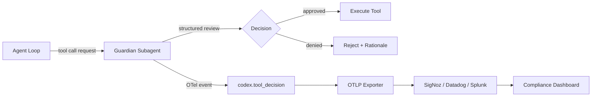
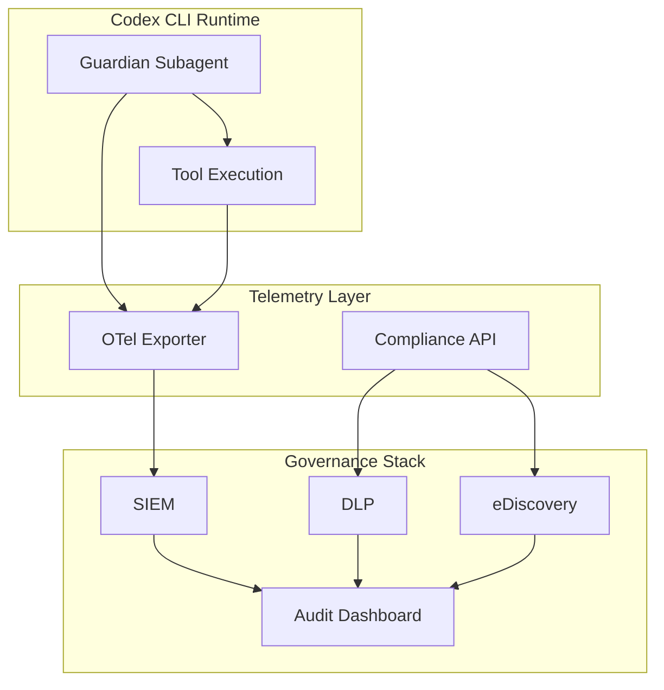

# Guardian Output Schema and Enterprise Compliance Audit Trails in Codex CLI


---

Every approval gate in a CI/CD pipeline needs to answer two questions: *what was decided?* and *why?* Codex CLI's guardian reviewer subagent — the AI that autonomously evaluates tool-call requests before execution — now emits structured output with discrete risk, authorisation, outcome, and rationale fields [^1]. For enterprise teams building compliance audit trails, this structured schema is the missing link between Codex's sandbox enforcement and the governance stack that auditors actually inspect.

This article dissects the guardian output schema, maps it to enterprise compliance requirements, and shows how to wire guardian decisions into an OpenTelemetry-backed audit pipeline.

## Smart Approvals and the Guardian Subagent

Codex CLI's approval system has always offered granular control over when execution pauses for human review. The `approval_policy` configuration supports `untrusted`, `on-request`, and `never` modes, plus granular sub-policies for sandbox escalation, exec-policy rules, MCP elicitations, and skill-script approvals [^2].

Smart Approvals (introduced in v0.115.0) add a third reviewer option: instead of requiring human approval or blindly auto-approving, eligible requests route through a **guardian reviewer subagent** — a separate LLM instance that independently evaluates each tool-call request [^3].

```toml
# ~/.codex/config.toml
[features]
smart_approvals = true

# Route approval requests to the guardian subagent
approvals_reviewer = "guardian_subagent"   # "user" (default) or "guardian_subagent"
```

The guardian session persists across approvals to reuse the prompt cache, avoiding startup overhead on each review [^3]. Critically, each individual review gets a clean history — prior decisions do not leak into later reviews, preventing context contamination [^3].

## The Guardian Output Schema

The guardian emits structured review notifications via the app-server WebSocket protocol. These notifications are currently marked `[UNSTABLE]` — the schema may evolve — but the core fields are well-defined [^1][^4]:

### Notification Events

Two notification types track the guardian review lifecycle:

- `item/autoApprovalReview/started` — emitted when the guardian begins evaluating a request
- `item/autoApprovalReview/completed` — emitted with the final assessment payload

### Review Fields

The `review` object contains four fields [^1][^4]:

| Field | Type | Values | Description |
|-------|------|--------|-------------|
| `status` | `string` (required) | `inProgress`, `approved`, `denied`, `aborted` | The outcome of the guardian's assessment |
| `riskLevel` | `string` (optional) | `low`, `medium`, `high`, `critical` | Categorical risk classification of the proposed action |
| `userAuthorization` | `string` (optional) | `unknown`, `low`, `medium`, `high` | The guardian's assessment of the user's authorisation level for this action |
| `rationale` | `string` (optional) | Free text | The guardian's reasoning for its decision |

### Action Types

The `action` field describes what the guardian is evaluating, using a tagged union [^4]:

```json
{
  "threadId": "th_abc123",
  "turnId": "tu_def456",
  "targetItemId": "item_ghi789",
  "review": {
    "status": "denied",
    "riskLevel": "high",
    "userAuthorization": "low",
    "rationale": "Command attempts to modify /etc/passwd which is outside the workspace sandbox boundary and poses a privilege escalation risk."
  },
  "action": {
    "type": "command",
    "command": "sudo usermod -aG wheel codex"
  }
}
```

The `action.type` discriminator supports five categories [^4]:

- **`command`** — shell command execution
- **`execve`** — direct process execution
- **`applyPatch`** — file modification via patch
- **`networkAccess`** — outbound network requests
- **`mcpToolCall`** — MCP server tool invocations

## Why Structured Rationale Matters for Compliance

Before the structured schema, guardian denials surfaced as opaque rejection messages. The rationale was embedded in the guardian's conversational output but not programmatically extractable. PR #17061 changed this by feeding guardian rationale directly into rejection messages and structuring it as a discrete field [^1].

This matters for three compliance scenarios:

### 1. SOC 2 Type II — Access Control Evidence

SOC 2 CC6.1 requires demonstrating that logical access controls restrict information system access to authorised users [^5]. The `userAuthorization` field maps directly to this: when the guardian assesses authorisation as `low` for a `high`-risk action, the denial creates an auditable record that the control operated correctly.

### 2. Change Management Audit Trails

Regulatory frameworks like ISO 27001 Annex A.12.1.2 require documented change management procedures [^6]. The guardian's `applyPatch` action type, combined with `riskLevel` and `rationale`, provides per-change risk assessment documentation that auditors can review.

### 3. Incident Investigation

When a security incident occurs, investigators need to reconstruct the decision chain. The structured `rationale` field captures *why* an action was permitted or blocked, not just *that* it was — critical for post-incident analysis.

## Wiring Guardian Output into Audit Pipelines

The guardian schema becomes useful for compliance only when it flows into your governance stack. Codex CLI provides two complementary channels.

### Channel 1: OpenTelemetry Export

Codex's built-in OTel integration captures tool decisions as structured events [^7]:

```toml
[otel]
environment = "production"
log_user_prompt = false   # redact prompts for compliance

exporter = { otlp-grpc = {
  endpoint = "https://otel.corp.example.com:4317",
  headers = { "x-otlp-api-key" = "${OTLP_TOKEN}" }
}}
```

The `codex.tool_decision` event category captures approval status and source — including guardian decisions [^7]. Every event includes `auth_mode`, `model`, and `app.version` metadata, providing the context auditors need to correlate decisions with specific Codex sessions.



### Channel 2: Enterprise Compliance API

For ChatGPT-authenticated Codex usage, the Compliance API exports activity logs including prompts, responses, user identifiers, timestamps, model metadata, and token usage [^8]. Audit logs are retained for up to 30 days [^8]. This API is designed for integration with eDiscovery, DLP, SIEM, and other compliance systems [^8].



### Combining Both Channels

The OTel channel captures real-time, granular tool decisions — ideal for live monitoring and alerting. The Compliance API provides batch exports with richer context — ideal for periodic audit reviews. Enterprise deployments should use both:

- **OTel** → SIEM for real-time alerting on `critical` risk denials
- **Compliance API** → eDiscovery for quarterly audit evidence packages

## Exec-Policy Rules as the First Gate

The guardian subagent is the *second* layer of defence. The *first* is Codex's exec-policy engine, which evaluates commands against Starlark-based rule files before they reach the guardian [^9]:

```bash
# Test whether a command would be allowed, prompted, or blocked
codex execpolicy check --rules ~/.codex/rules/production.star "rm -rf /var/log"
```

Exec-policy rules emit JSON showing the strictest matching decision [^9]. When a rule triggers `prompt`, the request surfaces to the configured reviewer — either the human user or the guardian subagent, depending on `approvals_reviewer` [^2].

This two-layer architecture means the guardian only evaluates requests that pass exec-policy filtering, reducing LLM invocations and focusing guardian reasoning on genuinely ambiguous cases.

## Practical Configuration for Enterprise Compliance

A production-ready compliance configuration combines all three components:

```toml
# ~/.codex/config.toml

# Layer 1: Exec-policy rules for deterministic blocking
# (rules defined in .codex/execpolicy/ Starlark files)

# Layer 2: Guardian subagent for risk-assessed approval
[features]
smart_approvals = true

approvals_reviewer = "guardian_subagent"

# Granular approval surfacing
[approval_policy.granular]
sandbox_approval = true
rules = true
mcp_elicitations = true
request_permissions = true
skill_approval = true

# Layer 3: Telemetry for audit trail
[otel]
environment = "production"
log_user_prompt = false
exporter = { otlp-grpc = {
  endpoint = "https://otel.corp.example.com:4317",
  headers = { "x-otlp-api-key" = "${OTLP_TOKEN}" }
}}
```

## Current Limitations

The guardian output schema is explicitly marked `[UNSTABLE]` [^4]. Several limitations apply:

- **No persistent review state**: guardian review decisions do not currently persist onto thread items — a follow-up is planned to attach review state to the underlying tool item lifecycle [^1]
- **Provider compatibility**: the guardian subagent requires a Responses API-compatible provider. Azure Responses API has exhibited issues with orphaned reasoning items that cause guardian failures [^10]
- **Rationale consistency**: the rationale field is free text with no enforced structure. Organisations needing machine-parseable rationale should post-process the text downstream ⚠️
- **30-day retention**: Compliance API audit logs are retained for only 30 days [^8], requiring organisations to implement their own long-term archival

## What Comes Next

The `[UNSTABLE]` marking signals active development. Based on the current trajectory, expect:

- Review state persistence on tool items, enabling retrospective audit queries against the conversation history ⚠️
- Richer action metadata (e.g., file paths for `applyPatch`, URLs for `networkAccess`) ⚠️
- Integration between guardian decisions and the Analytics API's per-user breakdowns [^8] ⚠️

For enterprise teams evaluating Codex CLI, the guardian output schema is already usable for compliance audit trails — but build your integration with the expectation that field names and structures will evolve.

---

## Citations

[^1]: [Add Smart Approvals guardian review across core, app-server, and TUI — PR #13860](https://github.com/openai/codex/pull/13860), OpenAI Codex GitHub repository.
[^2]: [Configuration Reference — Codex CLI](https://developers.openai.com/codex/config-reference), OpenAI Developers documentation.
[^3]: [Codex CLI: The Definitive Technical Reference](https://blakecrosley.com/guides/codex), Blake Crosley, 2026.
[^4]: [codex-rs/app-server/README.md](https://github.com/openai/codex/blob/main/codex-rs/app-server/README.md), OpenAI Codex GitHub repository.
[^5]: [SOC 2 Type II — Trust Services Criteria CC6.1](https://www.aicpa-cima.com/resources/landing/system-and-organization-controls-soc-suite-of-services), AICPA.
[^6]: [ISO/IEC 27001:2022 Annex A Control A.12.1.2](https://www.iso.org/standard/27001), International Organisation for Standardisation.
[^7]: [Advanced Configuration — Codex CLI](https://developers.openai.com/codex/config-advanced), OpenAI Developers documentation.
[^8]: [Governance — Codex Enterprise](https://developers.openai.com/codex/enterprise/governance), OpenAI Developers documentation.
[^9]: [Agent approvals & security — Codex CLI](https://developers.openai.com/codex/agent-approvals-security), OpenAI Developers documentation.
[^10]: [Automatic approval review failed: guardian review completed without an assessment payload — Issue #15341](https://github.com/openai/codex/issues/15341), OpenAI Codex GitHub repository.
