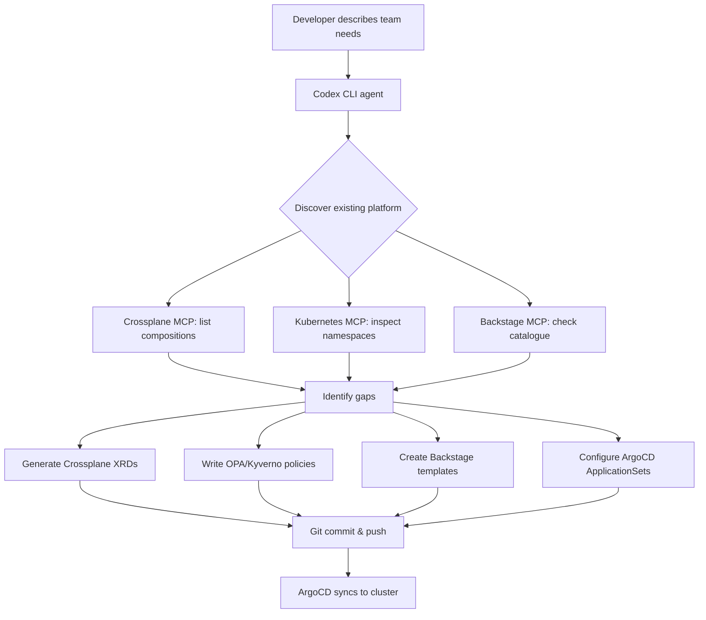
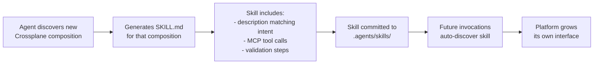
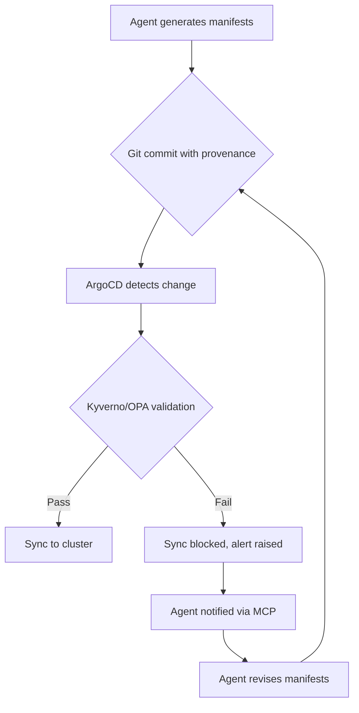

# Let the Platform Build Itself: AI-Constructed Developer Platforms and Codex CLI


---

Platform engineering has spent the last three years answering a single question: how do you give developers self-service access to infrastructure without letting them set fire to production? The standard answer — Crossplane compositions, Backstage templates, ArgoCD sync, OPA policies — works, but building it is months of toil. A newer thesis, articulated most clearly by Whitney Lee and Viktor Farcic at Platform Engineering Day North America 2025, flips the script: what if AI doesn't just *consume* the platform, but *constructs* it? [^1]

This article explores how Codex CLI — OpenAI's terminal-based coding agent [^2] — can serve as the builder, not merely the user, of an internal developer platform (IDP).

## The Self-Building Platform Concept

Whitney Lee (Datadog) and Viktor Farcic (Upbound) have iterated on this idea across multiple CNCF talks [^1]. The core thesis: an AI agent that understands Crossplane's control plane abstraction can discover available compositions, prompt developers through wizard-like interactions, and autonomously manage resource lifecycles — effectively constructing the platform dynamically rather than requiring a human to hand-craft every Crossplane XRD, Helm chart, and Backstage template.

Farcic's own Crossplane MCP server [^3] is the concrete proof-of-concept. It exposes three operations to any MCP-compatible agent — create, observe, and delete Crossplane Claims — defaulting to the `devopstoolkit.live` API group. His more ambitious **Dot AI** project [^4] takes this further: a dual-mode MCP server (MCP protocol + REST API) that uses semantic search over a Qdrant vector database to discover cluster capabilities, recommend deployment approaches, and enforce governance policies. Dot AI embodies what Farcic calls "Intent-as-Code" — developers state what they need ("I need a PostgreSQL database with 50GB storage"), and the AI discovers the appropriate Crossplane composition or Kubernetes operator to fulfil it [^4].

The shift from Infrastructure-as-Code to Intent-as-Code is not merely semantic. IaC requires the developer to know *how* to express their intent in HCL, YAML, or CUE. Intent-as-Code requires only that the platform exposes discoverable APIs — which is precisely what Crossplane's control plane provides.

## Codex CLI as Platform Builder

Codex CLI (v0.116.0 as of March 2026 [^5]) is not a platform engineering tool by design. It is a general-purpose coding agent with sandboxed execution, MCP support, and a skills system. But those primitives compose into a potent platform construction toolkit.

Consider the task of bootstrapping an IDP for a new team. Traditionally, a platform engineer writes:

1. Crossplane XRDs and Compositions for the team's required services
2. OPA/Kyverno policies scoped to the team's namespace
3. Backstage catalog entries and templates
4. ArgoCD ApplicationSets for GitOps sync
5. Documentation tying it all together

With Codex CLI connected to the right MCP servers, this becomes a single conversational session:

```bash
# Connect Codex CLI to platform MCP servers
codex mcp add crossplane -- npx crossplane-mcp-server
codex mcp add kubernetes -- npx @modelcontextprotocol/kubectl-mcp-server
codex mcp add backstage -- npx backstage-mcp-server
```

The agent can then discover what Crossplane compositions already exist in the cluster, identify gaps, generate new XRDs for missing services, write the accompanying OPA policies, register everything in Backstage, and wire up ArgoCD sync — all from a natural language description of the team's needs.



## MCP as the Discovery Layer

The Model Context Protocol is the critical enabler [^6]. Without MCP, the agent is guessing at cluster state. With MCP, it has structured access to live platform data.

Codex CLI supports both STDIO and Streamable HTTP MCP transports [^6], configured via `config.toml`:

```toml
[mcp_servers.crossplane]
command = "npx"
args = ["crossplane-mcp-server"]
startup_timeout_sec = 30
tool_timeout_sec = 120

[mcp_servers.kubernetes]
command = "npx"
args = ["@modelcontextprotocol/kubectl-mcp-server"]
env = { KUBECONFIG = "/home/dev/.kube/config" }
```

The kubectl MCP server (published in the CNCF Landscape [^7]) exposes tools for pod management, deployments, networking, storage, and security. Farcic's Crossplane MCP server [^3] adds Claim-level operations. Together, they give the agent a complete view of both the Kubernetes substrate and the Crossplane abstraction layer.

The discovery pattern follows a consistent loop:

1. **Enumerate** — list available Crossplane compositions, Kubernetes CRDs, Backstage entities
2. **Assess** — compare discovered state against desired state (from the developer's intent)
3. **Generate** — produce YAML manifests, policies, templates for any gaps
4. **Validate** — dry-run against the cluster, check policy compliance
5. **Apply** — commit to Git (for ArgoCD sync) or apply directly in non-production

## Skills That Write Skills

Codex CLI's skills system [^8] introduces a meta-automation possibility that is genuinely novel: an agent that generates new skills based on platform capabilities it discovers.

A skill is a directory containing a `SKILL.md` file with YAML frontmatter and natural language instructions, optionally accompanied by scripts and reference documents [^8]. Skills activate either explicitly (user invocation) or implicitly (Codex matches the task to a skill's description). The resolution order spans repository, user, admin, and system scopes.

The meta-automation pattern works as follows:



For example, if the platform team adds a new Crossplane composition for Redis clusters, the agent can:

1. Detect the new composition via the Crossplane MCP server
2. Generate a skill (`provision-redis/SKILL.md`) that knows how to invoke the composition with sensible defaults
3. Include validation scripts that check the Claim status post-creation
4. Commit it to `.agents/skills/` in the platform repository

The next developer who asks Codex CLI to "set up a Redis cache for my service" gets matched to the auto-generated skill — no platform team intervention required.

```yaml
# .agents/skills/provision-redis/SKILL.md
---
name: provision-redis
description: >
  Provision a Redis cluster using the platform's Crossplane composition.
  Trigger when the user asks for Redis, caching, or session storage.
---

## Steps

1. Use the crossplane MCP server to verify the redis-cluster composition exists
2. Ask the user for: namespace, size (small/medium/large), persistence (yes/no)
3. Generate a Crossplane Claim YAML with the user's parameters
4. Validate the Claim against cluster policies using dry-run
5. Commit the Claim to the GitOps repository under `claims/{namespace}/`
6. Monitor the Claim status until it reaches `Ready`
```

## The Feedback Loop: Platform Usage Informs Platform Evolution

The self-building platform is not a one-shot generation exercise. The real power emerges from a continuous feedback loop where platform usage data informs how the agent evolves the platform configuration.

With observability MCP servers (Datadog, Prometheus, Grafana), the agent gains access to:

- **Resource utilisation** — which compositions are over-provisioned, which are hitting limits
- **Error rates** — which platform abstractions are producing failed Claims
- **Adoption metrics** — which self-service paths developers actually use

This data feeds back into platform construction decisions. The agent can propose composition parameter adjustments, deprecate unused abstractions, and generate new skills for emerging usage patterns. ⚠️ *This feedback loop pattern is theoretical for Codex CLI specifically; no production implementations have been publicly documented as of April 2026.*

## Practical Constraints and Guardrails

The self-building platform concept is powerful but demands careful guardrailing. AI-generated infrastructure manifests carry real production risk.

**Sandbox boundaries matter.** Codex CLI's `workspace-write` approval mode prevents the agent from executing arbitrary commands without consent [^2]. For platform construction workflows, this means every `kubectl apply` and `git push` requires explicit approval — or must flow through a GitOps pipeline where ArgoCD, not the agent, performs the actual cluster mutation.

**Policy gates are non-negotiable.** Kyverno or OPA policies must validate any agent-generated manifests before they reach the cluster. Farcic's Dot AI enforces this through its governance layer, storing organisational policies in the Qdrant vector database and validating proposals against them [^4].

**Git as the audit trail.** Every agent-generated manifest should be committed to Git with full provenance — which agent, which skill, which user request, which MCP data informed the generation. ArgoCD's sync mechanism then provides the reconciliation guarantee: if the agent generates invalid YAML, ArgoCD's sync fails, and the cluster state remains unchanged.



## The Convergence

Platform engineering and agentic coding are solving the same problem — structured self-service with guardrails — from opposite directions [^9]. Platform teams build control planes, abstractions, and policy gates. Coding agents need structured APIs, discoverable tools, and approval workflows. The convergence point is an IDP whose interface layer *is* the agent, whose APIs *are* MCP servers, and whose evolution *is* driven by the same agent that consumes it.

In 2026, internal developer platforms are operational pillars at thousands of organisations, with IDP adoption reducing cognitive load by 40–50% [^9]. Adding an AI construction layer does not replace the platform team — it amplifies them. The platform team defines the guardrails, compositions, and policies. The agent handles the combinatorial explosion of wiring them together for each new team, service, and environment.

Whitney Lee's insight from KubeCon EU 2026 captures it precisely: "agents amplify what's good and bad in your ecosystem" [^1]. A well-structured Crossplane control plane with clear compositions and policies gives the agent a rich, discoverable surface to build on. A poorly structured cluster with ad-hoc Helm charts and undocumented CRDs gives the agent nothing useful to discover. The self-building platform only works if the foundations are sound.

## Citations

[^1]: Whitney Lee and Viktor Farcic, "Let the Platform Build Itself: Using AI To Construct an Internal Developer Platform With CNCF Tools", Platform Engineering Day, CNCF Co-located Events North America 2025, Atlanta. Schedule: [colocatedeventsna2025.sched.com](https://colocatedeventsna2025.sched.com/2025-11-10/overview/type/Platform+Engineering+Day). Also: "Choose Your Own Adventure: AI Meets Internal Developer Platform", KubeCon EU 2026.

[^2]: OpenAI, "Codex CLI", [developers.openai.com/codex/cli](https://developers.openai.com/codex/cli). v0.116.0 released March 2026.

[^3]: Viktor Farcic, "Crossplane MCP Server", [github.com/vfarcic/crossplane-mcp](https://github.com/vfarcic/crossplane-mcp). MIT licence. MVP: Observe (list claims), Create, Delete operations on Crossplane Claims.

[^4]: "Dot AI for Kubernetes: A Deep Dive with Viktor Farcic's MCP Server", [skywork.ai](https://skywork.ai/skypage/en/dot-ai-kubernetes-deep-dive/1977934697939783680). Dual-mode MCP server with Qdrant vector database, intent-as-code paradigm.

[^5]: OpenAI, "Codex CLI Changelog", [developers.openai.com/codex/changelog](https://developers.openai.com/codex/changelog). April 2026 updates include dynamic token refresh, enhanced exec workflows, Windows sandbox networking.

[^6]: OpenAI, "Model Context Protocol — Codex", [developers.openai.com/codex/mcp](https://developers.openai.com/codex/mcp). STDIO and Streamable HTTP transport support, config.toml configuration.

[^7]: kubectl-mcp-server, published in CNCF Landscape, [github.com/rohitg00/kubectl-mcp-server](https://github.com/rohitg00/kubectl-mcp-server). Tools for pod management, deployments, networking, storage, security.

[^8]: OpenAI, "Agent Skills — Codex", [developers.openai.com/codex/skills](https://developers.openai.com/codex/skills). SKILL.md format, progressive disclosure, multi-scope resolution.

[^9]: "In 2026, AI Is Merging With Platform Engineering. Are You Ready?", The New Stack, [thenewstack.io](https://thenewstack.io/in-2026-ai-is-merging-with-platform-engineering-are-you-ready/). IDP adoption reducing cognitive load by 40–50%.
