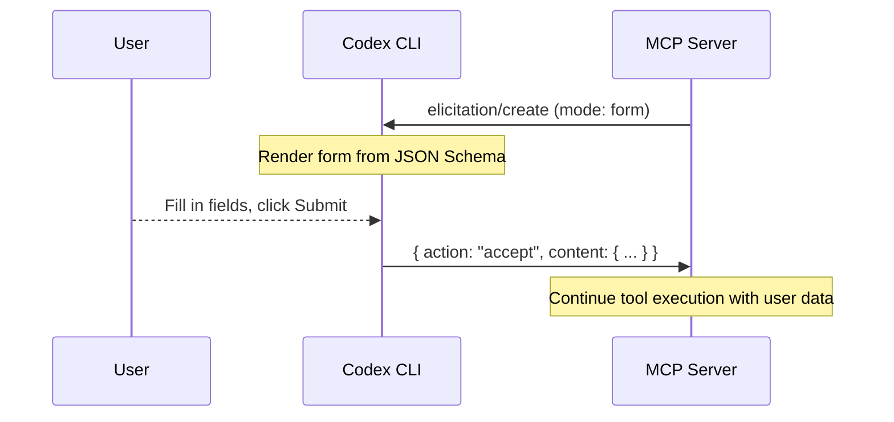

# MCP Server Elicitations in Codex CLI: Structured User Input, Auto-Approval, and Custom Server Patterns


---

Traditional agent–tool interactions are fire-and-forget: the agent calls a tool, the tool returns a result. But production workflows frequently need a pause point — a moment where the server asks the human "which database?", "confirm destructive migration?", or "please authenticate with this third-party service". MCP elicitation formalises that pause point into a first-class protocol primitive, and Codex CLI now supports it end-to-end.

## What Is MCP Elicitation?

Elicitation was introduced in the MCP specification dated 2025-06-18 [^1] and has since been extended with URL mode in the 2025-11-25 revision [^2]. It provides a standardised JSON-RPC method — `elicitation/create` — that allows an MCP server to interrupt tool execution and request structured input from the user via the client.

The protocol defines two modes:

- **Form mode** — the server sends a JSON Schema describing the fields it needs; the client renders a form, validates the input, and returns the data in-band.
- **URL mode** — the server directs the user to an external URL for sensitive interactions (OAuth flows, payment processing, credential entry) that must not pass through the MCP client [^2].

Both modes share a three-action response model:

| Action    | Meaning                                      |
|-----------|----------------------------------------------|
| `accept`  | User approved and submitted data             |
| `decline` | User explicitly rejected the request         |
| `cancel`  | User dismissed without making a choice       |

This is fundamentally different from multi-turn tool calling, where confirmation requires a full round-trip through the LLM's context window. Elicitation happens within a single request — no token overhead, no context loss [^3].

## The Protocol Flow



For URL mode, the flow differs — Codex opens a browser, the user interacts out-of-band, and the server optionally sends a `notifications/elicitation/complete` notification when the external interaction finishes [^2].

## Elicitation Request Anatomy

A form-mode elicitation request contains a human-readable message and a `requestedSchema` — a restricted subset of JSON Schema limited to flat objects with primitive properties [^1]:

```json
{
  "jsonrpc": "2.0",
  "id": 1,
  "method": "elicitation/create",
  "params": {
    "mode": "form",
    "message": "Select the target environment for this migration",
    "requestedSchema": {
      "type": "object",
      "properties": {
        "environment": {
          "type": "string",
          "title": "Target Environment",
          "enum": ["staging", "production"],
          "default": "staging"
        },
        "dry_run": {
          "type": "boolean",
          "title": "Dry run only",
          "default": true
        },
        "migration_version": {
          "type": "integer",
          "title": "Migration version",
          "minimum": 1
        }
      },
      "required": ["environment"]
    }
  }
}
```

Supported primitive types are `string` (with optional `format`: `email`, `uri`, `date`, `date-time`), `number`/`integer` (with `minimum`/`maximum`), `boolean`, and `enum` (single-select or multi-select via `array` with `items`) [^1]. Complex nested structures are intentionally excluded to keep client UIs simple.

## Configuring Elicitation in Codex CLI

Codex CLI surfaces elicitation support through the granular approval policy in `config.toml` [^4]:

```toml
[approval_policy.granular]
mcp_elicitations = true    # surface elicitation prompts to the user
sandbox_approval = true
rules = true
request_permissions = true
skill_approval = true
```

When `mcp_elicitations` is set to `false`, Codex auto-rejects all elicitation requests without prompting the user. This is the safe default for non-interactive environments but blocks any MCP server that relies on runtime user input [^4].

### Sandbox Interaction

Elicitation operates as a separate control layer from sandbox restrictions. A server can request elicitation regardless of whether the sandbox is `read-only`, `workspace-write`, or `danger-full-access` — the approval policy governs whether the prompt surfaces [^5].

Under `--dangerously-bypass-approvals-and-sandbox`, all elicitation prompts are auto-approved without user interaction. This is relevant for fully autonomous agentic pod workflows where trusted MCP servers need to proceed without human gates [^5].

### Capability Declaration

For Codex CLI to handle elicitation, it must declare the `elicitation` capability during the MCP handshake [^1]:

```json
{
  "capabilities": {
    "elicitation": {
      "form": {},
      "url": {}
    }
  }
}
```

An empty `elicitation` object defaults to form-mode support only, preserving backwards compatibility with older clients [^1].

## Practical Patterns

### Pattern 1: Approval Gate for Destructive Operations

The most immediate use case — your custom MCP server wraps a destructive operation and needs explicit confirmation before proceeding:

```python
@server.tool("drop_table")
async def drop_table(table_name: str, ctx: Context) -> str:
    result = await ctx.mcp.elicitation.send_request(
        message=f"Confirm DROP TABLE {table_name}? This is irreversible.",
        requested_schema={
            "type": "object",
            "properties": {
                "confirm": {
                    "type": "boolean",
                    "title": "I confirm this destructive action",
                    "default": False
                }
            },
            "required": ["confirm"]
        }
    )
    if result.action != "accept" or not result.content.get("confirm"):
        return "Operation cancelled by user."
    # proceed with DROP TABLE
    return f"Table {table_name} dropped."
```

### Pattern 2: Disambiguation When Context Is Ambiguous

When the agent's request maps to multiple possible targets:

```python
@server.tool("deploy_service")
async def deploy_service(service_name: str, ctx: Context) -> str:
    matches = find_matching_services(service_name)
    if len(matches) > 1:
        result = await ctx.mcp.elicitation.send_request(
            message=f"Multiple services match '{service_name}'. Which one?",
            requested_schema={
                "type": "object",
                "properties": {
                    "service": {
                        "type": "string",
                        "title": "Select service",
                        "enum": matches
                    }
                },
                "required": ["service"]
            }
        )
        if result.action != "accept":
            return "Deployment cancelled."
        service_name = result.content["service"]
    return deploy(service_name)
```

### Pattern 3: Runtime Credential Collection via URL Mode

For enterprise APIs requiring OAuth tokens, URL mode keeps credentials out of the MCP client entirely [^2]:

```json
{
  "jsonrpc": "2.0",
  "id": 3,
  "method": "elicitation/create",
  "params": {
    "mode": "url",
    "elicitationId": "550e8400-e29b-41d4-a716-446655440000",
    "url": "https://internal.example.com/oauth/authorize?scope=deploy",
    "message": "Authorise access to the deployment API."
  }
}
```

The user completes the OAuth flow in their browser. The MCP server stores the resulting tokens server-side, bound to user identity — they never transit through Codex CLI or the LLM context [^2].

### Pattern 4: Graceful Degradation

Servers must handle clients that do not support elicitation. The robust pattern: check capabilities, fall back to conservative defaults:

```python
@server.tool("configure_pipeline")
async def configure_pipeline(ctx: Context) -> str:
    if not ctx.client_capabilities.get("elicitation"):
        # Fall back to safe defaults
        return configure_with_defaults()

    result = await ctx.mcp.elicitation.send_request(
        message="Configure pipeline parameters",
        requested_schema=pipeline_schema
    )
    if result.action == "accept":
        return configure_with_params(result.content)
    return configure_with_defaults()
```

## The Hang Problem and Timeouts

Issue #11816 documents a critical edge case: when `codex mcp-server` is used as a server from another MCP client that cannot respond to `elicitation/create`, tool calls block indefinitely [^6]. The root causes are:

1. No timeout on the approval receiver
2. Missing capability checks during initialisation
3. Inconsistent error handling between `exec_approval.rs` and `patch_approval.rs`

PR #11824 addresses this with 30-second timeouts and automatic denial on timeout [^6]. If you are building MCP servers that will be consumed by heterogeneous clients, always implement timeouts and check whether the client declared elicitation support before sending requests.

## Security Constraints

The MCP specification enforces strict boundaries [^1][^2]:

- **Form mode must not request sensitive data** — no passwords, API keys, or payment credentials. Use URL mode for these.
- **Clients must show which server is requesting** — prevent phishing by clearly attributing elicitation prompts.
- **URL mode requires user consent before navigation** — no automatic pre-fetching or silent redirects.
- **Servers must bind elicitation state to verified user identity** — not session IDs alone, which can be forged.

For Codex CLI in enterprise contexts, this means your custom MCP servers should route all credential flows through URL mode elicitation, keeping secrets entirely off the agent's communication path.

## Current Status in Codex CLI

As of April 2026, Codex CLI's elicitation support is functional but evolving:

- **Form-mode elicitation works** in interactive sessions with `mcp_elicitations = true` [^4]
- **Issue #13405 (reopened)** tracks remaining gaps in form elicitation, particularly around per-tool approval flows [^7]
- **The response format mismatch** — Codex's handler historically returned `{ decision: "approved" }` instead of the spec-compliant `{ action: "accept" }` — has been addressed in recent builds [^8]
- **URL mode support** is dependent on the client rendering environment (TUI vs IDE extension)

⚠️ The exact Codex CLI version that first shipped full elicitation support has not been confirmed in public release notes. The feature has been iteratively improved across multiple PRs.

## Citations

[^1]: [MCP Specification — Elicitation (Draft)](https://modelcontextprotocol.io/specification/draft/client/elicitation)

[^2]: [MCP Specification — URL Mode Elicitation (2025-11-25)](https://modelcontextprotocol.io/specification/draft/client/elicitation#url-mode-elicitation-requests)

[^3]: [WorkOS — MCP Elicitation: Request User Input at Runtime](https://workos.com/blog/mcp-elicitation)

[^4]: [Codex CLI Configuration Reference — Approval Policy](https://developers.openai.com/codex/config-reference)

[^5]: [Codex CLI Agent Approvals & Security](https://developers.openai.com/codex/agent-approvals-security)

[^6]: [GitHub Issue #11816 — codex mcp-server hang on elicitation](https://github.com/openai/codex/issues/11816)

[^7]: [GitHub Issue #13405 — Add form elicitation support for MCP servers](https://github.com/openai/codex/issues/13405)

[^8]: [GitHub Issue #825 — Codex CLI MCP elicitation response format bug](https://github.com/slopus/happy/issues/825)
