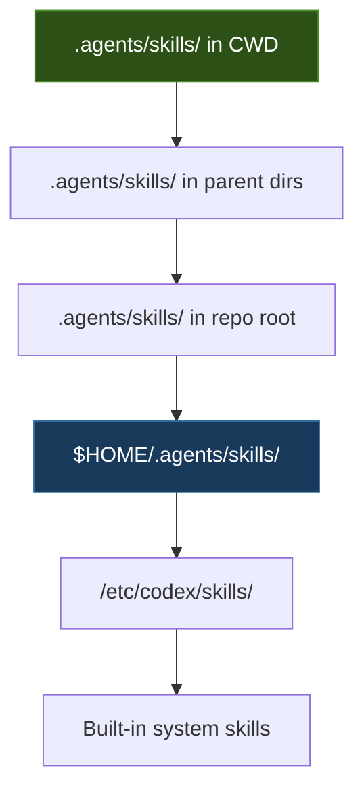
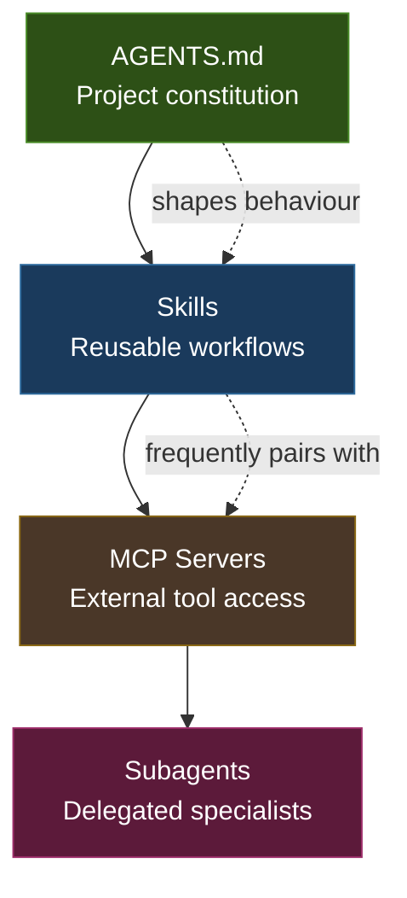

# Migrating Custom Prompts to Skills: The v0.117.0 Breaking Change and Practical Conversion Guide


If you upgraded Codex CLI to v0.117.0 and found your `/prompts:` slash commands had vanished, you are not alone. OpenAI removed the custom prompts subsystem entirely in the March 2026 stable release[^1], completing a deprecation cycle that began several months earlier[^2]. Every reusable Markdown prompt stored under `~/.codex/prompts/` is now dead weight unless you convert it into a skill.

This article walks through the migration: what changed, why it matters, and how to convert every custom prompt you have — including those relying on named arguments — into the skills system that replaced it.

## What Were Custom Prompts?

Custom prompts were Markdown files with YAML front matter, stored in `~/.codex/prompts/`, that Codex exposed as slash commands[^2]. A typical file looked like this:

```markdown
---
description: Generate a migration for the given model
argument-hint: [MODEL=<ModelName> TYPE=<create|alter>]
---

Generate a database migration for $MODEL.
Use migration type: $TYPE.
Follow the conventions in AGENTS.md.
```

You invoked it as `/prompts:migration MODEL=User TYPE=create`, and Codex substituted `$MODEL` and `$TYPE` before injecting the result as a user message[^2]. Positional placeholders (`$1` through `$9`) and named placeholders (uppercase variables supplied as `KEY=value`) were both supported[^2].

The system was simple, local, and fast. It was also a dead end: custom prompts lived only on your machine, could not be shared via a repository, could not be invoked implicitly by the model, and had no progressive disclosure — every prompt's full text was loaded into context at session start[^3].

## What Changed in v0.117.0

Three things happened simultaneously in v0.117.0:

1. **Custom prompts were fully removed.** The `/prompts:` namespace no longer exists. Attempting to use it produces no output[^1].
2. **A startup deprecation warning was added** (briefly, before the removal was finalised) directing users to skills[^4].
3. **Custom skills stored in the old locations also broke** for some users, as the discovery paths shifted to the new `.agents/skills/` convention[^1].

The result: users who had built workflows around custom prompts — CI review commands, migration generators, changelog formatters — found them silently gone after a routine upgrade[^5].

## Why Skills Replace Custom Prompts

Skills are the architectural successor to custom prompts, designed to address every limitation of the old system[^6]:

| Capability | Custom Prompts | Skills |
|---|---|---|
| Storage | `~/.codex/prompts/` (local only) | `.agents/skills/` (repo, user, or system) |
| Sharing | Manual file copy | Git, npm plugins |
| Invocation | Explicit `/prompts:name` only | Explicit (`$name`, `/skills`) or implicit |
| Context loading | Full text at session start | Progressive disclosure (metadata first) |
| Supporting files | None | Scripts, references, assets |
| Cross-surface | CLI and IDE extension | CLI, IDE, Desktop app, Cloud |
| Arguments | `$1`–`$9`, `$KEY=value` | ⚠️ No first-class support (workaround exists) |

The one regression is the loss of first-class named arguments. We will address that below.

## The Migration: Step by Step

### Step 1: Inventory Your Custom Prompts

```bash
ls ~/.codex/prompts/
```

For each `.md` file, note:

- The filename (becomes the skill name)
- Whether it uses positional (`$1`) or named (`$KEY`) placeholders
- Whether it references external files or tools

### Step 2: Create the Skills Directory

Skills can live in three locations, scanned in precedence order[^6]:



For personal skills that should work across all projects (the direct equivalent of `~/.codex/prompts/`), use:

```bash
mkdir -p ~/.agents/skills/
```

For team-shared skills, use `.agents/skills/` in your repository root.

### Step 3: Convert Each Prompt to a Skill

A custom prompt file becomes a skill directory with a `SKILL.md` file. Here is a concrete before-and-after.

**Before** (`~/.codex/prompts/migration.md`):

```markdown
---
description: Generate a migration for the given model
argument-hint: [MODEL=<ModelName> TYPE=<create|alter>]
---

Generate a database migration for $MODEL.
Use migration type: $TYPE.
Follow the conventions in AGENTS.md.
Check existing migrations in db/migrate/ for naming patterns.
Run the migration and verify it applies cleanly.
```

**After** (`~/.agents/skills/migration/SKILL.md`):

```markdown
---
name: migration
description: >
  Generate a database migration for a specified model. Use when the user
  asks to create or alter a database table, add columns, or change schema.
  Do not use for seed data or fixtures.
---

## Instructions

Generate a database migration for the specified model and migration type
(create or alter).

Follow the conventions in AGENTS.md.
Check existing migrations in db/migrate/ for naming patterns.
Run the migration and verify it applies cleanly.

## Inputs

The user will specify:
- **Model name** — the ActiveRecord/ORM model to migrate
- **Migration type** — either `create` (new table) or `alter` (modify existing)
```

Key differences:

- The `name` field replaces the filename convention
- The `description` field is richer — it tells Codex *when* to use the skill and *when not to*, enabling implicit invocation[^6]
- Placeholders are replaced with natural-language input descriptions
- The skill lives in its own directory, allowing supporting files

### Step 4: Handle Named Arguments

This is the migration's roughest edge. Skills have no native `$KEY=value` substitution[^7]. The official workaround uses the `agents/openai.yaml` metadata file with the `interface.default_prompt` field[^7]:

```bash
mkdir -p ~/.agents/skills/migration/agents/
```

Create `~/.agents/skills/migration/agents/openai.yaml`:

```yaml
interface:
  display_name: "Database Migration Generator"
  short_description: "Generate create or alter migrations for ORM models"
  default_prompt: "Use $migration MODEL=<model_name> TYPE=<create|alter>"

policy:
  allow_implicit_invocation: true
```

The `default_prompt` pre-fills the composer when a user selects the skill, simulating the named-argument experience[^7]. It is not true substitution — the model interprets the `KEY=value` pairs from the prompt text rather than performing string replacement — but in practice, GPT-5.4 handles this reliably[^8].

### Step 5: Add Supporting Files (Optional)

Skills support directories that custom prompts never could:

```
migration/
├── SKILL.md
├── agents/
│   └── openai.yaml
├── scripts/
│   └── validate_migration.sh
└── references/
    └── migration_conventions.md
```

- **`scripts/`** — deterministic operations the skill can invoke[^6]
- **`references/`** — long-form documentation loaded as context when the skill activates[^6]
- **`assets/`** — templates, fixtures, or images[^6]

### Step 6: Verify the Migration

```bash
# Launch Codex CLI and test skill discovery
codex

# In the interactive session:
/skills
# Your converted skill should appear in the list

# Test explicit invocation
$migration
# The default_prompt should pre-fill with the KEY=value pattern

# Test implicit invocation by describing the task naturally:
# "Create a migration for the User model with an email column"
# Codex should automatically select the migration skill
```

## Automating the Conversion with Codex

For users with many custom prompts, Codex can perform the conversion itself[^9]. Create a one-shot conversion prompt:

```bash
codex exec "Read every file in ~/.codex/prompts/. For each one, \
create a skill directory under ~/.agents/skills/ with a SKILL.md \
file and agents/openai.yaml. Convert positional placeholders to \
natural-language input descriptions. Convert named argument hints \
to default_prompt entries in the YAML. Preserve all original \
instructions. Do not modify the originals."
```

Review the output before committing — the conversion is mechanical but the `description` field benefits from human tuning to get implicit invocation right.

## The $skill-creator Scaffolding Skill

For writing new skills from scratch rather than converting old prompts, use the built-in `$skill-creator` skill[^10]:

```
$skill-creator
```

This walks you through an interactive flow: what the skill does, when it should trigger, whether it needs scripts or stays instruction-only. It generates a complete skill directory structure. For teams standardising on skills, `$skill-creator` is the canonical starting point[^10].

## Distribution: From Local to Shared

One of the key advantages of the skills architecture over custom prompts is distribution. Custom prompts were trapped in `~/.codex/prompts/` — sharing meant copying files manually. Skills have three distribution paths[^6][^11]:


1. **Personal** — `~/.agents/skills/` for your own workflows
2. **Repository** — `.agents/skills/` checked into the repo, available to every team member
3. **Plugin** — bundled into a Codex plugin for marketplace distribution[^11]

## Common Migration Pitfalls

**Duplicate names.** If two skills share the same `name`, Codex does not merge them — both appear in skill selectors[^6]. When migrating, ensure unique names across personal and repository scopes.

**Over-broad descriptions.** A description like "helps with code" will trigger on nearly every task. Be specific about when the skill should and should not activate. Include negative boundaries: "Do not use for..."[^6].

**Missing the directory structure.** A bare `SKILL.md` file without its own directory will not be discovered. Each skill needs `skillname/SKILL.md`, not `SKILL.md` at the skills root.

**Forgetting progressive disclosure.** Unlike custom prompts, skills use lazy loading — only `name`, `description`, and optional metadata are loaded at session start. The full `SKILL.md` body loads only when the skill is selected[^6]. This means your description must be good enough for Codex to decide whether to use the skill *without* reading the instructions.

**App-server TUI gap.** Some users on v0.117.0 reported that the app-server TUI did not display custom prompt lists even before the full removal[^12]. Skills work across all surfaces including the app-server TUI, the Desktop app, and Cloud.

## The Broader Customisation Stack

With custom prompts gone, the Codex customisation architecture is now cleaner[^3]:



The recommended build sequence: start with AGENTS.md for project-level guidance, add skills for repeatable workflows, connect MCP servers for external data, and configure subagents for delegated specialist work[^3]. Custom prompts sat awkwardly outside this stack — their removal aligns the architecture.

## What About Named Arguments Going Forward?

Issue #15316 requested that `$skill-creator` explicitly document the named-argument migration path *before* the deprecation completed[^7]. The issue was closed as completed, but the underlying gap remains: skills lack first-class named arguments.

The `default_prompt` workaround is functional but not elegant. If OpenAI adds a proper `arguments` field to SKILL.md front matter in a future release, migration will be straightforward — the `default_prompt` values already document what the arguments should be. For now, the workaround is the blessed path[^7].

⚠️ There is no public roadmap commitment to adding native arguments to skills. Plan your workflows assuming the current `default_prompt` approach is permanent.

## Conclusion

The custom prompts removal in v0.117.0 was abrupt for users who relied on them, but the skills architecture is genuinely superior in every dimension except named-argument ergonomics. The migration is mechanical — inventory, convert, verify — and can be automated with `codex exec` for large prompt libraries. The payoff is immediate: progressive disclosure reduces context overhead, repository-scoped skills enable team sharing, and implicit invocation means your workflows trigger automatically when the task matches.

If you have not migrated yet, today is the day. Your old `~/.codex/prompts/` directory is not coming back.

## Citations

[^1]: GitHub Issue #15972 — "custom prompts and custom skills gone on codex-cli 0.117.0", [github.com/openai/codex/issues/15972](https://github.com/openai/codex/issues/15972)
[^2]: OpenAI Codex Custom Prompts Documentation (deprecated), [developers.openai.com/codex/custom-prompts](https://developers.openai.com/codex/custom-prompts)
[^3]: OpenAI Codex Customization Concepts, [developers.openai.com/codex/concepts/customization](https://developers.openai.com/codex/concepts/customization)
[^4]: GitHub Issue #15941 — "Custom prompts in ~/.codex/prompts no longer appear after updating to codex-cli 0.117.0", [github.com/openai/codex/issues/15941](https://github.com/openai/codex/issues/15941)
[^5]: Codex Changelog — v0.117.0 release notes, [developers.openai.com/codex/changelog](https://developers.openai.com/codex/changelog)
[^6]: OpenAI Codex Agent Skills Documentation, [developers.openai.com/codex/skills](https://developers.openai.com/codex/skills)
[^7]: GitHub Issue #15316 — "Update $skill-creator guidance to cover named-arg migration from custom prompts", [github.com/openai/codex/issues/15316](https://github.com/openai/codex/issues/15316)
[^8]: OpenAI Codex Models Documentation, [developers.openai.com/codex/models](https://developers.openai.com/codex/models)
[^9]: OpenAI Codex Best Practices, [developers.openai.com/codex/learn/best-practices](https://developers.openai.com/codex/learn/best-practices)
[^10]: OpenAI Codex Best Practices — Skills section, [developers.openai.com/codex/learn/best-practices](https://developers.openai.com/codex/learn/best-practices)
[^11]: OpenAI Codex Plugins Documentation, [developers.openai.com/codex/plugins/build](https://developers.openai.com/codex/plugins/build)
[^12]: GitHub Issue #15980 — "codex-cli 0.117.0 ignores custom prompt list in app-server TUI", [github.com/openai/codex/issues/15980](https://github.com/openai/codex/issues/15980)
