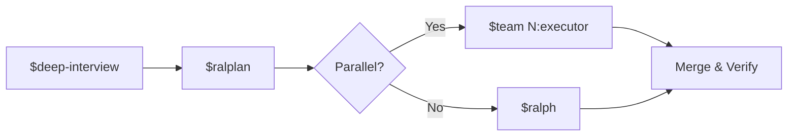
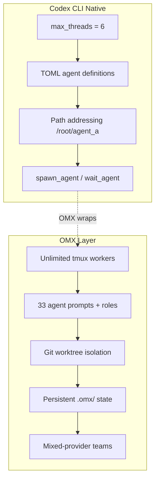

# Oh-My-Codex (OMX): The Community Orchestration Layer That Turns Codex CLI into a Team Runtime


Codex CLI's built-in subagent system caps at six concurrent threads with `max_threads` [^1]. For many workflows, that is plenty. But when you need a dozen parallel workers with isolated worktrees, persistent cross-session memory, mixed-provider teams, and a structured planning pipeline — you need an orchestration layer. Oh-My-Codex (OMX) is the community's answer: an MIT-licensed wrapper that has grown to 20,500+ GitHub stars and 36 workflow skills since its initial release, without forking or replacing the core Codex execution engine [^2].

This article examines what OMX adds, how it integrates with Codex CLI's native capabilities, and when the extra layer is worth the complexity.

## What OMX Is (and Is Not)

OMX follows the oh-my-zsh model: it wraps an existing tool with enhanced defaults, reusable skills, and quality-of-life features rather than replacing it [^3]. Every code generation task still runs through Codex CLI. OMX handles the orchestration above it — intent clarification, planning, parallel dispatch, state persistence, and merge coordination.

The project was created by Yeachan Heo and reached v0.12.5 in April 2026 (April 11: team-runtime and multi-workflow state hardening, Windows reliability, tmux/shell stability, and HUD session anchoring) [^4]. It requires Node.js 20+, a working Codex CLI installation, and `tmux` on macOS/Linux (or `psmux` on Windows, though WSL2 is recommended) [^2].

```bash
npm install -g @openai/codex oh-my-codex
omx setup
omx doctor
```

`omx setup` scaffolds the `.omx/` directory, generates AGENTS.md files with 33 specialised agent prompts, registers native Codex hooks in `.codex/hooks.json`, and configures five MCP servers for state, memory, and code intelligence [^3].

## The Canonical Workflow: Interview → Plan → Execute

OMX's core design philosophy is that most agent failures stem from premature execution — the agent starts coding before requirements are clear [^5]. The canonical path enforces a structured progression:



### `$deep-interview` — Socratic Requirement Clarification

When a request is ambiguous, `$deep-interview` fires a Socratic questioning loop that probes scope, constraints, and edge cases before any code is written [^5]. This is not a prompt template — it is an interactive skill that pauses for user confirmation at each decision point.

### `$ralplan` — Consensus Planning with Trade-Off Review

`$ralplan` converts clarified requirements into a phased implementation plan with effort estimation and explicit trade-off analysis [^3]. The plan is stored in `.omx/` and becomes the contract for subsequent execution.

### `$ralph` — Persistent Single-Owner Execution

`$ralph` takes an approved plan and drives it to completion in a persistent loop. If the session is interrupted (compaction, crash, or user break), the `.omx/state/` directory retains enough context to resume [^5]. The "single-owner responsibility" model means one agent owns the full lifecycle of a task — no handoff fragmentation.

### `$team` — Parallel Workers with Worktree Isolation

This is where OMX diverges most from Codex CLI's built-in subagents. The `$team` command spawns N workers, each in an isolated git worktree at `.omx/team/<name>/worktrees/worker-N` [^2]:

```bash
omx team 3:executor "parallelise auth migration across modules"
```

Since v0.12.1, every team worker runs in an isolated worktree by default — no additional flags required [^4]. Workers must commit their changes (`git add -A && git commit`) before reporting completion; a fallback auto-commit triggers if the worker protocol fails [^3]. The leader then integrates via merge, cherry-pick, or cross-worker rebase.

## The 33 Agent Prompts

OMX auto-generates AGENTS.md files organised into four lanes [^2]:

| Lane | Agents |
|------|--------|
| **Build/Analysis** | architect, planner, executor, debugger, verifier, explore |
| **Review** | style-reviewer, quality-reviewer, api-reviewer, security-reviewer, performance-reviewer |
| **Specialists** | dependency-expert, test-engineer, build-fixer, designer, writer, qa-tester |
| **Product** | product-manager, ux-researcher, product-analyst, information-architect |

These are not decorative labels. Each agent prompt is scoped to a specific concern, which means a `$team` execution can assign different roles to different workers — an architect plans while three executors implement in parallel and a reviewer validates output [^3].

## Mixed-Provider Teams

OMX supports heterogeneous agent fleets via the `OMX_TEAM_WORKER_CLI_MAP` environment variable [^2]:

```bash
export OMX_TEAM_WORKER_CLI_MAP=codex,codex,claude
omx team 3:executor "implement, implement, review"
```

This assigns the first two workers to Codex CLI and the third to Claude Code — enabling the cross-model adversarial review pattern without manual session juggling [^3]. Each provider gets its own worktree, so tool-specific conventions (AGENTS.md vs CLAUDE.md) coexist naturally.

## Hooks: First-Party Bash Integration

OMX v0.12.1 moved to native Codex hook ownership, eliminating the external shim layer that earlier versions required [^4]. Hooks now register directly in `.codex/hooks.json`:

- **PreToolUse** — fires before tool execution; OMX uses this for destructive command warnings with structured error guidance [^2]
- **PostToolUse** — follows tool completion; used for automatic verification triggers and state updates [^2]

Additional OMX-specific hooks live in `.omx/hooks/*.mjs` for plugin extensibility. The layered approach means Codex CLI's own hook contract is respected while OMX adds its orchestration concerns on top [^3].

## Persistent State and Memory

OMX maintains a `.omx/` directory structure that survives across sessions [^3]:

```
.omx/
├── project-memory.json    # Cross-session contextual memory
├── state/                 # Resumable session state
├── team/                  # Team worktrees and logs
│   └── <name>/
│       └── worktrees/
│           └── worker-N/
└── hooks/                 # Plugin hooks (.mjs)
```

Five MCP servers provide state, memory, code intelligence (LSP tools, AST grep), and trace functionality [^2]. The priority notepad system ensures critical context survives context pruning — a practical solution to the compaction problem that many Codex CLI users encounter in long sessions [^3].

## The 36 Skills

Beyond the four canonical skills, OMX ships 36 workflow skills accessible via `$name` syntax or the `/skills` browser [^2]:

| Category | Skills |
|----------|--------|
| **Core Workflow** | autopilot, ralph, ultrawork ($ulw), team, plan |
| **Research** | research, autoresearch, explore |
| **Quality** | tdd, code-review, security-review, build-fix |
| **Coordination** | cancel, configure-notifications |

The `autopilot` skill chains the entire canonical workflow end-to-end for straightforward tasks. `autoresearch` (`omx autoresearch`) performs iterative topic exploration with structured report generation — useful for technical spikes before implementation [^3].

## Launch Profiles

OMX provides intensity profiles that control reasoning effort and session behaviour [^2]:

```bash
omx --high          # Standard enhanced session
omx --xhigh         # Extended reasoning effort
omx --madmax        # Maximum intensity + all features
omx --madmax --high # Combined: full features + high reasoning
```

These map to Codex CLI's `model_reasoning_effort` configuration under the hood, but bundle additional OMX-specific defaults (state persistence, hook activation, HUD availability) [^3].

## Monitoring: The HUD

`omx hud --watch` provides a live monitoring dashboard showing active workers, task progress, and session state [^2]. For teams running multiple parallel agents, this addresses the "notification fatigue" problem — you get a single pane of glass rather than switching between tmux panes.

## How OMX Compares to Codex CLI's Built-In Subagents



| Capability | Codex CLI Native | OMX |
|-----------|-----------------|-----|
| Max concurrent agents | 6 (`max_threads`) [^1] | Limited by hardware/tmux |
| Worker isolation | Shared workspace | Git worktrees per worker [^2] |
| State persistence | Session-scoped | Cross-session `.omx/state/` [^3] |
| Planning pipeline | `/plan` mode | `$deep-interview` → `$ralplan` [^5] |
| Mixed providers | Single provider | `OMX_TEAM_WORKER_CLI_MAP` [^2] |
| Agent roles | Custom TOML files | 33 pre-built prompts [^2] |
| Merge coordination | Manual | Leader-driven with fallback [^3] |

The trade-off is complexity. OMX adds a dependency (tmux, Node.js wrapper, `.omx/` directory), and the abstraction can obscure what Codex CLI is actually doing underneath. For tasks within the six-thread limit that do not require cross-session persistence or mixed providers, native subagents are simpler and carry less overhead.

## When OMX Makes Sense

**Use OMX when:**

- You regularly run more than six parallel agents
- Your workflow requires cross-session state (multi-day refactors, large migrations)
- You want mixed-provider teams (Codex + Claude + Gemini workers)
- You need structured planning gates before execution begins
- Your team wants pre-built agent roles without writing custom TOML files

**Stay with native subagents when:**

- Six threads suffice for your parallelism needs
- You prefer minimal dependencies
- You are already invested in custom TOML agent definitions
- Your CI/CD pipeline uses `codex exec` (OMX's tmux dependency does not suit headless CI)

## Known Rough Edges

- Intel Mac users may experience `syspolicyd`/`trustd` CPU spikes during high-concurrency startup; the mitigation is `xattr -dr com.apple.quarantine $(which omx)` [^2]
- Windows support via `psmux` receives less attention than the macOS/Linux tmux path; WSL2 is the recommended Windows approach [^2]
- Team mode requires a clean workspace — stash or commit before launching workers [^3]
- The `.omx/` directory can grow substantially during long multi-agent sessions; periodic cleanup is advisable

## Getting Started

```bash
# Install
npm install -g @openai/codex oh-my-codex

# Scaffold project
omx setup

# Verify installation
omx doctor

# Run the canonical workflow
# 1. Clarify requirements
$deep-interview "add OAuth 2.1 to the API gateway"

# 2. Plan the implementation
$ralplan "approve the safest implementation path"

# 3. Execute with a team of 3
$team 3:executor "implement the approved OAuth plan"

# 4. Monitor progress
omx hud --watch
```

## Conclusion

OMX fills a genuine gap in the Codex CLI ecosystem: the space between built-in subagents (powerful but capped at six threads) and full external orchestrators like Gas Town (heavy, multi-process, $100/hour token burn). It does so by wrapping rather than replacing Codex CLI, which means you retain sandbox isolation, approval modes, and the entire plugin ecosystem while gaining structured planning, unlimited parallel workers, persistent state, and mixed-provider coordination.

The 20,500-star community endorsement suggests the gap is real. Whether OMX's additional layer of abstraction is worth the complexity depends on the scale of your agentic workflows — but for teams running substantial multi-agent operations, it has become the de facto orchestration standard for Codex CLI.

## Citations

[^1]: OpenAI, "Multi-Agent v2 Configuration — Codex CLI," [developers.openai.com/codex/cli/features](https://developers.openai.com/codex/cli/features), accessed April 2026.
[^2]: Yeachan Heo, "oh-my-codex — GitHub Repository," [github.com/Yeachan-Heo/oh-my-codex](https://github.com/Yeachan-Heo/oh-my-codex), accessed April 2026.
[^3]: a2a-mcp.org, "What Is Oh My Codex (OMX)? Complete 2026 Guide," [a2a-mcp.org/blog/what-is-oh-my-codex](https://a2a-mcp.org/blog/what-is-oh-my-codex), accessed April 2026.
[^4]: Yeachan Heo, "oh-my-codex Releases — v0.12.1–v0.12.4," [github.com/Yeachan-Heo/oh-my-codex/releases](https://github.com/Yeachan-Heo/oh-my-codex/releases), accessed April 2026.
[^5]: Ben Riemer, "How to Supercharge Your AI Coding Workflow with Oh My Codex," [dev.to/benriemer/how-to-supercharge-your-ai-coding-workflow-with-oh-my-codex-1n5f](https://dev.to/benriemer/how-to-supercharge-your-ai-coding-workflow-with-oh-my-codex-1n5f), accessed April 2026.
