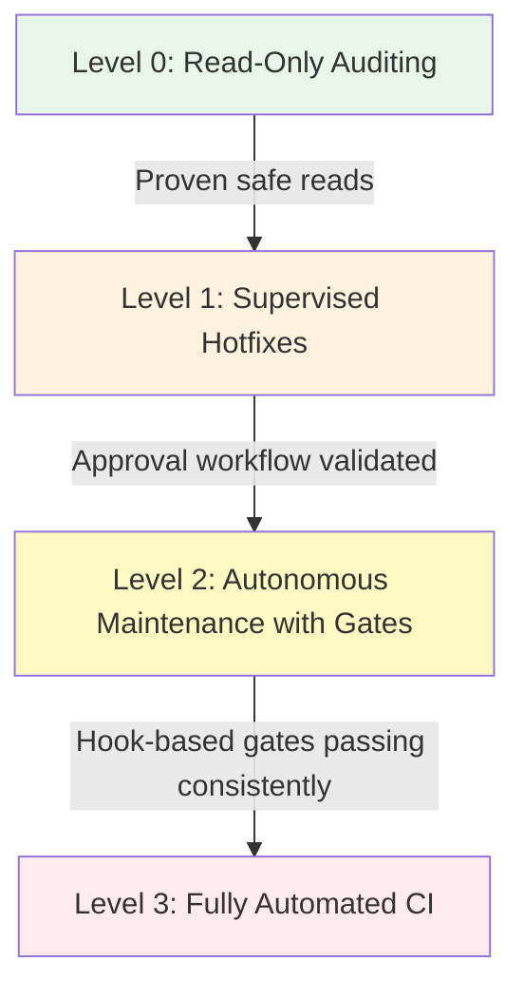
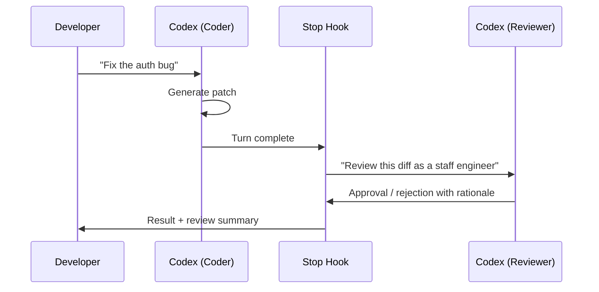
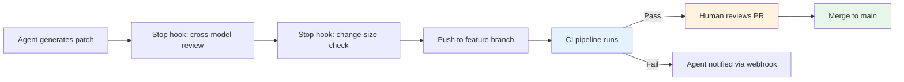

# Production Guardrails for Codex CLI: What Must Be in Place Before Agents Touch Production Code


---

Codex CLI is a powerful local coding agent, but "powerful" and "production-safe" are not synonyms. Letting an AI agent loose on a production codebase without guardrails is the engineering equivalent of handing an intern the root password on their first day. This article provides a concrete, layered framework for teams preparing to deploy Codex CLI against codebases that matter.

## The Trust Ladder

Production adoption is not binary. Teams should climb a trust ladder, expanding agent autonomy only after demonstrating safety at each rung.



**Level 0** uses `read-only` sandbox mode — the agent can inspect code, generate reports, and answer questions but cannot modify a single file [^1]. **Level 1** moves to `workspace-write` with `untrusted` approval policy, meaning every state-mutating command requires explicit human approval [^1]. **Level 2** relaxes to `on-request` approvals but adds hook-based policy gates (covered below). **Level 3** uses `codex exec` in CI with `--full-auto`, but only inside pre-isolated environments with branch protection and mandatory test passage.

## Sandbox Mode: workspace-write Is the Floor

For any production-adjacent work, `workspace-write` is the minimum acceptable sandbox mode [^1]. It constrains the agent to:

- **Read** files anywhere in the workspace
- **Write** only within the workspace directory (and optionally `$TMPDIR`)
- **Execute** commands sandboxed via OS-level enforcement — macOS Seatbelt, Linux Bubblewrap + seccomp, or Windows Sandbox [^2]
- **Network access disabled** by default [^3]

The `.git/` and `.codex/` directories remain read-only even in writable mode, preventing the agent from rewriting its own configuration or corrupting version history [^1].

Never use `danger-full-access` (aliased as `--yolo`) on production code. If a workflow genuinely requires elevated access, run it inside a pre-isolated container or VM and treat the entire environment as disposable [^3].

```toml
# .codex/config.toml — production baseline
sandbox_mode = "workspace-write"
approval_policy = "untrusted"
allow_login_shell = false

[sandbox_workspace_write]
network_access = false
exclude_slash_tmp = true
```

## Hook-Based Policy Gates

Hooks are the enforcement layer that transforms Codex CLI from a developer tool into a production-grade agent [^4]. Five hook events provide injection points across the agent loop:

| Event | Fires When | Production Use |
|---|---|---|
| `SessionStart` | Session begins or resumes | Inject compliance context, log session metadata |
| `PreToolUse` | Before a tool call executes | Block dangerous commands, enforce path restrictions |
| `PostToolUse` | After a tool call completes | Validate outputs, scan for secrets in results |
| `UserPromptSubmit` | User submits a prompt | Block prompts containing sensitive data |
| `Stop` | Agent turn completes | Trigger cross-model review, enforce quality gates |

### Branch Protection Hook

A `PreToolUse` hook can prevent the agent from operating on protected branches:

```json
{
  "hooks": {
    "PreToolUse": [
      {
        "matcher": "Bash",
        "hooks": [
          {
            "type": "command",
            "command": "/opt/codex-hooks/branch-guard.sh",
            "statusMessage": "Checking branch policy..."
          }
        ]
      }
    ]
  }
}
```

The backing script inspects the command for `git checkout main`, `git push origin main`, or similar patterns and exits with code `2` to block execution [^4]. Exit code `2` with a message on stderr triggers a denial, whilst exit code `0` permits the operation.

### Secrets Scanner Hook

A `PostToolUse` hook can scan tool outputs for leaked credentials:

```bash
#!/usr/bin/env bash
# secrets-scan.sh — PostToolUse hook
INPUT=$(cat)
RESPONSE=$(echo "$INPUT" | jq -r '.tool_response // empty')

if echo "$RESPONSE" | grep -qiE '(AKIA[0-9A-Z]{16}|ghp_[a-zA-Z0-9]{36}|sk-[a-zA-Z0-9]{48})'; then
  echo '{"decision":"block","reason":"Potential secret detected in tool output"}'
  exit 2
fi
echo '{}'
```

### Change-Size Limiter

A `Stop` hook can enforce maximum diff size before the agent's changes are accepted:

```bash
#!/usr/bin/env bash
# change-size-gate.sh — Stop hook
DIFF_LINES=$(git diff --stat | tail -1 | grep -oE '[0-9]+ insertion' | grep -oE '[0-9]+')
MAX_LINES=500

if [ "${DIFF_LINES:-0}" -gt "$MAX_LINES" ]; then
  echo "{\"decision\":\"block\",\"reason\":\"Change exceeds ${MAX_LINES} line limit (${DIFF_LINES} insertions). Break into smaller changes.\"}"
  exit 2
fi
echo '{}'
```

Enable hooks in your configuration [^4]:

```toml
[features]
codex_hooks = true
```

## Cross-Model Review as a Production Gate

One of the most effective guardrails is having a second model review the first model's work. The `Stop` hook enables this pattern: when the coding agent completes a turn, fire a hook that invokes a separate Codex session (or a direct API call) with a review-focused prompt [^5].



Configure the review model separately from the coding model using `review_model` in `config.toml` [^5]. A cheaper, faster model (such as `gpt-5.4-mini`) often suffices for review whilst the heavier model handles generation.

```toml
model = "gpt-5.4"
review_model = "gpt-5.4-mini"
```

## Guardian AI: Experimental but Promising

The `features.smart_approvals` flag routes eligible approval requests through a guardian reviewer subagent — a separate LLM that independently evaluates tool call requests before execution [^6]. This is not rule-based filtering; the guardian reasons about whether the proposed action is appropriate given the current context.

```toml
[features]
smart_approvals = true
```

⚠️ Guardian AI remains experimental as of April 2026. PR #17061 overhauled the guardian output schema into structured `risk`, `authorization`, `outcome`, and `rationale` fields, but the feature is off by default and should not be the sole production gate [^6].

## OpenTelemetry: The Audit Trail

Production deployments need observability. Codex CLI's OpenTelemetry integration emits structured events covering API requests, tool approvals, tool results, and conversation metadata [^7].

```toml
[otel]
exporter = "otlp-http"
environment = "production"
log_user_prompt = false

[otel.otlp_http]
endpoint = "https://otel-collector.internal:4318"
```

Key events to monitor:

- **Tool approval decisions** — track what the agent asked to do and whether it was permitted
- **API request metrics** — token consumption per session, model usage, latency histograms
- **SSE/WebSocket stream events** — detect stuck or unusually long agent turns

Setting `log_user_prompt = false` redacts prompt content from telemetry, which is essential for codebases containing proprietary logic [^7].

## Shell Environment Isolation

By default, Codex CLI inherits the parent shell's environment variables. In production, this is a liability — `AWS_SECRET_ACCESS_KEY`, `DATABASE_URL`, and similar secrets become visible to the agent [^8].

```toml
[shell_environment_policy]
inherit = "none"
exclude = ["AWS_*", "AZURE_*", "DATABASE_*", "SECRET_*"]
include = ["PATH", "HOME", "LANG", "TERM"]
```

The `inherit = "none"` policy starts with a clean slate, selectively including only the variables the agent needs [^8]. Combined with `allow_login_shell = false`, this prevents the agent from sourcing `~/.bashrc` or `~/.zshrc` and picking up credentials from dotfiles.

## Cost Controls and Rate Limiting

Runaway agent sessions can consume significant API credits. Production deployments should implement cost boundaries at multiple levels:

1. **Session-level**: Use OpenAI's API usage limits to cap per-session spend [^9]
2. **Turn-level**: Hook-based turn counters that terminate sessions after a configurable number of agent turns
3. **History capping**: Prevent unbounded context growth with `[history] max_bytes` [^8]

```toml
[history]
max_bytes = 104857600  # 100 MB cap
```

## The 10-Point Production Readiness Checklist

Before any Codex CLI agent touches production code, verify:

| # | Check | Config Key / Mechanism |
|---|---|---|
| 1 | Sandbox mode is `workspace-write` or `read-only` | `sandbox_mode` |
| 2 | Network access is disabled unless explicitly required | `sandbox_workspace_write.network_access` |
| 3 | Approval policy matches trust level | `approval_policy` |
| 4 | Branch protection hook blocks protected branches | `PreToolUse` hook |
| 5 | Secrets scanning hook active on `PostToolUse` | `PostToolUse` hook |
| 6 | Change-size limits enforced | `Stop` hook |
| 7 | Cross-model review configured | `review_model` |
| 8 | Shell environment isolated | `shell_environment_policy` |
| 9 | OpenTelemetry audit trail enabled | `[otel]` block |
| 10 | Login shell disabled | `allow_login_shell = false` |

## Rollback Strategy

Even with guardrails, agent-generated changes can introduce defects. Production workflows should ensure:

- **Atomic commits**: One logical change per commit, enabling clean reverts [^10]
- **Feature branches**: Never allow agents to commit directly to `main` — enforce via the branch protection hook
- **Git worktrees**: Run each agent session in an isolated worktree for parallel work without cross-contamination [^10]
- **CI as the final gate**: Merge only after CI passes — the agent's `Stop` hook should verify test results before declaring success



## When Not to Use Codex CLI in Production

Guardrails reduce risk; they do not eliminate it. Avoid automated agent workflows for:

- **Database migrations** — schema changes require human judgement about data preservation
- **Security-critical paths** — authentication, authorisation, and encryption logic
- **Compliance-sensitive code** — anything subject to SOC 2, HIPAA, or PCI-DSS audit requirements where AI-generated code introduces attestation complexity

For these domains, use Codex CLI at Level 0 (read-only auditing) or Level 1 (supervised hotfixes) only.

---

## Citations

[^1]: [Agent Approvals & Security — Codex | OpenAI Developers](https://developers.openai.com/codex/agent-approvals-security)

[^2]: [Sandboxing — Codex | OpenAI Developers](https://developers.openai.com/codex/concepts/sandboxing)

[^3]: [Advanced Configuration — Codex | OpenAI Developers](https://developers.openai.com/codex/config-advanced)

[^4]: [Hooks — Codex | OpenAI Developers](https://developers.openai.com/codex/hooks)

[^5]: [Best Practices — Codex | OpenAI Developers](https://developers.openai.com/codex/learn/best-practices)

[^6]: [Configuration Reference — Codex | OpenAI Developers](https://developers.openai.com/codex/config-reference)

[^7]: [OpenAI Codex Observability & Monitoring with OpenTelemetry — SigNoz](https://signoz.io/docs/codex-monitoring/)

[^8]: [Advanced Configuration — Codex | OpenAI Developers](https://developers.openai.com/codex/config-advanced)

[^9]: [Codex Pricing — OpenAI Developers](https://developers.openai.com/codex/pricing)

[^10]: [Best Practices — Codex | OpenAI Developers](https://developers.openai.com/codex/learn/best-practices)
