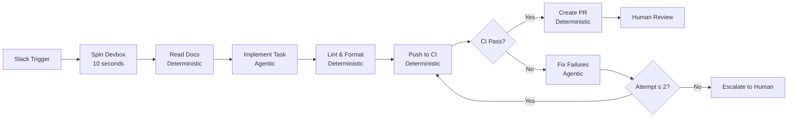
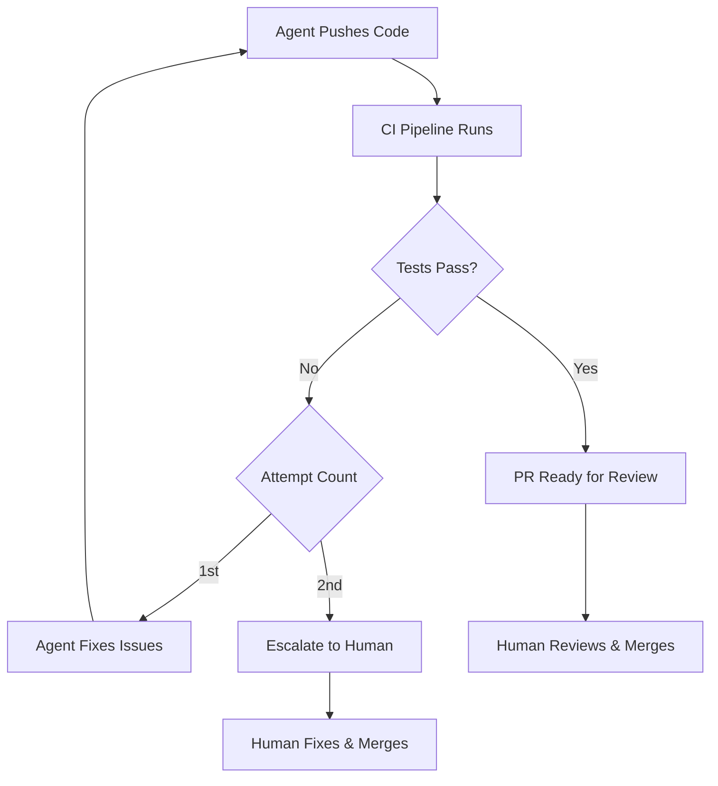

# Stripe's AI Agent Patterns: What Enterprise-Scale Agent Deployment Teaches Codex CLI Users


---

Stripe's engineering team merges over 1,300 AI-authored pull requests every week — none containing human-written code[^1]. Their internal system, called **Minions**, represents one of the most mature enterprise-scale AI agent deployments in production. For Codex CLI practitioners, Stripe's architecture offers a masterclass in the patterns that separate throwaway "vibe coding" from structured, accountable agent orchestration.

This article reverse-engineers Stripe's publicly documented patterns and maps each one to Codex CLI primitives — AGENTS.md, subagent TOML, hooks, MCP servers, and sandbox modes — showing how individual developers and small teams can adopt enterprise-grade agent discipline today.

## The Blueprint Pattern: Deterministic Nodes Meet Agentic Loops

At the heart of Minions sits the **blueprint** — a state machine that intermixes deterministic code nodes with free-flowing agentic nodes[^2]. Deterministic nodes handle predictable operations: linting, branch creation, pushing changes. Agentic nodes hand control to an LLM for open-ended reasoning: implementing a feature, fixing CI failures, writing tests.



The critical insight: **putting LLMs into contained boxes compounds into system-wide reliability**[^3]. Each agentic node operates within strict boundaries — curated tool subsets, scoped context, hard iteration limits. The deterministic nodes guarantee that essential steps (formatting, CI execution, PR creation) execute identically every time.

### Mapping to Codex CLI

Codex CLI's **hooks** system implements the same deterministic/agentic split. A `SessionStart` hook can enforce linting before the agent begins work. A `PostToolUse` hook can run static analysis after every file edit. The agent loop itself handles the agentic reasoning, whilst hooks inject deterministic quality gates at defined points[^4].

```toml
# codex-hooks.toml — blueprint-style deterministic gates
[[hooks]]
event = "PostToolUse"
command = "npx eslint --fix ${CODEX_CHANGED_FILES}"
description = "Auto-format after every edit"

[[hooks]]
event = "SessionStop"
command = "./scripts/run-ci-checks.sh"
description = "Run CI before session ends"
```

Codex CLI's **subagent TOML** extends this further. A parent agent can define a blueprint-like workflow where deterministic orchestration logic delegates to agentic subagents for specific implementation tasks, with the parent gating progression between phases[^5].

## Devbox Isolation: Cattle, Not Pets

Stripe's agents run in **devboxes** — AWS EC2 instances pre-loaded with the entire codebase, development tools, and services[^2]. Each devbox provides three properties critical for unattended agent operation:

1. **Isolation** — QA environments with no production access, no real customer data
2. **Parallelism** — multiple agents work simultaneously on separate tasks
3. **Predictability** — every agent starts from a clean, consistent state

Devboxes spin up in under 10 seconds via a pre-warmed pool[^2]. They are disposable — "cattle, not pets" — meaning agent failures carry zero blast radius.

### Mapping to Codex CLI

Codex CLI's sandbox modes mirror the isolation principle. The `seatbelt` (macOS) and `landlock` (Linux) sandboxes restrict filesystem and network access, creating a controlled environment analogous to Stripe's devbox boundaries[^6].

```toml
# config.toml — devbox-style isolation
[sandbox]
mode = "seatbelt"  # or "landlock" on Linux

[permissions.network]
allow_domains = ["api.github.com", "registry.npmjs.org"]
```

For teams wanting full devbox-style isolation, Codex CLI's **worktree** support enables each agent session to operate in a dedicated Git worktree — a clean, isolated copy of the repository that can be discarded after use[^7]. Combined with `codex exec` in CI pipelines, this achieves the same cattle-not-pets disposability at individual developer scale.

## Context Curation: 500 Tools, Scoped Delivery

Stripe maintains approximately **500 MCP-compatible tools** through an internal server called **Toolshed**[^2]. These tools surface internal documentation, ticket details, build statuses, and code search results. Crucially, agents receive only a **curated subset** of available tools for each task — preventing context bloat and reducing token consumption.

Stripe also adopted **scoped rule files** (in Cursor rule format) that load automatically based on file location and patterns, providing codebase-specific guidance without polluting the global context[^2].

### Mapping to Codex CLI

This maps directly to two Codex CLI features:

**MCP server scoping** allows different tool servers to activate based on the working directory or project type[^8]:

```toml
# config.toml — scoped MCP servers (Toolshed equivalent)
[mcp_servers.jira]
command = "npx"
args = ["-y", "@anthropic/mcp-jira"]
scope = "project"  # Only active in this project

[mcp_servers.datadog]
command = "npx"
args = ["-y", "@datadog/mcp-server"]
scope = "global"
```

**Hierarchical AGENTS.md** files provide the same scoped context as Stripe's rule files. A root `AGENTS.md` defines global conventions, whilst subdirectory files add context relevant to specific packages — precisely the pattern Stripe uses to guide agents through a codebase of hundreds of millions of lines[^9].

```
repo-root/
├── AGENTS.md              # Global: Ruby style, Sorbet types, PR conventions
├── payments/
│   └── AGENTS.md          # Scoped: PCI compliance rules, payment-specific APIs
├── billing/
│   └── AGENTS.md          # Scoped: subscription lifecycle, idempotency keys
└── infrastructure/
    └── AGENTS.md          # Scoped: Terraform conventions, approval escalation
```

## The Two-Attempt CI Limit: Knowing When to Stop

Stripe imposes a **hard limit of two CI rounds** per agent task[^3]. If the agent cannot produce passing code within two iterations — push, receive CI feedback, fix, push again — the branch escalates to human review. This constraint prevents agents from burning compute on tasks beyond their capability and ensures human expertise is applied where it matters most.

The rationale is pragmatic. CodeRabbit analysis of production AI-authored code reveals **1.75× more logic errors** and **2.74× more XSS vulnerabilities** compared to human-written code[^3]. Human review is not ceremonial — it is load-bearing infrastructure.



### Mapping to Codex CLI

Codex CLI hooks can enforce the same iteration budget. A `PostToolUse` hook tracking test execution attempts can terminate the session after a defined threshold, preventing runaway agent loops[^4]:

```bash
#!/bin/bash
# hooks/ci-budget.sh — enforce two-attempt limit
ATTEMPT_FILE="/tmp/codex-ci-attempts-${CODEX_SESSION_ID}"
COUNT=$(cat "$ATTEMPT_FILE" 2>/dev/null || echo 0)
COUNT=$((COUNT + 1))
echo "$COUNT" > "$ATTEMPT_FILE"

if [ "$COUNT" -gt 2 ]; then
    echo "CI budget exhausted after 2 attempts. Escalating to human review."
    exit 1  # Non-zero exit signals Codex to stop
fi
```

The broader principle — **define explicit failure budgets** — applies to any Codex CLI workflow. Unbounded agent loops waste tokens and compound errors through context degradation.

## Accountable Agents: From Slack Thread to Merged PR

Stripe's agents are triggered by structured inputs — Slack threads, bug reports, feature requests — and produce structured outputs: a pull request with context, test results, and a clear audit trail[^1]. Each agent is an **accountable team member** with a defined role, not a magic box that occasionally produces useful code.

This accountability model maps to what the developer community increasingly calls **compound engineering**: each feature is expected to make the next feature easier to build, because the system creates a learning loop where bug reports, failed tests, and problem-solving insights feed back into agent context[^10].

### Mapping to Codex CLI

Codex CLI's `commit_attribution` feature ensures every agent-authored commit carries a clear provenance trail[^11]:

```toml
# config.toml — accountability trail
[git]
commit_attribution = "Co-authored-by: Codex CLI <noreply@openai.com>"
```

Combined with hooks that log session transcripts, enforce PR templates, and validate test coverage, Codex CLI practitioners can build the same accountability infrastructure that Stripe runs at scale — without needing a dedicated platform team.

## Pre-LLM Infrastructure: The Real Competitive Advantage

Perhaps Stripe's most counterintuitive lesson is that their agent success stems primarily from **pre-LLM infrastructure investments** — not model selection[^2]. The devbox system, the 3-million-test suite, the linting daemon, the CI pipeline — all existed before Minions. The agents simply plugged into a well-structured platform.

This echoes a broader principle articulated across the agentic engineering community: **agents can only move as fast as their platform**[^12]. An agent without structured APIs is autocomplete with ambition. An agent with curated tools, scoped context, deterministic gates, and fast feedback loops becomes a reliable contributor.

For Codex CLI users, the implication is clear: invest in your surrounding infrastructure before optimising your prompts. A comprehensive AGENTS.md, well-configured hooks, scoped MCP servers, and a fast CI pipeline will deliver more value than any model upgrade.

## Stripe Patterns as a Codex CLI Checklist

| Stripe Pattern | Codex CLI Equivalent | Configuration |
|---|---|---|
| Blueprints (deterministic + agentic) | Hooks + subagent TOML | `codex-hooks.toml`, subagent `.toml` |
| Devbox isolation | Sandbox modes + worktrees | `sandbox.mode`, `git worktree` |
| Toolshed (500 scoped tools) | MCP server scoping | `[mcp_servers]` with `scope` |
| Scoped rule files | Hierarchical AGENTS.md | Directory-level `AGENTS.md` |
| Two-attempt CI limit | Hook-enforced budgets | Exit code protocol in hooks |
| Human review gate | Approval modes | `approve_mode = "unless-allow-listed"` |
| Commit accountability | `commit_attribution` | `[git]` config block |
| Pre-warmed environments | CI profiles with `codex exec` | `--profile ci-pipeline` |

## Conclusion

Stripe's Minions system demonstrates that enterprise-scale agent deployment is not about better models — it is about better walls. Deterministic gates, scoped context, hard iteration limits, disposable environments, and mandatory human review create the structural conditions for agents to contribute reliably.

Every one of these patterns is available to individual Codex CLI users today. The gap between Stripe's 1,300 weekly PRs and a solo developer's workflow is not the model — it is the discipline to build the surrounding infrastructure that makes agents accountable, bounded, and trustworthy.

---

## Citations

[^1]: InfoQ, "Stripe Engineers Deploy Minions, Autonomous Agents Producing Thousands of Pull Requests Weekly," March 2026. [https://www.infoq.com/news/2026/03/stripe-autonomous-coding-agents/](https://www.infoq.com/news/2026/03/stripe-autonomous-coding-agents/)

[^2]: Stripe Dev Blog, "Minions: Stripe's one-shot, end-to-end coding agents — Part 2," 2026. [https://stripe.dev/blog/minions-stripes-one-shot-end-to-end-coding-agents-part-2](https://stripe.dev/blog/minions-stripes-one-shot-end-to-end-coding-agents-part-2)

[^3]: Anup Jadhav, "Stripe's coding agents: the walls matter more than the model," 2026. [https://www.anup.io/stripes-coding-agents-the-walls-matter-more-than-the-model/](https://www.anup.io/stripes-coding-agents-the-walls-matter-more-than-the-model/)

[^4]: OpenAI Developers, "Hooks — Codex CLI," 2026. [https://developers.openai.com/codex/hooks](https://developers.openai.com/codex/hooks)

[^5]: OpenAI Developers, "Subagents — Codex CLI," 2026. [https://developers.openai.com/codex/subagents](https://developers.openai.com/codex/subagents)

[^6]: OpenAI Developers, "Features — Codex CLI," 2026. [https://developers.openai.com/codex/cli/features](https://developers.openai.com/codex/cli/features)

[^7]: Daniel Vaughan, "Worktree-Based Parallel Development with Codex CLI," March 2026. [https://codex.danielvaughan.com/2026/03/26/codex-cli-worktree-parallel-development/](https://codex.danielvaughan.com/2026/03/26/codex-cli-worktree-parallel-development/)

[^8]: Daniel Vaughan, "Codex CLI MCP Integration: Connecting Agents to External Tools," March 2026. [https://codex.danielvaughan.com/2026/03/26/codex-cli-mcp-integration/](https://codex.danielvaughan.com/2026/03/26/codex-cli-mcp-integration/)

[^9]: Daniel Vaughan, "AGENTS.md Advanced Patterns: Nested Hierarchies, Override Files and Fallbacks," March 2026. [https://codex.danielvaughan.com/2026/03/26/agents-md-advanced-patterns/](https://codex.danielvaughan.com/2026/03/26/agents-md-advanced-patterns/)

[^10]: Every.to, "Compound Engineering: How Every Codes With Agents," 2026. [https://every.to/chain-of-thought/compound-engineering-how-every-codes-with-agents](https://every.to/chain-of-thought/compound-engineering-how-every-codes-with-agents)

[^11]: Daniel Vaughan, "Codex CLI Commit Attribution: Tagging Agent Work with commit_attribution," March 2026. [https://codex.danielvaughan.com/2026/03/28/codex-cli-commit-attribution/](https://codex.danielvaughan.com/2026/03/28/codex-cli-commit-attribution/)

[^12]: ByteByteGo, "How Stripe's Minions Ship 1,300 PRs a Week," 2026. [https://blog.bytebytego.com/p/how-stripes-minions-ship-1300-prs](https://blog.bytebytego.com/p/how-stripes-minions-ship-1300-prs)
