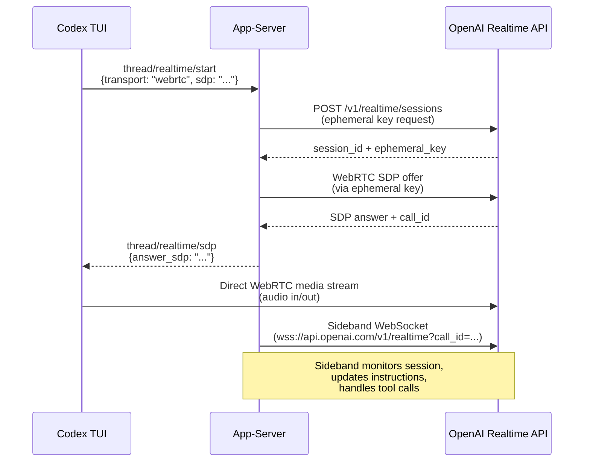
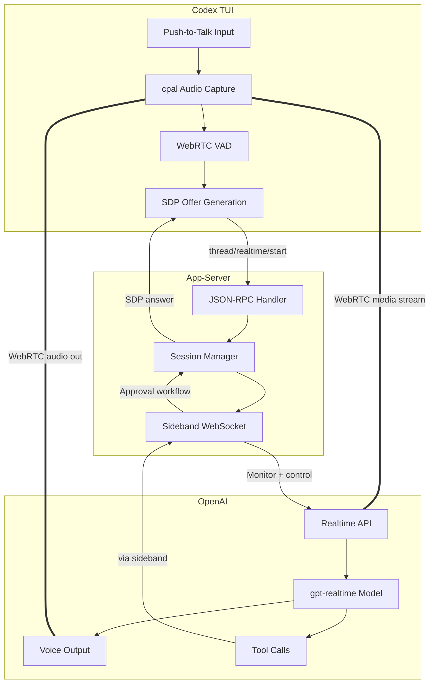

# WebRTC Realtime Voice in Codex CLI: Voice Selection, Session Architecture, and Production Readiness


---

As of the April 9 alpha batch, WebRTC is the **default realtime transport** in Codex CLI [^1]. This is not a minor configuration tweak — it rewires how voice flows between the terminal, the app-server, and OpenAI's Realtime API. Combined with new voice selection capabilities [^2] and sideband websocket attachment [^3], Codex CLI now exposes the full `gpt-realtime` voice stack to developers who want to talk to their codebase rather than type at it.

This article covers the complete WebRTC voice pipeline end-to-end: transport architecture, the v1-to-v2 transition, voice selection, sideband coordination, and what works (and what does not) in practice.

## The v2 Transport Shift

Prior to April 9, Codex CLI's realtime sessions defaulted to WebSocket transport — a holdover from the Realtime API's beta period. PR #17188 flipped `RealtimeConversationVersion` to `V2`, making WebRTC the derived default [^1]. The change:

- Sets `RealtimeConversationVersion::V2` as the default in the Rust config layer
- Allows partial `[realtime]` config tables to inherit `RealtimeConfig::default()` without breaking existing setups
- Introduces a brief delay in v1 realtime delegation to capture late transcript deltas before routing — preserving backward compatibility for users who explicitly pin v1

The practical upshot: if you update to the April 9 build and have no `[realtime]` override in your `config.toml`, voice sessions now negotiate WebRTC automatically.

### Why WebRTC Over WebSocket?

OpenAI recommends WebRTC over WebSocket for client-side realtime connections for several reasons [^4]:

- **Lower latency** — WebRTC uses UDP-based media transport with DTLS-SRTP encryption, avoiding TCP head-of-line blocking
- **Built-in codec negotiation** — Opus codec handling is native to the WebRTC stack rather than requiring manual audio framing
- **NAT traversal** — ICE/STUN/TURN handling is automatic, critical for developers behind corporate firewalls
- **Consistent performance** — WebSocket audio streaming is sensitive to network jitter; WebRTC's adaptive bitrate and jitter buffers smooth this out

For a terminal application like Codex CLI, the latency reduction matters most. Voice input that feels laggy breaks conversational flow — the 50–100ms improvement from UDP transport makes the difference between "talking to your code" and "dictating at your code."

## Session Architecture

The realtime voice stack in Codex CLI involves three layers: the TUI audio capture, the app-server session manager, and the OpenAI Realtime API endpoint.



### The SDP Exchange

When a realtime session starts with WebRTC transport, the TUI generates a browser-style SDP offer and passes it to the app-server via `thread/realtime/start` [^5]. The app-server negotiates with OpenAI's Realtime API endpoint and returns the answer SDP as a `thread/realtime/sdp` notification. Once the TUI completes the ICE handshake, audio flows directly between the client and OpenAI — the app-server is not in the media path.

This is a critical architectural detail: **audio does not transit the app-server**. The app-server handles signalling and sideband control only. This keeps latency minimal and avoids the app-server becoming an audio bottleneck.

### Sideband Websocket Attachment

PR #17057 added the ability to attach a sideband WebSocket to an active WebRTC session [^3]. The sideband connection:

- Parses the `Location` header from the realtime call response to extract the `call_id`
- Opens a persistent WebSocket to `wss://api.openai.com/v1/realtime?call_id={callId}`
- Initialises a rustls TLS provider for secure connections
- Maintains the realtime parser across the sideband connection for consistent event handling

The sideband pattern — documented in OpenAI's Realtime API guides — means the app-server can monitor the session, inject updated instructions, and respond to tool calls without interrupting the audio stream [^6]. This is how Codex CLI executes commands spoken by the developer: the voice model emits a function call, the sideband picks it up, the app-server routes it through the approval workflow, and the result feeds back into the conversation.

## Voice Selection

PR #17176 introduced realtime voice selection [^2], exposing both v1 and v2 voice lists through the app-server API. The implementation adds two new JSON-RPC parameter types:

- `ThreadRealtimeStartParams` — accepts an optional `voice` field when starting a session
- `ThreadRealtimeListVoicesParams` — returns the available voices for the active realtime version

### Available Voices

The `gpt-realtime` model supports ten voices [^7]:

| Voice | Character |
|-------|-----------|
| `alloy` | Neutral, balanced |
| `ash` | Clear, precise |
| `ballad` | Warm, melodic |
| `coral` | Warm, friendly |
| `echo` | Resonant, steady |
| `sage` | Calm, thoughtful |
| `shimmer` | Bright, energetic |
| `verse` | Versatile, expressive |
| `marin` | Natural, conversational (recommended) |
| `cedar` | Natural, articulate (recommended) |

OpenAI recommends `marin` or `cedar` for best quality [^7]. In the Codex CLI context, voice selection is configured via the `/audio` slash command introduced in PR #12850 [^8], which also handles microphone and speaker device selection with persistent configuration.

### Configuring Voice in config.toml

Voice preferences persist across sessions. The `/audio` command writes the chosen voice and audio devices to the top-level configuration, so you set it once and forget:

```bash
# Inside a Codex CLI session:
/audio
# Select voice: marin
# Select microphone: Built-in Microphone
# Select speaker: Built-in Output
```

If you change voice mid-session while realtime is active, Codex prompts to restart only the local audio — not the entire session [^8].

## The gpt-realtime Model

The voice stack runs on `gpt-realtime`, OpenAI's first GA realtime model (released August 28, 2025) [^9]. Key specifications:

| Property | Value |
|----------|-------|
| Context window | 32,000 tokens |
| Max output tokens | 4,096 |
| Input modalities | Text, audio, image |
| Output modalities | Text, audio |
| Transports | WebRTC, WebSocket, SIP |
| Function calling | ✓ |
| Audio input pricing | $32 / 1M tokens |
| Audio output pricing | $64 / 1M tokens |
| Cached input pricing | $0.40 / 1M tokens |

The model processes audio end-to-end — no intermediate speech-to-text step — which preserves vocal nuance, tone, and intent that would be lost in a transcription pipeline [^9]. This matters for coding contexts: when you say "no, revert *that* change," the model hears emphasis and can disambiguate more reliably than a text transcription would allow.

## Push-to-Talk vs Continuous Listening

Codex CLI's voice input uses a **push-to-talk** model: hold the spacebar on an empty composer to record, release to transcribe and process [^10]. The implementation uses:

- `cpal` for cross-platform audio capture (Rust crate)
- `webrtc-vad` for voice activity detection with aggressive mode and 200ms padding
- Adaptive gain compression for the live recording meter
- A 1-second minimum clip duration to avoid accidental triggers

The space-hold timeout was increased to 1 second in CLI 0.117.0 to reduce false activations from normal typing [^11].

⚠️ Note: the original TUI voice transcription feature (which used Whisper for local transcription) was removed in CLI 0.117.0 [^11]. The current voice pipeline uses the realtime model directly — audio goes to `gpt-realtime` via WebRTC, not to Whisper for transcription. This is a fundamentally different architecture: the model *hears* you rather than *reading a transcript of* you.

## Token Consumption Warning

Voice sessions consume tokens at a substantially higher rate than text interactions. At $32/1M input tokens and $64/1M output tokens for audio, a 10-minute voice coding session can easily burn through credits that would last hours of text-based interaction [^12]. The community has reported "rapid usage limit drain" with voice transcription enabled, potentially due to transcript echo loops where the model re-processes its own output [^12].

Practical mitigations:

- Use voice for high-level instructions and switch to text for iterative refinement
- Monitor the `/audio` session duration — there is no automatic timeout
- Check `gpt-realtime` cached input pricing ($0.40/1M) — repeated context benefits from caching

## What Actually Works Today

The WebRTC voice pipeline is functional but carries experimental status [^5]. Based on the current state:

**Working well:**

- Push-to-talk voice input with WebRTC transport
- Voice selection across all ten voices
- Audio device selection with persistence
- Sideband tool call execution (speak a command, Codex runs it)
- v1 fallback for users who prefer WebSocket transport

**Rough edges:**

- ⚠️ The `experimentalApi` capability must be enabled during app-server initialisation [^5]
- ⚠️ WebSocket transport is explicitly marked "unsupported" for production workloads [^5]
- ⚠️ Token consumption can be unpredictable during extended voice sessions [^12]
- ⚠️ Cross-platform audio capture varies — Linux audio device enumeration may require PulseAudio or PipeWire configuration

## Architecture Summary



The key insight is the separation of concerns: media flows directly between client and OpenAI (low latency), while control flows through the app-server (approval gates, tool execution, session management). This is the same pattern used by production VoIP systems — separate the media plane from the signalling plane.

## Conclusion

The April 9 changes represent the maturation of Codex CLI's voice stack from an experimental WebSocket prototype to a WebRTC-first architecture backed by the GA `gpt-realtime` model. Voice selection, persistent audio configuration, and sideband tool execution make it genuinely usable for hands-free coding workflows.

The experimental label remains, and token economics make sustained voice sessions expensive, but the architectural foundation is solid. For developers who want to integrate voice into their Codex workflows, the path is now: update to the latest build, run `/audio` to configure your devices and voice, and hold spacebar to talk.

---

## Citations

[^1]: [PR #17188 — "make webrtc the default experience"](https://github.com/openai/codex/pull/17188), merged April 9, 2026.

[^2]: [PR #17176 — "Add realtime voice selection"](https://github.com/openai/codex/pull/17176), merged April 9, 2026.

[^3]: [PR #17057 — "Attach WebRTC realtime starts to sideband websocket"](https://github.com/openai/codex/pull/17057), merged April 8, 2026.

[^4]: [OpenAI Realtime API with WebRTC documentation](https://platform.openai.com/docs/guides/realtime-webrtc).

[^5]: [Codex app-server README — realtime session API](https://github.com/openai/codex/blob/main/codex-rs/app-server/README.md).

[^6]: [OpenAI Realtime API — Webhooks and server-side controls](https://platform.openai.com/docs/guides/realtime-server-controls).

[^7]: [OpenAI Realtime API — voice options](https://platform.openai.com/docs/guides/realtime-conversations).

[^8]: [PR #12850 — "Add realtime audio device picker"](https://github.com/openai/codex/pull/12850), merged February 27, 2026.

[^9]: [gpt-realtime model documentation](https://platform.openai.com/docs/models/gpt-realtime), GA release August 28, 2025.

[^10]: [PR #3381 — "voice transcription"](https://github.com/openai/codex/pull/3381), initial push-to-talk implementation.

[^11]: [Codex CLI Changelog — CLI 0.117.0](https://developers.openai.com/codex/changelog), March 2026.

[^12]: [Issue #12902 — "Voice transcription/realtime can rapidly consume usage limits"](https://github.com/openai/codex/issues/12902).
