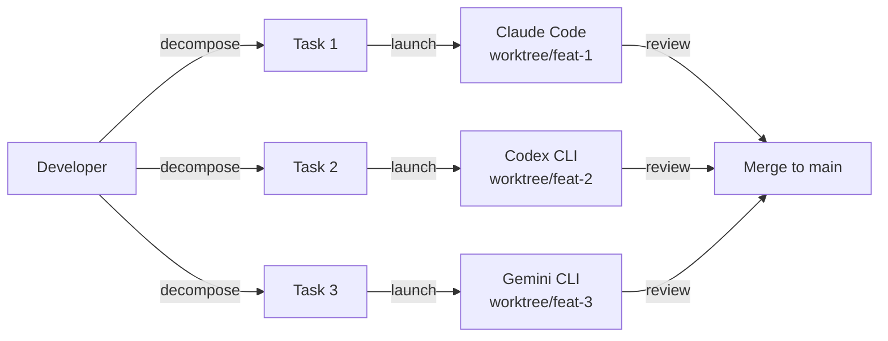
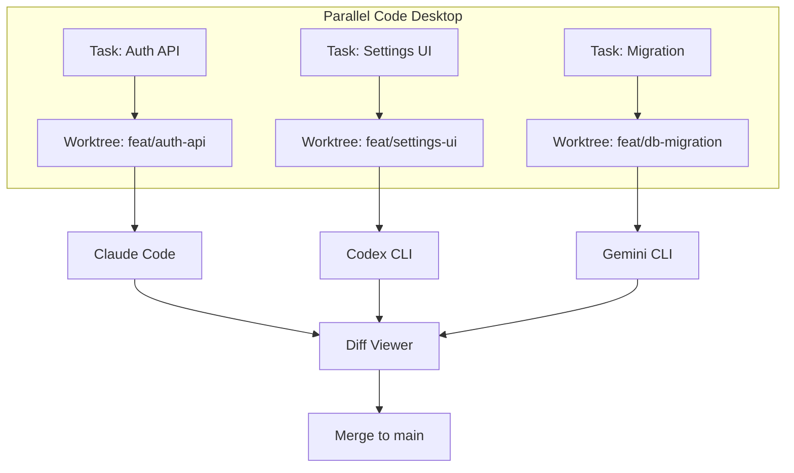

# Agentmaxxing: Parallel Multi-CLI Orchestration with Codex CLI, Claude Code and Gemini CLI


By April 2026, a new practice has crystallised among senior developers: running multiple AI coding agents from different vendors in parallel, each isolated in its own git worktree, with the human developer serving as coordinator rather than coder. The community has adopted the term **agentmaxxing** — borrowed from internet culture's "-maxxing" suffix — to describe this pattern of maximising concurrent agent throughput[^1].

This article examines the tooling ecosystem that makes agentmaxxing practical, how Codex CLI fits into the pattern, and the architectural principles that prevent it from becoming an expensive mess.

## The Core Pattern

Agentmaxxing is not multi-agent orchestration in the Codex CLI subagent sense (where one model spawns and coordinates child agents within a single session). Instead, it places the developer in the coordinator role across *multiple independent CLI tools*, each working on a separate task[^1].

The workflow follows four steps:

1. **Decompose** — break the work into independent, parallelisable tasks with clear file boundaries
2. **Launch** — start agents in isolated workspaces with focused prompts
3. **Review** — inspect output as each agent completes
4. **Merge** — integrate completed branches into main

The critical constraint: if Agent B needs to import something Agent A hasn't created yet, they cannot run in parallel[^1]. Task decomposition quality determines agentmaxxing ROI.



## Git Worktrees as the Isolation Primitive

Every agentmaxxing tool builds on git's native worktree feature[^2]. A worktree creates a separate working directory linked to the same `.git` directory, giving each agent its own branch and file system without the overhead of a full clone.

```bash
# Manual worktree creation for agent isolation
git worktree add ../settings-api feature/settings-api
git worktree add ../settings-ui feature/settings-ui
```

This is the same primitive that Codex CLI's Desktop App uses internally for its worktree-based parallel sessions[^3]. The agentmaxxing tools simply generalise it across multiple CLI vendors.

## The Tooling Ecosystem

Four categories of tool have emerged, each solving a different layer of the agentmaxxing stack.

### Worktree Managers: Worktrunk

**Worktrunk** (by Max Sixty) is a Rust CLI that simplifies git worktree lifecycle management for parallel agent workflows[^4]. It has rapidly become the most popular dedicated worktree manager since its early 2026 release, with packages available on Homebrew, Cargo, and Arch Linux[^4].

Three core commands replace the verbose `git worktree` API:

```bash
# Create a worktree and switch into it
wt new feature/auth

# Launch an agent directly in the worktree
wt switch -x codex -c feature/auth -- 'Add JWT authentication middleware'

# List active worktrees with status
wt list
```

Worktrees are addressed by branch name rather than path, with paths computed from a configurable template[^4]. Hooks automate local setup (dependency installation, environment file copying) on worktree creation — eliminating the manual bootstrap that makes raw `git worktree add` tedious at scale.

### Desktop Orchestrators: Parallel Code

**Parallel Code** (v1.4.0, released 9 April 2026, 512 GitHub stars, MIT licence) is an Electron desktop application that manages the full agent lifecycle visually[^5].

When you create a task, Parallel Code:

1. Creates a new git branch from main
2. Sets up a git worktree in a separate directory
3. Symlinks `node_modules` and gitignored directories (avoiding multi-gigabyte duplication)
4. Spawns the selected AI agent (Codex CLI, Claude Code, or Gemini CLI) within that worktree
5. Provides a built-in diff viewer for reviewing changes before merging[^5]

Key features include tiled panel layout with drag-and-drop reordering, scoped shell terminals per task, QR code monitoring from mobile devices, and state persistence across restarts[^5]. A "Direct mode" allows main-branch work without worktree isolation for quick tasks.



### Coordination Layers: Mozzie and Maestro

**Mozzie** (launched 13 March 2026) takes a task-management approach: you create work items, assign them to agents, and Mozzie tracks context and results across sessions[^6]. It coordinates existing CLI tools rather than replacing them — functioning as a local-first Kanban board for agent work.

**Maestro-Orchestrate** goes deeper, providing 22 specialist agent personas across Gemini CLI, Claude Code, and Codex CLI[^7]. It classifies incoming tasks, chooses between an Express workflow (simple tasks — one specialist, one review pass) and a Standard 4-phase workflow (design questions → implementation plan → specialist delegation → quality gate), then archives session state in `docs/maestro/`[^7]. This is the closest external tool to replicating Codex CLI's native subagent system across vendor boundaries.

### CLI Bootstrappers: agent-cli

**agent-cli** (by Bas Nijholt) reduces the launch ceremony to a single command[^8]:

```bash
agent-cli dev feature/settings-api --agent codex -- 'Add settings API endpoint'
```

This creates a git worktree, installs dependencies, copies `.env` files, sets up `direnv`, and opens the agent in a new terminal tab with the prompt pre-loaded — completing in roughly 4 seconds[^8]. It auto-detects terminal emulators (iTerm2, Kitty, Warp, GNOME Terminal) and multiplexers (tmux, zellij), opening a new window or tab in the existing session.

## Where Codex CLI Fits in the Stack

Codex CLI occupies a unique position in the agentmaxxing ecosystem because it operates across two of the three orchestration tiers[^9]:

| Tier | Description | Codex CLI Role |
|------|-------------|----------------|
| **In-process** | Subagents within a single session | Native subagents with `max_threads=6`, path addressing, TOML agent definitions |
| **Local parallel** | Multiple independent CLI processes | One of three major agents launched by external orchestrators |
| **Cloud async** | Fire-and-forget background tasks | `codex cloud exec` with isolated environments, up to 6 concurrent threads |

The strategic advantage: Codex Cloud tasks consume no local resources[^1]. While Claude Code and Gemini CLI run locally, Codex Cloud agents execute on OpenAI's infrastructure. This means you can run 3 local Claude Code instances alongside 4 Codex Cloud tasks simultaneously, achieving 7-agent parallelism without straining your machine.

### Codex-Specific Configuration for Agentmaxxing

When launching Codex CLI as one of several parallel agents, set a dedicated profile to avoid interference:

```toml
# ~/.config/codex/config.toml
[profiles.parallel]
model = "gpt-5.4-mini"
model_reasoning_effort = "medium"
sandbox_mode = "workspace-write"
approval_policy = "full-auto"
```

Launch with the profile:

```bash
# From a worktree directory
codex --profile parallel "Implement the user preferences API with tests"
```

Using `gpt-5.4-mini` for parallel worker tasks is deliberate — it delivers 96.7% of the flagship's code quality at 30% of the credit consumption[^10], making high-parallelism workflows economically viable.

## Cost Realities

Agentmaxxing multiplies both throughput and spend. Concrete numbers:

- **Rate limits**: ChatGPT Pro supports 2–3 concurrent Claude Code instances; Max plans enable 4–5[^1]. Codex CLI's cloud tasks bypass local rate limits entirely.
- **Optimal agent count**: 5–7 concurrent agents on modern hardware before review bandwidth becomes the bottleneck[^1]. Google Research found multi-agent coordination yields +81% gains on parallelisable tasks but -70% degradation on sequential work[^1].
- **Overhead threshold**: Agentmaxxing requires 5–10 minutes of setup overhead; tasks under 15 minutes of sequential time see negative ROI[^1].
- **The review bottleneck**: Human review capacity — not compute — caps the system. If you're approving agent output without reading it, you've exceeded your cognitive bandwidth (see the "toxic flow" anti-pattern).

## When Agentmaxxing Makes Sense

**Ideal scenarios:**

- 3+ independent tasks with clear file/module boundaries
- 30+ minutes of sequential duration per task
- Feature work across distinct services in a microservices architecture
- Migration tasks (database, API version, dependency upgrade) that touch separate modules

**Poor fit:**

- Tightly coupled codebases where changes cascade across files
- Exploratory work where the direction isn't clear
- Tasks under 15 minutes sequential — the orchestration overhead dominates
- Sequential dependencies where Agent B needs Agent A's output

## The Broader Pattern: Developer as Reviewer

Agentmaxxing represents a fundamental workflow inversion. The developer's primary activity shifts from writing code to decomposing work, dispatching agents, and reviewing output[^1]. This demands a different skill set — task decomposition, architectural reasoning, and rapid quality assessment — that aligns with the compound engineering model where 80% of effort goes to planning and review[^11].

The tooling will continue to consolidate. Parallel Code and Worktrunk are already converging on a shared model: worktree isolation + multi-CLI support + diff-based review. The remaining friction point is merge conflict resolution when parallel branches touch shared files — a problem that currently requires manual intervention but is ripe for agent-assisted resolution.

For Codex CLI users, the immediate practical step is straightforward: install Worktrunk, create a `parallel` profile with `gpt-5.4-mini` and `full-auto`, and start decomposing your next feature into 3–4 independent tasks. The tooling is mature enough to be productive today.

## Citations

[^1]: "Agentmaxxing: Run Multiple AI Agents in Parallel (2026)", vibecoding.app, April 2026. [https://vibecoding.app/blog/agentmaxxing](https://vibecoding.app/blog/agentmaxxing)

[^2]: Git documentation, "git-worktree — Manage multiple working trees". [https://git-scm.com/docs/git-worktree](https://git-scm.com/docs/git-worktree)

[^3]: OpenAI, "Codex CLI Features — Worktrees", developers.openai.com. [https://developers.openai.com/codex/cli/features](https://developers.openai.com/codex/cli/features)

[^4]: Worktrunk, "CLI for Git worktree management, designed for parallel AI agent workflows", worktrunk.dev. [https://worktrunk.dev/](https://worktrunk.dev/)

[^5]: johannesjo/parallel-code, GitHub, v1.4.0 released April 9, 2026. [https://github.com/johannesjo/parallel-code](https://github.com/johannesjo/parallel-code)

[^6]: Mozzie, Product Hunt launch, March 13, 2026. [https://www.producthunt.com/products/mozzie](https://www.producthunt.com/products/mozzie)

[^7]: josstei/maestro-orchestrate, GitHub, "Multi-agent orchestration platform for Gemini CLI, Claude Code, and Codex". [https://github.com/josstei/maestro-orchestrate](https://github.com/josstei/maestro-orchestrate)

[^8]: Bas Nijholt, "Parallel agentic coding made trivial with agent-cli dev", nijho.lt. [https://www.nijho.lt/post/parallel-agentic-coding/](https://www.nijho.lt/post/parallel-agentic-coding/)

[^9]: Based on Addy Osmani's three-tier agent orchestration framework, as documented in the codex-resources knowledge base.

[^10]: OpenAI, "GPT-5.4 mini — Models", developers.openai.com. [https://developers.openai.com/codex/models](https://developers.openai.com/codex/models)

[^11]: Compound engineering model, as described in the EveryInc framework and documented in the codex-resources knowledge base.
