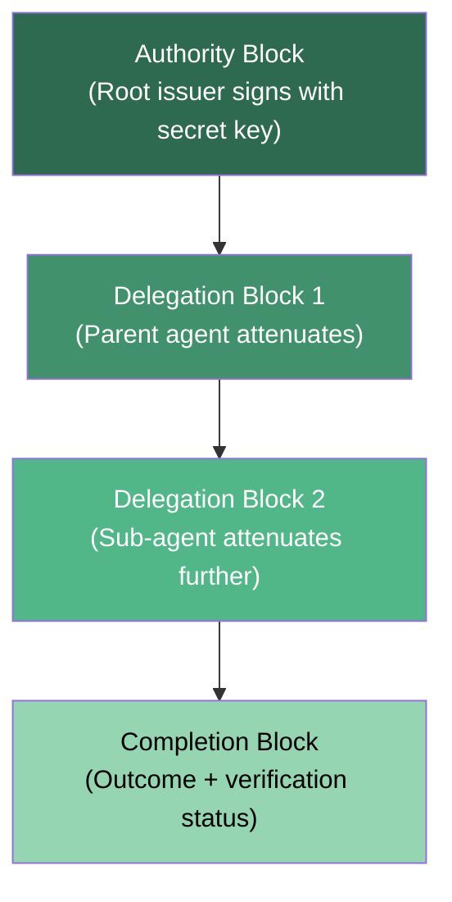
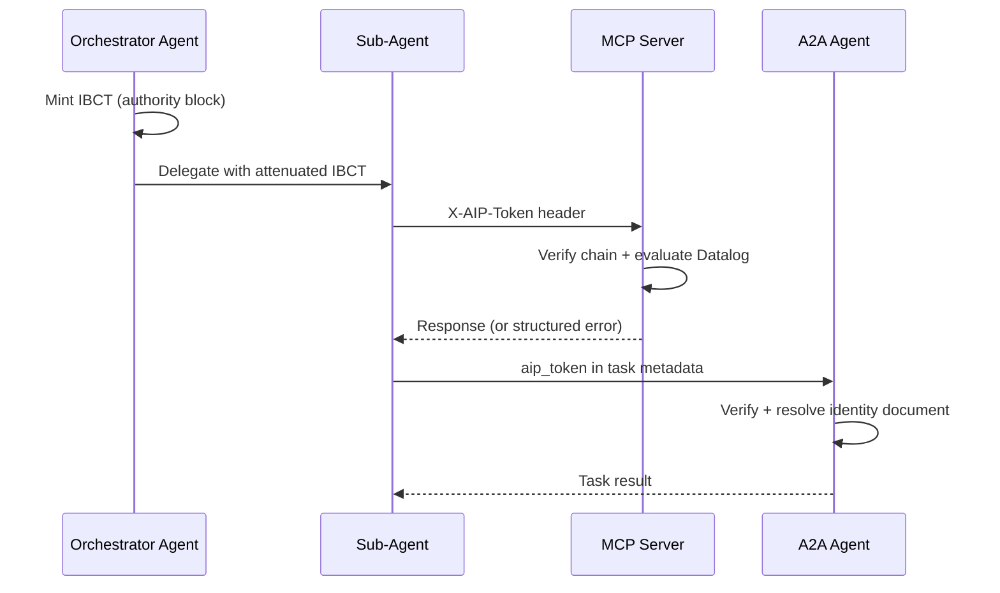
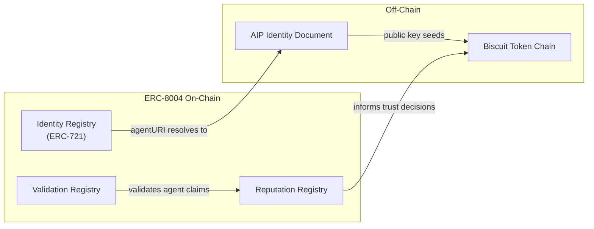

# Biscuit Tokens for Agent Identity: From PR to Production


## Introduction

The [companion article on Codex CLI's `use_agent_identity` feature flag](2026-04-11-codex-cli-agent-identity-biscuit-tokens.md) covers the four-PR stack that wires Biscuit tokens into the CLI. This article goes deeper: why Eclipse Biscuit was chosen over JWT and PASETO, how its append-only attenuation model maps to multi-agent delegation, and how the emerging Agent Identity Protocol (AIP) and ERC-8004 standards are shaping enterprise trust chains for agentic systems.

## Why Not JWT or PASETO?

JWTs dominate web authentication, and PASETO fixes many of JWT's cryptographic footguns[^1]. Neither, however, was designed for *delegation chains* — the defining requirement of multi-agent workflows.

| Property | JWT | PASETO | Biscuit |
|---|---|---|---|
| Signature algorithm | Configurable (footgun) | Fixed per version | Ed25519 / ECDSA P-256 |
| Offline attenuation | ❌ | ❌ | ✅ append-only blocks |
| Policy language | Claims only | Claims only | Datalog |
| Delegation depth | N/A | N/A | Cryptographically chained |
| Revocation hook | Out-of-band | Out-of-band | Built-in unique ID |
| Serialisation | JSON + Base64 | Versioned binary | Protobuf (cookie-sized) |

The critical differentiator is **offline attenuation**. When a parent agent spawns a sub-agent, it must issue a token with *narrower* scope — fewer tools, a lower budget, a shorter TTL — without calling home to the token issuer[^2]. Biscuit's append-only block structure makes this a local cryptographic operation. JWT and PASETO require minting an entirely new token server-side.

## Biscuit Token Architecture

### The Append-Only Block Model

A Biscuit token is a chain of immutable blocks serialised as Protocol Buffers and signed with Ed25519[^2][^3]:



The **authority block** is created by the root issuer and contains the initial set of rights expressed as Datalog facts[^3]. Each subsequent **delegation block** can only *add checks* — logic queries that must succeed for the token to remain valid. Crucially, "the holder of a biscuit token can at any time create a new token by adding a block with more checks, thus restricting the rights of the new token, but they cannot remove existing blocks without invalidating the signature"[^3].

This is enforced cryptographically. The attenuator generates an ephemeral Ed25519 keypair, signs the new block, and destroys the ephemeral secret key[^3]. The result is a chain where each link can only narrow scope — never widen it.

### Datalog Policy Evaluation

Biscuit's authorisation language is a variant of Datalog that supports typed expressions[^3]. Evaluation proceeds as follows:

1. **Facts** (ground predicates) are loaded from the token blocks and the authoriser context
2. **Rules** generate new facts through pattern matching, applied repeatedly until no new facts emerge
3. **Checks** are queries that must produce at least one matching fact — any failing check rejects the token
4. **Policies** (allow/deny) are evaluated in order; the first match determines the outcome

For agent identity, this maps naturally to capability constraints. A parent agent minting a token for a sub-agent appends checks like:

```
// Restrict to specific MCP tools
check if tool($t), ["search", "browse"].contains($t);

// Cap the budget
check if budget($b), $b <= 50;

// Limit delegation depth
check if depth($d), $d <= 3;

// Enforce expiry
check if time($t), $t <= 2026-04-12T00:00:00Z;
```

These checks are evaluated by the downstream service's authoriser, which combines them with its own policies[^4]. A delegation block that attempts to widen any scope, increase the budget, or extend the expiry fails cryptographic verification[^4].

### Scope Annotations and Trust Boundaries

By default, each block's rules can only operate on facts from the authority block, its own block, and the authoriser[^3]. This prevents a delegation block from reading facts injected by a different intermediate attenuator — a critical property when multiple agents in a chain do not fully trust each other.

Biscuit's `trusting` annotations allow selective relaxation of this boundary when needed, but the default is strict isolation between delegation layers[^3].

## AIP: The Agent Identity Protocol

The Agent Identity Protocol, published as an IETF Internet-Draft in September 2026, formalises how Biscuit tokens (and JWTs for simpler cases) carry agent identity across MCP and A2A protocol boundaries[^4].

### Invocation-Bound Capability Tokens (IBCTs)

AIP introduces IBCTs — tokens that "fuse identity, attenuated authorisation, and provenance into a single append-only chain"[^4]. Two wire formats serve different scenarios:

- **Compact mode**: A standard JWT with EdDSA signature carrying claims like `iss`, `sub`, `scope`, `budget_usd`, and `max_depth`. Suitable for single-hop MCP tool calls. Approximately 356 bytes, verified in 0.049 ms (Rust) or 0.189 ms (Python)[^4].
- **Chained mode**: A Biscuit token supporting multi-hop delegation with linear scaling at 340–380 bytes per delegation block[^4].

### Protocol Bindings



**MCP binding**: Clients include the IBCT in the `X-AIP-Token` HTTP header. Servers extract, verify signatures, resolve issuer identity documents, and evaluate Datalog policies against requested tools. Nine structured error codes distinguish authentication from authorisation failures[^4].

**A2A binding**: Agents advertise their identity via the `aip_identity` field in agent cards. Task metadata carries the IBCT in the `aip_token` field[^4].

**HTTP binding**: Generic HTTP APIs use `Authorization: AIP <token>` header format. Tokens exceeding 4 KB may use `X-AIP-Token-Ref` for token-by-reference[^4].

### Identity Schemes

AIP defines two identity resolution schemes[^4]:

- **`aip:web:<domain>/<path>`** — DNS-based, resolving to `/.well-known/aip/` endpoints containing the agent's public key, delegation parameters, and protocol bindings
- **`aip:key:ed25519:<multibase>`** — Self-certifying, embedding the public key directly in the identifier. Used for ephemeral sub-agents that do not need DNS registration

### Sub-Agent Delegation in Practice

When an orchestrator spawns an ephemeral sub-agent, the delegation flow is[^4]:

1. Generate an Ed25519 keypair for the sub-agent
2. Assign it an `aip:key` identity
3. Append a delegation block with narrowed scope and a short TTL (typically minutes)
4. The sub-agent uses the attenuated token for its work
5. The token auto-expires; no DNS registration or cleanup is needed

This maps directly to how Codex CLI's `use_agent_identity` feature mints per-thread task tokens cached in thread runtime state[^5].

## ERC-8004: On-Chain Agent Trust

For scenarios requiring decentralised trust establishment — agents from different organisations collaborating without pre-existing relationships — ERC-8004 provides a complementary on-chain layer[^6][^7].

ERC-8004 went live on Ethereum mainnet on 29 January 2026[^7] and defines a three-registry architecture:

- **Identity Registry** (ERC-721): Each agent gets a globally unique identifier as an NFT, with metadata including service endpoints for MCP, A2A, ENS, and DID resolution[^6]
- **Reputation Registry**: Structured feedback signals with fixed-point values, optional categorisation tags, and off-chain file references with KECCAK-256 integrity hashing[^6]
- **Validation Registry**: Agents request verification from designated validators, supporting 0–100 scoring and multiple responses per request for progressive validation[^6]



The combination is powerful: ERC-8004 handles *discovery and reputation* (which agent should I trust?), whilst AIP with Biscuit tokens handles *runtime authorisation* (what can this agent do right now?)[^6][^4].

## Practical Configuration for Enterprise Multi-Agent Trust

Bringing this together for a Codex CLI enterprise deployment:

### Step 1 — Enable Agent Identity

```toml
# ~/.codex/config.toml
[features]
use_agent_identity = true

[agent_identity]
biscuit_base_url = "https://identity.internal.example.com"
```

### Step 2 — Define Delegation Policies

Using AIP's simple Datalog profile, define the maximum capabilities an orchestrator can delegate:

```
// orchestrator-policy.datalog
// Allow code-generation and search tools only
check if tool($t), ["codegen", "search", "lint", "test"].contains($t);

// Cap per-task budget at $10
check if budget($b), $b <= 10;

// Maximum delegation depth of 2
check if depth($d), $d <= 2;

// Trust only internal domain agents
check if delegator($d), trust_domain($d, $dom), ["internal.example.com"].contains($dom);
```

### Step 3 — Verify the Chain

Any downstream service receiving a request with an `X-AIP-Token` header can verify the complete delegation chain using the AIP reference implementation[^4]:

```bash
# Rust CLI verification (aip_core crate)
aip verify --token "$AIP_TOKEN" \
  --allowed-tools codegen,search \
  --max-budget 10 \
  --require-domain internal.example.com
```

⚠️ The AIP reference implementations (1,214 LOC in Rust, 827 LOC in Python) are available but should be considered early-stage — the IETF draft is at version 00[^4].

## What This Means for Codex CLI Users

The current Codex CLI implementation (PRs #17385–#17388) provides the *plumbing*: feature flag, identity registration, task minting, and `AgentAssertion` attachment[^5]. The standards layer — AIP for protocol-level identity and ERC-8004 for cross-organisational trust — is maturing in parallel.

For teams running multi-agent Codex workflows today, the immediate action is enabling `use_agent_identity` and configuring a Biscuit endpoint. For enterprises planning cross-boundary agent collaboration, watching AIP's progression through IETF review and ERC-8004's on-chain adoption will determine when full delegation chains become production-ready.

The fundamental insight is that agent identity is not a single problem but a stack: cryptographic tokens (Biscuit) for runtime authorisation, protocol bindings (AIP) for interoperability, and on-chain registries (ERC-8004) for decentralised discovery and reputation. Each layer addresses a distinct failure mode, and the stack is designed to be adopted incrementally.

## Citations

[^1]: MojoAuth, "JWT vs PASETO vs Branca — The Future of Secure Tokens in 2026", [https://mojoauth.com/blog/jwt-vs-paseto-vs-branca-the-future-of-secure-tokens-in-2026](https://mojoauth.com/blog/jwt-vs-paseto-vs-branca-the-future-of-secure-tokens-in-2026)

[^2]: Eclipse Biscuit, "Biscuit: Authorization Token", [https://www.biscuitsec.org/](https://www.biscuitsec.org/)

[^3]: Eclipse Biscuit, "Biscuit Specification (SPECIFICATIONS.md)", [https://github.com/biscuit-auth/biscuit/blob/main/SPECIFICATIONS.md](https://github.com/biscuit-auth/biscuit/blob/main/SPECIFICATIONS.md)

[^4]: Prakash, S., "AIP: Agent Identity Protocol for Verifiable Delegation Across MCP and A2A", IETF Internet-Draft, September 2026, [https://arxiv.org/html/2603.24775v1](https://arxiv.org/html/2603.24775v1)

[^5]: OpenAI, Codex CLI PRs #17385–#17388, agent identity feature stack, [https://github.com/openai/codex](https://github.com/openai/codex)

[^6]: Ethereum Improvement Proposals, "ERC-8004: Trustless Agents", [https://eips.ethereum.org/EIPS/eip-8004](https://eips.ethereum.org/EIPS/eip-8004)

[^7]: CoinDesk, "Ethereum's ERC-8004 Aims to Put Identity and Trust Behind AI Agents", January 2026, [https://www.coindesk.com/markets/2026/01/28/ethereum-s-erc-8004-aims-to-put-identity-and-trust-behind-ai-agents](https://www.coindesk.com/markets/2026/01/28/ethereum-s-erc-8004-aims-to-put-identity-and-trust-behind-ai-agents)
