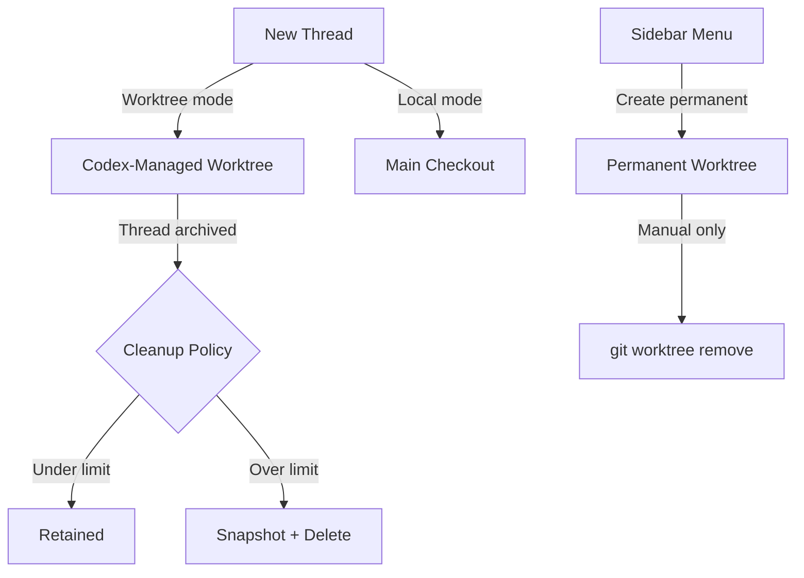
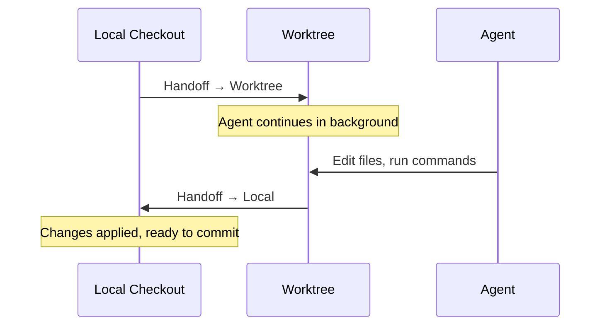

# Codex App Worktree Lifecycle: Local Environments, Setup Scripts, Handoff, and Automated Cleanup


Worktrees are the backbone of parallel agent work in the Codex Desktop App. Every time you open a new thread, start an automation, or delegate to a background agent, a Git worktree is created — an independent checkout sharing the same `.git` metadata as your main repository[^1]. Yet most practitioners treat worktrees as invisible infrastructure, never configuring the setup scripts, actions, or cleanup policies that turn them from disposable scratch pads into reliable, reproducible development environments.

This article covers the full worktree lifecycle: from creation through local environment configuration, the Handoff workflow for moving threads between foreground and background, and the automated cleanup system that prevents disk bloat. If you are running multi-agent workflows or team automations, getting this right is the difference between a smooth development experience and a graveyard of orphaned checkouts.

## The Two Worktree Types

Codex distinguishes between two fundamentally different worktree categories[^2]:

### Codex-Managed Worktrees

These are lightweight, disposable environments created automatically when you start a thread in Worktree mode. They live under `$CODEX_HOME/worktrees` and are dedicated to individual threads. You do not name them, you do not manage their branches, and Codex handles their lifecycle automatically.

### Permanent Worktrees

Created manually via the project sidebar's three-dot menu, permanent worktrees are long-lived environments that survive thread archival. They support multiple threads, require manual cleanup, and behave like any other Git worktree you might create with `git worktree add`. Use these for feature branches that span multiple agent sessions over days or weeks.



## Local Environments: Setup Scripts and Actions

The `.codex` folder at your project root stores local environment configuration[^3]. This configuration is UI-driven — you set it up through the Codex app settings pane — but the generated files can be committed to Git, making them sharable across the team.

### Setup Scripts

Setup scripts run automatically whenever Codex creates a new worktree at the start of a thread[^4]. This is the mechanism that ensures every worktree starts in a known-good state, regardless of which agent or automation created it.

A typical TypeScript project might use:

```bash
npm install
npm run build
```

A Python project with Poetry:

```bash
poetry install --with test
pip install pyright
```

A Spring Boot monorepo:

```bash
./mvnw dependency:go-offline -q
./mvnw compile -pl shared-libs -q
```

Platform-specific overrides are supported — you can define separate scripts for macOS, Windows, and Linux. This matters for teams with heterogeneous development environments, particularly when Windows developers need PowerShell-specific dependency installation[^5].

**Critical caveat:** Setup scripts run in separate Bash sessions, so `export` commands do not persist across lines. If you need environment variables available during the agent session, configure them through the Codex app's environment settings or write them to `~/.bashrc`[^6].

### Actions

Actions define common recurring tasks that appear as shortcut buttons in the Codex app's top toolbar[^7]. Rather than typing `npm test` every time you want to verify agent output, define it as an action with a recognisable icon. Actions execute within the integrated terminal scoped to the current worktree.

Useful action patterns for agentic workflows:

- **Run tests** — verify agent changes immediately
- **Start dev server** — let the agent observe running application output via terminal monitoring
- **Lint check** — quick formatting validation after agent edits
- **Build** — confirm compilation succeeds before committing

Actions also support platform-specific script variants, mirroring the setup script cross-platform pattern.

## The Handoff Workflow

Handoff is the mechanism for moving a thread between Local (foreground) and Worktree (background) mode[^8]. Shipped in early March 2026, it handles the Git operations required to safely transfer uncommitted changes between two checkouts.

### Foreground to Background

When you are working in Local mode and want to free up your main checkout — perhaps to switch branches for an urgent fix — use Handoff to move the thread to a worktree. The agent continues working in the background while your local checkout returns to its pre-thread state.

### Background to Foreground

When a worktree-based thread produces changes you want to integrate, hand it off to Local. Codex applies the worktree's changes to your main checkout, letting you review diffs, run tests, and commit from your primary working directory.



### Handoff Constraints

Two important limitations to be aware of:

1. **Branch exclusivity** — Git prevents the same branch from being checked out in more than one worktree simultaneously[^9]. If your local checkout and a worktree target the same branch, Handoff will fail. The solution is to let worktrees operate in detached HEAD state (the default) or on ephemeral branches.

2. **Gitignore gaps** — files matching `.gitignore` patterns do not transfer during Handoff[^10]. If your build artefacts or `node_modules` are gitignored (as they should be), the receiving checkout will need to rebuild them — which is where setup scripts become essential.

## Worktree Cleanup and Disk Management

Left unmanaged, worktrees accumulate rapidly. Each completed thread, each automation run, each abandoned experiment leaves a checkout on disk. For a team running 10–20 agent sessions per day, this becomes a real disk space problem within a week.

### Automated Cleanup Settings

Codex maintains a configurable limit on Codex-managed worktrees — the default is approximately 15[^11]. You can adjust this limit or disable automatic deletion entirely through the Codex app settings.

Auto-deletion follows these rules:

| Condition | Auto-deletes? |
|---|---|
| Thread archived by user | Yes |
| Codex needs space for newer worktrees | Yes |
| Thread still in progress | No |
| Thread is pinned | No |
| Worktree is permanent | No |

### Snapshots Before Deletion

Before deleting a managed worktree, Codex saves a snapshot of the work[^12]. If you later reopen an archived conversation, Codex can restore the snapshot. This provides a safety net against accidentally losing agent-generated changes that were never committed.

### Manual Cleanup

For permanent worktrees and edge cases where automated cleanup misses stale checkouts, standard Git commands apply:

```bash
# List all worktrees
git worktree list

# Remove a specific worktree (must be clean)
git worktree remove /path/to/worktree

# Prune stale metadata from removed worktrees
git worktree prune
```

## Automations and Worktree Isolation

Automations — scheduled recurring tasks in the Codex app — use dedicated background worktrees by default for Git repositories[^13]. This isolation ensures that an automation running every 30 minutes does not interfere with your active Local work.

However, frequent automation schedules create many worktrees over time[^14]. A practical approach:

1. **Archive automation runs** after reviewing their findings in the Triage inbox
2. **Set the worktree limit** to a value that accommodates your automation frequency (e.g., 20–30 for teams with multiple scheduled automations)
3. **Use Local mode for automations** that only read files (e.g., code quality scans) and do not need write isolation

### Sandbox Considerations for Automated Worktrees

Automations respect your default sandbox settings and use `approval_policy = "never"` unless admin requirements forbid it[^15]. For background worktrees, this means:

- **Read-only sandbox**: Safe for analysis-only automations, but tool calls requiring file modifications will fail
- **Workspace-write sandbox**: The sweet spot — allows file edits within the worktree but prevents network access and external file changes
- **Full access**: Carries elevated risk for background automations; the agent can modify files, run commands, and access the network without approval prompts

## Cloud Environments: The Server-Side Parallel

For Codex Cloud tasks, the equivalent of local environments is the **cloud environment** configuration[^16]. Cloud environments use setup scripts in the same conceptual way, but with important differences:

- A **universal container image** (`codex-universal`, based on Ubuntu 24.04) provides the base runtime with common languages pre-installed[^17]
- **Secrets** are available only during the setup phase and removed before the agent begins work — a stronger isolation model than local environments
- **Container caching** preserves the post-setup state for 12 hours, with a maintenance script for updating cached containers
- **Internet access** is available during setup but off by default during the agent phase

If you use both local and cloud Codex workflows, align your setup scripts. The local `.codex` configuration and cloud environment setup scripts should install the same dependencies and configure the same toolchains, ensuring agents produce consistent results regardless of execution surface.

## Practical Configuration for Teams

### The `.codex` Directory as a Team Contract

Commit your `.codex` folder to version control[^18]. This includes:

```
.codex/
├── config.toml          # Model, sandbox, MCP settings
├── AGENTS.md            # Project instructions
└── hooks.json           # Lifecycle hooks (if used)
```

Local environment settings (setup scripts and actions) are stored within this directory structure, making them available to every team member who clones the repository.

### A Complete Local Environment Example

For a polyglot monorepo with a Node.js frontend and Python backend:

**Setup script (default):**

```bash
cd frontend && npm ci && cd ..
cd backend && poetry install --with test && cd ..
cp .env.example .env
```

**Setup script (Windows override):**

```powershell
Push-Location frontend; npm ci; Pop-Location
Push-Location backend; poetry install --with test; Pop-Location
Copy-Item .env.example .env
```

**Actions:**

- 🧪 **Test All** — `cd frontend && npm test && cd ../backend && pytest`
- 🚀 **Dev Server** — `cd frontend && npm run dev`
- 🔍 **Lint** — `cd frontend && npm run lint && cd ../backend && ruff check .`

### Worktree Strategy by Workflow

| Workflow | Mode | Setup Script Critical? | Cleanup Setting |
|---|---|---|---|
| Single-agent feature work | Local | Low — your checkout is already set up | N/A |
| Parallel agent exploration | Worktree | **High** — each worktree needs deps | 10–15 |
| Scheduled automations | Worktree (auto) | **High** — runs unattended | 20–30 |
| Long-running refactoring | Permanent worktree | **High** — survives for days | Manual |
| CI/CD via `codex exec` | N/A (no app) | Use CLI config instead | N/A |

## Known Issues and Limitations

Several open issues affect worktree workflows as of April 2026:

- **No worktree path environment variable** — setup scripts execute in the worktree directory but receive no `$CODEX_WORKTREE_ROOT` or `$CODEX_PROJECT_ROOT` variable, making it difficult to reference the original repository root (Issue #13576)[^19]
- **Agent-created worktrees do not sync with UI** — if the agent itself creates a Git worktree via shell commands (rather than through the Codex app), the UI does not detect or manage it (Issue #16531, Discussion #16440)[^20]
- **Commit/Push buttons disappear after Handoff** — a known regression where the Git action buttons vanish when handing off from Worktree to Local (Issue #10572)[^21]
- **Custom worktree locations not supported** — all Codex-managed worktrees must live under `$CODEX_HOME/worktrees`; enterprise teams wanting centralised storage on a shared volume cannot override this path[^22]

## Conclusion

Worktrees are not just a convenience feature — they are the isolation primitive that makes parallel agent work safe. Without properly configured local environments, every new worktree starts broken: missing dependencies, missing build artefacts, missing environment variables. Without cleanup policies, your disk fills with orphaned checkouts. Without understanding Handoff, you lose the ability to fluidly move between foreground coding and background agent delegation.

The investment is small: a setup script, a few actions, and a sensible cleanup limit. The return is a development environment where agents can spin up, do their work, and clean up after themselves — exactly the way multi-agent workflows are meant to operate.

## Citations

[^1]: [Worktrees — Codex app, OpenAI Developers](https://developers.openai.com/codex/app/worktrees)
[^2]: [Worktrees — Codex app, OpenAI Developers](https://developers.openai.com/codex/app/worktrees) — Codex-managed vs permanent worktree types
[^3]: [Local environments — Codex app, OpenAI Developers](https://developers.openai.com/codex/app/local-environments)
[^4]: [Local environments — Codex app, OpenAI Developers](https://developers.openai.com/codex/app/local-environments) — setup scripts documentation
[^5]: [Codex App on Windows, OpenAI Developers](https://developers.openai.com/codex/app/windows) — platform-specific configuration
[^6]: [Cloud environments — Codex web, OpenAI Developers](https://developers.openai.com/codex/cloud/environments) — setup scripts run in separate Bash sessions
[^7]: [Features — Codex app, OpenAI Developers](https://developers.openai.com/codex/app/features) — action buttons in the app toolbar
[^8]: [Guinness Chen (@guinnesschen), X post, March 2026](https://x.com/guinnesschen/status/2028992363922969046) — Handoff feature announcement
[^9]: [Git documentation — git-worktree](https://git-scm.com/docs/git-worktree) — branch exclusivity constraint
[^10]: [Worktrees — Codex app, OpenAI Developers](https://developers.openai.com/codex/app/worktrees) — Gitignore behaviour during Handoff
[^11]: [Worktrees — Codex app, OpenAI Developers](https://developers.openai.com/codex/app/worktrees) — default 15-worktree cleanup limit
[^12]: [Worktrees — Codex app, OpenAI Developers](https://developers.openai.com/codex/app/worktrees) — snapshot preservation before deletion
[^13]: [Automations — Codex app, OpenAI Developers](https://developers.openai.com/codex/app/automations) — dedicated background worktrees
[^14]: [Automations — Codex app, OpenAI Developers](https://developers.openai.com/codex/app/automations) — frequent schedules creating many worktrees
[^15]: [Automations — Codex app, OpenAI Developers](https://developers.openai.com/codex/app/automations) — sandbox and approval settings
[^16]: [Cloud environments — Codex web, OpenAI Developers](https://developers.openai.com/codex/cloud/environments)
[^17]: [openai/codex-universal, GitHub](https://github.com/openai/codex-universal) — universal container image
[^18]: [Local environments — Codex app, OpenAI Developers](https://developers.openai.com/codex/app/local-environments) — checking configuration into Git
[^19]: [Issue #13576 — Inject worktree/root path environment variables into setup scripts, openai/codex](https://github.com/openai/codex/issues/13576)
[^20]: [Issue #16531 — Sync agent-created worktrees with the active Codex thread/UI context, openai/codex](https://github.com/openai/codex/issues/16531)
[^21]: [Issue #10572 — Commit/Push buttons disappear after handoff from worktree to local, openai/codex](https://github.com/openai/codex/issues/10572)
[^22]: [Worktrees — Codex app, OpenAI Developers](https://developers.openai.com/codex/app/worktrees) — `$CODEX_HOME/worktrees` fixed location
