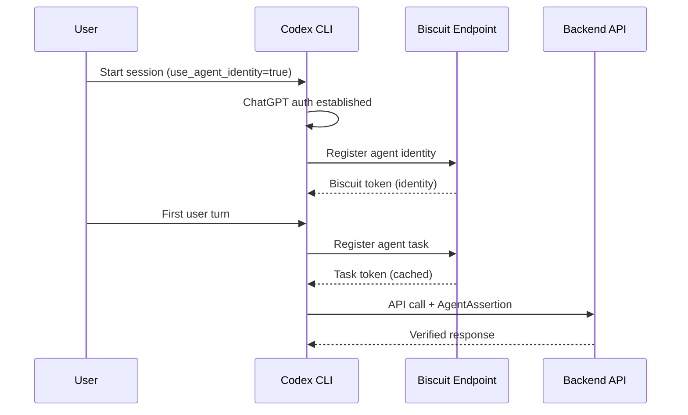
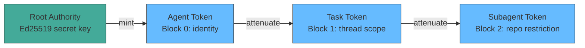

# Agent Identity in Codex CLI: The use_agent_identity Feature Flag, Biscuit Tokens, and Verified Multi-Agent Trust


## Why This Matters

Multi-agent architectures have an attribution problem. When three subagents collaborate on a pull request, a guardian reviewer examining the diff has no cryptographic way to verify *which* agent produced *which* change — or whether the agent claiming authorship is the one that actually executed the work. As enterprises adopt agentic workflows at scale, this gap becomes an audit and compliance liability.

A stack of four pull requests (#17385–#17388) currently under review in the Codex CLI repository introduces an opt-in agent identity system built on Eclipse Biscuit tokens[^1][^2][^3][^4]. The feature is gated behind `features.use_agent_identity` and, when enabled, registers agent identities, mints per-thread task tokens, and attaches `AgentAssertion` credentials to downstream API calls. The PRs are open and under active review — this article examines what they implement, how Biscuit tokens fit, and where this sits in the broader agent identity landscape.

## The Four-PR Stack

The implementation is structured as a layered stack, each PR building on the previous:

### PR #17385 — Feature Flag Configuration

The first PR adds the `features.use_agent_identity` flag to the Codex CLI configuration schema[^1]. It follows the established feature flag pattern: users enable it via `codex features enable use_agent_identity`, which writes to `~/.codex/config.toml`[^5]. Runtime behaviour remains unchanged with the flag off — this is pure plumbing.

```toml
# ~/.codex/config.toml
[features]
use_agent_identity = true
```

### PR #17386 — Agent Identity Registration

With the flag enabled, the second PR registers agent identities through a biscuit token endpoint configured via `agent_identity_biscuit_base_url`[^2]. Registration occurs after ChatGPT authentication is established, eliminating the need for client restarts when toggling the feature. An automated review flagged that `agent_identity_biscuit_base_url` defaults to an empty string but requires a non-empty value — suggesting that production deployments will need explicit endpoint configuration[^2].

### PR #17387 — Per-Thread Task Registration

The third PR mints agent tasks on the first real user turn in each thread, caching the task in thread runtime state for subsequent turns[^3]. An automated review raised a security concern: the cached task is returned without checking whether the authentication or workspace binding has changed[^3]. After re-authentication or workspace switching, turns could reuse tasks minted under a previous authorisation context — a potential credential misuse vector that the team is addressing.

### PR #17388 — AgentAssertion Downstream

The final PR attaches `AgentAssertion` authorisation to downstream backend API calls when the flag is active[^4]. This is the piece that makes identity *useful*: downstream services can verify which agent initiated a request. The Codex reviewer suggested that runtime mismatches should trigger task re-registration rather than fail outright, since identities can be regenerated on auth changes or secret loss[^4].



## Why Biscuit Tokens?

Codex CLI is written in Rust, and Biscuit is a Rust-native authorisation token with properties particularly suited to agentic workloads[^6][^7]:

**Offline attenuation.** A holder can create a new token with *fewer* permissions without contacting the issuing authority[^6]. In a subagent scenario, a parent agent can delegate a scoped token to a child agent that restricts it to specific repositories or operations — no round-trip required.

**Datalog policy language.** Authorisation rules are expressed in Datalog, a declarative logic language that evaluates facts, rules, and checks[^7]. Every block in a Biscuit token can carry Datalog checks that must all pass for the token to be valid. This means a guardian reviewer can inspect the token's policy chain to understand exactly what capabilities were delegated.

**Append-only blocks.** New restriction blocks can be appended to a token, but existing blocks cannot be removed without invalidating the cryptographic signature[^6]. This creates an immutable delegation chain — each agent in a multi-hop workflow adds its own attestation block.

**Ed25519 cryptography.** The initial token creator holds a secret key; verifiers need only the corresponding public key[^6]. Ephemeral key pairs used during attenuation are destroyed after use, limiting the blast radius of key compromise.



This contrasts with JWTs, which cannot be attenuated after issuance and require the verifier to trust the issuer's full permission set. For multi-agent delegation chains, Biscuit's append-only model is a significantly better fit.

## The Broader Agent Identity Landscape

Codex CLI's implementation does not exist in isolation. 2026 has seen agent identity emerge as a critical infrastructure concern across the industry.

### Agent Identity Protocol (AIP)

The IETF draft *Agent Identity Protocol* (draft-prakash-aip-00) defines Invocation-Bound Capability Tokens (IBCTs) — cryptographic artefacts binding identity, authorisation, scope constraints, and provenance into a single token[^8]. AIP specifies two modes: a compact JWT mode with Ed25519 signatures for single-hop interactions, and a chained Biscuit mode for multi-hop delegation[^8]. The protocol specifically targets the authentication gaps in MCP (which provides no built-in authentication layer) and A2A (which uses self-declared identities with no attestation)[^8].

Codex CLI's `AgentAssertion` aligns with AIP's chained mode conceptually, though the current PRs don't reference the IETF draft explicitly.

### ERC-8004: On-Chain Agent Identity

On the blockchain side, ERC-8004 went live on Ethereum mainnet on 29 January 2026[^9]. It provides three smart contract registries — identity, reputation, and validation — enabling agents to register themselves, collect reusable feedback, and publish independent verification of their work[^9]. While ERC-8004 targets a different deployment context (decentralised agent commerce), its three-registry architecture mirrors the identity/task/assertion layering in the Codex CLI PRs.

### RSAC 2026

AI agent identity was a headline theme at RSAC 2026, with multiple vendors presenting enterprise authentication frameworks for agentic systems[^10]. The consensus position: agent identity is not optional for production multi-agent deployments.

## Enterprise Implications

The `use_agent_identity` flag, once stable, enables several enterprise workflows:

| Capability | How It Works |
|-----------|-------------|
| **Audit trails** | Every API call carries an `AgentAssertion` tying it to a specific registered agent identity. Compliance teams can reconstruct which agent performed which action. |
| **Guardian verification** | Code review agents (guardians) can verify the identity of the agent that produced a diff before approving it, preventing spoofed agent attributions. |
| **Scoped delegation** | Biscuit offline attenuation lets parent agents issue restricted tokens to subagents — e.g., read-only access to a specific repository — without server round-trips. |
| **Pod architectures** | Authenticated agentic pods (multiple agents collaborating on a task) can establish mutual trust through verified identity chains rather than implicit trust. |

## Current Status and Caveats

Several points to note about the current state:

1. **All four PRs are open.** The feature is not yet merged into a stable release[^1][^2][^3][^4]. The E2E local app-server path was noted as "still being debugged" at PR creation time.

2. **Security concerns flagged.** The automated Codex reviewer identified that cached agent tasks don't check for auth/workspace binding changes[^3], and that runtime mismatches should trigger re-registration rather than hard failures[^4]. These issues are being addressed in review.

3. **Configuration required.** The `agent_identity_biscuit_base_url` must point to a running biscuit token endpoint[^2]. ⚠️ It is not yet clear whether OpenAI will host this endpoint or whether enterprises must run their own.

4. **Feature flag gating.** The flag defaults to off. This is consistent with Codex CLI's approach to experimental features — `unified_exec` and `shell_snapshot` followed the same pattern[^5].

5. **No subagent delegation yet.** ⚠️ The current PRs implement identity registration and assertion attachment for the primary agent. Multi-hop delegation to subagents via Biscuit attenuation is a logical next step but is not part of this initial stack.

## Looking Ahead

The agent identity stack represents a foundational piece of infrastructure for Codex CLI's multi-agent future. Once merged, it provides the cryptographic primitives needed for verified agent-to-agent trust. The choice of Biscuit over JWTs signals that OpenAI is thinking beyond single-agent scenarios — Biscuit's offline attenuation and Datalog policies are overengineered for simple auth but essential for delegation chains.

Watch for: stabilisation of the feature flag, documentation of the biscuit endpoint configuration, and — most critically — the follow-up PRs that extend `AgentAssertion` to subagent workflows.

## Citations

[^1]: PR #17385 — "Add use_agent_identity feature flag", openai/codex, April 2026. [https://github.com/openai/codex/pull/17385](https://github.com/openai/codex/pull/17385)
[^2]: PR #17386 — "Register agent identities behind use_agent_identity", openai/codex, April 2026. [https://github.com/openai/codex/pull/17386](https://github.com/openai/codex/pull/17386)
[^3]: PR #17387 — "Register agent tasks behind use_agent_identity", openai/codex, April 2026. [https://github.com/openai/codex/pull/17387](https://github.com/openai/codex/pull/17387)
[^4]: PR #17388 — "Use AgentAssertion downstream behind use_agent_identity", openai/codex, April 2026. [https://github.com/openai/codex/pull/17388](https://github.com/openai/codex/pull/17388)
[^5]: "Features – Codex CLI", OpenAI Developers documentation. [https://developers.openai.com/codex/cli/features](https://developers.openai.com/codex/cli/features)
[^6]: Eclipse Biscuit — delegated, decentralised, capabilities-based authorisation token. [https://www.biscuitsec.org/](https://www.biscuitsec.org/)
[^7]: biscuit-auth Rust crate documentation. [https://docs.rs/biscuit-auth](https://docs.rs/biscuit-auth)
[^8]: Prakash, S. "Agent Identity Protocol (AIP): Verifiable Delegation for AI Agent Systems", IETF draft-prakash-aip-00, 2026. [https://www.ietf.org/archive/id/draft-prakash-aip-00.html](https://www.ietf.org/archive/id/draft-prakash-aip-00.html)
[^9]: "ERC-8004: Trustless Agents", Ethereum Improvement Proposals. [https://eips.ethereum.org/EIPS/eip-8004](https://eips.ethereum.org/EIPS/eip-8004)
[^10]: "AI agent identity and next-gen enterprise authentication prominent at RSAC 2026", Biometric Update, March 2026. [https://www.biometricupdate.com/202603/ai-agent-identity-and-next-gen-enterprise-authentication-prominent-at-rsac-2026](https://www.biometricupdate.com/202603/ai-agent-identity-and-next-gen-enterprise-authentication-prominent-at-rsac-2026)
