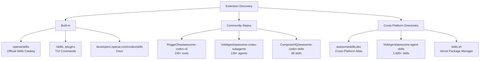
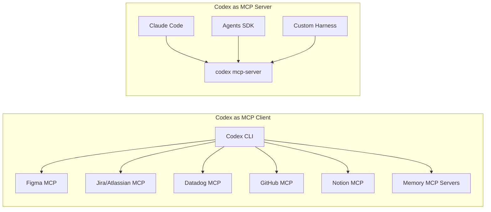
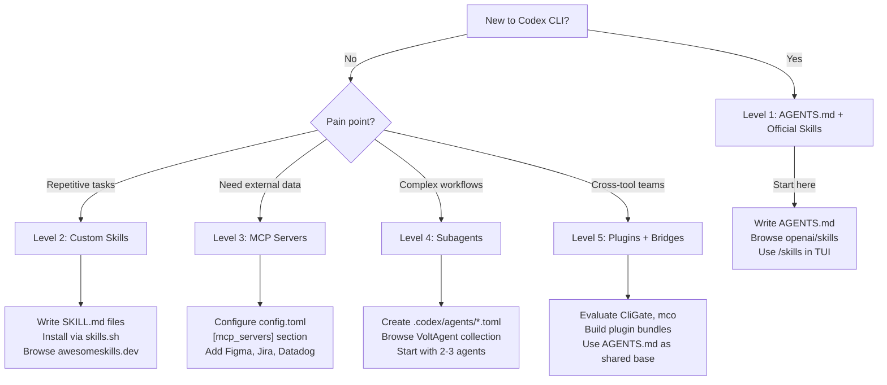

# The Codex CLI Ecosystem Map: Navigating 245+ Community Tools, Skills and Subagents


## Why This Matters

Twelve months ago, Codex CLI was a single binary with a handful of configuration options. Today, a curated list on the official OpenAI Codex GitHub Discussions page catalogues over 245 community-built tools across 20 categories — subagents, skills, plugins, MCP servers, IDE integrations, GUI wrappers, session managers and more[^1]. The ecosystem has exploded, but discoverability remains the bottleneck. This article maps the landscape, highlights the most impactful tools in each category, and provides a decision framework for which layer to invest in first.

## The Three Discovery Surfaces

Before diving into individual tools, it helps to understand where Codex CLI extensions live and how they are discovered.



**Built-in discovery** uses the `/skills` and `/plugins` slash commands within the TUI, backed by OpenAI's official `openai/skills` GitHub repository[^2]. This is the curated, first-party surface — reliable but deliberately conservative.

**Community repositories** aggregate everything the official catalog does not include. The canonical hub is RoggeOhta's `awesome-codex-cli` list, pinned in GitHub Discussion #16329 on the `openai/codex` repository[^1]. It is actively maintained, with contributions from dozens of authors.

**Cross-platform directories** serve skills that work across Codex CLI, Claude Code, Gemini CLI, Cursor, GitHub Copilot, and other tools adopting the SKILL.md standard. The largest is VoltAgent's `awesome-agent-skills` with over 1,000 entries[^3], alongside Vercel's `skills.sh` CLI package manager which has accumulated over 26,000 installs since its January 2026 launch[^4].

## Subagents: 136+ Specialist Workers

Subagents are TOML-defined worker agents that Codex spawns within a session. The community has produced an extraordinary number of pre-built subagent definitions.

### VoltAgent/awesome-codex-subagents

The largest single collection, with 136+ agents organised into ten categories[^5]:

| Category | Examples | Use Case |
|---|---|---|
| Core Dev | `code-reviewer`, `test-writer`, `refactorer` | Daily coding workflows |
| Language Specialists | `rust-expert`, `go-expert`, `python-expert` | Language-idiomatic patterns |
| Infrastructure | `terraform-agent`, `k8s-deployer`, `docker-builder` | IaC and DevOps |
| Security | `vuln-scanner`, `secret-detector`, `compliance-checker` | Security auditing |
| Data/AI | `data-pipeline`, `ml-trainer`, `notebook-helper` | Data engineering and ML |
| DX | `docs-writer`, `changelog-generator`, `onboarding-guide` | Developer experience |
| Domains | `fintech-agent`, `healthcare-agent`, `edtech-agent` | Industry-specific patterns |
| Business | `proposal-writer`, `metrics-dashboard` | Non-coding business tasks |
| Meta | `agent-debugger`, `prompt-optimizer` | Agent self-improvement |
| Orchestration | `dispatcher`, `wave-controller`, `fan-out-manager` | Multi-agent coordination |

To use any of these, drop the `.toml` file into `.codex/agents/` in your project root and reference it in your session:

```toml
# .codex/agents/security-scanner.toml
[agent]
name = "security-scanner"
model = "gpt-5.4-mini"
instructions = "You are a security specialist. Scan for OWASP Top 10 vulnerabilities..."

[agent.sandbox]
mode = "read-only"
```

### Enterprise and Specialised Packs

Beyond the VoltAgent mega-collection, several targeted packs stand out:

- **betterup/codex-cli-subagents** — enterprise-focused agents for code review, migration and compliance auditing[^1]
- **leonardsellem/codex-specialized-subagents** — accessibility, internationalisation and performance profiling agents[^1]
- **waltstephen/ArgusBot** — a 24/7 supervisor agent for autonomous task completion with watchdog monitoring[^1]
- **basilisk-labs/codex-swarm** — swarm intelligence patterns for large-scale refactoring operations[^1]

### Multi-Agent Orchestrators

The orchestration layer above subagents has also matured:

- **ComposioHQ/agent-orchestrator** — plans tasks, spawns agents, and handles CI failures autonomously[^1]
- **mco-org/mco** — a neutral orchestration layer supporting Codex CLI, Claude Code, Gemini CLI, OpenCode and Qwen Code simultaneously[^1]
- **hcom** (aannoo) — hierarchical communication framework with context preservation across agent boundaries[^1]

## Skills: From 38 to 1,370+

Skills are the most portable extension mechanism in Codex CLI — a SKILL.md file with YAML frontmatter and natural-language instructions[^2]. Unlike subagents (which are Codex-specific TOML), skills follow the open Agent Skills standard adopted by over 25 tools under the Linux Foundation's Agentic AI Foundation[^6].

### Key Skill Collections

| Collection | Scale | Differentiator |
|---|---|---|
| `openai/skills` | Official catalog | Curated, first-party quality |
| `ComposioHQ/awesome-codex-skills` | 38 skills | SaaS integration via Composio (Slack, GitHub, Notion, 1,000+ apps)[^7] |
| `VoltAgent/awesome-agent-skills` | 1,000+ skills | Largest cross-platform directory[^3] |
| `sickn33/antigravity-awesome-skills` | 1,370+ skills | Includes CLI installer and bundle system[^1] |
| `huggingface/upskill` | ML/AI focus | Official Hugging Face workflow pack[^1] |
| `affaan-m/everything-claude-code` | 147 skills + 36 agents | Performance-optimised system[^1] |

### Noteworthy Specialist Skills

Several specialist skills deserve attention for their depth:

- **Understand-Anything** (Lum1104) — converts entire codebases into interactive knowledge graphs, useful for onboarding to unfamiliar projects[^1]
- **ARIS** (wanshuiyin) — autonomous ML research that runs while you sleep, with cross-model review built in[^1]
- **bug-hunter** (codexstar69) — adversarial AI security scanner with automatic fix generation via multi-agent pipeline[^1]
- **ctf-skills** (ljagiello) — capture-the-flag challenge skills covering web exploitation, binary analysis, cryptography, reverse engineering and OSINT[^1]
- **Skywork-Skills** (SkyworkAI) — AI office suite covering presentations, documents, spreadsheets, image generation and music[^1]

### Installing Skills

Skills can be installed globally or per-project:

```bash
# Global installation (available in all sessions)
mkdir -p ~/.codex/skills/my-skill
cp SKILL.md ~/.codex/skills/my-skill/

# Project-local installation (committed to repo)
mkdir -p .agents/skills/my-skill
cp SKILL.md .agents/skills/my-skill/

# Via Vercel's skills.sh package manager
npx skills add composiohq/awesome-codex-skills
```

## Plugins: Bundling Skills, MCP and Apps

Plugins are the highest-level extension unit — a bundle of skills, MCP server configurations and app connectors packaged for distribution[^8]. The plugin system became first-class in v0.117.0 (March 2026), and the ecosystem is still young compared to skills and subagents.

Key plugin resources:

- **codex-plugin-cc** — cross-model code review delegation between Codex and Claude Code[^1]
- **claude-review-loop** — automated Stop Hook plugin that triggers cross-model review after every Codex session[^1]
- **$plugin-creator** — the built-in scaffolding skill for generating new plugin directory structures[^8]

## MCP Servers: Both Client and Server

Codex CLI acts as both an MCP client (consuming external tool servers) and an MCP server (exposing its agent capabilities to other tools)[^9]. The community has built MCP servers for virtually every major developer service.



The MCP server landscape is extensively documented in the official docs[^9], but community contributions worth noting include:

- **AgentMemory** — 41 MCP tools with triple-stream retrieval (BM25 + vector + knowledge graph)[^1]
- **codebase-memory-mcp** — Tree-Sitter AST-based code understanding across 66 languages[^1]
- **codex-mcp-code-review** (Szpadel) — clean-context review subagent pattern via MCP[^1]

## Cross-Platform Bridges

One of the most active ecosystem niches is tools that bridge between Codex CLI and competing agents:

- **shinpr/sub-agents-skills** — route tasks to Codex, Claude Code, Cursor or Gemini from any compatible tool[^10]
- **mco** — neutral orchestration layer across five CLI agents[^1]
- **CliGate** — local gateway proxy unifying authentication and billing across Codex CLI, Claude Code and Gemini CLI[^1]

The cross-platform story is strengthened by the AGENTS.md open standard, now adopted by over 60,000 projects under the Agentic AI Foundation (AAIF)[^6]. A single AGENTS.md file works across Codex CLI, Claude Code (via symlink workaround), Gemini CLI, Cursor, Copilot, Amp and dozens more.

## IDE and GUI Integrations

Beyond the terminal, the community has built graphical interfaces:

- **Nimbalyst** — macOS GUI for managing parallel Codex sessions with git worktree isolation[^1]
- **CC Pocket** — iOS app for remote session management via WebSocket bridge[^1]
- **cmux** — Ghostty-based terminal with agent notification system and PR-aware tabs[^1]
- **codex-replay** — HTML visualiser for JSONL session rollout files[^1]

## The Decision Framework: Where to Invest First

With 245+ tools available, the natural question is: where do you start? Here is a decision framework based on team maturity with Codex CLI.



### Level 1: AGENTS.md and official skills

If you are just getting started, write an AGENTS.md file for your project and browse the official `openai/skills` catalog. This costs nothing and delivers immediate productivity gains.

### Level 2: Custom skills

When you find yourself repeating the same instructions across sessions, extract them into a SKILL.md. Check `awesomeskills.dev` and `skills.sh` before writing from scratch — someone has likely solved your problem already[^4].

### Level 3: MCP servers

When your agent needs external data (Jira tickets, Figma designs, Datadog metrics, documentation), add MCP servers to your `config.toml`. Each server adds roughly 3–4K tokens of schema overhead to your context window[^9], so be selective.

### Level 4: Subagents

For complex workflows requiring parallel execution or specialist knowledge, define subagent TOML files. The VoltAgent collection provides battle-tested starting points[^5]. Start with two or three agents before scaling to larger swarms.

### Level 5: Plugins and cross-tool bridges

For teams running multiple AI coding tools (Codex + Claude Code is the most common pairing), invest in plugins and bridges that unify configuration and enable cross-model review loops.

## Ecosystem Health Metrics

The Codex CLI ecosystem shows strong vital signs as of April 2026:

- **245+ tools** catalogued across 20 categories[^1]
- **1,370+ cross-platform skills** available via community installers[^1]
- **136+ pre-built subagents** in the largest single collection[^5]
- **3M+ weekly active Codex CLI users** as of 8 April 2026[^11]
- **150+ members** of the Agentic AI Foundation backing the AGENTS.md standard[^6]

The ecosystem's growth rate — from a handful of tools in Q4 2025 to 245+ in Q1 2026 — mirrors the trajectory that npm saw in its early years. The key difference is that agent skills are inherently more portable: a well-written SKILL.md works across Codex, Claude Code, Gemini CLI and a dozen other tools without modification[^6].

## What to Watch

Three trends are shaping the ecosystem's near-term direction:

1. **Consolidation around `skills.sh`** — Vercel's package manager is becoming the de facto distribution channel, and its install counts increasingly influence which skills gain traction[^4].

2. **Cross-model orchestration** — Tools like mco and CliGate that abstract across multiple AI coding agents are gaining adoption as teams realise no single tool wins at everything[^1].

3. **Enterprise plugin registries** — The plugin system's `marketplace.json` format supports private, organisation-scoped registries[^8]. Enterprise teams are beginning to build internal plugin directories that bundle approved skills, MCP configurations and subagent definitions for their specific technology stacks.

## Citations

[^1]: RoggeOhta, "Awesome Codex CLI — curated list of 150+ ecosystem tools", GitHub Discussion #16329, openai/codex, April 2026. [https://github.com/openai/codex/discussions/16329](https://github.com/openai/codex/discussions/16329)

[^2]: OpenAI, "Agent Skills – Codex", developers.openai.com, 2026. [https://developers.openai.com/codex/skills](https://developers.openai.com/codex/skills)

[^3]: VoltAgent, "awesome-agent-skills: 1,000+ agent skills from official dev teams and the community", GitHub, 2026. [https://github.com/VoltAgent/awesome-agent-skills](https://github.com/VoltAgent/awesome-agent-skills)

[^4]: awesomeskills.dev, "Awesome Agent Skills — Claude Code, Codex & Cursor Skill Directory", 2026. [https://www.awesomeskills.dev/en](https://www.awesomeskills.dev/en)

[^5]: VoltAgent, "awesome-codex-subagents: 130+ specialized Codex subagents", GitHub, 2026. [https://github.com/VoltAgent/awesome-codex-subagents](https://github.com/VoltAgent/awesome-codex-subagents)

[^6]: Agentic AI Foundation (AAIF), "AGENTS.md Open Standard", Linux Foundation, 2025-2026. [https://github.com/agentsmd/agents.md](https://github.com/agentsmd/agents.md)

[^7]: ComposioHQ, "awesome-codex-skills: practical Codex skills for automating workflows", GitHub, 2026. [https://github.com/ComposioHQ/awesome-codex-skills](https://github.com/ComposioHQ/awesome-codex-skills)

[^8]: OpenAI, "Plugins – Codex CLI", developers.openai.com, 2026. [https://developers.openai.com/codex/plugins](https://developers.openai.com/codex/plugins)

[^9]: OpenAI, "Model Context Protocol – Codex", developers.openai.com, 2026. [https://developers.openai.com/codex/mcp](https://developers.openai.com/codex/mcp)

[^10]: shinpr, "sub-agents-skills: Cross-LLM sub-agent orchestration as Agent Skills", GitHub, 2026. [https://github.com/shinpr/sub-agents-skills](https://github.com/shinpr/sub-agents-skills)

[^11]: Sam Altman, "Codex crosses 3M weekly active users", OpenAI announcement, 8 April 2026. [https://openai.com/index/introducing-upgrades-to-codex/](https://openai.com/index/introducing-upgrades-to-codex/)
